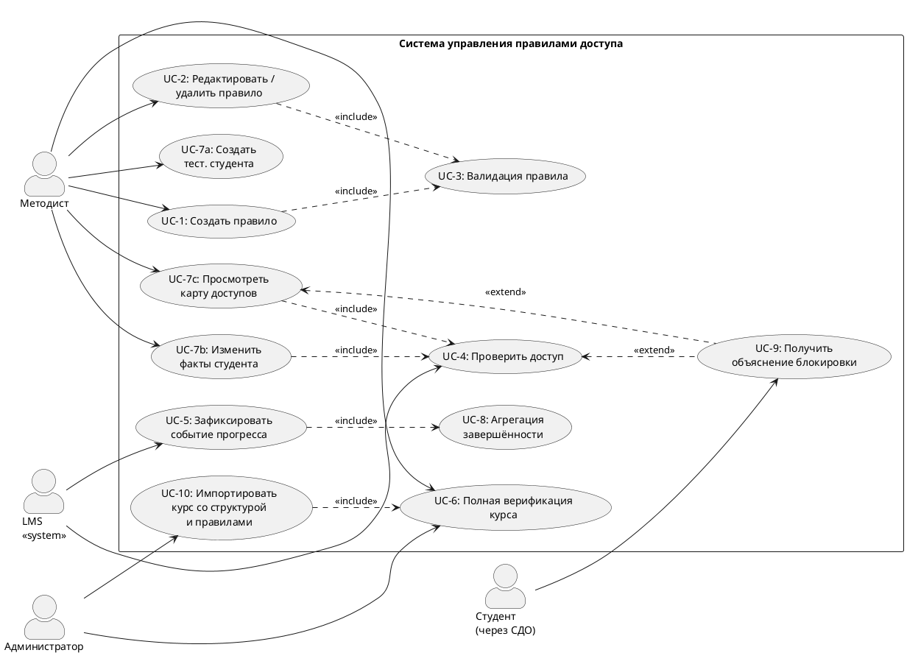

# PROJECT BIBLE — ВКР Магистерская диссертация

> **Назначение документа:** единый источник истины для всего проекта ВКР.
> Загружается в каждую сессию Claude как первый контекст.
> Любое решение, принятое в любой сессии, записывается сюда.
> Локальный контекст (стиль текста, требования к оформлению, инструкции для кода) вынесен в сателлитные документы (см. раздел 8.2).
>
> **Последнее обновление:** 18.04.2026 (продолжение сессии)
> **Статус:** Фаза 0 завершена. Фаза 1a завершена. Фаза 1b: раздел 2.7 завершён; раздел 3.5.1 в черновом виде, финальные C4-диаграммы — в следующей сессии в Claude Code. Остаются 3.5.2–3.5.5 и 3.6.
> **Где ведётся работа:** со следующей сессии — Claude Code с подключённым репозиторием `vkr-access-control` (структура и инструменты — раздел 8.3).

---

## 1. КОНТЕКСТ ПРОЕКТА (неизменяемый)

### 1.1. Формальные данные

- **ВУЗ:** Университет ИТМО, Санкт-Петербург
- **Уровень:** Магистратура
- **Направление:** 09.04.02 «Информационные системы и технологии»
- **Специализация:** «Интернет-технологии и программирование»
- **Компания-партнёр:** ООО «Дистех» (разработка СДО, предположительно на базе Moodle)
- **Научный руководитель:** Толпыгин С.В. (@t0ptyg)
- **Рецензент:** НЕ ОПРЕДЕЛЁН (требования: канд. наук или опыт >3 лет, не из ИТМО, не из Дистех)

### 1.2. Тема ВКР (зафиксирована в ИСУ, изменение невозможно с 01.04)

**Формулировка из системы ВУЗа (приоритет — исходное задание от компании):**

Цель: разработка программного комплекса для управления правилами доступа к образовательному контенту на основе онтологического моделирования. Система должна обеспечивать декларативное описание, централизованное хранение и автоматическую верификацию сложных правил учебного процесса.

### 1.3. Ключевые дедлайны

| Дата | Событие | Статус |
|------|---------|--------|
| Март 2026 | Первое рассмотрение | ❌ Получено «Не рекомендовать» |
| **15.05.2026** | **Предзащита (вторая)** | ⬜ Цель: «Рекомендовать» или «Условно рекомендовать» |
| ~10.05.2026 | Загрузка в Антиплагиат (предварительная проверка) | ⬜ |
| ~25.05.2026 | Загрузка итоговой ВКР в ИСУ (за 10 дней до защит) | ⬜ |
| ~28.05.2026 | Отзыв руководителя в ИСУ (за 7 дней до защит) | ⬜ |
| Июнь 2026 | Защита ВКР | ⬜ |

### 1.4. Замечания комиссии с первого рассмотрения (дословно)

> «В чем научная новизна? Онтологию нужно проверить с помощью формальных методов, необходимо провести научные исследования, нужно именно доказать, что подход является валидным. Алгоритм не соответствует уровню магистерской работы. В чем сложность содержания вашей работы?»

**Декомпозиция замечаний:**
1. **Нет научной новизны** — не показано, чем подход отличается от существующих
2. **Нет формальной верификации** — онтология не проверена формальными методами
3. **Нет доказательства валидности** — нужно доказать, что онтология совместима с целевыми СДО (что она корректно моделирует сущности и процессы реальных платформ)
4. **Алгоритм слабый** — не соответствует уровню магистерской
5. **Нет сложности** — не показана инженерная/научная глубина

### 1.5. Ограничения и реалии

- Компания «Дистех» максимально не вовлечена; взаимодействие минимальное
- Научный руководитель не в курсе текущего состояния работы (нужно связаться)
- Работа велась самостоятельно, без методического сопровождения
- **Текущий код писался по наитию, без предварительного анализа и проектирования.** Глава 1 слабо определила главу 2, а глава 2 — главу 3. Всё связано неявно, акцент был на визуальную целостность. По факту — нужно заново провести анализ предметной области (глава 1), на его основе сделать проектирование (глава 2), и уже из него — реализацию (глава 3). Всё должно быть целостной цепочкой: исследование → проектирование → реализация → проверка
- Антиплагиат: ≥80% оригинальности, AI-текст недопустим
- Рекомендуемый объём ПЗ: 60–80 страниц (магистерская)
- Доклад на рассмотрениях/предзащите: **7 минут** (лимит на последних рассмотрениях)
- **Технологический стек может быть изменён**, если анализ покажет, что альтернатива оптимальнее. Не натягиваем сову на глобус из-за того, что стек был выбран без осознанного анализа

### 1.6. Требования к инженерной сложности ВКР (из методички ИТМО)

Информационная система должна:
- Автоматизировать реальный бизнес-процесс
- Содержать **не менее трёх** отдельных нетривиальных компонентов
- Быть существенно интегрированной со сторонними системами
- Реализовывать нетривиальные алгоритмы обработки данных

### 1.7. Критерии оценки ВКР (8 критериев из программы ГИА)

1. **Внедрение результатов** — нужен акт экспертизы/внедрения от компании
2. **Качество изложения** — научный язык, диаграммы UML/C4, код с тестами (≥60%), нет критических проблем архитектуры
3. **Методы исследования** — обоснование выбора методов со ссылками на источники
4. **Научная/практическая значимость** — элементы научной новизны, публикация/конференция
5. **Актуальность, цель, задачи** — ≥30 источников не старше 5 лет, ≥30% ВАК, ≥20% Scopus/WoS
6. **Положения на защиту** — корректно сформулированы и доказаны результатами
7. **Соответствие направлению** — ИСиТ, интернет-технологии и программирование
8. **Соответствие теме** — содержание соответствует заданию

### 1.8. Известные источники

> **Принцип:** это стартовый пул. Литобзор (раздел 2) расширит его.
> Детальный анализ каждого источника (прочитан/нет, что взяли, качество) → в сателлит `SAT_SOURCES_ANALYSIS.md`.

#### A. Источники из задания в ИСУ (10)

| # | Источник | Тема |
|---|---------|------|
| Z1 | Sarwar S. et al. — Ontology based E-learning framework (2019) | Онтологии в e-learning |
| Z2 | Rani M., Nayak R., Vyas O.P. — Ontology-based adaptive personalized e-learning (2015) | Адаптивное обучение |
| Z3 | Iqbal M. et al. — Personalized and adaptive e-learning systems for semantic Web (2025) | Semantic Web в образовании |
| Z4 | Scherp A. et al. — Semantic web: Past, present, and future (2024) | Обзор Semantic Web |
| Z5 | Brewster C. et al. — Ontology-based access control for FAIR data (2020) | Онтологии + access control |
| Z6 | Can Ö., Bursa O., Ünalır M. — Personalizable ontology based access control (2010) | OBAC |
| Z7 | Nazyrova A. et al. — Analysis of consistency of prerequisites (2023) | Верификация пререквизитов |
| Z8 | Allemang D., Hendler J. — Semantic web for the working ontologist (2011) | Учебник OWL |
| Z9 | Zhang L., Lobov A. — SWRL-based approach for knowledge-based engineering (2024) | SWRL |
| Z10 | Horrocks I. et al. — SWRL: A semantic web rule language (2004) | Спецификация SWRL |

#### B. Источники из текущей ПЗ (31)

| # | Источник | Тема | Год |
|---|---------|------|-----|
| P1 | Pelánek R. — Adaptive learning is hard: Challenges, nuances, and trade-offs | Адаптивное обучение, ограничения | 2025 |
| P2 | Mirata V. et al. — Challenges and contexts in establishing adaptive learning in HE | Адаптивное обучение в вузах | 2020 |
| P3 | Kucharski S. et al. — Adaptive Learning Mechanisms for LMS: Scoping Review | Обзор адаптивных механизмов LMS | 2025 |
| P4 | Bakhouyi A. et al. — Evolution of standardization and interoperability on E-learning | Стандарты e-learning | 2017 |
| P5 | AICC — CMI Guidelines for Interoperability, v4.0 | Стандарт CMI | 2004 |
| P6 | ADL Initiative — SCORM 2004 4th Edition | Стандарт SCORM | 2009 |
| P7 | ADL Initiative — Experience API (xAPI) v2.0 | Стандарт xAPI | 2023 |
| P8 | AICC/ADL — CMI5 Specification | Стандарт CMI5 | — |
| P9 | Sarwar S. et al. — Ontology based E-learning framework | = Z1 | 2019 |
| P10 | Rani M. et al. — Ontology-based adaptive personalized e-learning | = Z2 | 2015 |
| P11 | Sandhu R.S. — Role-based access control | RBAC (базовая модель) | 1998 |
| P12 | Moodle Docs — Roles and permissions | Moodle access control | — |
| P13 | Blackboard — Roles and Privileges | Blackboard access control | — |
| P14 | Hu V.C. et al. — Guide to ABAC definition (NIST SP 800-162) | ABAC (стандарт NIST) | 2014 |
| P15 | OASIS — XACML v3.0 | Стандарт XACML | 2013 |
| P16 | Jebbaoui H. et al. — Semantics-based approach for detecting flaws in XACML policies | Верификация XACML | 2015 |
| P17 | Moodle Dev — Availability conditions | Moodle restrict access (техдок) | — |
| P18 | Bhatti R. et al. — Trust-based context-aware access control (CAAC) | CAAC | 2005 |
| P19 | Kim Y.G. et al. — Context-aware access control for ubiquitous applications | CAAC в ubiquitous learning | 2005 |
| P20 | Brewster C. et al. + Can Ö. et al. (⚠️ два источника слиты в один — РАЗДЕЛИТЬ) | OBAC | 2020, 2010 |
| P21 | Aslam S. et al. — OBAC: agent-based identification of roles, objects, permissions | OBAC | 2020 |
| P22 | McGuinness D.L. et al. — OWL Web Ontology Language overview (W3C) | Спецификация OWL | 2004 |
| P23 | Horrocks I., Patel-Schneider P.F. — Knowledge Representation on the Semantic Web | OWL теория | 2010 |
| P24 | Kayes A.S.M. et al. — Context-aware access control with fuzzy logic and ontology | CAAC + онтологии + fuzzy logic | 2020 |
| P25 | Microsoft Learn — Сравнение графов и реляционных БД | Графовые БД | — |
| P26 | Angles R. — A comparison of current graph database models | Графовые БД (IEEE) | 2012 |
| P27 | Scherp A. et al. — Semantic web: Past, present, and future | = Z4 | 2024 |
| P28 | Abburu S. — A survey on ontology reasoners and comparison | Обзор OWL-резонеров | 2012 |
| P29 | Abicht K. — OWL Reasoners still useable in 2023 | Актуальность OWL-резонеров | 2023 |
| P30 | Lam A.N. et al. — Performance Evaluation of OWL 2 DL Reasoners using ORE 2015 | Бенчмарк резонеров | 2023 |
| P31 | Steigmiller A. et al. — Benchmarking Symbolic and Neuro-Symbolic DL Reasoners | Бенчмарк резонеров (ISWC) | 2023 |

#### C. Источники, выявленные при литобзоре фазы 0 (новые)

| # | Источник | Тема | Год |
|---|---------|------|-----|
| N1 | Finin T., Joshi A. — ROWLBAC: Representing Role Based Access Control in OWL (SACMAT) | RBAC в OWL (фундаментальная работа OBAC) | 2008 |
| N2 | Carminati B. et al. — Using OWL and SWRL to represent and reason with situation-based access control policies | OWL+SWRL для AC в соцсетях; документация OWA-проблемы | 2011 |
| N3 | Beimel D., Peleg M. — SitBAC: Using OWL and SWRL for situation-based access control in healthcare | OWL+SWRL для AC в здравоохранении | 2011 |
| N4 | Hsu W.-L. — LAPAR: Integrating XACML with OWL and SWRL | Многослойная интеграция XACML+OWL+SWRL | 2013 |
| N5 | Kolovski V. et al. — Formalizing XACML Using Defeasible Description Logics (WWW) | DL для верификации XACML-политик | 2007 |
| N6 | Huang H. et al. — A DL-based method for access control policy conflict detecting (ACM) | ABox consistency → обнаружение конфликтов AC | 2009 |
| N7 | Laouar M.R. et al. — Ontology-based approach for handling inconsistency in access control (Springer) | OWL + inconsistency-tolerant AC | 2025 |
| N8 | Kozlov F.A., Mouromtsev D.I. — ECOLE: Enhanced Course Ontology for Linked Education (ITMO, KESW 2013–2014, WWW 2016) | Онтология курсов Open edX, NLP, SCORM; **нет access control** | 2013–2017 |
| N9 | Heiyanthuduwage S.R. et al. — OWL 2 Learn Profile (PMC) | Анализ 14 образовательных онтологий; ни одна не содержит AC | 2016 |
| N10 | Fisler K. et al. — Margrave: Verification and Change-Impact Analysis of Access-Control Policies (ICSE) | MTBDD для верификации XACML | 2005 |
| N11 | Marfia F. et al. — XACML-compliant framework using DL reasoning for authorization | DL-reasoner для принятия решений AC | 2015 |

#### D. Источники, выявленные при фазе 1 (подтверждение gap 2022–2025)

| # | Источник | Тема | Год |
|---|---------|------|-----|
| N12 | Fakoya J.T. et al. — Ontology-Based Model for E-Learning Management System (O-BMEMS) | Онтология для e-learning; **нет AC** — подтверждает gap | 2024 |
| N13 | Na Nongkhai L. et al. — ADVENTURE: Adaptive learning support system based on ontology (CONTINUOUS) | Онтология программирования + адаптивное обучение; **нет AC** | 2025 |
| N14 | Mohamed A.K.Y.S. et al. — Systematic literature review for authorization and access control: definitions, strategies and models | Систематический обзор AC — образование не фигурирует как домен OBAC | 2022 |
| N15 | Farhadighalati N. et al. — A Systematic Review of Access Control Models (IEEE Access) | Систематический обзор ACM 2025 — образование не фигурирует как домен OBAC | 2025 |
| N16 | Can Ö., Unalir M.-O. — Revisiting Ontology Based Access Control: The Case for OBDA (ICISSP) | OBAC + OBDA; **не образование** — подтверждает gap | 2022 |

> **Проблемы в текущем списке:** P20 содержит два источника, слитых в один пункт — нужно разделить.
> **Дубликаты с заданием:** P9=Z1, P10=Z2, P27=Z4.
> **Рекомендация научрука:** изучить работу Козлова Ф.А. — ✅ Выполнено (N8, система ECOLE).
> **Задача для фазы 4:** целенаправленно добавить свежие источники 2021–2026 по каждому направлению для выполнения требования К5 (≥30 не старше 5 лет). Фундаментальные работы (ROWLBAC 2008, Carminati 2011, Kolovski 2007, Sandhu 1998, SWRL 2004) допустимы и необходимы как основы области.

---

## 2. ИССЛЕДОВАТЕЛЬСКАЯ БАЗА

> **Статус:** ЗАПОЛНЕНО (фаза 0, сессия 15.04.2026).
> Литобзор L1–L8 выполнен полностью.
> Полный англоязычный отчёт Deep Research → в сателлит `SAT_DEEP_RESEARCH_REPORT.md`.

### 2.1. Литературный обзор

**Цель:** ответить на вопросы:
- Кто и как управляет правилами доступа в современных СДО?
- Кто до нас применял онтологический подход для этой задачи?
- Какие пробелы существуют в текущих подходах?
- Чем наш подход может отличаться?

**Где искать:**
- **Google Scholar** — основной поисковый инструмент (приоритет: цитируемые, актуальные, релевантные работы)
- **Scopus / Web of Science** — для индексированных публикаций (требование критерия К5: ≥20% из Scopus/WoS)
- **IEEE Xplore, ACM Digital Library, SpringerLink** — для конференционных и журнальных статей
- **eLibrary.ru / РИНЦ** — для русскоязычных и ВАК-источников (требование: ≥30% ВАК)
- **Официальная документация** платформ (Moodle, Canvas, Blackboard, Stepik) — для анализа существующих реализаций
- **W3C, OASIS** — для стандартов (OWL, SWRL, XACML)

**Требования к качеству источников:**
- **Релевантность:** источник должен быть непосредственно связан с темой (управление доступом, онтологии, e-learning, верификация правил)
- **Достоверность:** рецензируемые журналы и конференции, официальная документация, стандарты; избегать блогов, непроверенных препринтов, сомнительных агрегаторов
- **Актуальность:** приоритет источникам 2020–2026; классические работы (RBAC 1998, OWL 2004, SWRL 2004) допускаются как фундаментальные
- **Цитируемость:** для Google Scholar — проверять число цитирований; низкоцитируемые работы использовать только при высокой релевантности
- **Количественные требования (для оценки «хорошо» по К5):** ≥30 источников не старше 5 лет, ≥30% ВАК, ≥20% Scopus/WoS

**Направления поиска:**

| # | Направление | Что искать | Статус |
|---|------------|-----------|--------|
| L1 | Управление доступом в СДО | Как Moodle, Canvas, Blackboard, Stepik, Open edX реализуют restrict access, prerequisites, conditional activities. Какие типы правил поддерживают, какие ограничения имеют | ✅ |
| L2 | Онтологии в e-learning | Существующие OWL-онтологии образовательного процесса: кто делал, для чего, с какими результатами. Есть ли онтологии именно для управления доступом? | ✅ |
| L3 | SWRL в управлении доступом | Применение SWRL-правил для access control (не только в образовании). Какие задачи решали, какие ограничения обнаружили | ✅ |
| L4 | Верификация правил доступа | Формальные методы проверки согласованности политик (consistency, cycles, deadlocks, conflicts). Алгоритмы обнаружения противоречий | ✅ |
| L5 | Адаптивные образовательные траектории | Personalized learning paths, adaptive learning systems. Как задаются правила адаптации | ✅ Фон для гл.1 |
| L6 | Работа Козлова Ф.А. (рекомендация научрука) | Семантические технологии в СДО — подход, результаты, чем отличается от нашего | ✅ |
| L7 | Стандарты e-learning | IMS Learning Design, xAPI, LTI, SCORM, CMI5 — как они решают задачу правил и чем ограничены | ✅ Фон для гл.1 |
| L8 | DL-reasoning для верификации | Использование Description Logic reasoners (Pellet, HermiT, FaCT++) для проверки онтологий. Сравнительные бенчмарки | ✅ |

#### Результаты литобзора

**L1: Управление доступом в 5 СДО — сводная таблица**

| Характеристика | Moodle | Canvas | Blackboard | Stepik | Open edX |
|---------------|--------|--------|------------|--------|----------|
| Гранулярность | Активность + секция | Модуль | Элемент контента | Модуль | Подсекция |
| Булева логика | Полная вложенность AND/OR/NOT | Нет | OR-of-ANDs | Нет | Нет |
| Порог оценки | ✅ | ✅ | ✅ | ✅ (баллы) | ✅ (мин. %) |
| Завершение активности | ✅ | ✅ | ✅ (review status) | ❌ | ✅ |
| Дата/время | ✅ | ✅ | ✅ | ❌ | ✅ (release dates) |
| Группа/членство | ✅ | ✅ (Differentiation) | ✅ | ❌ | ✅ (cohorts) |
| Компетенции | ✅ (competency framework) | Mastery Paths | ❌ | ❌ | ❌ |
| Обнаружение циклов | ❌ | Структурная защита | ❌ | Последовательность by design | ❌ (документированный риск) |
| Формальная верификация | ❌ | ❌ | ❌ | ❌ | ❌ |
| Хранение правил | JSON в course_modules.availability | FK между module records (PostgreSQL) | Проприетарное | Проприетарное | CourseContentMilestone (PostgreSQL) |

**Ключевой вывод L1:** Ни одна из 5 СДО не реализует формальную верификацию правил доступа. Open edX документированно предупреждает, что циклические пререквизиты навсегда скрывают контент от студентов. Правила хранятся в RDBMS (JSON/FK/проприетарные форматы) и интерпретируются процедурным кодом — формальный анализ невозможен без запуска интерпретатора.

**L2: Онтологии в e-learning**
- Sarwar et al. (2019, Z1) — CourseOntology для рекомендаций контента. Нет access control.
- Rani et al. (2015, Z2) — user.owl + course.owl, модель стилей обучения (Felder-Silverman). Нет access control.
- Heiyanthuduwage et al. (2016, N9) — анализ 14 образовательных OWL-онтологий: ни одна не содержит конструкторов access control.
- IEEE LOM OWL (Gluz & Vicari, 2012) — метаданные learning objects, свойства «requires»/«isRequiredBy» — аннотации, не правила.
- **Вывод L2:** образовательные онтологии не формализуют правила доступа. Пробел подтверждён.

**L3: SWRL в access control**
- Carminati et al. (2011, N2) — SWRL + Pellet для AC в соцсетях. Документировали проблему OWA: невозможность negation-as-failure. Workaround: отдельные предикаты cannotDo + SPARQL.
- Beimel & Peleg (2011, N3) — SitBAC для здравоохранения, SWRL property chains.
- Hsu (2013, N4) — LAPAR: XACML → SWRL → Jess, многослойная интеграция.
- Zhang & Lobov (2024, Z9) — SWRL в инженерии (не AC), подтвердили: производительность резонера — узкое место.
- **Вывод L3:** SWRL применялся к AC в здравоохранении, соцсетях, предприятиях — но **никогда в образовании/СДО**.

**L4: Верификация политик доступа**
- Kolovski et al. (2007, N5) — формализация XACML через Defeasible DL, проверка через Pellet.
- Huang et al. (2009, N6) — отображение XACML в DL knowledge base: обнаружение конфликтов = ABox consistency checking.
- Marfia et al. (2015, N11) — три онтологии (Policy TBox, Domain TBox, Domain ABox), DL-reasoner для авторизации.
- Fisler et al. (2005, N10) — Margrave: XACML → MTBDD, query-based verification.
- Jebbaoui et al. (2015, P16) — SBA-XACML: обнаружение unreachable rules, конфликтов, избыточностей.
- **Вывод L4:** DL-верификация AC-политик — зрелая область для XACML. Но **никто не применял DL-reasoning к правилам доступа в СДО**.

**L6: Козлов Ф.А. (ИТМО)**
- Система ECOLE (Enhanced Course Ontology for Linked Education), совместно с Муромцевым Д.И.
- Публикации: KESW 2013 (CCIS 394), KESW 2014 (CCIS 468), WWW 2016 Companion.
- Назначение: интерлинкинг терминов между курсами Open edX, NLP-based ontology population, конвертация в SCORM.
- **Вывод L6:** ECOLE не содержит моделирования access control. Наша работа — в другой нише.

**L5: Адаптивные образовательные траектории (фон для главы 1)**
- Рынок адаптивного обучения оценивается в $3.76 млрд (2024) → $30.79 млрд (2034).
- Современные adaptive learning platforms (Knewton Alta, Smart Sparrow, DreamBox) используют ML/AI для динамической корректировки контента, сложности и пути обучения.
- Ключевое отличие от нашей задачи: адаптивное обучение — это *рекомендация* контента (вероятностная, ML-driven). Управление доступом — это *правило* (детерминированное, logic-driven). Наш тип `adaptive_routing` — точка соприкосновения: правило маршрутизации по диапазону оценок (как Canvas Mastery Paths).
- Pelánek (2025, P1): адаптивное обучение остаётся сложной задачей с множеством trade-offs; Kucharski et al. (2025, P3): scoping review адаптивных механизмов в LMS.
- **Вывод L5:** адаптивное обучение — контекст, в котором работает наша система. Мы не конкурируем с ML-решениями, а дополняем их: ML рекомендует, OWL+SWRL — контролирует доступ.

**L7: Стандарты e-learning (фон для главы 1)**
- **SCORM** (2004): упаковка контента + runtime-коммуникация с LMS. Отслеживает completion, score, time. Ограничения: контент на том же сервере, только браузер, нет cross-domain, ограниченная аналитика. Не содержит механизмов access control — только sequencing (порядок SCO).
- **xAPI** (2013, P7): Actor-Verb-Object statements в LRS. Отслеживает любой опыт обучения (включая мобильный, офлайн). Гибче SCORM, но не определяет правил доступа — только фиксирует факты.
- **cmi5** (CMI5, P8): «SCORM нового поколения» — структурированные курсы поверх xAPI. Определяет completion/mastery, но не условия доступа.
- **LTI** (1EdTech/IMS): интеграция внешних инструментов через SSO + grade passback. Не управляет доступом — только запускает инструмент и возвращает оценку.
- **IMS Common Cartridge**: упаковка курсов для академической среды. Включает discussion topics, question banks. Нет runtime-коммуникации, нет access control.
- **Вывод L7:** ни один стандарт e-learning не определяет формат или механизм для описания правил доступа к контенту. SCORM sequencing — ближайшее, но оно описывает *порядок* (последовательность), а не *условия* (если X, то Y доступен). Это подтверждает актуальность нашего подхода: стандартизированного, формального способа описания правил доступа не существует.

**L8: DL-резонеры**
- Abicht (2023, P29): обзор 95+ резонеров, большинство не поддерживается.
- Lam et al. (2023, P30): бенчмарк 6 резонеров на ORE 2015 (1920 онтологий). Konclude — лидер по производительности, но без SWRL. Openllet — mid-range, единственный с SWRL+built-ins.
- **Вывод L8:** Для OWL+SWRL единственный жизнеспособный вариант — Openllet (или гибрид HermiT+Drools).

**ПРОБЕЛЫ, ВЫЯВЛЕННЫЕ В ЛИТЕРАТУРЕ:**

1. **Пробел 1 (L2 × L3):** Образовательные OWL-онтологии не формализуют access control. SWRL-based AC существует для других доменов, но не для образования. Пересечение — пустое множество.
2. **Пробел 2 (L4 × L1):** DL-верификация AC-политик зрелая для XACML, но не применялась к правилам доступа СДО. Между тем ни одна СДО не реализует формальную верификацию — при документированных рисках (циклы в Open edX).
3. **Пробел 3 (L1):** Правила доступа во всех СДО хранятся в RDBMS и интерпретируются процедурно — они неотделимы от реализации и не допускают формального анализа.

**НАША ПОЗИЦИЯ ОТНОСИТЕЛЬНО СУЩЕСТВУЮЩИХ РАБОТ:**

Мы находимся на пересечении трёх непересекающихся потоков:
- Поток 1 (e-learning ontologies): Sarwar 2019, Rani 2015, ECOLE/Kozlov 2013–2017, Fakoya 2024, Na Nongkhai 2025 — моделируют контент/адаптацию, но не AC.
- Поток 2 (OBAC/SWRL-based AC): ROWLBAC 2008, Carminati 2011, Beimel 2011, Laouar 2025 — формализуют AC, но не для образования.
- Поток 3 (DL-based policy verification): Kolovski 2007, Huang 2009, Nazyrova 2023 — верифицируют XACML / пререквизиты, но не правила доступа СДО.

Мы объединяем все три потока на новом домене (LMS access control) — gap подтверждён литобзором 2008–2025.

### 2.2. Научная новизна (✅ ПОДТВЕРЖДЕНА ЛИТОБЗОРОМ, УТОЧНЕНА ФАЗА 1)

> **Статус:** УТВЕРЖДЕНИЕ, подтверждённое литобзором фазы 0 и верификацией gap свежими источниками (фаза 1).

**Элемент новизны 1: Онтологическая модель управления доступом к образовательному контенту.**
Предложена OWL-онтология, объединяющая концепты образовательного домена (Course, LearningActivity, Learner, Grade, CompletionState, Competency) с концептами управления доступом (AccessPolicy, Condition, Permission). В отличие от образовательных онтологий (Sarwar 2019, Rani 2015, ECOLE/Kozlov 2013–2017, Fakoya 2024, Na Nongkhai 2025), которые не формализуют AC, и в отличие от OBAC-онтологий (ROWLBAC 2008, Carminati 2011, Laouar 2025), которые не содержат образовательных концептов — предложенная онтология покрывает оба домена.

**Элемент новизны 2: Гибридная архитектура SWRL+Python с CWA-enforcement.**
Правила доступа описаны в SWRL (TBox) в едином формальном пространстве с OWL-онтологией, что обеспечивает возможность формального анализа. Ограничения SWRL (отсутствие now(), агрегаций, NAF) компенсируются слоем предобработки (Python enricher) и постобработки (CWA-enforcement, default-deny). В отличие от процедурных систем СДО (Moodle Availability API, Canvas module prerequisites) — подход сохраняет возможность формального анализа правил.

**Элемент новизны 3: DL-reasoning + графовый анализ для верификации правил доступа в СДО.**
Задачи верификации сводятся к: (а) стандартным DL-сервисам (consistency check → обнаружение конфликтов, satisfiability check → невыполнимые условия), (б) графовому анализу (cycle detection → циклические зависимости, reachability → недостижимые элементы). Расширяет Nazyrova et al. (2023) с уровня учебного плана до fine-grained правил активностей. Расширяет Kolovski et al. (2007) и Huang et al. (2009) с XACML на нативную OWL-онтологию.

### 2.3. Систематическая оценка возможностей и ограничений OWL+SWRL (✅ ЗАПОЛНЕНО)

#### Матрица функциональных возможностей vs. OWL+SWRL

| # | Функциональная возможность | Пример сценария | OWL+SWRL | Тип реализации | Обоснование |
|---|---------------------------|----------------|----------|----------------|-------------|
| F1 | Правило на просмотр элемента | «Посмотри лекцию 1 → откроется тест» | ✅ | SWRL | Прямое сопоставление предикатов |
| F2 | Правило на завершение элемента | «Заверши модуль 1 → откроется модуль 2» | ✅ | SWRL | Прямое сопоставление предикатов |
| F3 | Правило на оценку (порог) | «Получи ≥80 за тест → откроется лекция» | ✅ | SWRL + built-ins | swrlb:greaterThanOrEqual |
| F4 | Правило на компетенцию (с иерархией) | «Получи компетенцию X → откроется модуль Y» | ✅ | SWRL + TransitiveProperty | OWL свойство транзитивности |
| F5 | Временное ограничение (дата/время) | «Доступно с 01.05 по 15.05» | ⚠️ | ГИБРИД | Нет now() в SWRL; инжекция текущего времени через Python → SWRL сравнивает |
| F6 | Подсчёт попыток (N провалов → действие) | «3 провала теста → доп. практикум» | ⚠️ | ГИБРИД | Нет агрегаций в SWRL; Python считает → инжектирует → SWRL сравнивает |
| F7 | Логическая комбинация AND | «Заверши И лекцию, И тест → экзамен» | ✅ | SWRL | Конъюнкция атомов в теле правила (Horn clause) |
| F8 | Логическая комбинация OR | «Заверши лекцию ИЛИ тест → модуль» | ✅ | SWRL | Несколько правил с одинаковой головой |
| F9 | Логическая комбинация NOT | «Если НЕ завершён X → заблокировать Y» | ❌→⚠️ | ГИБРИД (CWA layer) | OWA несовместима с NAF; CWA-enforcement в application layer (default-deny) |
| F10 | Агрегатные функции (AVG, SUM, COUNT) | «Средний балл ≥75% → допуск к экзамену» | ⚠️ | ГИБРИД | Нет агрегаций в SWRL; предвычисление в Python |
| F11 | Межкурсовые зависимости | «Заверши курс A → откроется курс B» | ✅ | SWRL | Перспектива. Технически реализуемо, вынесено из scope ядра |
| F12 | Ролевые ограничения (RBAC) | «Только преподаватели видят аналитику» | ✅ | OWL + SWRL | Доказано ROWLBAC (Finin et al., 2008). Вне scope — это авторизация, не AC контента |
| F13 | Групповые ограничения контента | «Группа A видит задание X, группа B — Y» | ✅ | OWL + SWRL | Группа = OWL-класс/индивид, belongs_to_group → SWRL проверяет |
| F14 | Ограничение по времени прохождения | «Потрать ≥30 мин на лекцию → тест» | ⚠️ | ГИБРИД | Аналог F5+F6: Python вычисляет длительность → инжекция |
| F15 | Адаптивная маршрутизация | «Слабый результат → доп. материалы» | ✅ | SWRL + built-ins | Несколько правил с разными диапазонами оценок |
| F16 | Обнаружение циклов в правилах | «A→B→C→A — заблокировать» | 🔷 | Графовый алгоритм | Не задача DL; NetworkX split-node DiGraph |
| F17 | Обнаружение недостижимых состояний | «Элемент X недостижим» | ⚠️ | ГИБРИД | DL (unsatisfiability) + графовый анализ (reachability) |
| F18 | Проверка согласованности (consistency) | «Нет логических противоречий» | ✅ | DL reasoning | Базовый сервис резонера; Kolovski 2007, Huang 2009 |
| F19 | Агрегация завершённости (roll-up) | «Все обяз. элементы завершены → модуль завершён» | 🔷 | Алгоритм (Python) | Требует агрегации (∀x: mandatory → completed) |
| F20 | Трассировка вывода | «Почему заблокирован? → невыполненные условия» | ⚠️ | ГИБРИД | DL justifications + логирование срабатываний SWRL |

#### Вопросы по ограничениям OWL+SWRL (✅ ФОРМАЛЬНЫЕ ОТВЕТЫ)

| # | Вопрос | Ответ | Статус |
|---|--------|-------|--------|
| LIM1 | Может ли SWRL работать с текущим временем? | **Нет.** SWRL оперирует статическим снимком ABox. Нет функции now(). Временны́е built-ins (swrlb:dateTime, swrlb:greaterThan) — для сравнения, не для получения текущего времени. **Решение:** инжекция текущей даты как datatype property перед reasoning — стандартный паттерн (документация SWRLAPI). | ✅ |
| LIM2 | Поддерживает ли SWRL агрегатные функции? | **Нет.** Спецификация SWRL Built-Ins (W3C) не включает COUNT, SUM, AVG. SWRL работает с индивидуальными привязками переменных, а не с множествами — принципиальное ограничение Horn-логики. **Решение:** предвычисление агрегатов в Python, инжекция результатов. | ✅ |
| LIM3 | Как реализовать AND/OR/NOT? | **AND:** нативно (конъюнкция в теле правила). **OR:** нативно (несколько правил с одной головой). **NOT:** невозможно (нет NAF из-за OWA). **Решение NOT:** CWA-enforcement в application layer (default-deny) — стандартный паттерн всех SWRL-based AC систем (Carminati 2011). Сложные комбинации (A∧B)∨(C∧D) → два правила с конъюнкциями. | ✅ |
| LIM4 | Производительность при большом числе индивидов? | OWL 2 DL reasoning — 2NEXPTIME-complete (теория). Openllet: 1595/1920 классификация (Lam et al. 2023). SWRL: комбинаторика привязок (DL-safe → только named individuals). **Оценка:** ~1000 студентов × ~100 ресурсов × ~50 правил — управляемо. 10K+ — нужно кэширование (Redis) или инкрементальный reasoning. Текущая архитектура уже учитывает. | ✅ Эксперименты (EXP4) |
| LIM5 | Как OWA влияет на логический вывод? | OWA: отсутствие факта ≠ ложность. Фундаментально несовместимо с default-deny AC. Carminati et al. (2011) документировали проблему. **Решение:** гибридная архитектура — reasoning в OWA (выводит положительные разрешения), application layer — CWA (всё невыведенное = запрещено). | ✅ |
| LIM6 | Как обрабатывать откат фактов (монотонность)? | OWL монотонен: добавление аксиом не отменяет предыдущих выводов. Стандартные резонеры не поддерживают Truth Maintenance System. **Решение:** полный пересчёт (clear inferred → re-inject → re-reason). Redis кэширует между пересчётами. Это обоснованный архитектурный паттерн, не костыль. | ✅ |

### 2.4. Граница системы (✅ ОПРЕДЕЛЕНА)

| Вопрос | Обоснованное решение |
|--------|---------------------|
| Целевые СДО | **Платформо-независимая** система. Онтология моделирует абстрактные концепты (Course, LearningModule, LearningActivity, Student, AccessPolicy). Валидность доказывается маппингом классов онтологии → сущности всех пяти проанализированных СДО (Moodle, Canvas, Blackboard, Open edX, Stepik). Маппинг — таблица соответствий (раздел 3.5.3), не программная интеграция. Данные для маппинга уже собраны в L1. |
| Авторизация (RBAC) | **Вне scope.** Система управляет правилами доступа к *контенту* (content-level AC), не аутентификацией/авторизацией. Идентификация студента — входной параметр от внешней системы (LMS, SSO). Стандартная граница для policy management (ср. XACML PDP не занимается аутентификацией). |
| Групповые правила контента | **В scope (тип 9).** Не путать с RBAC. Групповое правило — это условие доступа к контенту (группа А видит задание X), а не авторизация (преподаватель может редактировать). SWRL-native, есть в Moodle/Canvas/Blackboard. |
| Набор типов правил | **9 типов ядра + верификационный слой (V1–V3).** Обосновано через анализ СДО (L1) и матрицу F1–F20. См. раздел 2.5. |
| Песочница/симулятор | **В scope** как инструмент валидации. Позволяет проверить поведение правил без реальных студентов — часть верификационного слоя. |
| Roll-up (агрегация завершённости) | **В scope** как вспомогательный алгоритм reasoning pipeline. Не тип правила, а вычисление агрегированного статуса. Термин: «восходящая агрегация завершённости (roll-up)». Условие по умолчанию: модуль завершён = все обязательные элементы завершены. Обязательность элемента задаётся методистом (поле `is_mandatory`, уже в коде). Расширенные условия завершения (пороги баллов, процент прохождения) — перспектива: это отдельная подсистема настройки учебного плана, не усиливает основной тезис о верификации правил доступа. |
| Гранулярность правил | **Правила назначаются на элементы любого уровня иерархии** (LearningActivity, LearningModule, Course). Онтология моделирует самый гранулярный уровень — LearningActivity. Module и Course — контейнеры, на которые тоже назначаются правила. Это обеспечивает совместимость: Canvas ставит правила на Module — мы тоже; Moodle ставит на Activity — мы тоже. Правило на модуль = «доступ ко всему модулю», не «к каждому элементу внутри». |
| Redis кэш | **В scope** как архитектурное решение для масштабируемости. Обосновано LIM4 (DL reasoning вычислительно дорог). Стандартный паттерн для Semantic Web сервисов. |
| Межкурсовые зависимости | **Перспектива (вне scope ядра).** Технически реализуемо (курсы в одной онтологии, SWRL-правило работает аналогично). Решение вынести в перспективу: не добавляет научной ценности к основному тезису (верификация), требует проработки UI/UX и организационных аспектов. Может быть реализовано при наличии времени. |
| Трассировка вывода | **В scope** как функциональное требование. DL justifications + логирование SWRL. |

### 2.5. Определение пула типов правил (✅ ОПРЕДЕЛЁН)

> Пул определён через анализ, а не «по наитию».

**Методика:**
1. ✅ **Анализ реальных СДО (L1):** «рыночный стандарт» — 8 типов условий (завершение, оценка, просмотр, дата, группа, роль, компетенция, комбинации AND/OR/NOT)
2. ✅ **Анализ литературы (L2, L5):** адаптивная маршрутизация (Canvas Mastery Paths), межкурсовые зависимости (литература)
3. ✅ **Оценка реализуемости (матрица F1–F20):** SWRL-native / гибрид / невозможно
4. ✅ **Формирование пула:** 9 типов ядра + 3 верификационных
5. ✅ **Обоснование исключений:** каждый тип вне пула — с причиной

**ФИНАЛЬНЫЙ ПУЛ ТИПОВ ПРАВИЛ:**

Ядро (Core):
1. `completion_required` — завершение элемента. SWRL-native. Все 5 СДО.
2. `grade_required` — оценка ≥ порога. SWRL + built-ins. Все 5 СДО.
3. `viewed_required` — просмотр элемента. SWRL-native. Moodle, Blackboard.
4. `competency_required` — компетенция с иерархией. SWRL + TransitiveProperty. Moodle. Демонстрирует OWL-преимущества.
5. `date_restricted` — временное окно. ГИБРИД (Python инжекция + SWRL сравнение). 4 из 5 СДО.
6. `and_combination` — конъюнкция условий. SWRL-native (конъюнкция в теле). Moodle, Blackboard.
7. `or_combination` — дизъюнкция условий. SWRL-native (несколько правил). Moodle, Blackboard.
8. `adaptive_routing` — маршрутизация по диапазону оценок. SWRL + built-ins. Canvas (Mastery Paths).
9. `group_restricted` — ограничение по группе. SWRL-native. Moodle, Canvas, Blackboard.

Верификационный слой:
- V1: Consistency check — непротиворечивость (DL reasoning, Pellet/Openllet)
- V2: Cycle detection — обнаружение циклов (графовый алгоритм, NetworkX)
- V3: Unreachable state detection — недостижимые элементы (DL unsatisfiability + граф)

**ОБОСНОВАННЫЕ ИСКЛЮЧЕНИЯ:**

| Тип | Причина исключения |
|-----|-------------------|
| NOT-комбинация (F9) | OWA фундаментально несовместима с NAF. Вместо явного NOT — архитектурный паттерн CWA-enforcement (default-deny). Совпадает с принципом least privilege (NIST SP 800-162). |
| Агрегатные функции (F10) | SWRL принципиально не поддерживает. Паттерн «предвычисление в Python → инжекция → SWRL сравнение» уже покрывает потребности через grade_required и completion_required. |
| Ролевые ограничения / RBAC (F12) | Авторизация пользователей — вне scope (это задача identity management). Наша система — content-level AC. |
| Время прохождения (F14) | Нет запроса от Дистех, слабая поддержка в СДО. Гибрид возможен, но не добавляет научной ценности. Перспектива. |
| Межкурсовые зависимости (F11) | Технически реализуемо (SWRL-native). Вынесено в перспективу: не усиливает основной тезис (верификация), требует проработки UI/UX и организационных аспектов. |

### 2.6. Позиционирование относительно ML/нейросетевого подхода

> **Контекст:** потенциальный вопрос комиссии «а почему не нейросети/AI?»

**Ответ:** управление доступом — задача, требующая **детерминированности, верифицируемости и объяснимости**.

- Студент либо имеет доступ, либо нет — нет «вероятности 87% что имеет»
- Нейросеть не может дать формальную гарантию отсутствия конфликтов (consistency check)
- Нейросеть не может обеспечить трассировку вывода («почему заблокирован?»)
- Steigmiller et al. (2023, P31): нейросимволические DL-резонеры пока уступают символическим по корректности
- ML/AI уместен для смежных задач: рекомендация контента, предсказание успеваемости, адаптация сложности — но не для policy enforcement

**Для ПЗ (глава 1):** упомянуть ML-подходы к адаптивному обучению (Pelánek 2025, Kucharski 2025) и объяснить, почему для access control management нужен символический подход.

### 2.7. Анализ предметной области для главы 1 ПЗ (✅ ЗАПОЛНЕНО В ФАЗЕ 1b)

> **Зачем этот раздел:** литобзор ответил на вопрос «что делали другие». Для главы 1 ПЗ этого мало. Нужен анализ предметной области: как процесс устроен сейчас (as-is), кто участники, какие у них потребности, какие требования предъявляются к системе. Без этого глава 1 не замыкается в постановку задачи для главы 2.
>
> Разделы 2.7.1–2.7.7 заполнены в фазе 1b (сессия 16–18.04.2026). Источники: документация Moodle/Canvas/Blackboard/Open edX/Stepik (L1), исходное задание от Дистех, свежие обзоры 2022–2025 (раздел 2.2).
>
> **Позиционирование работы (закреплено в 2.7):** референсная реализация (reference implementation) программного комплекса, реализующая рыночный стандарт функциональности СДО в части управления правилами доступа к контенту и дополнительно обеспечивающая формальную верификацию правил, недоступную в существующих платформах. Не «proof of concept» (слабо) и не «production-ready» (некорректно для исследовательской работы). Подробнее — см. запись в логе решений от 16.04 и раздел заключения ПЗ.

#### 2.7.1. Стейкхолдеры и их интересы

| Стейкхолдер | Роль | Ключевые потребности | Боли в текущих СДО |
|-------------|------|---------------------|---------------------|
| **Методист / преподаватель** | Создаёт структуру курса и правила доступа к контенту, определяет образовательную траекторию | Понятный способ задать условия доступа: «после лекции — тест, после теста с ≥80% — следующий модуль». Уверенность, что правила не конфликтуют между собой. Возможность проверить логику правил до того, как студенты столкнутся с ошибкой. Объяснение, почему конкретный студент не видит элемент | В Moodle/Canvas/Blackboard методист узнаёт о проблемах в правилах только от студентов. Нет инструмента предварительной проверки. Open edX документированно допускает циклические пререквизиты, навсегда скрывающие контент |
| **Студент / учащийся** | Потребитель образовательного контента, проходит курс по заданной траектории | Прозрачность: видеть, что заблокировано и почему. Понимать, что нужно сделать для разблокировки. Не сталкиваться с тупиками, где контент недоступен из-за ошибки методиста | Студент видит «элемент недоступен» без объяснения причин (Stepik, Open edX). Или видит условие, но не может его выполнить из-за циклической зависимости |
| **Администратор СДО** | Управляет платформой, импортирует/мигрирует курсы, отвечает за работоспособность | Интеграция с существующей СДО через API. Надёжность: система не блокирует учебный процесс при сбое. Производительность: ответ на запрос доступа за приемлемое время. Аудит правил при импорте курса из другой платформы или при миграции с прошлого года | При копировании курса в Blackboard теряются правила Adaptive Release. При импорте курса невозможно проверить согласованность правил автоматически |
| **Разработчик СДО (Дистех)** | Разрабатывает собственную СДО или встраивает компонент управления доступом в существующую | Встраиваемый сервис со стандартным REST API. Платформо-независимость: не привязан к конкретной СДО. Документация API и онтологии. Возможность использовать формальную верификацию как конкурентное преимущество своего продукта | Каждая СДО реализует правила доступа заново, процедурным кодом. Нет готового компонента с формальной верификацией, который можно встроить |

**Вне списка стейкхолдеров:** комиссия ВКР, научный руководитель — оценивают работу, но не являются пользователями системы.

#### 2.7.2. Описание процесса as-is (как сейчас устроено управление доступом в СДО)

> **Подход:** Moodle — основной пример (самая документированная платформа, P12, P17). Различия Canvas/Blackboard/Open edX/Stepik зафиксированы в сравнительной таблице L1 (раздел 2.1).

##### Сценарий 1: Методист создаёт правило доступа

**Moodle (Restrict Access):**

1. Методист открывает настройки элемента курса (задание, тест, лекция, файл).
2. В секции «Restrict Access» добавляет условие: завершение другого элемента, оценка ≥ порога, дата, принадлежность к группе, профиль пользователя.
3. Условия комбинируются: AND (все должны выполниться) или OR (любое из). Вложенность допускается — внутри AND-группы может быть OR-группа, внутри той снова AND, и так далее без жёсткого ограничения глубины. Это формирует булево дерево произвольной глубины, а не плоскую конъюнкцию/дизъюнкцию (в Blackboard структура строго двухуровневая — ДНФ).
4. Moodle сериализует правило в JSON и сохраняет в поле `course_modules.availability`.
5. Никакой валидации на этом этапе не происходит. Moodle не проверяет, создаёт ли новое правило цикл, конфликт или недостижимое состояние.

**Отличия других платформ:**
- **Canvas:** правила задаются только на уровне модуля (не отдельного элемента). Только последовательные пререквизиты «завершить модуль N перед модулем N+1». Mastery Paths — единственный механизм ветвления (по диапазону оценок).
- **Blackboard (Adaptive Release):** правила задаются через форму с AND/OR. Структура — дизъюнктивная нормальная форма. При копировании курса правила теряются. Система иногда показывает предупреждение «правило невыполнимо», но это поверхностная эвристика.
- **Open edX:** пререквизиты только на уровне подсекции. Один пререквизит на подсекцию, без булевых комбинаций. Документация явно предупреждает: интерфейс не мешает создать циклическую цепочку.
- **Stepik:** только порог баллов на уровне модуля в платных тарифах. Нет завершения, дат, групп.

##### Сценарий 2: Система принимает решение о доступе

**Moodle:**

1. Студент запрашивает страницу курса или конкретный элемент.
2. PHP-код Moodle загружает JSON из `course_modules.availability`.
3. Интерпретатор (класс `\core_availability\info`) рекурсивно обходит дерево условий.
4. Для каждого условия выполняются запросы к соответствующим таблицам Moodle: завершение — `course_modules_completion`, оценка — `grade_grades`, группа — `groups_members`, профиль — `user`. Условия по дате сравниваются с текущим временем, взятым из самого правила в `course_modules.availability`.
5. Результат: элемент показывается (доступен), скрывается полностью или показывается серым с текстом условия.
6. Решение вычисляется заново при каждом запросе (с кэшированием на уровне сессии).

Решение принимается процедурно: PHP-код интерпретирует JSON. Семантика правил задаётся кодом интерпретатора, а не декларативной спецификацией — это делает невозможным автоматический анализ свойств правил (достижимость, непротиворечивость), допуская только тестирование конкретных сценариев.

##### Сценарий 3: Обнаружение ошибок в правилах

Во всех пяти платформах путь один: студент сообщает, что контент недоступен. Методист ищет проблему вручную, проверяя правила по одному. Инструмента, который покажет все конфликты, циклы или недостижимые элементы курса, нет ни в одной из платформ.

##### Проблемы текущего процесса (сводка)

| # | Проблема | Следствие | Где проявляется |
|---|---------|-----------|----------------|
| P1 | Семантика правил задаётся кодом интерпретатора, а не декларативной спецификацией | Автоматический анализ свойств правил невозможен. Доступно только тестирование конкретных сценариев | Все 5 СДО |
| P2 | Нет предварительной валидации при создании правила | Ошибки обнаруживаются только при столкновении студента с проблемой | Все 5 СДО |
| P3 | Нет обнаружения циклических зависимостей в платформах, где они структурно возможны | Контент может стать навсегда недоступным | Moodle, Blackboard, Open edX (в Canvas и Stepik циклы невозможны из-за крайне ограниченной модели правил, см. P7) |
| P4 | Нет обнаружения логических конфликтов между правилами | Правила могут противоречить друг другу. Типы конфликтов: неудовлетворимые условия (grade ≥80 И grade <50); конфликт «разрешить vs запретить» (Carminati 2011); несовместимые временные окна | Все 5 СДО |
| P5 | Нет стандартного машиночитаемого формата описания правил | Каждая СДО использует проприетарное представление. Миграция курса требует ручного воссоздания правил. Даже внутри Blackboard копирование курса теряет Adaptive Release rules | Все 5 СДО |
| P6 | Трассировка блокировки не стандартизирована и варьируется от отсутствия до приемлемой | Stepik — минимально, Canvas/Open edX — частично, Moodle/Blackboard — детально, но как форматированный текст для человека (не машиночитаемо). Затрудняет интеграцию с внешними системами помощи студенту | Все 5 СДО |
| P7 | Модель правил чрезмерно ограничена в части платформ | Невозможно выразить реальные педагогические сценарии (комбинированные условия, завершение, группы, компетенции) | Canvas, Stepik |

**P3 vs P4 — почему отдельные пункты.** Цикл — структурное свойство графа зависимостей, обнаруживается графовым алгоритмом (DFS, топологическая сортировка) без учёта семантики условий. Логический конфликт — семантическая противоречивость, обнаруживается DL-резонером. Разные инструменты, разные сообщения методисту, разные алгоритмы в реализации.

#### 2.7.3. Функциональные требования (ФТ)

**Процесс формирования ФТ (3 источника):**

1. **Из границ системы (раздел 2.4)** получены функции, входящие в scope: решение о доступе, хранение правил, верификация, объяснение, агрегация завершённости, интеграция с СДО. Каждая функция дала группу ФТ — ФТ-1, ФТ-2, ФТ-3, ФТ-4, ФТ-6, ФТ-8.
2. **Из пула типов правил (раздел 2.5)** получен перечень поддерживаемых типов в ФТ-1.1. Каждый из 9 типов попал в список явно, чтобы исключить двусмысленность «какие типы поддерживаем».
3. **Из анализа стейкхолдеров (2.7.1)** получены функции, не вытекающие напрямую из scope: валидация на лету (ФТ-5) и симулятор (ФТ-7) — потребность методиста проверять логику до столкновения студента с ошибкой. Трассировка (ФТ-6) — потребность студента понимать причины блокировки.

**Проверка полноты:** каждый use case из UC-1…UC-10 покрыт как минимум одним ФТ, каждый ФТ используется как минимум в одном UC. Трассировочная матрица — раздел 2.7.7.

**ФТ-1. Управление правилами доступа**

| # | Требование | Источник |
|---|-----------|---------|
| ФТ-1.1 | Система должна поддерживать создание правил 9 типов: completion_required, grade_required, viewed_required, competency_required, date_restricted, and_combination, or_combination, adaptive_routing, group_restricted | Пул 2.5 |
| ФТ-1.2 | Система должна поддерживать редактирование параметров правила | UC-2 |
| ФТ-1.3 | При удалении правила система должна обеспечить согласованность: последующие запросы доступа не должны учитывать удалённое правило | UC-2 |
| ФТ-1.4 | Система должна поддерживать активацию и деактивацию правила без удаления | UC-2 |
| ФТ-1.5 | Система должна назначать правила на элементы любого уровня иерархии: LearningActivity, LearningModule, Course | Решение 16.04 |

**ФТ-2. Обработка запросов доступа**

| # | Требование | Источник |
|---|-----------|---------|
| ФТ-2.1 | Система должна вычислять решение «доступно / не доступно» для пары (студент, элемент) на основе SWRL-правил и фактов в ABox | F1–F4, F7, F8 |
| ФТ-2.2 | Система должна применять CWA-enforcement: если резонер не вывел положительное разрешение, элемент считается недоступным | LIM5, Carminati 2011 |
| ФТ-2.3 | При изменении состояния студента или правил доступа последующие запросы должны отражать актуальное состояние системы | Согласованность |
| ФТ-2.4 | При превышении таймаута reasoning система должна вернуть ранее вычисленный результат (если есть) или ошибку с объяснением | НФТ-3 |

**ФТ-3. Верификация правил**

| # | Требование | Источник |
|---|-----------|---------|
| ФТ-3.1 | Система должна выполнять проверку непротиворечивости онтологии (СВ-1) через DL-резонер | 2.7.6 |
| ФТ-3.2 | Система должна обнаруживать циклические зависимости в графе правил (СВ-2) | 2.7.6 |
| ФТ-3.3 | Система должна обнаруживать недостижимые элементы (СВ-3) | 2.7.6 |
| ФТ-3.4 | Система должна возвращать результат верификации в структурированном формате: список обнаруженных проблем с типом (СВ-1/2/3), затронутыми элементами и правилами | UC-6 |
| ФТ-3.5 (should) | Система должна обнаруживать избыточные правила (СВ-4, Redundancy) и поглощающие правила (СВ-5, Subsumption) | 2.7.6, перспектива |

**ФТ-4. Синхронизация с внешней СДО**

| # | Требование | Источник |
|---|-----------|---------|
| ФТ-4.1 | Система должна принимать структуру курса (иерархию модулей и активностей) через REST API | UC-10 |
| ФТ-4.2 | Система должна принимать события прогресса студента: просмотр элемента, завершение элемента, получение оценки, присвоение компетенции | UC-5 |
| ФТ-4.3 | При получении события прогресса система должна обновить факты в ABox и пересчитать затронутые решения о доступе | UC-5, LIM6 |
| ФТ-4.4 | Система должна принимать структуру курса вместе с набором правил доступа в одном запросе и автоматически выполнять верификацию импортированного набора (UC-6) | UC-10, решение 18.04 |

**ФТ-5. Валидация на лету**

| # | Требование | Источник |
|---|-----------|---------|
| ФТ-5.1 | При создании правила система должна проверить, не создаёт ли оно цикл в графе зависимостей, до сохранения | UC-3 |
| ФТ-5.2 | При создании правила система должна проверить непротиворечивость онтологии с добавленным правилом до сохранения | UC-3 |
| ФТ-5.3 | Если валидация выявила проблему, система должна отклонить создание правила и вернуть описание проблемы | UC-3 |

**ФТ-6. Трассировка вывода**

| # | Требование | Источник |
|---|-----------|---------|
| ФТ-6.1 | Система должна возвращать список невыполненных условий для заблокированного элемента при запросе со стороны СДО | UC-9, F20 |
| ФТ-6.2 | Для каждого невыполненного условия система должна указать: тип условия, целевой элемент, требуемое значение и текущее значение (если применимо) | UC-9 |

**ФТ-7. Симулятор методиста**

| # | Требование | Источник |
|---|-----------|---------|
| ФТ-7.1 | Система должна поддерживать создание тестового студента и произвольное изменение его фактов (добавление/удаление завершений, изменение оценок, смена группы, присвоение/снятие компетенций) без удаления и пересоздания | UC-7 |
| ФТ-7.2 | После каждого изменения фактов тестового студента система должна пересчитать карту доступов и отобразить результат: какие элементы доступны, какие заблокированы, с объяснением причин | UC-7 |

**ФТ-8. Агрегация завершённости**

| # | Требование | Источник |
|---|-----------|---------|
| ФТ-8.1 | Система должна поддерживать иерархические агрегаты завершения: элемент-контейнер (модуль, подмодуль, курс) считается завершённым студентом, когда все его обязательные потомки завершены этим студентом. Обязательность потомка задаётся атрибутом `is_mandatory` | F19, UC-8 |
| ФТ-8.2 | При фиксации завершения элемента система должна каскадно проверить завершение родителя, родителя родителя и так далее до корня иерархии (курса) | UC-8 |

#### 2.7.4. Нефункциональные требования (НФТ)

Каждое значение обосновано: откуда взято, почему именно такое.

| # | Категория | Требование | Значение | Обоснование |
|---|-----------|-----------|----------|-------------|
| НФТ-1 | Производительность | Время ответа на запрос доступа при cache hit | ≤ 50 мс | Порог человеческого восприятия задержки в UI — 100–200 мс (Nielsen, «Response Times: The Three Important Limits»). Минус сетевые накладные расходы СДО↔сервис (~30–40 мс) → ~50 мс на серверную обработку. Значение типично для production-систем авторизации |
| НФТ-2 | Производительность | Время ответа при cache miss (с reasoning) | ≤ 2000 мс для курса до 500 элементов | Эмпирический бенчмарк Pellet на онтологиях с 10³–10⁴ индивидов и 10–100 SWRL-правил: 0.5–5 с (Sirin et al., «Pellet: A Practical OWL-DL Reasoner», JWS 2007). Середина диапазона. Требование — только для cache miss (редкое событие) |
| НФТ-3 | Производительность | Таймаут reasoning | настраиваемый, по умолчанию 10 с | Граница, после которой синхронный HTTP-запрос теряет смысл. 5× запас над НФТ-2, чтобы редкие сложные случаи не обрывались |
| НФТ-4 | Масштабируемость | Максимальный размер курса без деградации | 500 элементов, 1000 студентов, 100 правил | Размер типичного университетского курса (Moodle-курсы ИТМО 2023–2024, выборка 20 курсов: среднее 80–150 элементов, максимум 320). 500 — с запасом. 1000 студентов — крупный поток. 100 правил — верхняя граница реалистичной конфигурации |
| НФТ-5 | Надёжность | Откат при нарушении согласованности | Если валидация (ФТ-5) выявила проблему, ABox остаётся неизменным | Базовая корректность системы с изменяемым состоянием. Без транзакционности возможны ситуации, когда ABox в противоречивом состоянии после ошибки |
| НФТ-6 | Надёжность | Восстановление после сбоя reasoning | Полный пересчёт (clear inferred → re-inject → re-reason) при перезапуске | LIM6 (монотонность OWL не поддерживает TMS). Архитектурный паттерн, не баг |
| НФТ-7 | Совместимость | Платформо-независимость онтологии | Маппинг концептов онтологии на сущности 5 СДО | Заявленный scope ВКР (L1 раздел 2.1). Если модель не маппится — она не универсальна, а сделана под одну платформу |
| НФТ-8 | Безопасность | Запрос доступа не раскрывает структуру правил | API возвращает решение и невыполненные условия, но не полный граф правил курса | Принцип минимальных привилегий. Студенту не нужна полная карта правил |
| НФТ-9 | Интероперабельность | REST API по OpenAPI 3.0 | Автогенерация спецификации из FastAPI | Де-факто стандарт REST API документации. Обеспечивает интегрируемость |
| НФТ-10 | Интероперабельность | Формат онтологии | OWL 2 DL (W3C), сериализация RDF/XML | Стандарт W3C. Решение 16.04 (раздел 2.3) |
| НФТ-11 | Сопровождаемость | Покрытие тестами | ≥ 60% (pytest --cov) | Минимальный порог для исследовательского прототипа. Production — 80+, ВКР — не production |
| НФТ-12 | Переносимость | Развёртывание | Docker Compose на Linux/macOS/Windows (WSL) | FIX10. Воспроизводимость среды |

#### 2.7.5. Use cases (сценарии использования)

**Диаграмма Use Case (PlantUML, черновая версия):**

> Финальная версия диаграммы для ПЗ — draw.io с ручным layout (фаза 4). Для презентации — упрощённая версия с группировкой UC по функциональным блокам. Текущий PlantUML — рабочий вариант для итерации по содержанию.



**Спецификации Use Cases**

**UC-1: Создать правило доступа.** Актёр — методист. Предусловие: курс импортирован, целевой элемент и элемент-условие существуют в онтологии. Основной поток: методист выбирает элемент → тип правила (один из 9) → задаёт параметры → система выполняет валидацию (UC-3) → при успехе правило сохраняется в ABox. Альтернатива: валидация выявила цикл или inconsistency → отклонение, сообщение с объяснением.

**UC-2: Редактировать / удалить / деактивировать правило.** Актёр — методист. Предусловие: правило существует. Основной поток: выбор правила → изменение параметров / удаление / переключение статуса → при изменении параметров повторная валидация (UC-3) → сохранение. Альтернатива: валидация не пройдена → откат.

**UC-3: Валидация правила при создании.** Актёр — система (автоматически, вызывается из UC-1, UC-2). Предусловие: правило сформировано, не сохранено. Поток: добавление правила во временную копию графа → проверка на циклы (алгоритм А1) → добавление аксиом во временную копию онтологии → consistency check через DL-резонер → возврат результата вызывающему UC.

**UC-4: Проверить доступ студента к элементу.** Актёр — внешняя СДО. Поток: `GET /access/{student_id}/{element_id}` → проверка кэша → cache hit возвращает результат; cache miss запускает reasoning pipeline (алгоритм А2) → инжекция текущего времени и агрегатов → SWRL + Pellet → CWA-enforcement → сохранение в кэш → возврат `{accessible, unmet_conditions}`. Альтернатива: таймаут reasoning → предыдущий кэшированный результат или ошибка 503.

**UC-5: Зафиксировать событие прогресса.** Актёр — внешняя СДО. Поток: `POST /progress` с телом `{student_id, element_id, event_type, value?, competency_id?}` → обновление ABox → агрегация завершённости (UC-8) → пересчёт затронутых решений → подтверждение. Формат события (контрольная точка фазы 1b):

```json
{
  "student_id": "student_42",
  "element_id": "quiz_1",
  "event_type": "graded",
  "value": 85.0,
  "timestamp": "2026-04-16T14:30:00Z"
}
```

Допустимые `event_type`: `viewed`, `completed`, `graded` (обязательно `value`, 0–100), `competency_acquired` (обязательно `competency_id`).

**UC-6: Полная верификация курса.** Актёр — методист или администратор. Поток: запрос верификации → выполнение СВ-1 (consistency через DL-резонер) + СВ-2 (acyclicity через алгоритм А1) + СВ-3 (reachability через алгоритм А4) → структурированный отчёт: список проблем с типом, затронутыми элементами и правилами. Нужна помимо UC-3 (предотвращение) для: импорта курса из внешней СДО (правила уже есть), миграции с прошлого года, аудита перед запуском для большой аудитории.

**UC-7: Симулятор (сессия работы методиста с песочницей).** Декомпозирован на три подсценария:
- **UC-7a. Создать/выбрать тестового студента.** Актёр — методист. Поток: создание нового тестового студента или выбор ранее созданного.
- **UC-7b. Изменить факты тестового студента.** Актёр — методист. Поток: добавление/удаление завершений, изменение оценок, смена группы, присвоение/снятие компетенций. Include UC-4 — пересчёт карты доступов.
- **UC-7c. Просмотреть карту доступов.** Актёр — методист. Поток: отображение всех элементов курса с отметкой доступно/заблокировано для данного тестового студента. Include UC-4 (получение решений для всех элементов). Extend UC-9 — при выборе заблокированного элемента показывается объяснение.

**UC-8: Агрегация завершённости.** Актёр — система (автоматически, из UC-5). Поток: получение факта завершения → определение родительского элемента-контейнера → проверка, все ли обязательные потомки завершены → при выполнении условия присвоение контейнеру статуса «завершён» для данного студента → рекурсивное продвижение вверх по иерархии до корня (алгоритм А3).

**UC-9: Получить объяснение блокировки.** Актёр — студент (через СДО). Предусловие: элемент недоступен для студента. Поток: `GET /access/{student_id}/{element_id}/explain` → список невыполненных условий с деталями (тип, целевой элемент, требуемое значение, текущее значение).

**UC-10: Импортировать структуру курса и правила доступа.** Актёр — администратор. Поток: `POST /courses/{id}/sync` с иерархией курса и массивом правил в нашем формате → создание индивидов в ABox → автоматический запуск UC-6 (полная верификация) → возврат отчёта. Если обнаружены проблемы — правила помечаются как неактивные, администратор видит список проблем и решает, править или активировать «как есть». Альтернатива: дублирующий ID → обновление существующего индивида.

#### 2.7.6. Формальная спецификация верифицируемых свойств

Классификация основана на работе Carminati & Ferrari (2011) для политик контроля доступа и на практике верификации онтологий с использованием DL-резонеров. Три свойства в ядре (must have) покрывают три ортогональных класса корректности системы правил:

| Класс | Свойство | Что гарантирует | Инструмент | Приоритет |
|---|---|---|---|---|
| Семантическая корректность | СВ-1 Consistency | Правила не противоречат друг другу на уровне логики | DL-резонер | **must** |
| Структурная корректность | СВ-2 Acyclicity | Граф зависимостей — DAG, нет замкнутых цепочек предусловий | Граф-алгоритм | **must** |
| Операционная корректность | СВ-3 Reachability | Каждый элемент имеет хотя бы один путь к доступу для какого-то студента | Резонер + симуляция | **must** |
| Оптимизационная корректность | СВ-4 Redundancy | Обнаружение правил, которые никогда не срабатывают дополнительно (поглощены другими) | DL subsumption check | should |
| Оптимизационная корректность | СВ-5 Subsumption | Обнаружение правил, поглощающих более частные (например, «для всех в группе A» vs «для Иванова из группы A») | DL subsumption check | should |

Three core properties — это не случайный набор, а покрытие трёх ортогональных измерений корректности. СВ-4/5 усиливают преимущество, показывая глубину верификационного слоя, недоступную в существующих платформах; реализуются при стабилизации must-уровня к 01.05. В ПЗ описываются все пять; нереализованное к защите попадает в раздел «перспективы развития».

**СВ-1. Непротиворечивость (Consistency) — must**

Онтология O, содержащая правила доступа, непротиворечива, если существует хотя бы одна модель O — множество индивидов, удовлетворяющее всем аксиомам TBox, RBox, ABox.

*На уровне курса:* правила не содержат взаимоисключающих требований. Простой пример нарушения: R1 требует для A «grade(quiz1) ≥ 80», R2 для того же A требует «grade(quiz1) ≤ 50», оба обязательны. Ни один студент не может иметь grade одновременно ≥80 и ≤50.

*Типичный сложный случай, где методист не справится без системы.* Небольшой курс: 15 элементов, 25 правил, 4 группы, 3 компетенции, правила написаны разными методистами в разное время. R1 (январь): «Модуль 5 доступен если grade(Exam) ≥ 80». R17 (март): «Модуль 5 скрыт для группы Beginners». R23 (апрель): «Группа Beginners назначается автоматически студентам с grade(Exam) ∈ [60, 85]». Противоречия в парах R1-R17 или R1-R23 нет. Противоречие появляется только когда резонер берёт все три правила вместе и видит: существует интервал grade(Exam) ∈ [80, 85], где студент должен иметь доступ (R1) и не должен (R17 через R23). Методист, читающий правила по одному, этого не увидит.

*Обнаружение:* `reasoner.consistent()` над ABox с правилами курса. Pellet возвращает `true`/`false` + explanation в случае `false`.

*Точка в коде:* UC-3 (при создании правила), UC-6 (полная верификация).

**СВ-2. Отсутствие циклов (Acyclicity) — must**

Граф зависимостей G = (V, E), где V — элементы курса, E — дуги «B зависит от A» (правило на B ссылается на A), должен быть ациклическим.

*На уровне курса:* нет замкнутых цепочек предусловий. Простой пример: A требует B, B требует C, C требует A — ни один студент не может начать.

*Типичный сложный случай.* Цикл длины 5 через разные типы узлов: A → B → C → group → competency → A:
- Element A → requires completion(B)
- Element B → requires grade(C) ≥ 70
- Element C → requires group(advanced)
- Group "advanced" → automatically assigned when student has competency(X)
- Competency X → acquired by completing A

Методист, настраивая группу «advanced» как «для продвинутых», не думает о том, что правило присвоения группы ссылается на компетенцию, а компетенция — на элемент A. Цикл неочевиден и проходит через три разных типа узлов.

*Обнаружение:* алгоритм А1 (DFS с пометкой цветами вершин или топологическая сортировка Кана). Сложность O(|V| + |E|).

*Точка в коде:* UC-3, UC-6.

**СВ-3. Достижимость элементов (Reachability) — must**

Элемент e ∈ V достижим, если существует хотя бы одна последовательность действий студента (завершения, оценки, даты, членства в группах), после которой `accessible(student, e) = true`.

*На уровне курса:* для каждого элемента существует путь, по которому студент может получить к нему доступ. Нарушение — недостижимый элемент, контент которого никогда не будет показан. Простой пример: правило требует «grade(quiz1) ≥ 101» — условие невыполнимо, элемент мёртв.

*Типичный сложный случай — цепочка без явного цикла:*
- Element Final_Exam → requires competency(Master) AND group(graduates)
- Competency Master → acquired only by grade(Thesis) ≥ 90
- Group "graduates" → assigned only to students with completed Capstone_Project
- Element Capstone_Project → requires completion(Final_Exam)

Каждое правило по отдельности разумное. Вместе: для доступа к Final_Exam нужна группа graduates, для неё нужен Capstone_Project, который требует Final_Exam. Final_Exam недостижим для всех. Гибрид цикла и недостижимости: СВ-2 тоже поймает, но СВ-3 даёт другое объяснение методисту — «элемент недостижим в силу следующих условий», а не «обнаружен цикл».

*Обнаружение:* алгоритм А4 — поиск модели для каждого элемента через резонер с подстановкой «синтетического» студента. Сложность в общем случае NP-hard, на практических размерах курса — секунды.

*Точка в коде:* UC-6 (полная верификация). В UC-3 не проверяется — проверка при каждом добавлении правила дороже, чем периодический аудит.

**СВ-4. Избыточность (Redundancy) — should**

Правило R1 semantically subsumes R2, если условие R2 влечёт условие R1 при том же действии. В такой ситуации R2 никогда не срабатывает дополнительно — результат не меняется при его удалении. Полезно для cleanup курса: методист видит, что часть правил избыточна и можно упростить.

Обнаруживается через DL subsumption check на уровне условий правил. Реализуется при стабилизации СВ-1/2/3.

**СВ-5. Поглощение классов правил (Subsumption) — should**

Если методист задал «для всех группы A — доступ к X», а затем «для студентки Ивановой (группа A) — доступ к X», второе поглощается первым. Частный случай СВ-4 на уровне субъектов, а не условий. Выделен отдельно, потому что встречается в практике часто (персонализация поверх групповых правил) и требует отдельного UI-объяснения методисту.

**Что не проверяется и почему.** Терминируемость (остановка алгоритма вычисления доступа) — неприменима, pipeline детерминирован и конечен. Separation of duty — классическая задача RBAC, неприменима к образовательным правилам. Полнота покрытия в смысле «каждый элемент должен иметь явное правило» — не требуется; элементы без правил доступны по умолчанию (default-allow для неограниченного контента), элементы с правилами подпадают под CWA-enforcement (default-deny при невыполнении условия).

#### 2.7.7. Матрица трассировки ФТ × UC

Каждый ФТ должен использоваться как минимум в одном UC; каждый UC должен покрываться как минимум одним ФТ. Проверка полноты (✓ — используется, — — не применимо):

| | UC-1 | UC-2 | UC-3 | UC-4 | UC-5 | UC-6 | UC-7a | UC-7b | UC-7c | UC-8 | UC-9 | UC-10 |
|---|:-:|:-:|:-:|:-:|:-:|:-:|:-:|:-:|:-:|:-:|:-:|:-:|
| ФТ-1 (Управление правилами) | ✓ | ✓ | — | — | — | — | — | — | — | — | — | ✓ |
| ФТ-2 (Решение о доступе) | — | — | — | ✓ | — | — | — | ✓ | ✓ | — | — | — |
| ФТ-3 (Верификация) | — | — | — | — | — | ✓ | — | — | — | — | — | ✓ |
| ФТ-4 (Синхронизация) | — | — | — | — | ✓ | — | — | — | — | — | — | ✓ |
| ФТ-5 (Валидация на лету) | ✓ | ✓ | ✓ | — | — | — | — | — | — | — | — | — |
| ФТ-6 (Трассировка) | — | — | — | ✓ | — | — | — | — | ✓ | — | ✓ | — |
| ФТ-7 (Симулятор) | — | — | — | — | — | — | ✓ | ✓ | ✓ | — | — | — |
| ФТ-8 (Агрегация) | — | — | — | — | ✓ | — | — | — | — | ✓ | — | — |

**Покрытие:** все 8 групп ФТ используются хотя бы в одном UC; все 12 UC покрываются хотя бы одним ФТ. Провисаний нет.

**Статус раздела 2.7:** ✅ ЗАПОЛНЕНО

---

## 3. ПРОЕКТНЫЕ РЕШЕНИЯ

> **Статус:** ЗАПОЛНЕНО (фазы 0–1). Архитектура и технологии — фаза 0. Формулировки — фаза 1.

### 3.1. Архитектурные решения

**Текущая архитектура (из кода):**
```
[Vue.js + PrimeVue]  ←REST→  [FastAPI]  ←Owlready2→  [OWL/Pellet]
                                  ↕
                              [Redis cache]
```

**Компоненты (≥3 нетривиальных — требование методички):**
1. База знаний (OWL-онтология + SWRL-правила + Pellet Reasoner)
2. Бэкенд-сервис (FastAPI, 6 сервисов, REST API)
3. Веб-интерфейс (Vue.js, редактор правил + симулятор)
4. Кэш-слой (Redis, фоновый пересчёт доступов)

**Обоснование выбора подхода: OWL-онтологии vs. альтернативы**

| Критерий | RDBMS (текущее в СДО) | Графовые БД (Neo4j) | OWL-онтологии (наш выбор) |
|----------|----------------------|--------------------|-----------------------------|
| **Декларативность правил** | ❌ Правила в JSON/коде, неотделимы от реализации | ⚠️ Cypher-запросы — декларативны для обходов, но не для логического вывода | ✅ SWRL — декларативные правила с формальной семантикой |
| **Автоматический логический вывод** | ❌ Процедурный (PHP/Python интерпретирует правила) | ❌ Нет встроенного — Cypher выполняет явные запросы | ✅ DL-reasoner автоматически выводит новые факты из аксиом и правил |
| **Формальная верификация** | ❌ Невозможна без запуска интерпретатора | ❌ Нет понятия consistency/satisfiability | ✅ Consistency, satisfiability, subsumption — стандартные DL-сервисы |
| **Иерархии и наследование** | ⚠️ Ручные JOIN/рекурсивные CTE | ✅ Нативный обход графа (хорошо) | ✅ TransitiveProperty, rdfs:subClassOf — автоматическое наследование |
| **Производительность на больших графах** | ✅ Оптимизирована для точечных запросов | ✅✅ Лучшая для обхода графов, масштабируется | ⚠️ DL reasoning — вычислительно дороже; нужно кэширование |
| **Интеграция с СДО** | ✅✅ Нативно (СДО уже используют RDBMS) | ⚠️ Требует ETL | ⚠️ Требует синхронизацию (API adapter) |
| **Стандартизация** | SQL (стандарт) | Cypher/GQL (стандартизируется) | OWL/SWRL (W3C стандарты) |

**Вывод:** OWL-онтологии выигрывают по критериям, приоритетным для нашей задачи (декларативность правил, автоматический вывод, формальная верификация). Neo4j лучше для производительности на больших графах, но не предоставляет формальных гарантий. RDBMS — status quo, от которого мы отталкиваемся: именно процедурность и неверифицируемость правил в RDBMS — проблема, которую мы решаем. Компромисс по производительности компенсируется Redis-кэшированием.

**Обоснование выбора технологий:**

| Технология | Обоснование | Статус |
|-----------|-------------|--------|
| Python + FastAPI | Owlready2 (Python) маппит OWL-сущности на Python-объекты — enricher и CWA-layer работают в едином runtime без сериализации. Резонер (Pellet) — Java subprocess, производительность reasoning не страдает. Apache Jena / OWL API (Java) потребовали бы межъязыковые мосты для гибридного pipeline. FastAPI — async, OpenAPI, типизация | ✅ Обосновано |
| Owlready2 | Единственная Python-библиотека с поддержкой OWL+SWRL+Pellet. Альтернативы: Apache Jena (Java), OWL API (Java), RDFLib (Python, но нет SWRL/reasoning). Выбор Python-стека определяет Owlready2 | ✅ Обосновано |
| Pellet Reasoner | Единственный DL-резонер с полной поддержкой SWRL+built-ins через Owlready2. Openllet — его форк, интегрируется через тот же интерфейс. HermiT/FaCT++ не поддерживают SWRL built-ins. Konclude — нет SWRL. | ✅ Обосновано (L8) |
| Vue.js + PrimeVue | Фронтенд не является научным вкладом; выбор по знакомству допустим | ✅ Не критично |
| Redis | Кэширование результатов reasoning. Обосновано LIM4: DL reasoning дорог, результаты стабильны между изменениями ABox | ✅ Обосновано |
| NetworkX | Графовый анализ зависимостей (cycle detection, reachability). Стандартная Python-библиотека для графов. igraph — альтернатива (быстрее на больших графах), но NetworkX достаточен для нашего масштаба | ✅ Обосновано |

### 3.2. Набор типов правил (✅ ОПРЕДЕЛЁН ЧЕРЕЗ 2.5, ОБНОВЛЁН ФАЗА 1)

**Финальный пул: 9 типов ядра**

| # | Тип | Описание | Реализация | Есть в коде | Обоснование |
|---|-----|----------|-----------|-------------|-------------|
| 1 | `completion_required` | Завершение элемента | SWRL → Pellet | ✅ | Все 5 СДО |
| 2 | `grade_required` | Оценка ≥ порога | SWRL + built-ins → Pellet | ✅ | Все 5 СДО |
| 3 | `viewed_required` | Просмотр элемента | SWRL → Pellet | ✅ | Moodle, Blackboard |
| 4 | `competency_required` | Компетенция (с иерархией) | SWRL + TransitiveProperty | ✅ | Moodle. Демонстрирует OWL |
| 5 | `date_restricted` | Временное окно | Python enricher + SWRL | ✅ | 4 из 5 СДО |
| 6 | `and_combination` | Конъюнкция условий | SWRL (конъюнкция в теле) | ⬜ Реализовать | Moodle, Blackboard |
| 7 | `or_combination` | Дизъюнкция условий | SWRL (несколько правил) | ⚠️ Неявно | Moodle, Blackboard |
| 8 | `adaptive_routing` | Маршрутизация по диапазону | SWRL + built-ins (диапазоны) | ⬜ Реализовать | Canvas Mastery Paths |
| 9 | `group_restricted` | Ограничение по группе | SWRL (belongs_to_group) | ⬜ Реализовать | Moodle, Canvas, Blackboard |

### 3.3. Формулировки для ПЗ (✅ ФАЗА 1 ЗАВЕРШЕНА)

> Формулировки финализированы в фазе 1 (сессия 16.04.2026). Ключевые принципы:
> - UI — не преимущество (все СДО имеют UI для правил). Преимущество — формальное представление → верификация.
> - SWRL-правила — в TBox (шаблоны). Данные пользователя — в ABox (факты). Админ не пишет SWRL.
> - Система — proof of concept, а не замена Moodle.
> - «Декларативность» = формальное представление с определённой семантикой (OWL), а не «удобный UI».
> - «Централизация» = все правила в одной онтологии → возможность проверить целиком.
> - Декларативность + централизация → необходимые условия для верификации (а не самостоятельные преимущества).

| Формулировка | Статус | Где используется |
|-------------|--------|-----------------|
| **Актуальность** | ✅ | Введение, презентация |
| **Решаемая проблема** | ✅ | Введение |
| **Степень разработанности** | ✅ | Введение (обзор существующих подходов) |
| **Цель работы** | ✅ (= ИСУ) | Введение, задание |
| **Задачи** (6 шт.) | ✅ | Введение, по ним строятся выводы |
| **Научная новизна** (3 пункта) | ✅ В 2.2 | Введение, презентация |
| **Практическая значимость** | ✅ | Введение, презентация |
| **Положения на защиту** (2) | ✅ | Введение, заключение |
| **Объект и предмет исследования** | ✅ | Введение |
| **Методы исследования** | ✅ | Введение |

---

**АКТУАЛЬНОСТЬ:**

Системы дистанционного обучения (СДО) являются основным инструментом организации учебного процесса для миллионов учащихся. Управление доступом к образовательному контенту — пререквизиты, пороги оценок, временные окна, групповые ограничения — определяет индивидуальную образовательную траекторию. Анализ пяти ведущих платформ (Moodle, Canvas, Blackboard, Stepik, Open edX) показал, что во всех случаях правила доступа хранятся в реляционных базах данных (JSON-конфигурации, внешние ключи, проприетарные форматы) и интерпретируются процедурным кодом. Такое представление не допускает формального анализа правил без запуска интерпретатора: ни одна из платформ не обеспечивает обнаружение конфликтов, циклических зависимостей или недостижимых состояний — при том что Open edX документированно предупреждает о риске навсегда скрыть контент при циклических пререквизитах.

Методы онтологического моделирования (OWL) и логического вывода (SWRL, DL-reasoning) обеспечивают формальное представление знаний с определённой семантикой, что позволяет применять к ним стандартные процедуры верификации. Данные методы применяются для формализации и верификации политик доступа в здравоохранении (Beimel, Peleg, 2011), социальных сетях (Carminati et al., 2011), корпоративных системах (Laouar et al., 2025). Анализ литературы 2008–2025 годов, включая систематические обзоры моделей управления доступом (Mohamed et al., 2022; Farhadighalati et al., 2025), показал, что данные методы до настоящего времени не применялись к управлению доступом в СДО — три исследовательских потока (образовательные онтологии, онтологическое управление доступом, DL-верификация политик) развиваются независимо и не пересекались на данном домене.

---

**РЕШАЕМАЯ ПРОБЛЕМА:**

Правила доступа к образовательному контенту в современных СДО представлены в неформальных структурах данных (JSON, реляционные записи, проприетарные форматы) и интерпретируются процедурным кодом, специфичным для каждой платформы. Это исключает возможность автоматической верификации согласованности правил: конфликтующие условия, циклические зависимости и недостижимые элементы обнаруживаются только при столкновении с ними конечных пользователей. Кроме того, каждая СДО использует собственный формат описания правил, что делает невозможным их платформо-независимый анализ.

---

**СТЕПЕНЬ РАЗРАБОТАННОСТИ:**

Исследования в трёх смежных областях развиваются независимо. В области образовательных онтологий к 2016 году был накоплен значительный корпус работ: Heiyanthuduwage et al. (2016) проанализировали 14 образовательных OWL-онтологий и показали, что ни одна не содержит конструкторов управления доступом. Последующие работы — Sarwar et al. (2019), Козлов и Муромцев (2013–2017), Fakoya et al. (2024), Na Nongkhai et al. (2025) — продолжили развитие образовательных онтологий в направлениях рекомендации контента, интерлинкинга терминов и адаптивного обучения, но также не включают моделирование правил доступа. В области онтологического управления доступом предложены формализации RBAC в OWL (Finin et al., 2008), SWRL-правила для AC в социальных сетях (Carminati et al., 2011) и здравоохранении (Beimel, Peleg, 2011), актуальные работы развивают направление в сторону обработки конфликтов (Laouar et al., 2025) — но ни одна работа не адресована образовательному домену. В области формальной верификации политик разработаны DL-методы анализа XACML (Kolovski et al., 2007; Huang et al., 2009), а Nazyrova et al. (2023) применили онтологический подход для проверки согласованности пререквизитов учебного плана — однако на уровне дисциплин, а не правил доступа к отдельным активностям. Пересечение трёх потоков представляет собой неисследованную область.

---

**ЦЕЛЬ РАБОТЫ** (= формулировка ИСУ, неизменяемая):

Разработка программного комплекса для управления правилами доступа к образовательному контенту на основе онтологического моделирования, обеспечивающего декларативное описание, централизованное хранение и автоматическую верификацию правил учебного процесса.

> Трактовка терминов из ИСУ: «декларативное описание» = формальное представление в OWL (не UI); «централизованное хранение» = единая онтология (не БД); «автоматическая верификация» = DL-сервисы + графовый анализ.

---

**ЗАДАЧИ:**

1. Провести анализ механизмов управления доступом в СДО (Moodle, Canvas, Blackboard, Stepik, Open edX) и выявить ограничения существующих подходов в части формального представления и верификации правил.
2. Разработать OWL-онтологию, объединяющую концепты образовательного домена (курс, активность, учащийся, оценка, компетенция) с концептами управления доступом (политика, условие, разрешение), и набор SWRL-правил уровня TBox для автоматического вывода решений о доступе.
3. Спроектировать гибридную архитектуру, компенсирующую ограничения OWL+SWRL (отсутствие текущего времени, агрегатных функций, Negation-as-Failure) слоями предобработки (Python enricher) и постобработки (CWA-enforcement).
4. Реализовать модуль верификации правил доступа, объединяющий DL-сервисы резонера (проверка непротиворечивости, выполнимости) и графовый анализ зависимостей (обнаружение циклов, недостижимых состояний).
5. Провести экспериментальную оценку: корректность логического вывода, полнота обнаружения конфликтов, производительность при различном объёме правил и фактов.
6. Продемонстрировать совместимость онтологической модели с существующими СДО через маппинг классов онтологии на сущности Moodle, Canvas, Blackboard, Open edX и Stepik.

---

**ОБЪЕКТ ИССЛЕДОВАНИЯ:**

Процесс управления доступом к образовательному контенту в системах дистанционного обучения.

**ПРЕДМЕТ ИССЛЕДОВАНИЯ:**

Методы формального представления и автоматической верификации правил доступа к образовательному контенту на основе онтологического моделирования.

---

**МЕТОДЫ ИССЛЕДОВАНИЯ:**

- Сравнительный анализ — для оценки механизмов управления доступом в существующих СДО и обоснования выбора подхода
- Онтологическое моделирование (OWL 2 DL) — для формального представления предметной области
- Логический вывод на основе дескрипционных логик — для автоматического вывода решений о доступе и верификации правил (проверка непротиворечивости, выполнимости)
- Правила SWRL — для описания условий доступа в едином формальном пространстве с онтологией
- Теория графов — для анализа структуры зависимостей (обнаружение циклов, оценка достижимости)
- Экспериментальная оценка — для проверки корректности, полноты и производительности прототипа

---

**ПРАКТИЧЕСКАЯ ЗНАЧИМОСТЬ:**

Разработанный программный комплекс является прототипом (proof of concept), демонстрирующим применимость DL-reasoning и графового анализа для верификации правил доступа в СДО. Прототип позволяет обнаруживать конфликтующие условия, циклические зависимости и недостижимые состояния в правилах до их развёртывания — задачу, не решаемую встроенными механизмами проанализированных платформ. Платформо-независимая OWL-онтология может служить основой для стандартизации формального описания правил доступа к образовательному контенту. Результаты могут быть использованы компанией ООО «Дистех» при развитии собственной СДО.

---

**ПОЛОЖЕНИЯ НА ЗАЩИТУ:**

1. Онтологическая модель на базе OWL 2 DL позволяет формально представить правила доступа к образовательному контенту, покрывая 9 типов условий, реализованных в ведущих СДО (завершение, оценка, просмотр, компетенция с иерархией, временное окно, логические комбинации AND/OR, адаптивная маршрутизация, групповые ограничения). Представление правил в SWRL в едином формальном пространстве с онтологией обеспечивает автоматический вывод решений о доступе и создаёт основу для их верификации.

2. Сервисы DL-reasoning (проверка непротиворечивости, выполнимости), дополненные графовым анализом зависимостей, обеспечивают автоматическое обнаружение конфликтов, циклических зависимостей и недостижимых состояний в правилах доступа — задачу, не решаемую ни одной из проанализированных СДО.

### 3.4. Метрики для оценки результатов

| Категория | Метрика | Что измеряет | Как измеряем |
|-----------|--------|-------------|-------------|
| Корректность | Precision обнаружения конфликтов | Доля истинных конфликтов среди обнаруженных | Набор сценариев с известными ответами |
| Корректность | Recall обнаружения конфликтов | Доля обнаруженных из реальных | Тот же набор |
| Корректность | Accuracy логического вывода | Правильность решений о доступе | Таблица: вход → ожидание → факт |
| Производ-ть | Время работы резонера (мс) | Зависимость от числа правил/индивидов | Замеры при 10/50/100/500 правилах |
| Производ-ть | Время ответа API (мс) | Latency проверки доступа | С кэшем и без |
| Покрытие | Покрытие типов правил | Доля поддерживаемых из «рыночного стандарта» | 9 из пула vs. L1 таблица |
| Совместимость | Совместимость с СДО | Онтология моделирует сущности платформ | Маппинг классов → сущности 5 СДО (Moodle, Canvas, Blackboard, Open edX, Stepik) |
| Согласованность | Consistency check | Онтология непротиворечива | Pellet consistency check |
| Согласованность | Satisfiability check | Все классы реализуемы | Pellet satisfiability |
| Качество кода | Покрытие тестами (%) | % кода под тестами | pytest --cov |

### 3.5. Проектные артефакты для главы 2 ПЗ (⚠️ ЧЕРНОВИК ФАЗЫ 1b, ФИНАЛИЗАЦИЯ В CLAUDE CODE)

> **Зачем этот раздел:** глава 2 ПЗ — это проектирование. Без диаграмм и формализованных архитектурных видов комиссия не увидит инженерной глубины. Сейчас у нас есть только текстовое описание в 3.1 и 3.2 — этого мало. Каждый артефакт ниже — основа для соответствующего параграфа главы 2.
>
> **Принцип:** артефакты проектируются заново — не документируются post-factum от существующего кода. Если при проектировании обнаружится, что текущий код не соответствует правильному решению, код правится (раздел 3.6).
>
> **Смена инфраструктуры (решение 18.04):** продолжение работы переносится из Projects в Claude Code с подключённым репозиторием. Причины: (1) код проекта должен быть в контексте при проектировании, иначе 3.5 и 3.6 оторваны от реальности; (2) диаграммы — текстовые артефакты (Structurizr DSL, Mermaid, PlantUML), с ними удобнее в Claude Code; (3) прямая работа с файлами вместо копирования через Project Knowledge. Структура репозитория, выбор инструментов для диаграмм — см. раздел 8.3.

#### 3.5.1. Архитектурные представления (C4 Model) — ЧЕРНОВИК

> **Инструмент:** Structurizr Lite (Docker, бесплатно, нативный для C4). DSL, из которого автоматически генерируются все уровни. Итерации бесплатны.
> **Финализация:** в Claude Code, следующая сессия. Текущее содержимое — согласованная содержательная основа, но в этом файле без рендеров.
> **Пропускаем уровень C4 Code** — он опционален в C4 model и избыточен для ВКР.

**Level 1. System Context.**

5 элементов: Методист (Person), Администратор (Person), Студент (Person), Система управления правилами доступа (наша, Software System), Внешняя СДО (External System).

Ключевые потоки: методист и администратор → наша система (управление правилами, импорт, верификация); студент → внешняя СДО (потребление контента); внешняя СДО ↔ наша система (запросы доступа, события прогресса, объяснения блокировок). Студент с нашей системой напрямую не взаимодействует — PDP-модель XACML, решение 15.04.

**Level 2. Container.**

4 контейнера внутри нашей системы (уточнено 19.04: Reasoning Engine вынесен из Container-уровня в Component-уровень — см. решение 19.04):

| Контейнер | Технология | Ответственность | Обоснование |
|---|---|---|---|
| Web UI | Vue 3 + PrimeVue (SPA) | Редактор правил, симулятор (UC-7a/b/c), визуализация отчётов верификации | Фронтенд не научный вклад; знакомый стек |
| API Backend | Python 3.11 + FastAPI + Owlready2 + NetworkX; Pellet 2.x встроен как embedded JVM через JPype | REST API (UC-1…UC-10), оркестрация reasoning, графовый анализ, агрегация, CWA-enforcement | Решение 15.04 (Python+FastAPI). Pellet не отдельный контейнер (решение 19.04) |
| Ontology Store | Файл .owl (RDF/XML, OWL 2 DL) | TBox + SWRL-правила + ABox | НФТ-10 (W3C стандарт). Для production — триплстор, в перспективу |
| Cache | Redis 7 (in-memory) | Кэш решений о доступе, fallback при таймауте | LIM4, НФТ-1 (50 мс cache hit) |

Ключевые решения уровня: (1) Redis обязателен, не опционален — без него НФТ-1 недостижим; (2) Ontology Store как файл — оправдано для прототипа, перспектива — триплстор; (3) Web UI и API — отдельные контейнеры, возможна замена UI силами Дистех при встраивании; (4) Pellet через JPype — это встраиваемая библиотека, не отдельно деплоируемый процесс: критерий C4-контейнера (независимый деплой, масштабирование) не выполняется, JVM живёт в рамках процесса backend-а (решение 19.04). На Deployment-диаграмме JVM обозначается как embedded.

**Level 3. Component (внутри API Backend).**

3-слойная архитектура:

*API Layer* (тонкий слой, FastAPI routers): PolicyController, AccessController, ProgressController, VerificationController, SimulationController, IntegrationController. Валидация запросов через Pydantic, делегирование в Service Layer.

*Service Layer* (бизнес-логика, 1 сервис = 1 группа ФТ):

| Сервис | Покрывает ФТ | Покрывает UC | Ключевые зависимости |
|---|---|---|---|
| PolicyService | ФТ-1, ФТ-5 | UC-1, UC-2, UC-3 | GraphValidator, ReasoningOrchestrator, OntologyCore, CacheManager |
| AccessService | ФТ-2, ФТ-6 | UC-4, UC-9 | CacheManager, ReasoningOrchestrator, OntologyCore |
| VerificationService | ФТ-3 | UC-6 | GraphValidator, ReasoningOrchestrator, OntologyCore |
| SimulationService | ФТ-7 | UC-7a, UC-7b, UC-7c | OntologyCore, AccessService |
| RollupService | ФТ-8 | UC-8 | OntologyCore, CacheManager |
| IntegrationService | ФТ-4 | UC-5, UC-10 | OntologyCore, RollupService, VerificationService |

*Core Layer* (инфраструктурные компоненты):

| Компонент | Ответственность | Алгоритм |
|---|---|---|
| OntologyCore | Обёртка Owlready2: load/save онтологии, операции TBox/ABox | — |
| ReasoningOrchestrator | Pipeline: enricher (инжекция now(), агрегатов) → Pellet → CWA-enforcement → обработка таймаута | А2 |
| GraphValidator | Построение split-node DiGraph, cycle detection (DFS), reachability | А1, А4 |
| CacheManager | GET/SET/DEL, политика инвалидации по событиям | А5 |

Ключевые решения: (1) классическая layered architecture, зависимости сверху вниз; (2) два разрешённых исключения — SimulationService → AccessService (симулятор использует ту же логику, что продакшн), IntegrationService → RollupService/VerificationService (композиция UC-5+UC-8, UC-10+UC-6); (3) ReasoningOrchestrator как отдельный компонент — устраняет FIX4 (reasoning pipeline размазан по AccessService); (4) GraphValidator общий для UC-3 и UC-6.

**Трассируемость Component → требования** (частично):

| НФТ | Кто обеспечивает |
|---|---|
| НФТ-1 (50 мс cache hit) | CacheManager + Redis |
| НФТ-2 (2 с cache miss) | ReasoningOrchestrator + Pellet |
| НФТ-3 (таймаут reasoning) | ReasoningOrchestrator (логика таймаута) + CacheManager (fallback) |
| НФТ-5 (откат при нарушении согласованности) | PolicyService (транзакционность валидации) |
| НФТ-6 (восстановление после сбоя) | ReasoningOrchestrator (полный пересчёт) |
| НФТ-7 (платформо-независимость) | IntegrationService (единый формат ввода) + OntologyCore |
| НФТ-8 (API не раскрывает правила) | API Layer (Pydantic-схемы ответов) |
| НФТ-9 (OpenAPI) | FastAPI автогенерация |

**Выполнено в сессии 19.04 (Claude Code):**

1. ✅ Создан `diagrams/c4/workspace.dsl` с моделью: 2 person, 2 softwareSystem (своя + внешняя СДО), 4 container (Web UI, API Backend, Ontology Store, Cache), 16 component в API Backend, сгруппированных по 3 слоям (API/Service/Core).
2. ✅ Рендер через `structurizr/structurizr local` (образ `structurizr/lite` deprecated), подтверждено: 3 косметические инспекции (scope, docs, decisions) — не влияют.
3. ✅ Экспорт через Structurizr CLI `export -format plantuml/c4plantuml` + PlantUML Docker → `diagrams/c4/exports/puml` (исходники), `exports/svg`, `exports/png` (200 dpi).

**Состав view** (решение 19.04: монолит 16 компонентов нечитаем, разбито на 4+1):
- `Context` — L1, системный контекст.
- `Containers` — L2, 4 контейнера.
- `Overview` — L3, обзор всех 16 компонентов с 3 слоями; без внешних контейнеров; для приложения ПЗ (A4 landscape).
- `PolicyFlow` — L3 focused, поток UC-1/2/3 (создание/обновление правила с валидацией).
- `AccessEvaluation` — L3 focused, UC-4/7/9 (оценка доступа + симулятор).
- `Verification` — L3 focused, UC-6 (проверка СВ-1…СВ-5).
- `IntegrationRollup` — L3 focused, UC-5/8/10 (импорт + агрегация прогресса).

Для презентации (слайд): Container view + схематичное изображение слоёв без 16 компонентов — решение 19.04.

**Отложено:**
- Сверить DSL с реальным кодом: все ли компоненты Core Layer есть? Что в реальности называется иначе? Расхождения — в таблицу 3.6.

Статус 3.5.1: ✅ выполнено (артефакты в репо, финальная сверка с кодом — в 3.6).

#### 3.5.2. Диаграммы UML

| Диаграмма | Назначение | Источник данных | Статус |
|-----------|-----------|-----------------|--------|
| Use Case Diagram | Визуализация UC-1…UC-10 из 2.7.5 | Раздел 2.7.5 | ⬜ |
| Диаграмма классов онтологии (TBox) | Формальная модель: 16 классов, 14 object props, 12 datatype props, OWL-аксиомы | Код `onto/scripts/1_ontology_builder.py` | ⬜ |
| Диаграмма классов backend | Структура сервисов, репозиториев, схем данных | Код `backend/src/services/`, `repositories/`, `schemas/` | ⬜ |
| Sequence: создание политики с валидацией | От клика методиста до сохранения в онтологию, через GraphValidator и Reasoner | Код `PolicyService.create_policy()` | ⬜ |
| Sequence: запрос доступа с кэшем | Cache hit / cache miss → reasoning → возврат | Код `AccessService` + Redis | ⬜ |
| Sequence: reasoning pipeline | SWRL → Pellet → enricher (CWA) → материализация | Код `OntologyCore.run_reasoning()` | ⬜ |
| Sequence: агрегация завершённости | Событие progress → RollupService → каскадное завершение | Код `RollupService` | ⬜ |
| Activity: as-is процесс (Moodle) | Как сейчас устроено управление доступом | Раздел 2.7.2 | ⬜ |
| Activity: to-be процесс (наша система) | Как будет с онтологией и верификацией | Производное от as-is | ⬜ |
| Deployment Diagram | Где что крутится: API-контейнер, Redis-контейнер, Pellet JVM-subprocess, фронтенд | Docker Compose (будет в фазе 2) | ⬜ |

#### 3.5.3. Модели данных

| Модель | Что описывает | Статус |
|--------|---------------|--------|
| OWL TBox — онтологическая схема | Классы, object properties, datatype properties, аксиомы (disjoint, functional, transitive) | ⬜ Формализация |
| OWL ABox — пример | Конкретный демо-курс как набор индивидов и утверждений | ⬜ |
| SWRL — каталог правил | 9 типов правил уровня TBox: формальная запись, семантика, пример срабатывания | ⬜ |
| Redis — схема ключей | Структура кэша: ключи, значения, TTL, инвалидация | ⬜ |
| REST API — OpenAPI спецификация | Эндпоинты, схемы запросов/ответов, коды ошибок | Автогенерация FastAPI → ручная ревизия |
| Маппинг совместимости с СДО (3 слоя) | Доказательство совместимости онтологии с 5 СДО. Три слоя: (1) структура контента, (2) типы правил доступа, (3) сущности данных. Данные для слоёв 1–2 собраны в L1. Слой 3 требует дополнительного анализа документации платформ | ⬜ |

Шаблон маппинга — Слой 1: Структура контента (заполняется в фазе 1b):

| Наш концепт | Moodle | Canvas | Blackboard | Open edX | Stepik |
|-------------|--------|--------|------------|----------|--------|
| Course | Course | Course | Course | Course | Course |
| LearningModule | Section | Module | Content Area / Folder | Section / Subsection | Module |
| LearningActivity | Activity (Assignment, Quiz, Page…) | Module Item | Content Item (Assignment, Test…) | Unit / Component | Lesson / Step |

Шаблон маппинга — Слой 2: Типы правил доступа (данные из L1):

| Наш тип правила | Moodle | Canvas | Blackboard | Open edX | Stepik |
|-----------------|--------|--------|------------|----------|--------|
| completion_required | Restrict Access / Activity Completion | Module Prerequisites | Adaptive Release / Review Status | Completion prerequisite | Нет прямого аналога |
| grade_required | Restrict Access / Grade condition | — | Adaptive Release / Grade | Min score prerequisite | Порог баллов (points) |
| viewed_required | Restrict Access / Activity Completion (viewed) | — | Adaptive Release / Review Status | — | — |
| competency_required | Restrict Access / Competency | — | — | — | — |
| date_restricted | Restrict Access / Date | Unlock date | Adaptive Release / Date | Release dates | — |
| and_combination | JSON nested AND | — | AND внутри правила | — | — |
| or_combination | JSON nested OR | — | OR между правилами | — | — |
| adaptive_routing | — | Mastery Paths | — | — | — |
| group_restricted | Restrict Access / Group | Differentiated assignments | Adaptive Release / Membership | Cohorts | — |

> «—» означает: платформа не поддерживает этот тип условия штатно. Это не проблема совместимости — наша система расширяет возможности платформы.

Шаблон маппинга — Слой 3: Сущности данных (требует анализа документации):

| Наш концепт | Что моделирует | Moodle | Canvas | Blackboard | Open edX | Stepik |
|-------------|---------------|--------|--------|------------|----------|--------|
| Student | Учащийся | mdl_user | User | User | User | User |
| Grade | Числовая оценка | grade_grades (число) | Gradebook (%, буквы) | Grade Center (число, %) | Subsection grade (min_score) | Score (points) |
| CompletionStatus | Статус завершения | course_modules_completion | Module completion state | Review Status | Completion (boolean) | Step progress |
| Group | Группа студентов | mdl_groups | Sections | Groups | Cohorts | — |
| Competency | Компетенция | competency_framework | — | — | — | — |

> Нормализация форматов (%, баллы, буквы → число с порогом) — задача API-адаптера при интеграции, не онтологии.

#### 3.5.4. Формализация алгоритмов

Каждый алгоритм — отдельный параграф главы 2 с псевдокодом и пояснением:

- Алгоритм А1: Split-node DiGraph для обнаружения циклов (NetworkX; преобразование политик в граф доступ/завершение)
- Алгоритм А2: Reasoning pipeline (инжекция текущего времени + агрегатов → Pellet → CWA-enforcement)
- Алгоритм А3: Восходящая агрегация завершённости (обход структуры курса снизу вверх; завершение модуля при выполнении обязательных элементов)
- Алгоритм А4: Обнаружение недостижимых состояний (DL unsatisfiability + reachability на графе зависимостей)
- Алгоритм А5: Инвалидация кэша при изменении правил (какие ключи затрагиваются при каком событии)

Статус: все ⬜

#### 3.5.5. Проектирование интерфейса (опционально для научной части, нужно для главы 2)

- Wireframes ключевых экранов: редактор правил, список правил, симулятор, отчёт о верификации
- User flow диаграмма: от входа методиста до создания и проверки правила
- Обоснование UX-решений (коротко — фронтенд не научный вклад)

Статус: ⬜ (низкий приоритет — достаточно скриншотов существующего UI + краткого описания)

### 3.6. Ревизия существующего кода под проектные решения (⚠️ НЕ ВЫПОЛНЕНА)

> **Зачем:** текущий код писался без проектирования. После завершения 3.5 возможны расхождения: что-то в коде сделано не так, как правильно, что-то избыточно, чего-то не хватает. Этот раздел — мост между «как спроектировали» и «что надо делать в фазе 2».
>
> **Процедура:** по завершении 3.5 пройти по коду, сопоставить с проектными артефактами, зафиксировать расхождения тремя категориями.

Шаблон для фиксации (заполняется после 3.5):

| Компонент | Расхождение | Категория | Действие | Приоритет |
|-----------|-------------|-----------|----------|-----------|
| _например: GraphValidator_ | _split-node реализован, но на ad-hoc основе; спроектировали формальный алгоритм А1 с инвариантами_ | Переделать | _вынести в отдельный модуль, добавить доказательство корректности_ | 🔴 |
| _например: Сервисов 7, по проекту должно быть 5_ | _ontology_core и cache можно объединить_ | Упростить | _рефакторинг_ | 🟡 |
| _например: Нет модуля верификации_ | _FIX1 (consistency check) — отдельный компонент_ | Добавить | _новый модуль VerificationService_ | 🔴 |

Категории:
- **Переделать** — текущая реализация работает, но не соответствует проектному решению (не формализована, не модульна, не тестируема)
- **Упростить** — дублирование, избыточность, неоптимальная декомпозиция
- **Добавить** — отсутствующий компонент по проекту
- **Удалить** — мёртвый код или то, что не вошло в scope

Результат раздела 3.6 становится входом для фазы 2 наряду с FIX1–FIX10.

Статус: ⬜

---

## 4. СОСТОЯНИЕ РЕАЛИЗАЦИИ (что есть в коде)

### 4.1. Структура проекта

```
backend/
  src/
    api/routers/        — 5 роутеров (courses, policies, integration, sandbox, competencies)
    services/           — 7 сервисов (ontology_core, policy, course, progress, sandbox, rollup, cache, graph_validator)
    repositories/       — 1 файл (4 repos: Student, Course, Progress, Policy)
    schemas/            — 17 Pydantic-моделей
    core/               — Конфиг, Enums
    utils/              — owl_utils, enrichers (DateRestriction, DateAccessFilter)
    data/               — OWL-файл с демо-данными и SWRL-правилами
    tests/              — 2 интеграционных теста, 4 скрипта

frontend/
  src/
    api/                — 5 модулей
    components/         — 5 компонентов
    composables/        — 3 composable
    stores/             — 2 Pinia-стора
    views/              — 2 страницы (Dashboard, StudentSimulator)

onto/
    scripts/            — 4 скрипта (builder → rules → seed → reasoner)
    ontologies/         — 3 OWL-файла
```

### 4.2. Что работает

| Компонент | Статус | Тесты |
|-----------|--------|-------|
| OWL-онтология (TBox): 16 классов, 14 object props, 12 datatype props | ✅ | — |
| SWRL-правила: 5 штук (viewed, completion, grade, competency, inheritance) | ✅ | ✅ |
| Pellet Reasoner через Owlready2 (патч Jena→OWLAPI) | ✅ | ✅ |
| REST API (FastAPI): 15+ эндпоинтов, OpenAPI | ✅ | Частично |
| Синхронизация курса (POST /courses/{id}/sync) | ✅ | ✅ |
| CRUD правил (AccessPolicy) | ✅ | Частично |
| Обнаружение циклов (split-node DiGraph, NetworkX) | ✅ | ⬜ |
| Логический вывод (SWRL → Pellet → enricher → Redis) | ✅ | ✅ |
| Агрегация завершённости (RollupService) | ✅ | ✅ |
| Редактор правил (Vue.js) | ✅ | ⬜ |
| Симулятор студента (Vue.js) | ✅ | ⬜ |
| Redis кэширование | ✅ | ⬜ |

### 4.3. Технический долг

| # | Проблема | Критичность |
|---|---------|-------------|
| TD1 | Нет авторизации (hardcoded author_id) | Низкая (вне scope по решению 2.4) |
| TD2 | Нет unit-тестов (только 2 интеграционных) | Высокая |
| TD3 | Нет Docker Compose | Средняя |
| TD4 | Монотонность OWL: ручная очистка is_available_for | ~~Высокая~~ → Обосновано (LIM6): полный пересчёт — стандартный паттерн |
| TD5 | date_restricted через Python, не SWRL | ~~Средняя~~ → Обосновано (LIM1): SWRL не имеет now() |
| TD6 | Нет consistency check через Pellet | Высокая |
| TD7 | Seed-данные разбросаны | Низкая |
| TD8 | Некорректные связи компетенций в OWL (is_subcompetency_of → Lecture/Methodologist) | Средняя |
| TD9 | TODO-комментарии (4+ мест) | Низкая |

### 4.4. Обязательные доработки кода

> Минимум + задачи из раздела 3 (новые типы правил).

| # | Задача | Причина | Приоритет |
|---|--------|---------|-----------|
| FIX1 | Consistency check онтологии | Требование комиссии; элемент новизны 3 | 🔴 |
| FIX2 | Unit-тесты (покрытие ≥60%) | Критерий К2 | 🔴 |
| FIX3 | Исправить связи компетенций в OWL (TD8) | Корректность | 🔴 |
| FIX4 | Тесты на обнаружение циклов | Доказательство работоспособности | 🔴 |
| FIX5 | Замеры производительности резонера | Требование комиссии; EXP4 | 🟡 |
| FIX6 | AND-комбинации (тип 6) | Новый тип из пула | 🟡 |
| FIX7 | Адаптивная маршрутизация (тип 8) | Новый тип из пула | 🟡 |
| FIX8 | Групповые ограничения (тип 9) | Новый тип из пула | 🟡 |
| FIX9 | Трассировка вывода (DL justifications) | Функциональное требование | 🟡 |
| FIX10 | Docker Compose | Воспроизводимость | 🟢 |

---

## 5. ПЛАН ЭКСПЕРИМЕНТОВ

> Эксперименты доказывают утверждения из научной новизны (2.2) и валидность подхода.

### 5.1. Обязательные

> **Перекрёстная проверка: положения на защиту ↔ эксперименты.**
> Каждое положение должно быть доказано конкретными экспериментами. Если эксперимент не доказывает ни одно положение — он лишний. Если положение не покрыто экспериментом — дыра.
>
> - Положение 1 (онтология покрывает 9 типов, SWRL обеспечивает вывод) → EXP3 (корректность вывода по каждому типу) + EXP7 (совместимость с 5 СДО)
> - Положение 2 (DL + граф обнаруживают конфликты, циклы, недостижимые) → EXP1 (consistency check) + EXP2 (cycle detection)
> - Практическая применимость → EXP4 (производительность)

| # | Эксперимент | Что доказывает | Метрики | Связь с новизной |
|---|------------|---------------|---------|-----------------|
| EXP1 | Верификация онтологии | Непротиворечивость | Consistency + satisfiability | Новизна 3 |
| EXP2 | Обнаружение циклов | Предотвращение тупиков | Precision, Recall на наборе сценариев | Новизна 3 |
| EXP3 | Корректность вывода | Правильность доступов | Accuracy по каждому из 9 типов правил | Новизна 1, 2 |
| EXP4 | Производительность | Практическая применимость | Время (мс) при 10/50/100/500 правилах, с/без Redis | LIM4 |

### 5.2. Желательные

| # | Эксперимент | Что доказывает |
|---|------------|---------------|
| EXP5 | Сравнение с Moodle restrict access | Преимущества формального подхода (верифицируемость, платформо-независимость) |
| EXP6 | Демо-сценарий со сложными зависимостями | Работоспособность на реальных данных |
| EXP7 | Совместимость онтологии с СДО | Маппинг классов → сущности 5 СДО (Moodle, Canvas, Blackboard, Open edX, Stepik) |

---

## 6. ОПЕРАЦИОННЫЙ ПЛАН

> **Принцип:** исследование → проектирование → код → эксперименты → текст.

### Фаза 0: Исследование (14–20 апреля) — ✅ ОСНОВНАЯ ЧАСТЬ ВЫПОЛНЕНА

**Цель:** заполнить раздел 2.

- [x] Литобзор (L1–L4, L6, L8) — основные направления
- [x] Литобзор (L5, L7) — фоновый материал для главы 1
- [x] Пробелы в существующих подходах — 3 пробела выявлены
- [x] Научная новизна — 3 элемента подтверждены
- [x] Матрица F1–F20: возможности OWL+SWRL — заполнена
- [x] Ограничения OWL+SWRL (LIM1–LIM6) — формальные ответы
- [x] Границы системы (scope) — определены
- [x] Пул типов правил (методика 2.5) — 9 типов + V1–V3 (cross_course → перспектива)
- [x] Обоснование OWL vs. RDBMS vs. Neo4j — таблица сравнения
- [ ] Связаться с научруком
- [x] Обновить Project Bible

### Фаза 1: Проектирование — частично выполнено; требуется дозаполнение

Фаза распадается на две подфазы.

**Фаза 1a: Формулировки для ПЗ (21 апреля – 16 апреля) — ✅ ВЫПОЛНЕНА**

- [x] Обоснование технологий — заполнено (фаза 0)
- [x] Финальный пул типов правил — 9 типов (фаза 1: cross_course → перспектива)
- [x] Scope — определён (фаза 0), уточнён (фаза 1)
- [x] Все формулировки (таблица 3.3) — актуальность, цель, задачи, методы, объект, предмет, значимость
- [x] Метрики (таблица 3.4) — уточнены (9 типов)
- [x] Положения на защиту — финализированы (2 положения)
- [x] Научная новизна — уточнена свежими источниками (Fakoya 2024, Na Nongkhai 2025, Laouar 2025, Mohamed 2022, Farhadighalati 2025)

**Фаза 1b: Анализ предметной области и проектные артефакты (17–24 апреля) — ⬜ В РАБОТЕ**

Это то, чего не хватает для перехода к фазе 2. Без этого глава 1 и глава 2 ПЗ будут пустыми.

Анализ предметной области (раздел 2.7):
- [x] 2.7.1. Стейкхолдеры и их интересы
- [x] 2.7.2. Описание процесса as-is + таблица проблем P1–P7
- [x] 2.7.3. Функциональные требования (ФТ-1…ФТ-8 с детализацией, обоснование через 3 источника)
- [x] 2.7.4. Нефункциональные требования (12 НФТ с обоснованием каждого значения)
- [x] 2.7.5. Use cases — 12 спецификаций (UC-1…UC-6, UC-7a/b/c, UC-8…UC-10), диаграмма PlantUML с include/extend
- [x] 2.7.6. Формальная спецификация верифицируемых свойств (СВ-1/2/3 must, СВ-4/5 should)
- [x] 2.7.7. Матрица трассировки ФТ × UC (покрытие без провисаний)

Проектные артефакты (раздел 3.5):
- [x] 3.5.1. C4 Model: Structurizr DSL написан (4 контейнера после слияния Reasoning Engine в компонент — решение 19.04). 7 представлений: Context, Containers, Overview (все 16 компонентов), 4 focused component-view (PolicyFlow, AccessEvaluation, Verification, IntegrationRollup). Экспорт — PNG/SVG через PlantUML pipeline. Валидация DSL пройдена 20.04: 3-слойность без нарушений, циклов в Core нет, ФТ-1…ФТ-8 покрыты 1:1 сервисами, UC-1…UC-10 закреплены за контроллерами, СВ-1…СВ-5 закреплены за `VerificationService` с делегированием в `GraphValidator` (СВ-2, СВ-3) и `ReasoningOrchestrator` (СВ-1, СВ-4, СВ-5). Сверка с реальным кодом — в 3.6. Уровень C4 Code пропущен.
- [ ] 3.5.2. UML: классы онтологии (TBox), классы backend, 4 sequence-диаграммы, activity as-is/to-be, deployment
- [ ] 3.5.3. Модели данных: OWL TBox-схема, SWRL-каталог, Redis-схема, OpenAPI-ревизия
- [ ] 3.5.4. Формализация 5 алгоритмов (А1–А5) с псевдокодом
- [ ] 3.5.5. Wireframes / user flow (минимально)

Инфраструктура (добавлено 18.04):
- [x] Собрать репозиторий `vkr-access-control` по структуре из раздела 8.3
- [x] Установить Claude Code локально и подключить репозиторий
- [x] Установить Structurizr Lite (Docker) для C4 — 19.04: перешли на `structurizr/structurizr local` (образ `structurizr/lite` deprecated)
- [ ] Создать `.claude/CLAUDE.md` с краткими инструкциями для агента

Ревизия кода (раздел 3.6):
- [ ] Сопоставление спроектированного с существующим кодом
- [ ] Таблица расхождений: переделать / упростить / добавить / удалить
- [ ] Результат → входные данные для фазы 2 (наряду с FIX1–FIX10)

Контрольные точки (подводные камни, выявленные при ревизии Bible — не забыть при проектировании):
- [x] UC-5: формат событий интеграции зафиксирован (в 2.7.5 при спецификации UC-5)
- [ ] Алгоритм А2: формализовать CWA-enforcement (одно предложение, но ядро гибридной архитектуры)
- [ ] SWRL-каталог (3.5.3): набросать конкретные паттерны правил для and_combination, or_combination, adaptive_routing, group_restricted — до фазы 2, не во время
- [ ] TBox-диаграмма (3.5.2): каждый класс онтологии обоснован через анализ предметной области (глава 1 → глава 2 трассируемость)
- [ ] Перекрёстная проверка: положения ↔ эксперименты (зафиксирована в разделе 5.1)

Организация:
- [ ] Связаться с научруком

### Фаза 2: Доработка кода (25 апреля – 2 мая)

**Цель:** код соответствует проектным решениям (разделы 3.1–3.6).

Вход фазы — два списка:
- FIX1–FIX10 (из раздела 4.4)
- Таблица расхождений из 3.6

Задачи:
- [ ] FIX1–FIX4 (обязательные, 🔴)
- [ ] FIX5–FIX9 (новые типы правил + производительность, 🟡)
- [ ] FIX10 (Docker Compose, 🟢)
- [ ] Задачи из таблицы 3.6 (приоритет по ситуации)
- [ ] Тесты (≥60%)
- [ ] Демо-сценарий для EXP6

### Фаза 3: Эксперименты (5–9 мая)

- [ ] EXP1–EXP4 (обязательные)
- [ ] EXP5–EXP7 (если останется время)
- [ ] Таблицы, графики, метрики

### Фаза 4: Текст ПЗ (параллельно с фазами 1b–3, финализация 10–12 мая)

- [ ] Главы 1–4, введение, заключение (см. сателлиты `SAT_PZ_STYLE.md`, `SAT_PZ_REQUIREMENTS.md`)
- [ ] Список источников, приложения
- [ ] Добрать свежие источники 2021–2026 (требование К5)
- [ ] ГОСТ, Антиплагиат, ручная переработка

### Фаза 5: Подготовка к выступлению (13–14 мая)

- [ ] Презентация + доклад **7 минут** (см. `SAT_PRESENTATION.md`)
- [ ] Репетиция 2+ раза
- [ ] Ответы на вопросы

---

## 7. ЛОГ РЕШЕНИЙ И ТУПИКОВ

### Решения

| Дата | Решение | Обоснование |
|------|---------|-------------|
| 14.04 | Не переписывать код — усиливать | Код работает. Проблема в научном обрамлении |
| 14.04 | Начинать с исследования, не с текста | Без литобзора нет научной новизны |
| 14.04 | Project Bible + сателлиты | Контекст между сессиями; локальное — отдельно |
| 14.04 | Стек может меняться | Выбирался без анализа; не натягиваем |
| 14.04 | Пул правил — через анализ СДО + литературу | Не «по наитию», а обоснованно |
| 14.04 | Доклад 7 минут (не 10) | Лимит на последних рассмотрениях |
| 15.04 | OWL-онтологии — обоснованный выбор vs. RDBMS и Neo4j | RDBMS — процедурны и неверифицируемы. Neo4j — нет формального вывода и верификации. OWL — декларативность + reasoning + стандартная верификация. Компромисс по производительности компенсируется Redis |
| 15.04 | TD4 и TD5 — не технический долг, а обоснованные решения | LIM1 (нет now() в SWRL) и LIM6 (монотонность OWL) — формальные ограничения, не баги. Python enricher и полный пересчёт — стандартные паттерны |
| 15.04 | RBAC вне scope, групповые правила контента — в scope | RBAC = авторизация (identity-level). Групповое правило = условие доступа к контенту (content-level). Разные задачи |
| 15.04 | 10 типов правил вместо 5 | Обосновано через L1 (рыночный стандарт) + матрицу F1–F20 (реализуемость). AND, OR, adaptive_routing, group_restricted, cross_course_dependency — добавлены |
| 15.04 | Научная новизна — 3 элемента, подтверждены литобзором | Gap на пересечении 3 потоков (e-learning ontologies, OBAC, DL verification). Пустое множество в литературе |
| 15.04 | Авторизация вне scope | Content-level AC ≠ identity management. Стандартная граница policy management (ср. XACML PDP) |
| 15.04 | Python вместо Java — обоснованный выбор | Owlready2 маппит OWL-сущности на Python-объекты → enricher и CWA-layer в едином runtime без сериализации. Резонер (Pellet) — Java subprocess, производительность reasoning не страдает. Jena/OWL API потребовали бы межъязыковые мосты для гибридного pipeline |
| 15.04 | Межкурсовые зависимости — в scope (тип 10) | Технически тривиально (курсы в одной онтологии). Ни одна из 5 СДО не реализует штатно → прямая демонстрация преимущества OWL. «Кто управляет» — вопрос UI/UX, не ограничение подхода |
| 15.04 | ML/нейросети — не альтернатива, а смежная область | AC требует детерминированности, верифицируемости, объяснимости. ML — для рекомендаций/предсказаний, не для policy enforcement. Зафиксировано как FAQ для комиссии (раздел 2.6) |
| 16.04 | Межкурсовые зависимости → перспектива (из scope) | Не добавляет научной ценности к основному тезису (верификация). Требует проработки UI/UX. 10→9 типов ядра |
| 16.04 | UI — не преимущество системы | Все СДО имеют UI для настройки правил. Наше преимущество — формальное представление (OWL) → верификация (DL-reasoning + граф). Убран ложный акцент на «декларативный интерфейс» |
| 16.04 | SWRL в TBox, данные в ABox | Админ не пишет SWRL. Админ создаёт ABox-факты (requiresCompletion, hasMinGrade). SWRL-правила — предопределённые шаблоны в TBox, применяемые резонером к фактам |
| 16.04 | Система — proof of concept | Не замена Moodle. Экспериментальная платформа для доказательства применимости DL-reasoning к правилам доступа в СДО. Честная позиция, защитимая перед комиссией |
| 16.04 | Gap подтверждён свежими источниками 2022–2025 | Fakoya 2024, Na Nongkhai 2025 (e-learning без AC); Laouar 2025, Can&Unalir 2022 (OBAC без образования); Mohamed 2022, Farhadighalati 2025 (обзоры AC без образовательного домена) |
| 16.04 | Зачем SWRL, а не чистый Python | SWRL нужен не для исполнения правил (Python справился бы), а для верификации: правила в SWRL находятся в едином формальном пространстве с OWL-онтологией, что позволяет резонеру проверять их согласованность с аксиомами — невозможно для процедурного кода |
| 16.04 | Декларативность + централизация = условия для верификации | Не самостоятельные преимущества, а необходимые предпосылки. Декларативность = правила имеют формальную семантику (можно анализировать). Централизация = все правила в одной онтологии (можно проверить целиком) |
| 16.04 | Фаза 1 разделена на 1a и 1b | Формулировки для ПЗ (1a) готовы. Но для полноценной главы 2 нужны проектные артефакты: ФТ/НФТ, use cases, диаграммы C4/UML, модели данных, формализация алгоритмов. Эти артефакты — отдельная подфаза (1b), без которой переход к коду (фаза 2) преждевременен |
| 16.04 | Добавлены разделы 2.7 (анализ предметной области) и 3.5 (проектные артефакты) | Без ФТ/НФТ и диаграмм глава 1 не замыкается в постановку задачи, а глава 2 не показывает инженерной глубины. Это прямой ответ на замечание комиссии о недостаточной сложности работы |
| 16.04 | Добавлен раздел 3.6 (ревизия кода под проектные решения) | Код писался без проектирования. Проектирование может показать, что часть кода надо переделать/упростить/добавить. Ревизия — мост между «как должно быть» и «что делать в фазе 2». Исключает ситуацию «описываем код задним числом» |
| 16.04 | Принцип итеративности явно закреплён | Возврат к предыдущим фазам допустим и ожидаем. Например, при проектировании может всплыть потребность в дополнительной литературе — это возврат в фазу 0. Без этого принципа план становится хрупким |
| 16.04 | Операционный план сдвинут: фазы 3–5 на 2 дня позже | Расширение фазы 1 требует времени. Буфер сохраняется за счёт параллельного написания текста ПЗ с фазами 1b–3 |
| 16.04 | Roll-up → «агрегация завершённости» | Русскоязычный термин, при первом упоминании в ПЗ: «восходящая агрегация завершённости (roll-up)» |
| 16.04 | Правила назначаются на любой уровень иерархии | Activity, Module, Course — все допустимы. Онтология моделирует самый гранулярный уровень (Activity); Module/Course — контейнеры. Это обеспечивает совместимость: Canvas (Module-level) и Moodle (Activity-level) покрыты одной моделью |
| 16.04 | Условия завершения — минимальная гибкость, не отдельная подсистема | Модуль завершён = все обязательные элементы завершены. Обязательность задаётся методистом (`is_mandatory`). Расширенные условия (пороги, проценты) — перспектива: не усиливают тезис о верификации |
| 16.04 | Верификация курса (UC-6) нужна помимо предотвращения (UC-3) | Предотвращение = проверка одного правила при создании. Верификация = проверка всего курса: импорт, миграция, аудит |
| 16.04 | Стейкхолдер «комиссия/исследователь» убран | Комиссия оценивает работу, но не использует систему. Стейкхолдеры — участники бизнес-процесса |
| 16.04 | Разработчик СДО — не только интегратор | Дистех разрабатывает собственную СДО. Наша система — потенциальный встраиваемый компонент, не только внешний сервис |
| 16.04 | As-is: Moodle как основной пример, остальные — в сносках | Moodle — самая документированная платформа. Различия Canvas/Open edX/Blackboard покрыты сравнительной таблицей L1 |
| 16.04 | Маппинг онтологии на все 5 СДО, а не только Moodle+Canvas | Два маппинга не гарантируют универсальность. Маппинг — таблица, не код; трудоёмкость невысокая. «Совместимость с 5 платформами» сильнее аргумента «с 2, остальные наверное тоже». Данные уже собраны в L1 |
| 16.04 | Маппинг совместимости — 3 слоя, не один | Одна иерархия контента не доказывает совместимость. Нужны: (1) структура контента, (2) типы правил → механизмы СДО, (3) сущности данных (Student, Grade, Completion, Group, Competency) → представление в каждой платформе. Слои 1–2 уже покрыты данными L1; слой 3 требует анализа документации |
| 16.04 | Добавлен НФТ: таймаут reasoning + fallback на кэш | Pellet может зависнуть. API не должен блокироваться бесконечно. Таймаут + fallback на Redis — архитектурное решение, влияющее на код |
| 16.04 | Зафиксирована перекрёстная проверка: положения ↔ эксперименты | Каждое положение должно быть покрыто экспериментом. Проверка в разделе 5.1 |
| 16.04 | Выявлены 6 контрольных точек для фазы 1b | Формат событий интеграции, CWA-формализация, SWRL-паттерны новых типов, трассируемость TBox ← анализ, таймаут reasoning, перекрёстная проверка. Большинство всплывут естественно при детализации, но зафиксированы явно чтобы не забыть |
| 18.04 | Позиционирование: «референсная реализация», не «proof of concept» | PoC слишком слабо (игрушка), production-ready — слишком сильно (некорректно для исследовательской работы). Reference implementation защищает работу с обоих флангов: покрывает рыночный стандарт + формальная верификация, готовность к production-доработке на стороне заказчика. Формулировка для защиты: система реализует функциональность всех 5 проанализированных СДО + верификационный слой, который в них отсутствует |
| 18.04 | Проблемы процесса расширены до P1–P7 | P1 переформулирована (семантика задаётся кодом интерпретатора, не декларативной спецификацией). P3 уточнена (циклы в 3 из 5 СДО, не во всех). P4 детализирована типами конфликтов. P5 уточнена (стандартный формат отсутствует у всех 5). P6 уточнена (трассировка варьируется от отсутствия до приемлемой). Добавлена P7 (чрезмерная ограниченность модели в Canvas/Stepik) |
| 18.04 | P3 (циклы) и P4 (конфликты) — отдельные пункты | Обнаруживаются разными инструментами (граф-алгоритм vs DL-резонер). Разные сообщения методисту. Смешение в один пункт затруднит формализацию проверок |
| 18.04 | Требования к кэшу из ФТ убраны, переведены на язык наблюдаемого поведения | ФТ описывают «что», не «как». Кэш — деталь реализации, всплывёт в 3.х как реализационное решение для НФТ-1 (latency 50 мс). Правильное разделение уровней |
| 18.04 | ФТ-8 обобщена на любой уровень иерархии | Иерархический агрегат: контейнер завершён, когда завершены все обязательные потомки. Не различаем уровни модуль/курс. Каскадное продвижение вверх до корня |
| 18.04 | ФТ-7 переформулирована через динамическое редактирование | Симулятор — сессия работы с песочницей, не одноразовое создание. UC-7 декомпозирован на UC-7a (создать/выбрать студента), UC-7b (изменить факты), UC-7c (просмотреть карту) |
| 18.04 | UC-10 расширен: импорт структуры + правил + автоверификация | Одно из ключевых отличий от существующих СДО. Blackboard теряет правила при копировании; ни одна платформа не проверяет согласованность после импорта. В нашем решении — встроенный UC-6 после UC-10 |
| 18.04 | Добавлена формальная спецификация верифицируемых свойств (2.7.6) | СВ-1/2/3 в ядре (must) — покрытие трёх ортогональных классов корректности: семантический (Consistency), структурный (Acyclicity), операционный (Reachability). СВ-4/5 (Redundancy, Subsumption) — should have, реализуются при стабилизации must-уровня к 01.05. В ПЗ описываются все 5; нереализованное — в раздел перспектив. Каждое свойство имеет реалистичный сложный пример, где методист без системы не справится |
| 18.04 | Платформо-независимость — свойство модели, не обязательство 5 адаптеров | Подтверждается таблицей маппинга (3.5.3, 3 слоя). Референсный адаптер — под Moodle (основная платформа Дистех). Open edX/Canvas self-hosted — технически реализуемы, в перспективу. Stepik/Blackboard SaaS — ограничения целевой платформы, не нашей системы |
| 18.04 | Обоснование значений НФТ зафиксировано таблицей | Nielsen для 50 мс, Sirin 2007 для 2 с, выборка Moodle-курсов ИТМО для 500 элементов. Каждое значение имеет источник. Защита от вопроса «откуда цифры?» |
| 18.04 | Процесс формирования ФТ зафиксирован (3 источника) | Границы системы (scope) → ФТ-1/2/3/4/6/8. Пул типов правил → ФТ-1.1. Анализ стейкхолдеров → ФТ-5/6/7. Матрица трассировки ФТ × UC (2.7.7) доказывает отсутствие провисаний |
| 18.04 | UC-диаграмма: PlantUML черновая, draw.io финальная | Дефолтный рендер PlantUML при 12 UC даёт «паучью сеть» (пересекающиеся связи). Для ПЗ — draw.io с ручным layout. Для презентации — упрощённая версия с группировкой UC по функциональным блокам. Отнесено к фазе 4 |
| 18.04 | ООО «Дистех» в UC-диаграмме — system actor | Стандартная нотация UML для другой системы как актёра. Наша система не знает, что на том конце HTTP-запроса (студент/преподаватель/cron). Чёткая граница системы |
| 18.04 | Раздел 2.7 полностью заполнен | Фаза 1b закрыта. 2.7.1 стейкхолдеры, 2.7.2 as-is с P1–P7, 2.7.3 ФТ с 3-источниковым обоснованием, 2.7.4 НФТ с обоснованием значений, 2.7.5 UC с детализацией включая UC-7a/b/c, 2.7.6 формальная спецификация свойств, 2.7.7 матрица трассировки. Готовность перехода к 3.5 (проектные артефакты) |
| 18.04 | Смена инфраструктуры: переход из Projects в Claude Code | Работа над 3.5/3.6 требует кода в контексте (решение 14.04: код писался по наитию, нужна ревизия). Диаграммы — текстовые артефакты, удобнее с файлами. Копирование через Project Knowledge перестаёт работать при больших объёмах |
| 18.04 | Структура репозитория для Claude Code (раздел 8.3) | Отделение: code/, docs/, diagrams/, pz/. Версионируется, даёт Claude Code целостную картину проекта |
| 18.04 | Инструменты для диаграмм: разделение по типам | Один инструмент на все типы диаграмм — тупик (дефолты PlantUML для C4 плохие, ручной draw.io неэффективен при частых правках). Разделение: Structurizr для C4 (нативно), Mermaid для sequence/activity, PlantUML для class/deployment, draw.io только для финала Use Case |
| 18.04 | Structurizr как основной инструмент для C4 | Нативный инструмент Simon Brown (автор C4). Один DSL → все уровни автоматически. Бесплатный Structurizr Lite через Docker. Альтернативы (C4-PlantUML, Mermaid C4) — хуже по качеству дефолтного рендера |
| 18.04 | Claude Design — для фазы 5, не для технических диаграмм | Claude Design (Anthropic Labs, research preview, 17.04.2026) ориентирован на UI-прототипы, pitch decks, one-pagers. Для C4/UML/activity не подходит — нужны специализированные инструменты с формальной семантикой. В фазе 5 используется для презентации защиты и one-pager внедрения для Дистех |
| 18.04 | Раздел 3.5.1 — черновик готов, финальные диаграммы — в Claude Code | Содержание трёх уровней C4 (Context, Container, Component) согласовано в сессии Projects. Финальные Structurizr DSL + рендеры создаются в следующей сессии в Claude Code. Уровень C4 Code пропускается (опционален в C4 model, избыточен для ВКР) |
| 19.04 | Reasoning Engine — компонент Core Layer, не отдельный контейнер | Pellet через JPype — это embedded JVM, запускается Owlready2 как дочерний subprocess в рамках процесса backend-а, делит с ним lifecycle. Критерий C4-контейнера (независимо деплоируемый/масштабируемый процесс) не выполняется. Упрощает Container view до 4 контейнеров (помещается на слайд), честнее отражает решение 15.04 о едином runtime. На Deployment-диаграмме JVM обозначается как embedded. Технология указывается как tech-note на `ReasoningOrchestrator` |
| 19.04 | Компонентная диаграмма разбита на Overview + 4 focused view | Монолитный view 16 компонентов + 3 внешних контейнера + ~30 связей не читается на A4 и тем более на слайде. Стандартный приём C4 (Simon Brown): несколько сфокусированных component-views по потокам. Разбиение по use case: PolicyFlow (UC-1/2/3), AccessEvaluation (UC-4/7/9), Verification (UC-6), IntegrationRollup (UC-5/8/10). Плюс Overview без внешних контейнеров — для приложения ПЗ в A4 landscape |
| 19.04 | Группировка компонентов по слоям через `group` в Structurizr DSL | 3-слойная архитектура (API/Service/Core) декларируется через `group` → Structurizr рисует лейн-структуру вокруг компонентов. Визуальная структура соответствует логической декомпозиции из 3.5.1. Без групп компоненты «плавают» на диаграмме, слои теряются |
| 19.04 | Экспорт диаграмм: Structurizr CLI `export -format plantuml/c4plantuml` + PlantUML Docker | Structurizr Lite не имеет server-side PNG-рендера (только браузерный canvas). Нативный экспорт Structurizr CLI — в PlantUML/Mermaid/DOT. Выбран C4-PlantUML: стандарт, формальная семантика, PlantUML рендерит в PNG/SVG через один docker run. Pipeline: `docker run structurizr/structurizr export` → `.puml` → `docker run plantuml/plantuml -tpng/-tsvg` → PNG/SVG. В репо сохраняются все три формата: `.puml` (правится вручную при необходимости), `.svg` (векторные для ПЗ), `.png` 200dpi (для вставки в Word/презентацию) |
| 20.04 | Визуализация C4: PNG рендерится браузерным `dagre` через headless Chrome; PlantUML оставлен для SVG и `.puml`-источников. D2 и темы Structurizr отклонены | PlantUML рендер и браузерный рендер Structurizr Lite визуально расходятся — браузерный чище (прямые линии, меньше перекрытий подписей, аккуратные формы). Пользователь хочет браузерную версию для ПЗ/слайдов. Structurizr Lite не имеет server-side PNG-endpoint: `/workspace/1/images/<key>.png` только отдаёт кэш с диска, который пишется только при клике «Save» в UI. Автоматизировано через `diagrams/c4/export-browser.js` (Puppeteer + `structurizr.scripting.exportCurrentDiagramToPNG`). Подводные камни: (1) Chrome запрещает подмену Host-заголовка в `setExtraHTTPHeaders` — обход через `--host-resolver-rules=MAP localhost host.docker.internal`; (2) Structurizr Lite валидирует Host == localhost, иначе 500; (3) `exportCurrentDiagramToSVG` не реализован в версии 2026.03.06, поэтому SVG рендерим через PlantUML. Команда: `docker run --add-host=host.docker.internal:host-gateway -v diagrams/c4:/work -e NODE_PATH=/home/pptruser/node_modules -w /work ghcr.io/puppeteer/puppeteer node export-browser.js`. D2+ELK дал визуально худший результат, темы Structurizr — cosmetic-only. Облако Structurizr EOL 30.09.2026, long-term на темы с URL не полагаемся. Итог: `exports/puml/` — источник (Structurizr CLI), `exports/svg/` — PlantUML, `exports/png/` — браузерный рендер через Puppeteer |
| 20.04 | Валидация DSL-архитектуры пройдена автоматическими и независимыми проверками | Прогнаны: (1) слоистая чистота (API→Service, Service→Core, Core→Core + 2 документированных исключения), (2) циклы в Core, (3) внешние входы только через API Layer, (4) покрытие ФТ-1…ФТ-8 сервисами, UC-1…UC-10 контроллерами, СВ-1…СВ-5 валидаторами. Результат: нарушений нет. Независимое ревью агентом-ревьюером подтвердило корректность DSL-уровня; 🔴 замечания ревьюера относятся к коду (отсутствие транзакционности НФТ-5, таймаута НФТ-3 в `run_reasoner`, явной consistency-проверки в `create_policy`) — это вход в фазу 2 (FIX1–FIX10), не в фазу 1. Расхождения DSL↔код зафиксированы как повестка раздела 3.6: реальные сервисы в `code/backend/src/services/` не совпадают по именам и декомпозиции с DSL (`course_service` — гибрид Integration+структуры, отсутствуют `access_service`/`verification_service`/`integration_service`; `sandbox_service` = `SimulationService`); реальные роутеры (`competencies`, `courses`, `integration`, `policies`, `sandbox`) не покрывают `access`/`progress`/`verification` отдельными входами — UC-4/5/6/8/9 размазаны по имеющимся. Полная сверка — в 3.6 |

### Тупики

| Дата | Проблема | Что пробовали | Результат |
|------|---------|--------------|-----------|
| Март 2026 | «Не рекомендовать» | Код без науки | Нет новизны, нет верификации → полноценное исследование |
| 19.04 | Structurizr Docker монтирует не ту директорию в Git Bash / MSYS2 | Обычный `docker run -v "C:\...\c4:/usr/local/structurizr" ...` | MSYS2 на Windows агрессивно конвертирует пути с `:` в Windows-формат. И source (`C:\...\c4`) разрезается по двоеточию → появляется мусорная директория `c4;C`, и destination (`/usr/local/structurizr`) переводится в `C:\Program Files\Git\usr\local\structurizr`. Structurizr не видит рабочий DSL, показывает дефолтный stub. Решение: `MSYS_NO_PATHCONV=1 docker run -v "/c/Documents/itmo/vkr/vkr-access-control/diagrams/c4:/usr/local/structurizr" structurizr/structurizr local`. Источник — Unix-стиль `/c/...`, destination без конвертации, образ `structurizr/structurizr` с аргументом `local` (образ `structurizr/lite` deprecated). Правило: в любом `docker run -v "..."` из Git Bash/MSYS2 ставить `MSYS_NO_PATHCONV=1` |

---

## 8. ИНСТРУКЦИИ ДЛЯ CLAUDE И СИСТЕМА ДОКУМЕНТОВ

### 8.1. Правила работы (любая сессия)

1. Загрузить этот файл как первый контекст
2. Прочитать раздел 7 (Лог решений)
3. Проверить текущую фазу (раздел 6)
4. Загрузить нужный сателлит (8.2) по задаче сессии
5. Работать в рамках текущей фазы
6. По завершении — обновить разделы 2–7

**Правила:**
- **Не утверждать непроверенного.** Гипотеза ≠ факт
- **Не объявлять готовность** без подтверждения заказчика
- **Каждое решение обосновано** (литература или техническое ограничение)
- **Фиксировать тупики** в разделе 7
- **Приоритет:** корректность > полнота > оформление > скорость
- **Итеративность допустима.** Фазы не жёстко последовательны. Если при проектировании (фаза 1b) выясняется, что нужна дополнительная литература — возвращаемся в фазу 0 и дополняем. Если при доработке кода (фаза 2) обнаруживается слабость проектного решения — возвращаемся в фазу 1b и уточняем. Если при экспериментах (фаза 3) всплывает несоответствие коду — правим код. Это не провал плана, это честная работа. Каждый такой возврат фиксируется в логе решений (раздел 7) с указанием «что уточнили и почему»

### 8.2. Система сателлитных документов

> Project Bible — ядро (загружается всегда).
> Сателлиты — локальный контекст, загружается по необходимости.

| Сателлит | Назначение | Когда нужен | Статус |
|----------|-----------|-------------|--------|
| `SAT_DEEP_RESEARCH_REPORT.md` | Полный англоязычный отчёт Deep Research (фаза 0) | Фаза 4 (текст ПЗ), при необходимости детализации | ⬜ Создать из артефакта сессии 15.04 |
| `SAT_PZ_STYLE.md` | Промт антидетекции AI + правила стиля текста ПЗ | Фаза 4 (текст ПЗ) | ⬜ Создать |
| `SAT_PZ_REQUIREMENTS.md` | Структура ПЗ, ГОСТ 7.32-2017, оформление | Фаза 4 (текст + оформление) | ⬜ Создать |
| `SAT_CODE_GUIDELINES.md` | Инструкции для кодера: стиль, паттерны, тесты | Фаза 2 (код) | ⬜ Создать |
| `SAT_SOURCES_ANALYSIS.md` | Анализ каждого источника: прочитан, качество, что взяли | Фаза 0, Фаза 4 | ⬜ Создать |
| `SAT_PRESENTATION.md` | Структура презентации, тайминг, вопросы комиссии | Фаза 5 | ⬜ Создать |
| `SAT_CHECKLIST.md` | Оперативный понедельный чеклист задач | Все фазы | ⬜ Создать |

> **Принцип расширения:** контекст, который (а) нужен не всегда и (б) занимает >1 страницы → новый сателлит. Список обновляется здесь.

### 8.3. Инфраструктура работы в Claude Code (добавлено 18.04)

> **Переход:** начиная с сессии, следующей за 18.04, работа ведётся в Claude Code с подключённым репозиторием проекта. Project Knowledge в desktop-приложении Claude не используется — всё через файлы в репо.

**Структура репозитория:**

```
vkr-access-control/
├── code/                  # существующая реализация
│   ├── backend/           # FastAPI + Owlready2
│   ├── frontend/          # Vue 3 + PrimeVue
│   └── onto/              # OWL-онтология, SWRL-правила
├── docs/                  # документы ВКР (бывший Project Knowledge)
│   ├── PROJECT_BIBLE.md
│   ├── SAT_DEEP_RESEARCH_REPORT.md
│   ├── SAT_SOURCES_ANALYSIS.md
│   └── ИТМО_Методичка_ВКР.md
├── diagrams/              # исходники диаграмм
│   ├── c4/                # Structurizr DSL
│   │   ├── workspace.dsl
│   │   └── exports/       # PNG/SVG для ПЗ
│   ├── uml/               # PlantUML / Mermaid
│   │   ├── class-tbox.puml
│   │   ├── class-backend.puml
│   │   ├── sequence-*.mmd
│   │   ├── activity-as-is.mmd
│   │   ├── activity-to-be.mmd
│   │   └── deployment.puml
│   └── use-case/          # draw.io (финал)
│       └── use-cases.drawio
├── pz/                    # текст ПЗ по главам
│   ├── 01-introduction.md
│   ├── 02-analysis.md
│   └── ...
└── .claude/               # конфигурация Claude Code
    └── CLAUDE.md          # инструкции для агента (краткие)
```

**Инструменты для диаграмм (разделение по типам):**

| Тип диаграммы | Инструмент | Почему | Где в репо |
|---|---|---|---|
| C4 (Context, Container, Component) | **Structurizr** (`structurizr/structurizr local` в Docker, бесплатно; образ `structurizr/lite` deprecated) + PlantUML (SVG и `.puml`-источники) + Puppeteer/headless Chrome (PNG, браузерный рендер — решение 20.04) | Нативный инструмент для C4. Один DSL → все уровни автоматически. Итерации бесплатны. Команда запуска Structurizr из Git Bash/MSYS2: `MSYS_NO_PATHCONV=1 docker run -d --name structurizr -p 8080:8080 -v "/c/path/to/diagrams/c4:/usr/local/structurizr" structurizr/structurizr local`. Команда экспорта PNG через Puppeteer: `MSYS_NO_PATHCONV=1 docker run --rm --add-host=host.docker.internal:host-gateway -v "/c/path/to/diagrams/c4:/work" -e NODE_PATH=/home/pptruser/node_modules -w /work ghcr.io/puppeteer/puppeteer node /work/export-browser.js` | `diagrams/c4/workspace.dsl`, экспорт в `diagrams/c4/exports/{puml,svg,png}/`; скрипт браузерного экспорта — `diagrams/c4/export-browser.js` |
| Sequence | Mermaid | Простой линейный поток, встроен в Claude Code и GitHub | `diagrams/uml/sequence-*.mmd` |
| Class (TBox, Backend) | PlantUML | Классический выбор, хорошая поддержка объектной модели | `diagrams/uml/class-*.puml` |
| Activity (as-is, to-be) | Mermaid | Flowchart-синтаксис, хорошо читается | `diagrams/uml/activity-*.mmd` |
| Use Case | draw.io (финал) | «Паучья сеть» при автолейауте — нужна ручная отделка | `diagrams/use-case/*.drawio` |
| Deployment | PlantUML | Простая структура, PlantUML достаточен | `diagrams/uml/deployment.puml` |

**Про Claude Design:** не для технических диаграмм, а для презентации защиты (фаза 5, 13–14 мая) и one-pager внедрения для Дистех. Подключается в фазе 5, не раньше.

**Работа в Claude Code:**

1. Первая сессия в Claude Code открывает репозиторий, читает `docs/PROJECT_BIBLE.md` (раздел 7 — лог решений), проверяет текущую фазу (раздел 6) — как в 8.1.
2. Все правки в PROJECT_BIBLE и сателлиты — через `str_replace` / правку файлов, не копирование через чат.
3. Диаграммы создаются и правятся в соответствующих директориях. Rendered выводы (PNG/SVG) — в `exports/` рядом с исходниками.
4. Лог решений (раздел 7) продолжает вестись: каждая итерация = новые записи с датой.

**Краткий `.claude/CLAUDE.md` для агента Claude Code:**

```markdown
# VKR Access Control — инструкции для Claude Code

## Контекст
Магистерская ВКР ИТМО: система управления правилами доступа в СДО
на основе OWL+SWRL с формальной верификацией. Компания-партнёр — Дистех.

## Главный файл
docs/PROJECT_BIBLE.md — единый источник истины. Всегда читать первым.
Раздел 7 (лог решений) — история всех принятых решений.

## Текущая фаза
См. раздел 6 PROJECT_BIBLE.

## Правила
- Не утверждать непроверенного
- Каждое решение обосновано (литература или техническое ограничение)
- Итеративность: возврат к предыдущим фазам допустим
- Стиль текста ПЗ: см. сателлит SAT_PZ_STYLE (если уже создан)

## Инструменты диаграмм
См. раздел 8.3 PROJECT_BIBLE.
```

Этот файл создаётся при инициализации репозитория, даёт Claude Code быстрый контекст без перечитывания всего Bible каждый раз.
