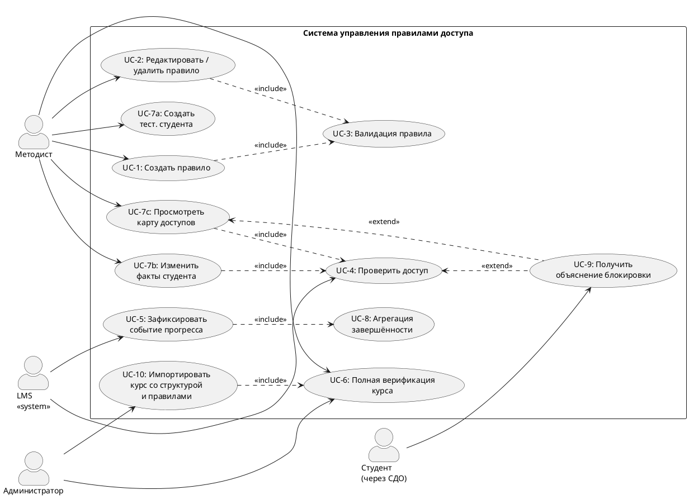

# PROJECT BIBLE — ВКР Магистерская диссертация

> **Назначение документа:** единый источник истины для всего проекта ВКР.
> Загружается в каждую сессию Claude как первый контекст.
> Любое решение, принятое в любой сессии, записывается сюда.
> Локальный контекст (стиль текста, требования к оформлению, инструкции для кода) вынесен в сателлитные документы (см. раздел 8.2).
>
> **Последнее обновление:** 21.04.2026 (ревизия scope и двухуровневой SWRL)
> **Статус:** Фаза 0 завершена. Фаза 1a завершена. Фаза 1b закрыта 21.04: 2.7 (ФТ/НФТ/UC/СВ/трассировка) + 3.5 (C4 + 10 UML DSL + SAT_DATA_MODELS §1–§10 + SAT_ALGORITHMS §А1–§А6 + wireframes) + 3.6 (102 пункта дифа, маппинг FIX1–FIX15, 3-блочная последовательность). Scope сужен до 9 типов (исключён adaptive_routing), СВ-4/5 переведены в must, двухуровневая SWRL-семантика подтверждена. Фаза 2 стартует 25.04.
> **Где ведётся работа:** со следующей сессии — Claude Code с подключённым репозиторием `vkr-access-control` (структура и инструменты — раздел 8.3).

---

## 1. КОНТЕКСТ ПРОЕКТА (неизменяемый)

### 1.1. Формальные данные

- **ВУЗ:** Университет ИТМО, Санкт-Петербург
- **Уровень:** Магистратура
- **Направление:** 09.04.02 «Информационные системы и технологии»
- **Специализация:** «Интернет-технологии и программирование»
- **Компания-партнёр:** ООО «Дистех» (разработка СДО, предположительно на базе Moodle)
- **Научный руководитель:** Толпыгин С.В. (@t0ptyg)
- **Рецензент:** НЕ ОПРЕДЕЛЁН (требования: канд. наук или опыт >3 лет, не из ИТМО, не из Дистех)

### 1.2. Тема ВКР (зафиксирована в ИСУ, изменение невозможно с 01.04)

**Формулировка из системы ВУЗа (приоритет — исходное задание от компании):**

Цель: разработка программного комплекса для управления правилами доступа к образовательному контенту на основе онтологического моделирования. Система должна обеспечивать декларативное описание, централизованное хранение и автоматическую верификацию сложных правил учебного процесса.

### 1.3. Ключевые дедлайны

| Дата | Событие | Статус |
|------|---------|--------|
| Март 2026 | Первое рассмотрение | ❌ Получено «Не рекомендовать» |
| **15.05.2026** | **Предзащита (вторая)** | ⬜ Цель: «Рекомендовать» или «Условно рекомендовать» |
| ~10.05.2026 | Загрузка в Антиплагиат (предварительная проверка) | ⬜ |
| ~25.05.2026 | Загрузка итоговой ВКР в ИСУ (за 10 дней до защит) | ⬜ |
| ~28.05.2026 | Отзыв руководителя в ИСУ (за 7 дней до защит) | ⬜ |
| Июнь 2026 | Защита ВКР | ⬜ |

### 1.4. Замечания комиссии с первого рассмотрения (дословно)

> «В чем научная новизна? Онтологию нужно проверить с помощью формальных методов, необходимо провести научные исследования, нужно именно доказать, что подход является валидным. Алгоритм не соответствует уровню магистерской работы. В чем сложность содержания вашей работы?»

**Декомпозиция замечаний:**
1. **Нет научной новизны** — не показано, чем подход отличается от существующих
2. **Нет формальной верификации** — онтология не проверена формальными методами
3. **Нет доказательства валидности** — нужно доказать, что онтология совместима с целевыми СДО (что она корректно моделирует сущности и процессы реальных платформ)
4. **Алгоритм слабый** — не соответствует уровню магистерской
5. **Нет сложности** — не показана инженерная/научная глубина

### 1.5. Ограничения и реалии

- Компания «Дистех» максимально не вовлечена; взаимодействие минимальное
- Научный руководитель не в курсе текущего состояния работы (нужно связаться)
- Работа велась самостоятельно, без методического сопровождения
- **Текущий код писался по наитию, без предварительного анализа и проектирования.** Глава 1 слабо определила главу 2, а глава 2 — главу 3. Всё связано неявно, акцент был на визуальную целостность. По факту — нужно заново провести анализ предметной области (глава 1), на его основе сделать проектирование (глава 2), и уже из него — реализацию (глава 3). Всё должно быть целостной цепочкой: исследование → проектирование → реализация → проверка
- Антиплагиат: ≥80% оригинальности, AI-текст недопустим
- Рекомендуемый объём ПЗ: 60–80 страниц (магистерская)
- Доклад на рассмотрениях/предзащите: **7 минут** (лимит на последних рассмотрениях)
- **Технологический стек может быть изменён**, если анализ покажет, что альтернатива оптимальнее. Не натягиваем сову на глобус из-за того, что стек был выбран без осознанного анализа

### 1.6. Требования к инженерной сложности ВКР (из методички ИТМО)

Информационная система должна:
- Автоматизировать реальный бизнес-процесс
- Содержать **не менее трёх** отдельных нетривиальных компонентов
- Быть существенно интегрированной со сторонними системами
- Реализовывать нетривиальные алгоритмы обработки данных

### 1.7. Критерии оценки ВКР (8 критериев из программы ГИА)

1. **Внедрение результатов** — нужен акт экспертизы/внедрения от компании
2. **Качество изложения** — научный язык, диаграммы UML/C4, код с тестами (≥60%), нет критических проблем архитектуры
3. **Методы исследования** — обоснование выбора методов со ссылками на источники
4. **Научная/практическая значимость** — элементы научной новизны, публикация/конференция
5. **Актуальность, цель, задачи** — ≥30 источников не старше 5 лет, ≥30% ВАК, ≥20% Scopus/WoS
6. **Положения на защиту** — корректно сформулированы и доказаны результатами
7. **Соответствие направлению** — ИСиТ, интернет-технологии и программирование
8. **Соответствие теме** — содержание соответствует заданию

### 1.8. Известные источники

> **Принцип:** это стартовый пул. Литобзор (раздел 2) расширит его.
> Детальный анализ каждого источника (прочитан/нет, что взяли, качество) → в сателлит `SAT_SOURCES_ANALYSIS.md`.

#### A. Источники из задания в ИСУ (10)

| # | Источник | Тема |
|---|---------|------|
| Z1 | Sarwar S. et al. — Ontology based E-learning framework (2019) | Онтологии в e-learning |
| Z2 | Rani M., Nayak R., Vyas O.P. — Ontology-based adaptive personalized e-learning (2015) | Адаптивное обучение |
| Z3 | Iqbal M. et al. — Personalized and adaptive e-learning systems for semantic Web (2025) | Semantic Web в образовании |
| Z4 | Scherp A. et al. — Semantic web: Past, present, and future (2024) | Обзор Semantic Web |
| Z5 | Brewster C. et al. — Ontology-based access control for FAIR data (2020) | Онтологии + access control |
| Z6 | Can Ö., Bursa O., Ünalır M. — Personalizable ontology based access control (2010) | OBAC |
| Z7 | Nazyrova A. et al. — Analysis of consistency of prerequisites (2023) | Верификация пререквизитов |
| Z8 | Allemang D., Hendler J. — Semantic web for the working ontologist (2011) | Учебник OWL |
| Z9 | Zhang L., Lobov A. — SWRL-based approach for knowledge-based engineering (2024) | SWRL |
| Z10 | Horrocks I. et al. — SWRL: A semantic web rule language (2004) | Спецификация SWRL |

#### B. Источники из текущей ПЗ (31)

| # | Источник | Тема | Год |
|---|---------|------|-----|
| P1 | Pelánek R. — Adaptive learning is hard: Challenges, nuances, and trade-offs | Адаптивное обучение, ограничения | 2025 |
| P2 | Mirata V. et al. — Challenges and contexts in establishing adaptive learning in HE | Адаптивное обучение в вузах | 2020 |
| P3 | Kucharski S. et al. — Adaptive Learning Mechanisms for LMS: Scoping Review | Обзор адаптивных механизмов LMS | 2025 |
| P4 | Bakhouyi A. et al. — Evolution of standardization and interoperability on E-learning | Стандарты e-learning | 2017 |
| P5 | AICC — CMI Guidelines for Interoperability, v4.0 | Стандарт CMI | 2004 |
| P6 | ADL Initiative — SCORM 2004 4th Edition | Стандарт SCORM | 2009 |
| P7 | ADL Initiative — Experience API (xAPI) v2.0 | Стандарт xAPI | 2023 |
| P8 | AICC/ADL — CMI5 Specification | Стандарт CMI5 | — |
| P9 | Sarwar S. et al. — Ontology based E-learning framework | = Z1 | 2019 |
| P10 | Rani M. et al. — Ontology-based adaptive personalized e-learning | = Z2 | 2015 |
| P11 | Sandhu R.S. — Role-based access control | RBAC (базовая модель) | 1998 |
| P12 | Moodle Docs — Roles and permissions | Moodle access control | — |
| P13 | Blackboard — Roles and Privileges | Blackboard access control | — |
| P14 | Hu V.C. et al. — Guide to ABAC definition (NIST SP 800-162) | ABAC (стандарт NIST) | 2014 |
| P15 | OASIS — XACML v3.0 | Стандарт XACML | 2013 |
| P16 | Jebbaoui H. et al. — Semantics-based approach for detecting flaws in XACML policies | Верификация XACML | 2015 |
| P17 | Moodle Dev — Availability conditions | Moodle restrict access (техдок) | — |
| P18 | Bhatti R. et al. — Trust-based context-aware access control (CAAC) | CAAC | 2005 |
| P19 | Kim Y.G. et al. — Context-aware access control for ubiquitous applications | CAAC в ubiquitous learning | 2005 |
| P20 | Brewster C. et al. + Can Ö. et al. (⚠️ два источника слиты в один — РАЗДЕЛИТЬ) | OBAC | 2020, 2010 |
| P21 | Aslam S. et al. — OBAC: agent-based identification of roles, objects, permissions | OBAC | 2020 |
| P22 | McGuinness D.L. et al. — OWL Web Ontology Language overview (W3C) | Спецификация OWL | 2004 |
| P23 | Horrocks I., Patel-Schneider P.F. — Knowledge Representation on the Semantic Web | OWL теория | 2010 |
| P24 | Kayes A.S.M. et al. — Context-aware access control with fuzzy logic and ontology | CAAC + онтологии + fuzzy logic | 2020 |
| P25 | Microsoft Learn — Сравнение графов и реляционных БД | Графовые БД | — |
| P26 | Angles R. — A comparison of current graph database models | Графовые БД (IEEE) | 2012 |
| P27 | Scherp A. et al. — Semantic web: Past, present, and future | = Z4 | 2024 |
| P28 | Abburu S. — A survey on ontology reasoners and comparison | Обзор OWL-резонеров | 2012 |
| P29 | Abicht K. — OWL Reasoners still useable in 2023 | Актуальность OWL-резонеров | 2023 |
| P30 | Lam A.N. et al. — Performance Evaluation of OWL 2 DL Reasoners using ORE 2015 | Бенчмарк резонеров | 2023 |
| P31 | Steigmiller A. et al. — Benchmarking Symbolic and Neuro-Symbolic DL Reasoners | Бенчмарк резонеров (ISWC) | 2023 |

#### C. Источники, выявленные при литобзоре фазы 0 (новые)

| # | Источник | Тема | Год |
|---|---------|------|-----|
| N1 | Finin T., Joshi A. — ROWLBAC: Representing Role Based Access Control in OWL (SACMAT) | RBAC в OWL (фундаментальная работа OBAC) | 2008 |
| N2 | Carminati B. et al. — Using OWL and SWRL to represent and reason with situation-based access control policies | OWL+SWRL для AC в соцсетях; документация OWA-проблемы | 2011 |
| N3 | Beimel D., Peleg M. — SitBAC: Using OWL and SWRL for situation-based access control in healthcare | OWL+SWRL для AC в здравоохранении | 2011 |
| N4 | Hsu W.-L. — LAPAR: Integrating XACML with OWL and SWRL | Многослойная интеграция XACML+OWL+SWRL | 2013 |
| N5 | Kolovski V. et al. — Formalizing XACML Using Defeasible Description Logics (WWW) | DL для верификации XACML-политик | 2007 |
| N6 | Huang H. et al. — A DL-based method for access control policy conflict detecting (ACM) | ABox consistency → обнаружение конфликтов AC | 2009 |
| N7 | Laouar M.R. et al. — Ontology-based approach for handling inconsistency in access control (Springer) | OWL + inconsistency-tolerant AC | 2025 |
| N8 | Kozlov F.A., Mouromtsev D.I. — ECOLE: Enhanced Course Ontology for Linked Education (ITMO, KESW 2013–2014, WWW 2016) | Онтология курсов Open edX, NLP, SCORM; **нет access control** | 2013–2017 |
| N9 | Heiyanthuduwage S.R. et al. — OWL 2 Learn Profile (PMC) | Анализ 14 образовательных онтологий; ни одна не содержит AC | 2016 |
| N10 | Fisler K. et al. — Margrave: Verification and Change-Impact Analysis of Access-Control Policies (ICSE) | MTBDD для верификации XACML | 2005 |
| N11 | Marfia F. et al. — XACML-compliant framework using DL reasoning for authorization | DL-reasoner для принятия решений AC | 2015 |

#### D. Источники, выявленные при фазе 1 (подтверждение gap 2022–2025)

| # | Источник | Тема | Год |
|---|---------|------|-----|
| N12 | Fakoya J.T. et al. — Ontology-Based Model for E-Learning Management System (O-BMEMS) | Онтология для e-learning; **нет AC** — подтверждает gap | 2024 |
| N13 | Na Nongkhai L. et al. — ADVENTURE: Adaptive learning support system based on ontology (CONTINUOUS) | Онтология программирования + адаптивное обучение; **нет AC** | 2025 |
| N14 | Mohamed A.K.Y.S. et al. — Systematic literature review for authorization and access control: definitions, strategies and models | Систематический обзор AC — образование не фигурирует как домен OBAC | 2022 |
| N15 | Farhadighalati N. et al. — A Systematic Review of Access Control Models (IEEE Access) | Систематический обзор ACM 2025 — образование не фигурирует как домен OBAC | 2025 |
| N16 | Can Ö., Unalir M.-O. — Revisiting Ontology Based Access Control: The Case for OBDA (ICISSP) | OBAC + OBDA; **не образование** — подтверждает gap | 2022 |

> **Проблемы в текущем списке:** P20 содержит два источника, слитых в один пункт — нужно разделить.
> **Дубликаты с заданием:** P9=Z1, P10=Z2, P27=Z4.
> **Рекомендация научрука:** изучить работу Козлова Ф.А. — ✅ Выполнено (N8, система ECOLE).
> **Задача для фазы 4:** целенаправленно добавить свежие источники 2021–2026 по каждому направлению для выполнения требования К5 (≥30 не старше 5 лет). Фундаментальные работы (ROWLBAC 2008, Carminati 2011, Kolovski 2007, Sandhu 1998, SWRL 2004) допустимы и необходимы как основы области.

---

## 2. ИССЛЕДОВАТЕЛЬСКАЯ БАЗА

> **Статус:** ЗАПОЛНЕНО (фаза 0, сессия 15.04.2026).
> Литобзор L1–L8 выполнен полностью.
> Полный англоязычный отчёт Deep Research → в сателлит `SAT_DEEP_RESEARCH_REPORT.md`.

### 2.1. Литературный обзор

**Цель:** ответить на вопросы:
- Кто и как управляет правилами доступа в современных СДО?
- Кто до нас применял онтологический подход для этой задачи?
- Какие пробелы существуют в текущих подходах?
- Чем наш подход может отличаться?

**Где искать:**
- **Google Scholar** — основной поисковый инструмент (приоритет: цитируемые, актуальные, релевантные работы)
- **Scopus / Web of Science** — для индексированных публикаций (требование критерия К5: ≥20% из Scopus/WoS)
- **IEEE Xplore, ACM Digital Library, SpringerLink** — для конференционных и журнальных статей
- **eLibrary.ru / РИНЦ** — для русскоязычных и ВАК-источников (требование: ≥30% ВАК)
- **Официальная документация** платформ (Moodle, Canvas, Blackboard, Stepik) — для анализа существующих реализаций
- **W3C, OASIS** — для стандартов (OWL, SWRL, XACML)

**Требования к качеству источников:**
- **Релевантность:** источник должен быть непосредственно связан с темой (управление доступом, онтологии, e-learning, верификация правил)
- **Достоверность:** рецензируемые журналы и конференции, официальная документация, стандарты; избегать блогов, непроверенных препринтов, сомнительных агрегаторов
- **Актуальность:** приоритет источникам 2020–2026; классические работы (RBAC 1998, OWL 2004, SWRL 2004) допускаются как фундаментальные
- **Цитируемость:** для Google Scholar — проверять число цитирований; низкоцитируемые работы использовать только при высокой релевантности
- **Количественные требования (для оценки «хорошо» по К5):** ≥30 источников не старше 5 лет, ≥30% ВАК, ≥20% Scopus/WoS

**Направления поиска:**

| # | Направление | Что искать | Статус |
|---|------------|-----------|--------|
| L1 | Управление доступом в СДО | Как Moodle, Canvas, Blackboard, Stepik, Open edX реализуют restrict access, prerequisites, conditional activities. Какие типы правил поддерживают, какие ограничения имеют | ✅ |
| L2 | Онтологии в e-learning | Существующие OWL-онтологии образовательного процесса: кто делал, для чего, с какими результатами. Есть ли онтологии именно для управления доступом? | ✅ |
| L3 | SWRL в управлении доступом | Применение SWRL-правил для access control (не только в образовании). Какие задачи решали, какие ограничения обнаружили | ✅ |
| L4 | Верификация правил доступа | Формальные методы проверки согласованности политик (consistency, cycles, deadlocks, conflicts). Алгоритмы обнаружения противоречий | ✅ |
| L5 | Адаптивные образовательные траектории | Personalized learning paths, adaptive learning systems. Как задаются правила адаптации | ✅ Фон для гл.1 |
| L6 | Работа Козлова Ф.А. (рекомендация научрука) | Семантические технологии в СДО — подход, результаты, чем отличается от нашего | ✅ |
| L7 | Стандарты e-learning | IMS Learning Design, xAPI, LTI, SCORM, CMI5 — как они решают задачу правил и чем ограничены | ✅ Фон для гл.1 |
| L8 | DL-reasoning для верификации | Использование Description Logic reasoners (Pellet, HermiT, FaCT++) для проверки онтологий. Сравнительные бенчмарки | ✅ |

#### Результаты литобзора

**L1: Управление доступом в 5 СДО — сводная таблица**

| Характеристика | Moodle | Canvas | Blackboard | Stepik | Open edX |
|---------------|--------|--------|------------|--------|----------|
| Гранулярность | Активность + секция | Модуль | Элемент контента | Модуль | Подсекция |
| Булева логика | Полная вложенность AND/OR/NOT | Нет | OR-of-ANDs | Нет | Нет |
| Порог оценки | ✅ | ✅ | ✅ | ✅ (баллы) | ✅ (мин. %) |
| Завершение активности | ✅ | ✅ | ✅ (review status) | ❌ | ✅ |
| Дата/время | ✅ | ✅ | ✅ | ❌ | ✅ (release dates) |
| Группа/членство | ✅ | ✅ (Differentiation) | ✅ | ❌ | ✅ (cohorts) |
| Компетенции | ✅ (competency framework) | Mastery Paths | ❌ | ❌ | ❌ |
| Обнаружение циклов | ❌ | Структурная защита | ❌ | Последовательность by design | ❌ (документированный риск) |
| Формальная верификация | ❌ | ❌ | ❌ | ❌ | ❌ |
| Хранение правил | JSON в course_modules.availability | FK между module records (PostgreSQL) | Проприетарное | Проприетарное | CourseContentMilestone (PostgreSQL) |

**Ключевой вывод L1:** Ни одна из 5 СДО не реализует формальную верификацию правил доступа. Open edX документированно предупреждает, что циклические пререквизиты навсегда скрывают контент от студентов. Правила хранятся в RDBMS (JSON/FK/проприетарные форматы) и интерпретируются процедурным кодом — формальный анализ невозможен без запуска интерпретатора.

**L2: Онтологии в e-learning**
- Sarwar et al. (2019, Z1) — CourseOntology для рекомендаций контента. Нет access control.
- Rani et al. (2015, Z2) — user.owl + course.owl, модель стилей обучения (Felder-Silverman). Нет access control.
- Heiyanthuduwage et al. (2016, N9) — анализ 14 образовательных OWL-онтологий: ни одна не содержит конструкторов access control.
- IEEE LOM OWL (Gluz & Vicari, 2012) — метаданные learning objects, свойства «requires»/«isRequiredBy» — аннотации, не правила.
- **Вывод L2:** образовательные онтологии не формализуют правила доступа. Пробел подтверждён.

**L3: SWRL в access control**
- Carminati et al. (2011, N2) — SWRL + Pellet для AC в соцсетях. Документировали проблему OWA: невозможность negation-as-failure. Workaround: отдельные предикаты cannotDo + SPARQL.
- Beimel & Peleg (2011, N3) — SitBAC для здравоохранения, SWRL property chains.
- Hsu (2013, N4) — LAPAR: XACML → SWRL → Jess, многослойная интеграция.
- Zhang & Lobov (2024, Z9) — SWRL в инженерии (не AC), подтвердили: производительность резонера — узкое место.
- **Вывод L3:** SWRL применялся к AC в здравоохранении, соцсетях, предприятиях — но **никогда в образовании/СДО**.

**L4: Верификация политик доступа**
- Kolovski et al. (2007, N5) — формализация XACML через Defeasible DL, проверка через Pellet.
- Huang et al. (2009, N6) — отображение XACML в DL knowledge base: обнаружение конфликтов = ABox consistency checking.
- Marfia et al. (2015, N11) — три онтологии (Policy TBox, Domain TBox, Domain ABox), DL-reasoner для авторизации.
- Fisler et al. (2005, N10) — Margrave: XACML → MTBDD, query-based verification.
- Jebbaoui et al. (2015, P16) — SBA-XACML: обнаружение unreachable rules, конфликтов, избыточностей.
- **Вывод L4:** DL-верификация AC-политик — зрелая область для XACML. Но **никто не применял DL-reasoning к правилам доступа в СДО**.

**L6: Козлов Ф.А. (ИТМО)**
- Система ECOLE (Enhanced Course Ontology for Linked Education), совместно с Муромцевым Д.И.
- Публикации: KESW 2013 (CCIS 394), KESW 2014 (CCIS 468), WWW 2016 Companion.
- Назначение: интерлинкинг терминов между курсами Open edX, NLP-based ontology population, конвертация в SCORM.
- **Вывод L6:** ECOLE не содержит моделирования access control. Наша работа — в другой нише.

**L5: Адаптивные образовательные траектории (фон для главы 1)**
- Рынок адаптивного обучения оценивается в $3.76 млрд (2024) → $30.79 млрд (2034).
- Современные adaptive learning platforms (Knewton Alta, Smart Sparrow, DreamBox) используют ML/AI для динамической корректировки контента, сложности и пути обучения.
- Ключевое отличие от нашей задачи: адаптивное обучение — это *рекомендация* контента (вероятностная, ML-driven). Управление доступом — это *правило* (детерминированное, logic-driven). Точкой соприкосновения могла бы быть адаптивная маршрутизация по диапазону оценок (как Canvas Mastery Paths); в нашем пуле этот паттерн не вынесен отдельным типом (решение 21.04), но эквивалентно выразим через `or_combination` + два `grade_required` с граничными порогами.
- Pelánek (2025, P1): адаптивное обучение остаётся сложной задачей с множеством trade-offs; Kucharski et al. (2025, P3): scoping review адаптивных механизмов в LMS.
- **Вывод L5:** адаптивное обучение — контекст, в котором работает наша система. Мы не конкурируем с ML-решениями, а дополняем их: ML рекомендует, OWL+SWRL — контролирует доступ.

**L7: Стандарты e-learning (фон для главы 1)**
- **SCORM** (2004): упаковка контента + runtime-коммуникация с LMS. Отслеживает completion, score, time. Ограничения: контент на том же сервере, только браузер, нет cross-domain, ограниченная аналитика. Не содержит механизмов access control — только sequencing (порядок SCO).
- **xAPI** (2013, P7): Actor-Verb-Object statements в LRS. Отслеживает любой опыт обучения (включая мобильный, офлайн). Гибче SCORM, но не определяет правил доступа — только фиксирует факты.
- **cmi5** (CMI5, P8): «SCORM нового поколения» — структурированные курсы поверх xAPI. Определяет completion/mastery, но не условия доступа.
- **LTI** (1EdTech/IMS): интеграция внешних инструментов через SSO + grade passback. Не управляет доступом — только запускает инструмент и возвращает оценку.
- **IMS Common Cartridge**: упаковка курсов для академической среды. Включает discussion topics, question banks. Нет runtime-коммуникации, нет access control.
- **Вывод L7:** ни один стандарт e-learning не определяет формат или механизм для описания правил доступа к контенту. SCORM sequencing — ближайшее, но оно описывает *порядок* (последовательность), а не *условия* (если X, то Y доступен). Это подтверждает актуальность нашего подхода: стандартизированного, формального способа описания правил доступа не существует.

**L8: DL-резонеры**
- Abicht (2023, P29): обзор 95+ резонеров, большинство не поддерживается.
- Lam et al. (2023, P30): бенчмарк 6 резонеров на ORE 2015 (1920 онтологий). Konclude — лидер по производительности, но без SWRL. Openllet — mid-range, единственный с SWRL+built-ins.
- **Вывод L8:** Для OWL+SWRL единственный жизнеспособный вариант — Openllet (или гибрид HermiT+Drools).

**ПРОБЕЛЫ, ВЫЯВЛЕННЫЕ В ЛИТЕРАТУРЕ:**

1. **Пробел 1 (L2 × L3):** Образовательные OWL-онтологии не формализуют access control. SWRL-based AC существует для других доменов, но не для образования. Пересечение — пустое множество.
2. **Пробел 2 (L4 × L1):** DL-верификация AC-политик зрелая для XACML, но не применялась к правилам доступа СДО. Между тем ни одна СДО не реализует формальную верификацию — при документированных рисках (циклы в Open edX).
3. **Пробел 3 (L1):** Правила доступа во всех СДО хранятся в RDBMS и интерпретируются процедурно — они неотделимы от реализации и не допускают формального анализа.

**НАША ПОЗИЦИЯ ОТНОСИТЕЛЬНО СУЩЕСТВУЮЩИХ РАБОТ:**

Мы находимся на пересечении трёх непересекающихся потоков:
- Поток 1 (e-learning ontologies): Sarwar 2019, Rani 2015, ECOLE/Kozlov 2013–2017, Fakoya 2024, Na Nongkhai 2025 — моделируют контент/адаптацию, но не AC.
- Поток 2 (OBAC/SWRL-based AC): ROWLBAC 2008, Carminati 2011, Beimel 2011, Laouar 2025 — формализуют AC, но не для образования.
- Поток 3 (DL-based policy verification): Kolovski 2007, Huang 2009, Nazyrova 2023 — верифицируют XACML / пререквизиты, но не правила доступа СДО.

Мы объединяем все три потока на новом домене (LMS access control) — gap подтверждён литобзором 2008–2025.

### 2.2. Научная новизна (✅ ПОДТВЕРЖДЕНА ЛИТОБЗОРОМ, УТОЧНЕНА ФАЗА 1)

> **Статус:** УТВЕРЖДЕНИЕ, подтверждённое литобзором фазы 0 и верификацией gap свежими источниками (фаза 1).

**Элемент новизны 1: Онтологическая модель управления доступом к образовательному контенту.**
Предложена OWL-онтология, объединяющая концепты образовательного домена (Course, LearningActivity, Learner, Grade, CompletionState, Competency) с концептами управления доступом (AccessPolicy, Condition, Permission). В отличие от образовательных онтологий (Sarwar 2019, Rani 2015, ECOLE/Kozlov 2013–2017, Fakoya 2024, Na Nongkhai 2025), которые не формализуют AC, и в отличие от OBAC-онтологий (ROWLBAC 2008, Carminati 2011, Laouar 2025), которые не содержат образовательных концептов — предложенная онтология покрывает оба домена.

**Элемент новизны 2: Гибридная архитектура SWRL+Python с CWA-enforcement.**
Правила доступа описаны в SWRL (TBox) в едином формальном пространстве с OWL-онтологией, что обеспечивает возможность формального анализа. Ограничения SWRL (отсутствие now(), агрегаций, NAF) компенсируются слоем предобработки (Python enricher) и постобработки (CWA-enforcement, default-deny). В отличие от процедурных систем СДО (Moodle Availability API, Canvas module prerequisites) — подход сохраняет возможность формального анализа правил.

**Элемент новизны 3: DL-reasoning + графовый анализ для верификации правил доступа в СДО.**
Задачи верификации сводятся к: (а) стандартным DL-сервисам (consistency check → обнаружение конфликтов, satisfiability check → невыполнимые условия), (б) графовому анализу (cycle detection → циклические зависимости, reachability → недостижимые элементы). Расширяет Nazyrova et al. (2023) с уровня учебного плана до fine-grained правил активностей. Расширяет Kolovski et al. (2007) и Huang et al. (2009) с XACML на нативную OWL-онтологию.

### 2.3. Систематическая оценка возможностей и ограничений OWL+SWRL (✅ ЗАПОЛНЕНО)

#### Матрица функциональных возможностей vs. OWL+SWRL

| # | Функциональная возможность | Пример сценария | OWL+SWRL | Тип реализации | Обоснование |
|---|---------------------------|----------------|----------|----------------|-------------|
| F1 | Правило на просмотр элемента | «Посмотри лекцию 1 → откроется тест» | ✅ | SWRL | Прямое сопоставление предикатов |
| F2 | Правило на завершение элемента | «Заверши модуль 1 → откроется модуль 2» | ✅ | SWRL | Прямое сопоставление предикатов |
| F3 | Правило на оценку (порог) | «Получи ≥80 за тест → откроется лекция» | ✅ | SWRL + built-ins | swrlb:greaterThanOrEqual |
| F4 | Правило на компетенцию (с иерархией) | «Получи компетенцию X → откроется модуль Y» | ✅ | SWRL + TransitiveProperty | OWL свойство транзитивности |
| F5 | Временное ограничение (дата/время) | «Доступно с 01.05 по 15.05» | ⚠️ | ГИБРИД | Нет now() в SWRL; инжекция текущего времени через Python → SWRL сравнивает |
| F6 | Подсчёт попыток (N провалов → действие) | «3 провала теста → доп. практикум» | ⚠️ | ГИБРИД | Нет агрегаций в SWRL; Python считает → инжектирует → SWRL сравнивает |
| F7 | Логическая комбинация AND | «Заверши И лекцию, И тест → экзамен» | ✅ | SWRL | Конъюнкция атомов в теле правила (Horn clause) |
| F8 | Логическая комбинация OR | «Заверши лекцию ИЛИ тест → модуль» | ✅ | SWRL | Несколько правил с одинаковой головой |
| F9 | Логическая комбинация NOT | «Если НЕ завершён X → заблокировать Y» | ❌→⚠️ | ГИБРИД (CWA layer) | OWA несовместима с NAF; CWA-enforcement в application layer (default-deny) |
| F10 | Агрегатные функции (AVG, SUM, COUNT) | «Средний балл ≥75% → допуск к экзамену» | ⚠️ | ГИБРИД | Нет агрегаций в SWRL; предвычисление в Python |
| F11 | Межкурсовые зависимости | «Заверши курс A → откроется курс B» | ✅ | SWRL | Перспектива. Технически реализуемо, вынесено из scope ядра |
| F12 | Ролевые ограничения (RBAC) | «Только преподаватели видят аналитику» | ✅ | OWL + SWRL | Доказано ROWLBAC (Finin et al., 2008). Вне scope — это авторизация, не AC контента |
| F13 | Групповые ограничения контента | «Группа A видит задание X, группа B — Y» | ✅ | OWL + SWRL | Группа = OWL-класс/индивид, belongs_to_group → SWRL проверяет |
| F14 | Ограничение по времени прохождения | «Потрать ≥30 мин на лекцию → тест» | ⚠️ | ГИБРИД | Аналог F5+F6: Python вычисляет длительность → инжекция |
| F15 | Адаптивная маршрутизация | «Слабый результат → доп. материалы» | ✅ | SWRL + built-ins | Несколько правил с разными диапазонами оценок |
| F16 | Обнаружение циклов в правилах | «A→B→C→A — заблокировать» | 🔷 | Графовый алгоритм | Не задача DL; NetworkX split-node DiGraph |
| F17 | Обнаружение недостижимых состояний | «Элемент X недостижим» | ⚠️ | ГИБРИД | DL (unsatisfiability) + графовый анализ (reachability) |
| F18 | Проверка согласованности (consistency) | «Нет логических противоречий» | ✅ | DL reasoning | Базовый сервис резонера; Kolovski 2007, Huang 2009 |
| F19 | Агрегация завершённости (roll-up) | «Все обяз. элементы завершены → модуль завершён» | 🔷 | Алгоритм (Python) | Требует агрегации (∀x: mandatory → completed) |
| F20 | Трассировка вывода | «Почему заблокирован? → невыполненные условия» | ⚠️ | ГИБРИД | DL justifications + логирование срабатываний SWRL |

#### Вопросы по ограничениям OWL+SWRL (✅ ФОРМАЛЬНЫЕ ОТВЕТЫ)

| # | Вопрос | Ответ | Статус |
|---|--------|-------|--------|
| LIM1 | Может ли SWRL работать с текущим временем? | **Нет.** SWRL оперирует статическим снимком ABox. Нет функции now(). Временны́е built-ins (swrlb:dateTime, swrlb:greaterThan) — для сравнения, не для получения текущего времени. **Решение:** инжекция текущей даты как datatype property перед reasoning — стандартный паттерн (документация SWRLAPI). | ✅ |
| LIM2 | Поддерживает ли SWRL агрегатные функции? | **Нет.** Спецификация SWRL Built-Ins (W3C) не включает COUNT, SUM, AVG. SWRL работает с индивидуальными привязками переменных, а не с множествами — принципиальное ограничение Horn-логики. **Решение:** предвычисление агрегатов в Python, инжекция результатов. | ✅ |
| LIM3 | Как реализовать AND/OR/NOT? | **AND:** нативно (конъюнкция в теле правила). **OR:** нативно (несколько правил с одной головой). **NOT:** невозможно (нет NAF из-за OWA). **Решение NOT:** CWA-enforcement в application layer (default-deny) — стандартный паттерн всех SWRL-based AC систем (Carminati 2011). Сложные комбинации (A∧B)∨(C∧D) → два правила с конъюнкциями. | ✅ |
| LIM4 | Производительность при большом числе индивидов? | OWL 2 DL reasoning — 2NEXPTIME-complete (теория). Openllet: 1595/1920 классификация (Lam et al. 2023). SWRL: комбинаторика привязок (DL-safe → только named individuals). **Оценка:** ~1000 студентов × ~100 ресурсов × ~50 правил — управляемо. 10K+ — нужно кэширование (Redis) или инкрементальный reasoning. Текущая архитектура уже учитывает. | ✅ Эксперименты (EXP4) |
| LIM5 | Как OWA влияет на логический вывод? | OWA: отсутствие факта ≠ ложность. Фундаментально несовместимо с default-deny AC. Carminati et al. (2011) документировали проблему. **Решение:** гибридная архитектура — reasoning в OWA (выводит положительные разрешения), application layer — CWA (всё невыведенное = запрещено). | ✅ |
| LIM6 | Как обрабатывать откат фактов (монотонность)? | OWL монотонен: добавление аксиом не отменяет предыдущих выводов. Стандартные резонеры не поддерживают Truth Maintenance System. **Решение:** полный пересчёт (clear inferred → re-inject → re-reason). Redis кэширует между пересчётами. Это обоснованный архитектурный паттерн, не костыль. | ✅ |
| LIM7 | Почему OWL 2 DL + SWRL, а не альтернативы (F-Logic, ASP, Datalog, XACML)? | **F-Logic** (Kifer & Lausen, 1995) — ОО-логика с NAF и агрегациями, но не W3C-стандарт (→ нарушение НФТ-10), нет Python-моста уровня Owlready2, не используется в OBAC-литературе. **ASP** (Gelfond & Lifschitz, 1988) — нативный NAF/CWA, но не ЯПЗ: классы/свойства/иерархия домена пришлось бы моделировать отдельно, DL-сервисы (Consistency, Subsumption для СВ-1/4/5) нужно кодировать вручную, в образовательном AC не применяется. **Datalog** — проще, но без онтологического моделирования и транзитивности. **XACML** — не логический язык, а процедурная спецификация; формальная верификация XACML возможна только через его перевод в OWL (Kolovski 2007). **Итог:** выбор OWL+SWRL обоснован четырьмя пересекающимися критериями — (1) W3C-стандарт; (2) привязка к OBAC-литературе, где концентрируется научная новизна; (3) зрелая экосистема резонеров и Python-биндингов; (4) базовые DL-сервисы верификации из коробки. Цена гибридной архитектуры (enricher + CWA) локализована в двух модулях `ReasoningOrchestrator`. Детальный разбор — в `SAT_DATA_MODELS.md §1.1.1` | ✅ |

### 2.4. Граница системы (✅ ОПРЕДЕЛЕНА)

| Вопрос | Обоснованное решение |
|--------|---------------------|
| Целевые СДО | **Платформо-независимая** система. Онтология моделирует абстрактные концепты (Course, LearningModule, LearningActivity, Student, AccessPolicy). Валидность доказывается маппингом классов онтологии → сущности всех пяти проанализированных СДО (Moodle, Canvas, Blackboard, Open edX, Stepik). Маппинг — таблица соответствий (раздел 3.5.3), не программная интеграция. Данные для маппинга уже собраны в L1. |
| Авторизация (RBAC) | **Вне scope.** Система управляет правилами доступа к *контенту* (content-level AC), не аутентификацией/авторизацией. Идентификация студента — входной параметр от внешней системы (LMS, SSO). Стандартная граница для policy management (ср. XACML PDP не занимается аутентификацией). |
| Групповые правила контента | **В scope (тип 9).** Не путать с RBAC. Групповое правило — это условие доступа к контенту (группа А видит задание X), а не авторизация (преподаватель может редактировать). SWRL-native, есть в Moodle/Canvas/Blackboard. |
| Набор типов правил | **9 типов ядра + верификационный слой (V1–V3).** Обосновано через анализ СДО (L1) и матрицу F1–F20. См. раздел 2.5. |
| Песочница/симулятор | **В scope** как инструмент валидации. Позволяет проверить поведение правил без реальных студентов — часть верификационного слоя. |
| Roll-up (агрегация завершённости) | **В scope** как вспомогательный алгоритм reasoning pipeline. Не тип правила, а вычисление агрегированного статуса. Термин: «восходящая агрегация завершённости (roll-up)». Условие по умолчанию: модуль завершён = все обязательные элементы завершены. Обязательность элемента задаётся методистом (поле `is_mandatory`, уже в коде). Расширенные условия завершения (пороги баллов, процент прохождения) — перспектива: это отдельная подсистема настройки учебного плана, не усиливает основной тезис о верификации правил доступа. |
| Гранулярность правил | **Правила назначаются на элементы любого уровня иерархии** (LearningActivity, LearningModule, Course). Онтология моделирует самый гранулярный уровень — LearningActivity. Module и Course — контейнеры, на которые тоже назначаются правила. Это обеспечивает совместимость: Canvas ставит правила на Module — мы тоже; Moodle ставит на Activity — мы тоже. Правило на модуль = «доступ ко всему модулю», не «к каждому элементу внутри». |
| Redis кэш | **В scope** как архитектурное решение для масштабируемости. Обосновано LIM4 (DL reasoning вычислительно дорог). Стандартный паттерн для Semantic Web сервисов. |
| Межкурсовые зависимости | **Перспектива (вне scope ядра).** Технически реализуемо (курсы в одной онтологии, SWRL-правило работает аналогично). Решение вынести в перспективу: не добавляет научной ценности к основному тезису (верификация), требует проработки UI/UX и организационных аспектов. Может быть реализовано при наличии времени. |
| Трассировка вывода | **В scope** как функциональное требование. DL justifications + логирование SWRL. |

### 2.5. Определение пула типов правил (✅ ОПРЕДЕЛЁН)

> Пул определён через анализ, а не «по наитию».

**Методика:**
1. ✅ **Анализ реальных СДО (L1):** «рыночный стандарт» — 8 типов условий (завершение, оценка, просмотр, дата, группа, роль, компетенция, комбинации AND/OR/NOT)
2. ✅ **Анализ литературы (L2, L5):** адаптивная маршрутизация (Canvas Mastery Paths), межкурсовые зависимости (литература)
3. ✅ **Оценка реализуемости (матрица F1–F20):** SWRL-native / гибрид / невозможно
4. ✅ **Формирование пула:** 9 типов ядра + 3 верификационных
5. ✅ **Обоснование исключений:** каждый тип вне пула — с причиной

**ФИНАЛЬНЫЙ ПУЛ ТИПОВ ПРАВИЛ:**

Ядро (Core), 9 типов:
1. `completion_required` — завершение элемента. SWRL-native. Все 5 СДО.
2. `grade_required` — оценка ≥ порога. SWRL + built-ins. Все 5 СДО.
3. `viewed_required` — просмотр элемента. SWRL-native. Moodle, Blackboard.
4. `competency_required` — компетенция с иерархией. SWRL + TransitiveProperty. Moodle. Демонстрирует OWL-преимущества.
5. `date_restricted` — временное окно. ГИБРИД (Python инжекция `CurrentTime` + SWRL сравнение). 4 из 5 СДО.
6. `and_combination` — конъюнкция условий. SWRL-native (конъюнкция в теле). Moodle, Blackboard.
7. `or_combination` — дизъюнкция условий. SWRL-native (несколько правил). Moodle, Blackboard.
8. `group_restricted` — ограничение по группе. SWRL-native. Moodle, Canvas, Blackboard.
9. `aggregate_required` — агрегат (AVG/SUM/COUNT) по набору элементов ≥ порога. ГИБРИД (Python-агрегация → `AggregateFact` per student × policy + SWRL сравнение). Moodle (gradebook categories), Blackboard (weighted), Open edX (subsection grading) — 3 из 5 СДО штатно.

Верификационный слой:
- V1: Consistency check — непротиворечивость (DL reasoning, Pellet/Openllet)
- V2: Cycle detection — обнаружение циклов (графовый алгоритм, NetworkX)
- V3: Unreachable state detection — недостижимые элементы (DL unsatisfiability + граф)

**ОБОСНОВАННЫЕ ИСКЛЮЧЕНИЯ:**

| Тип | Причина исключения |
|-----|-------------------|
| NOT-комбинация (F9) | OWA фундаментально несовместима с NAF. Вместо явного NOT — архитектурный паттерн CWA-enforcement (default-deny). Совпадает с принципом least privilege (NIST SP 800-162). |
| Ролевые ограничения / RBAC (F12) | Авторизация пользователей — вне scope (это задача identity management). Наша система — content-level AC. |
| Время прохождения (F14) | Нет запроса от Дистех, слабая поддержка в СДО. Гибрид возможен, но не добавляет научной ценности. Перспектива. |
| Межкурсовые зависимости (F11) | Технически реализуемо (SWRL-native). Вынесено в перспективу: не усиливает основной тезис (верификация), требует проработки UI/UX и организационных аспектов. |
| Адаптивная маршрутизация (F15) | Нишевой паттерн, штатно только в Canvas (Mastery Paths). Технически эквивалентен нескольким `grade_required` с разными диапазонами, что покрывается существующими типами 2 и 7 (`or_combination` двух `grade_required` с граничными порогами). Не усиливает тезис о верификации. Решение 21.04: исключён для сокращения scope. Перспектива. |
| Количество попыток (F6) | Гибрид возможен по тому же паттерну, что F10 (enricher считает → инжекция → SWRL сравнивает). DataProperty `failed_attempts_count` уже есть в TBox. Не включено в ядро: нишевой сценарий remediation. Перспектива. |

### 2.6. Позиционирование относительно ML/нейросетевого подхода

> **Контекст:** потенциальный вопрос комиссии «а почему не нейросети/AI?»

**Ответ:** управление доступом — задача, требующая **детерминированности, верифицируемости и объяснимости**.

- Студент либо имеет доступ, либо нет — нет «вероятности 87% что имеет»
- Нейросеть не может дать формальную гарантию отсутствия конфликтов (consistency check)
- Нейросеть не может обеспечить трассировку вывода («почему заблокирован?»)
- Steigmiller et al. (2023, P31): нейросимволические DL-резонеры пока уступают символическим по корректности
- ML/AI уместен для смежных задач: рекомендация контента, предсказание успеваемости, адаптация сложности — но не для policy enforcement

**Для ПЗ (глава 1):** упомянуть ML-подходы к адаптивному обучению (Pelánek 2025, Kucharski 2025) и объяснить, почему для access control management нужен символический подход.

### 2.7. Анализ предметной области для главы 1 ПЗ (✅ ЗАПОЛНЕНО В ФАЗЕ 1b)

> **Зачем этот раздел:** литобзор ответил на вопрос «что делали другие». Для главы 1 ПЗ этого мало. Нужен анализ предметной области: как процесс устроен сейчас (as-is), кто участники, какие у них потребности, какие требования предъявляются к системе. Без этого глава 1 не замыкается в постановку задачи для главы 2.
>
> Разделы 2.7.1–2.7.7 заполнены в фазе 1b (сессия 16–18.04.2026). Источники: документация Moodle/Canvas/Blackboard/Open edX/Stepik (L1), исходное задание от Дистех, свежие обзоры 2022–2025 (раздел 2.2).
>
> **Позиционирование работы (закреплено в 2.7):** референсная реализация (reference implementation) программного комплекса, реализующая рыночный стандарт функциональности СДО в части управления правилами доступа к контенту и дополнительно обеспечивающая формальную верификацию правил, недоступную в существующих платформах. Не «proof of concept» (слабо) и не «production-ready» (некорректно для исследовательской работы). Подробнее — см. запись в логе решений от 16.04 и раздел заключения ПЗ.

#### 2.7.1. Стейкхолдеры и их интересы

| Стейкхолдер | Роль | Ключевые потребности | Боли в текущих СДО |
|-------------|------|---------------------|---------------------|
| **Методист / преподаватель** | Создаёт структуру курса и правила доступа к контенту, определяет образовательную траекторию | Понятный способ задать условия доступа: «после лекции — тест, после теста с ≥80% — следующий модуль». Уверенность, что правила не конфликтуют между собой. Возможность проверить логику правил до того, как студенты столкнутся с ошибкой. Объяснение, почему конкретный студент не видит элемент | В Moodle/Canvas/Blackboard методист узнаёт о проблемах в правилах только от студентов. Нет инструмента предварительной проверки. Open edX документированно допускает циклические пререквизиты, навсегда скрывающие контент |
| **Студент / учащийся** | Потребитель образовательного контента, проходит курс по заданной траектории | Прозрачность: видеть, что заблокировано и почему. Понимать, что нужно сделать для разблокировки. Не сталкиваться с тупиками, где контент недоступен из-за ошибки методиста | Студент видит «элемент недоступен» без объяснения причин (Stepik, Open edX). Или видит условие, но не может его выполнить из-за циклической зависимости |
| **Администратор СДО** | Управляет платформой, импортирует/мигрирует курсы, отвечает за работоспособность | Интеграция с существующей СДО через API. Надёжность: система не блокирует учебный процесс при сбое. Производительность: ответ на запрос доступа за приемлемое время. Аудит правил при импорте курса из другой платформы или при миграции с прошлого года | При копировании курса в Blackboard теряются правила Adaptive Release. При импорте курса невозможно проверить согласованность правил автоматически |
| **Разработчик СДО (Дистех)** | Разрабатывает собственную СДО или встраивает компонент управления доступом в существующую | Встраиваемый сервис со стандартным REST API. Платформо-независимость: не привязан к конкретной СДО. Документация API и онтологии. Возможность использовать формальную верификацию как конкурентное преимущество своего продукта | Каждая СДО реализует правила доступа заново, процедурным кодом. Нет готового компонента с формальной верификацией, который можно встроить |

**Вне списка стейкхолдеров:** комиссия ВКР, научный руководитель — оценивают работу, но не являются пользователями системы.

#### 2.7.2. Описание процесса as-is (как сейчас устроено управление доступом в СДО)

> **Подход:** Moodle — основной пример (самая документированная платформа, P12, P17). Различия Canvas/Blackboard/Open edX/Stepik зафиксированы в сравнительной таблице L1 (раздел 2.1).

##### Сценарий 1: Методист создаёт правило доступа

**Moodle (Restrict Access):**

1. Методист открывает настройки элемента курса (задание, тест, лекция, файл).
2. В секции «Restrict Access» добавляет условие: завершение другого элемента, оценка ≥ порога, дата, принадлежность к группе, профиль пользователя.
3. Условия комбинируются: AND (все должны выполниться) или OR (любое из). Вложенность допускается — внутри AND-группы может быть OR-группа, внутри той снова AND, и так далее без жёсткого ограничения глубины. Это формирует булево дерево произвольной глубины, а не плоскую конъюнкцию/дизъюнкцию (в Blackboard структура строго двухуровневая — ДНФ).
4. Moodle сериализует правило в JSON и сохраняет в поле `course_modules.availability`.
5. Никакой валидации на этом этапе не происходит. Moodle не проверяет, создаёт ли новое правило цикл, конфликт или недостижимое состояние.

**Отличия других платформ:**
- **Canvas:** правила задаются только на уровне модуля (не отдельного элемента). Только последовательные пререквизиты «завершить модуль N перед модулем N+1». Mastery Paths — единственный механизм ветвления (по диапазону оценок).
- **Blackboard (Adaptive Release):** правила задаются через форму с AND/OR. Структура — дизъюнктивная нормальная форма. При копировании курса правила теряются. Система иногда показывает предупреждение «правило невыполнимо», но это поверхностная эвристика.
- **Open edX:** пререквизиты только на уровне подсекции. Один пререквизит на подсекцию, без булевых комбинаций. Документация явно предупреждает: интерфейс не мешает создать циклическую цепочку.
- **Stepik:** только порог баллов на уровне модуля в платных тарифах. Нет завершения, дат, групп.

##### Сценарий 2: Система принимает решение о доступе

**Moodle:**

1. Студент запрашивает страницу курса или конкретный элемент.
2. PHP-код Moodle загружает JSON из `course_modules.availability`.
3. Интерпретатор (класс `\core_availability\info`) рекурсивно обходит дерево условий.
4. Для каждого условия выполняются запросы к соответствующим таблицам Moodle: завершение — `course_modules_completion`, оценка — `grade_grades`, группа — `groups_members`, профиль — `user`. Условия по дате сравниваются с текущим временем, взятым из самого правила в `course_modules.availability`.
5. Результат: элемент показывается (доступен), скрывается полностью или показывается серым с текстом условия.
6. Решение вычисляется заново при каждом запросе (с кэшированием на уровне сессии).

Решение принимается процедурно: PHP-код интерпретирует JSON. Семантика правил задаётся кодом интерпретатора, а не декларативной спецификацией — это делает невозможным автоматический анализ свойств правил (достижимость, непротиворечивость), допуская только тестирование конкретных сценариев.

##### Сценарий 3: Обнаружение ошибок в правилах

Во всех пяти платформах путь один: студент сообщает, что контент недоступен. Методист ищет проблему вручную, проверяя правила по одному. Инструмента, который покажет все конфликты, циклы или недостижимые элементы курса, нет ни в одной из платформ.

##### Проблемы текущего процесса (сводка)

| # | Проблема | Следствие | Где проявляется |
|---|---------|-----------|----------------|
| P1 | Семантика правил задаётся кодом интерпретатора, а не декларативной спецификацией | Автоматический анализ свойств правил невозможен. Доступно только тестирование конкретных сценариев | Все 5 СДО |
| P2 | Нет предварительной валидации при создании правила | Ошибки обнаруживаются только при столкновении студента с проблемой | Все 5 СДО |
| P3 | Нет обнаружения циклических зависимостей в платформах, где они структурно возможны | Контент может стать навсегда недоступным | Moodle, Blackboard, Open edX (в Canvas и Stepik циклы невозможны из-за крайне ограниченной модели правил, см. P7) |
| P4 | Нет обнаружения логических конфликтов между правилами | Правила могут противоречить друг другу. Типы конфликтов: неудовлетворимые условия (grade ≥80 И grade <50); конфликт «разрешить vs запретить» (Carminati 2011); несовместимые временные окна | Все 5 СДО |
| P5 | Нет стандартного машиночитаемого формата описания правил | Каждая СДО использует проприетарное представление. Миграция курса требует ручного воссоздания правил. Даже внутри Blackboard копирование курса теряет Adaptive Release rules | Все 5 СДО |
| P6 | Трассировка блокировки не стандартизирована и варьируется от отсутствия до приемлемой | Stepik — минимально, Canvas/Open edX — частично, Moodle/Blackboard — детально, но как форматированный текст для человека (не машиночитаемо). Затрудняет интеграцию с внешними системами помощи студенту | Все 5 СДО |
| P7 | Модель правил чрезмерно ограничена в части платформ | Невозможно выразить реальные педагогические сценарии (комбинированные условия, завершение, группы, компетенции) | Canvas, Stepik |

**P3 vs P4 — почему отдельные пункты.** Цикл — структурное свойство графа зависимостей, обнаруживается графовым алгоритмом (DFS, топологическая сортировка) без учёта семантики условий. Логический конфликт — семантическая противоречивость, обнаруживается DL-резонером. Разные инструменты, разные сообщения методисту, разные алгоритмы в реализации.

#### 2.7.3. Функциональные требования (ФТ)

**Процесс формирования ФТ (3 источника):**

1. **Из границ системы (раздел 2.4)** получены функции, входящие в scope: решение о доступе, хранение правил, верификация, объяснение, агрегация завершённости, интеграция с СДО. Каждая функция дала группу ФТ — ФТ-1, ФТ-2, ФТ-3, ФТ-4, ФТ-6, ФТ-8.
2. **Из пула типов правил (раздел 2.5)** получен перечень поддерживаемых типов в ФТ-1.1. Каждый из 9 типов попал в список явно, чтобы исключить двусмысленность «какие типы поддерживаем».
3. **Из анализа стейкхолдеров (2.7.1)** получены функции, не вытекающие напрямую из scope: валидация на лету (ФТ-5) и симулятор (ФТ-7) — потребность методиста проверять логику до столкновения студента с ошибкой. Трассировка (ФТ-6) — потребность студента понимать причины блокировки.

**Проверка полноты:** каждый use case из UC-1…UC-10 покрыт как минимум одним ФТ, каждый ФТ используется как минимум в одном UC. Трассировочная матрица — раздел 2.7.7.

**ФТ-1. Управление правилами доступа**

| # | Требование | Источник |
|---|-----------|---------|
| ФТ-1.1 | Система должна поддерживать создание правил 9 типов: completion_required, grade_required, viewed_required, competency_required, date_restricted, and_combination, or_combination, group_restricted, aggregate_required | Пул 2.5 |
| ФТ-1.2 | Система должна поддерживать редактирование параметров правила | UC-2 |
| ФТ-1.3 | При удалении правила система должна обеспечить согласованность: последующие запросы доступа не должны учитывать удалённое правило | UC-2 |
| ФТ-1.4 | Система должна поддерживать активацию и деактивацию правила без удаления | UC-2 |
| ФТ-1.5 | Система должна назначать правила на элементы любого уровня иерархии: LearningActivity, LearningModule, Course | Решение 16.04 |

**ФТ-2. Обработка запросов доступа**

| # | Требование | Источник |
|---|-----------|---------|
| ФТ-2.1 | Система должна вычислять решение «доступно / не доступно» для пары (студент, элемент) на основе SWRL-правил и фактов в ABox | F1–F4, F7, F8 |
| ФТ-2.2 | Система должна применять CWA-enforcement: если резонер не вывел положительное разрешение, элемент считается недоступным | LIM5, Carminati 2011 |
| ФТ-2.3 | При изменении состояния студента или правил доступа последующие запросы должны отражать актуальное состояние системы | Согласованность |
| ФТ-2.4 | При превышении таймаута reasoning система должна вернуть ранее вычисленный результат (если есть) или ошибку с объяснением | НФТ-3 |

**ФТ-3. Верификация правил**

| # | Требование | Источник |
|---|-----------|---------|
| ФТ-3.1 | Система должна выполнять проверку непротиворечивости онтологии (СВ-1) через DL-резонер | 2.7.6 |
| ФТ-3.2 | Система должна обнаруживать циклические зависимости в графе правил (СВ-2) | 2.7.6 |
| ФТ-3.3 | Система должна обнаруживать недостижимые элементы (СВ-3) | 2.7.6 |
| ФТ-3.4 | Система должна возвращать результат верификации в структурированном формате: список обнаруженных проблем с типом (СВ-1/2/3), затронутыми элементами и правилами | UC-6 |
| ФТ-3.5 (should) | Система должна обнаруживать избыточные правила (СВ-4, Redundancy) и поглощающие правила (СВ-5, Subsumption) | 2.7.6, перспектива |

**ФТ-4. Синхронизация с внешней СДО**

| # | Требование | Источник |
|---|-----------|---------|
| ФТ-4.1 | Система должна принимать структуру курса (иерархию модулей и активностей) через REST API | UC-10 |
| ФТ-4.2 | Система должна принимать события прогресса студента: просмотр элемента, завершение элемента, получение оценки, присвоение компетенции | UC-5 |
| ФТ-4.3 | При получении события прогресса система должна обновить факты в ABox и пересчитать затронутые решения о доступе | UC-5, LIM6 |
| ФТ-4.4 | Система должна принимать структуру курса вместе с набором правил доступа в одном запросе и автоматически выполнять верификацию импортированного набора (UC-6) | UC-10, решение 18.04 |

**ФТ-5. Валидация на лету**

| # | Требование | Источник |
|---|-----------|---------|
| ФТ-5.1 | При создании правила система должна проверить, не создаёт ли оно цикл в графе зависимостей, до сохранения | UC-3 |
| ФТ-5.2 | При создании правила система должна проверить непротиворечивость онтологии с добавленным правилом до сохранения | UC-3 |
| ФТ-5.3 | Если валидация выявила проблему, система должна отклонить создание правила и вернуть описание проблемы | UC-3 |

**ФТ-6. Трассировка вывода**

| # | Требование | Источник |
|---|-----------|---------|
| ФТ-6.1 | Система должна возвращать список невыполненных условий для заблокированного элемента при запросе со стороны СДО | UC-9, F20 |
| ФТ-6.2 | Для каждого невыполненного условия система должна указать: тип условия, целевой элемент, требуемое значение и текущее значение (если применимо) | UC-9 |

**ФТ-7. Симулятор методиста**

| # | Требование | Источник |
|---|-----------|---------|
| ФТ-7.1 | Система должна поддерживать создание тестового студента и произвольное изменение его фактов (добавление/удаление завершений, изменение оценок, смена группы, присвоение/снятие компетенций) без удаления и пересоздания | UC-7 |
| ФТ-7.2 | После каждого изменения фактов тестового студента система должна пересчитать карту доступов и отобразить результат: какие элементы доступны, какие заблокированы, с объяснением причин | UC-7 |

**ФТ-8. Агрегация завершённости**

| # | Требование | Источник |
|---|-----------|---------|
| ФТ-8.1 | Система должна поддерживать иерархические агрегаты завершения: элемент-контейнер (модуль, подмодуль, курс) считается завершённым студентом, когда все его обязательные потомки завершены этим студентом. Обязательность потомка задаётся атрибутом `is_mandatory` | F19, UC-8 |
| ФТ-8.2 | При фиксации завершения элемента система должна каскадно проверить завершение родителя, родителя родителя и так далее до корня иерархии (курса) | UC-8 |

#### 2.7.4. Нефункциональные требования (НФТ)

Каждое значение обосновано: откуда взято, почему именно такое.

| # | Категория | Требование | Значение | Обоснование |
|---|-----------|-----------|----------|-------------|
| НФТ-1 | Производительность | Время ответа на запрос доступа при cache hit | ≤ 50 мс | Порог человеческого восприятия задержки в UI — 100–200 мс (Nielsen, «Response Times: The Three Important Limits»). Минус сетевые накладные расходы СДО↔сервис (~30–40 мс) → ~50 мс на серверную обработку. Значение типично для production-систем авторизации |
| НФТ-2 | Производительность | Время ответа при cache miss (с reasoning) | ≤ 2000 мс для курса до 500 элементов | Эмпирический бенчмарк Pellet на онтологиях с 10³–10⁴ индивидов и 10–100 SWRL-правил: 0.5–5 с (Sirin et al., «Pellet: A Practical OWL-DL Reasoner», JWS 2007). Середина диапазона. Требование — только для cache miss (редкое событие) |
| НФТ-3 | Производительность | Таймаут reasoning | настраиваемый, по умолчанию 10 с | Граница, после которой синхронный HTTP-запрос теряет смысл. 5× запас над НФТ-2, чтобы редкие сложные случаи не обрывались |
| НФТ-4 | Масштабируемость | Максимальный размер курса без деградации | 500 элементов, 1000 студентов, 100 правил | Размер типичного университетского курса (Moodle-курсы ИТМО 2023–2024, выборка 20 курсов: среднее 80–150 элементов, максимум 320). 500 — с запасом. 1000 студентов — крупный поток. 100 правил — верхняя граница реалистичной конфигурации |
| НФТ-5 | Надёжность | Откат при нарушении согласованности | Если валидация (ФТ-5) выявила проблему, ABox остаётся неизменным | Базовая корректность системы с изменяемым состоянием. Без транзакционности возможны ситуации, когда ABox в противоречивом состоянии после ошибки |
| НФТ-6 | Надёжность | Восстановление после сбоя reasoning | Полный пересчёт (clear inferred → re-inject → re-reason) при перезапуске | LIM6 (монотонность OWL не поддерживает TMS). Архитектурный паттерн, не баг |
| НФТ-7 | Совместимость | Платформо-независимость онтологии | Маппинг концептов онтологии на сущности 5 СДО | Заявленный scope ВКР (L1 раздел 2.1). Если модель не маппится — она не универсальна, а сделана под одну платформу |
| НФТ-8 | Безопасность | Запрос доступа не раскрывает структуру правил | API возвращает решение и невыполненные условия, но не полный граф правил курса | Принцип минимальных привилегий. Студенту не нужна полная карта правил |
| НФТ-9 | Интероперабельность | REST API по OpenAPI 3.0 | Автогенерация спецификации из FastAPI | Де-факто стандарт REST API документации. Обеспечивает интегрируемость |
| НФТ-10 | Интероперабельность | Формат онтологии | OWL 2 DL (W3C), сериализация RDF/XML | Стандарт W3C. Решение 16.04 (раздел 2.3) |
| НФТ-11 | Сопровождаемость | Покрытие тестами | ≥ 60% (pytest --cov) | Минимальный порог для исследовательского прототипа. Production — 80+, ВКР — не production |
| НФТ-12 | Переносимость | Развёртывание | Docker Compose на Linux/macOS/Windows (WSL) | FIX10. Воспроизводимость среды |

#### 2.7.5. Use cases (сценарии использования)

**Диаграмма Use Case (PlantUML, черновая версия):**

> Финальная версия диаграммы для ПЗ — draw.io с ручным layout (фаза 4). Для презентации — упрощённая версия с группировкой UC по функциональным блокам. Текущий PlantUML — рабочий вариант для итерации по содержанию.



**Спецификации Use Cases**

**UC-1: Создать правило доступа.** Актёр — методист. Предусловие: курс импортирован, целевой элемент и элемент-условие существуют в онтологии. Основной поток: методист выбирает элемент → тип правила (один из 9) → задаёт параметры → система выполняет валидацию (UC-3) → при успехе правило сохраняется в ABox. Альтернатива: валидация выявила цикл или inconsistency → отклонение, сообщение с объяснением.

**UC-2: Редактировать / удалить / деактивировать правило.** Актёр — методист. Предусловие: правило существует. Основной поток: выбор правила → изменение параметров / удаление / переключение статуса → при изменении параметров повторная валидация (UC-3) → сохранение. Альтернатива: валидация не пройдена → откат.

**UC-3: Валидация правила при создании.** Актёр — система (автоматически, вызывается из UC-1, UC-2). Предусловие: правило сформировано, не сохранено. Поток: добавление правила во временную копию графа → проверка на циклы (алгоритм А1) → добавление аксиом во временную копию онтологии → consistency check через DL-резонер → возврат результата вызывающему UC.

**UC-4: Проверить доступ студента к элементу.** Актёр — внешняя СДО. Поток: `GET /access/{student_id}/{element_id}` → проверка кэша → cache hit возвращает результат; cache miss запускает reasoning pipeline (алгоритм А2) → инжекция текущего времени и агрегатов → SWRL + Pellet → CWA-enforcement → сохранение в кэш → возврат `{accessible, unmet_conditions}`. Альтернатива: таймаут reasoning → предыдущий кэшированный результат или ошибка 503.

**UC-5: Зафиксировать событие прогресса.** Актёр — внешняя СДО. Поток: `POST /progress` с телом `{student_id, element_id, event_type, value?, competency_id?}` → обновление ABox → агрегация завершённости (UC-8) → пересчёт затронутых решений → подтверждение. Формат события (контрольная точка фазы 1b):

```json
{
  "student_id": "student_42",
  "element_id": "quiz_1",
  "event_type": "graded",
  "value": 85.0,
  "timestamp": "2026-04-16T14:30:00Z"
}
```

Допустимые `event_type`: `viewed`, `completed`, `graded` (обязательно `value`, 0–100), `competency_acquired` (обязательно `competency_id`).

**UC-6: Полная верификация курса.** Актёр — методист или администратор. Поток: запрос верификации → выполнение СВ-1 (consistency через DL-резонер) + СВ-2 (acyclicity через алгоритм А1) + СВ-3 (reachability через алгоритм А4) → структурированный отчёт: список проблем с типом, затронутыми элементами и правилами. Нужна помимо UC-3 (предотвращение) для: импорта курса из внешней СДО (правила уже есть), миграции с прошлого года, аудита перед запуском для большой аудитории.

**UC-7: Симулятор (сессия работы методиста с песочницей).** Декомпозирован на три подсценария:
- **UC-7a. Создать/выбрать тестового студента.** Актёр — методист. Поток: создание нового тестового студента или выбор ранее созданного.
- **UC-7b. Изменить факты тестового студента.** Актёр — методист. Поток: добавление/удаление завершений, изменение оценок, смена группы, присвоение/снятие компетенций. Include UC-4 — пересчёт карты доступов.
- **UC-7c. Просмотреть карту доступов.** Актёр — методист. Поток: отображение всех элементов курса с отметкой доступно/заблокировано для данного тестового студента. Include UC-4 (получение решений для всех элементов). Extend UC-9 — при выборе заблокированного элемента показывается объяснение.

**UC-8: Агрегация завершённости.** Актёр — система (автоматически, из UC-5). Поток: получение факта завершения → определение родительского элемента-контейнера → проверка, все ли обязательные потомки завершены → при выполнении условия присвоение контейнеру статуса «завершён» для данного студента → рекурсивное продвижение вверх по иерархии до корня (алгоритм А3).

**UC-9: Получить объяснение блокировки.** Актёр — студент (через СДО). Предусловие: элемент недоступен для студента. Поток: `GET /access/{student_id}/{element_id}/explain` → список невыполненных условий с деталями (тип, целевой элемент, требуемое значение, текущее значение).

**UC-10: Импортировать структуру курса и правила доступа.** Актёр — администратор. Поток: `POST /courses/{id}/sync` с иерархией курса и массивом правил в нашем формате → создание индивидов в ABox → автоматический запуск UC-6 (полная верификация) → возврат отчёта. Если обнаружены проблемы — правила помечаются как неактивные, администратор видит список проблем и решает, править или активировать «как есть». Альтернатива: дублирующий ID → обновление существующего индивида.

#### 2.7.6. Формальная спецификация верифицируемых свойств

Классификация основана на работе Carminati & Ferrari (2011) для политик контроля доступа и на практике верификации онтологий с использованием DL-резонеров. Три свойства в ядре (must have) покрывают три ортогональных класса корректности системы правил:

| Класс | Свойство | Что гарантирует | Инструмент | Приоритет |
|---|---|---|---|---|
| Семантическая корректность | СВ-1 Consistency | Правила не противоречат друг другу на уровне логики | DL-резонер | **must** |
| Структурная корректность | СВ-2 Acyclicity | Граф зависимостей — DAG, нет замкнутых цепочек предусловий | Граф-алгоритм | **must** |
| Операционная корректность | СВ-3 Reachability | Каждый элемент имеет хотя бы один путь к доступу для какого-то студента | Резонер + симуляция | **must** |
| Оптимизационная корректность | СВ-4 Redundancy | Обнаружение правил, которые никогда не срабатывают дополнительно (поглощены другими) | DL subsumption check | **must** |
| Оптимизационная корректность | СВ-5 Subsumption | Обнаружение правил, поглощающих более частные (например, «для всех в группе A» vs «для Иванова из группы A») | DL subsumption check | **must** |

Пять свойств покрывают четыре ортогональных измерения корректности: семантическое (СВ-1), структурное (СВ-2), операционное (СВ-3), оптимизационное (СВ-4, СВ-5). СВ-4 и СВ-5 показывают глубину верификационного слоя, недоступную в существующих платформах, и формулируются через DL subsumption на уровне условий политик (двухуровневая SWRL-семантика §2.1 SAT_DATA_MODELS делает это возможным: сравниваются тела, выводящие `satisfies`, а не итоговое `is_available_for`). Решение 21.04: СВ-4/5 переведены из «should» в «must» — риск «заявить и не сделать» устраняется через обязательную реализацию в фазе 2 (FIX13–FIX14) и покрытие EXP1.

**СВ-1. Непротиворечивость (Consistency) — must**

Онтология O, содержащая правила доступа, непротиворечива, если существует хотя бы одна модель O — множество индивидов, удовлетворяющее всем аксиомам TBox, RBox, ABox.

*На уровне курса:* правила не содержат взаимоисключающих требований. Простой пример нарушения: R1 требует для A «grade(quiz1) ≥ 80», R2 для того же A требует «grade(quiz1) ≤ 50», оба обязательны. Ни один студент не может иметь grade одновременно ≥80 и ≤50.

*Типичный сложный случай, где методист не справится без системы.* Небольшой курс: 15 элементов, 25 правил, 4 группы, 3 компетенции, правила написаны разными методистами в разное время. R1 (январь): «Модуль 5 доступен если grade(Exam) ≥ 80». R17 (март): «Модуль 5 скрыт для группы Beginners». R23 (апрель): «Группа Beginners назначается автоматически студентам с grade(Exam) ∈ [60, 85]». Противоречия в парах R1-R17 или R1-R23 нет. Противоречие появляется только когда резонер берёт все три правила вместе и видит: существует интервал grade(Exam) ∈ [80, 85], где студент должен иметь доступ (R1) и не должен (R17 через R23). Методист, читающий правила по одному, этого не увидит.

*Обнаружение:* `reasoner.consistent()` над ABox с правилами курса. Pellet возвращает `true`/`false` + explanation в случае `false`.

*Точка в коде:* UC-3 (при создании правила), UC-6 (полная верификация).

**СВ-2. Отсутствие циклов (Acyclicity) — must**

Граф зависимостей G = (V, E), где V — элементы курса, E — дуги «B зависит от A» (правило на B ссылается на A), должен быть ациклическим.

*На уровне курса:* нет замкнутых цепочек предусловий. Простой пример: A требует B, B требует C, C требует A — ни один студент не может начать.

*Типичный сложный случай.* Цикл длины 5 через разные типы узлов: A → B → C → group → competency → A:
- Element A → requires completion(B)
- Element B → requires grade(C) ≥ 70
- Element C → requires group(advanced)
- Group "advanced" → automatically assigned when student has competency(X)
- Competency X → acquired by completing A

Методист, настраивая группу «advanced» как «для продвинутых», не думает о том, что правило присвоения группы ссылается на компетенцию, а компетенция — на элемент A. Цикл неочевиден и проходит через три разных типа узлов.

*Обнаружение:* алгоритм А1 (DFS с пометкой цветами вершин или топологическая сортировка Кана). Сложность O(|V| + |E|).

*Точка в коде:* UC-3, UC-6.

**СВ-3. Достижимость элементов (Reachability) — must**

Элемент e ∈ V достижим, если существует хотя бы одна последовательность действий студента (завершения, оценки, даты, членства в группах), после которой `accessible(student, e) = true`.

*На уровне курса:* для каждого элемента существует путь, по которому студент может получить к нему доступ. Нарушение — недостижимый элемент, контент которого никогда не будет показан. Простой пример: правило требует «grade(quiz1) ≥ 101» — условие невыполнимо, элемент мёртв.

*Типичный сложный случай — цепочка без явного цикла:*
- Element Final_Exam → requires competency(Master) AND group(graduates)
- Competency Master → acquired only by grade(Thesis) ≥ 90
- Group "graduates" → assigned only to students with completed Capstone_Project
- Element Capstone_Project → requires completion(Final_Exam)

Каждое правило по отдельности разумное. Вместе: для доступа к Final_Exam нужна группа graduates, для неё нужен Capstone_Project, который требует Final_Exam. Final_Exam недостижим для всех. Гибрид цикла и недостижимости: СВ-2 тоже поймает, но СВ-3 даёт другое объяснение методисту — «элемент недостижим в силу следующих условий», а не «обнаружен цикл».

*Обнаружение:* алгоритм А4 — поиск модели для каждого элемента через резонер с подстановкой «синтетического» студента. Сложность в общем случае NP-hard, на практических размерах курса — секунды.

*Точка в коде:* UC-6 (полная верификация). В UC-3 не проверяется — проверка при каждом добавлении правила дороже, чем периодический аудит.

**СВ-4. Избыточность (Redundancy) — must**

Правило R1 semantically subsumes R2, если условие R2 влечёт условие R1 при том же действии. В такой ситуации R2 никогда не срабатывает дополнительно — результат не меняется при его удалении. Полезно для cleanup курса: методист видит, что часть правил избыточна и можно упростить.

*Обнаружение:* алгоритм А6 (SAT_ALGORITHMS). Для каждой пары (R1, R2) с одним целевым элементом — построение синтетической ABox, удовлетворяющей R2 (через `synthetic_prerequisites` из А4.5), проверка Pellet-ом выводимости `satisfies(σ*, R1)`. Если выводится — R1 subsumes R2 → R2 избыточно.

*Точка в коде:* UC-6 (полная верификация, отчёт «список избыточных правил»). В UC-3 не проверяется — per-rule дорогое (требует N Pellet-прогонов на пару).

**СВ-5. Поглощение классов правил (Subsumption) — must**

Если методист задал «для всех группы A — доступ к X», а затем «для студентки Ивановой (группа A) — доступ к X», второе поглощается первым. Частный случай СВ-4 на уровне субъектов, а не условий. Выделен отдельно, потому что встречается в практике часто (персонализация поверх групповых правил) и требует отдельного UI-объяснения методисту.

*Обнаружение:* тот же алгоритм А6, но с фокусом на subject-условия (`belongs_to_group`, named individual константы). Отчёт различает «избыточность условий» (СВ-4) и «поглощение субъектов» (СВ-5) в зависимости от того, где была унификация при проверке вывода.

**Что не проверяется и почему.** Терминируемость (остановка алгоритма вычисления доступа) — неприменима, pipeline детерминирован и конечен. Separation of duty — классическая задача RBAC, неприменима к образовательным правилам. Полнота покрытия в смысле «каждый элемент должен иметь явное правило» — не требуется; элементы без правил доступны по умолчанию (default-allow для неограниченного контента), элементы с правилами подпадают под CWA-enforcement (default-deny при невыполнении условия).

#### 2.7.7. Матрица трассировки ФТ × UC

Каждый ФТ должен использоваться как минимум в одном UC; каждый UC должен покрываться как минимум одним ФТ. Проверка полноты (✓ — используется, — — не применимо):

| | UC-1 | UC-2 | UC-3 | UC-4 | UC-5 | UC-6 | UC-7a | UC-7b | UC-7c | UC-8 | UC-9 | UC-10 |
|---|:-:|:-:|:-:|:-:|:-:|:-:|:-:|:-:|:-:|:-:|:-:|:-:|
| ФТ-1 (Управление правилами) | ✓ | ✓ | — | — | — | — | — | — | — | — | — | ✓ |
| ФТ-2 (Решение о доступе) | — | — | — | ✓ | — | — | — | ✓ | ✓ | — | — | — |
| ФТ-3 (Верификация) | — | — | — | — | — | ✓ | — | — | — | — | — | ✓ |
| ФТ-4 (Синхронизация) | — | — | — | — | ✓ | — | — | — | — | — | — | ✓ |
| ФТ-5 (Валидация на лету) | ✓ | ✓ | ✓ | — | — | — | — | — | — | — | — | — |
| ФТ-6 (Трассировка) | — | — | — | ✓ | — | — | — | — | ✓ | — | ✓ | — |
| ФТ-7 (Симулятор) | — | — | — | — | — | — | ✓ | ✓ | ✓ | — | — | — |
| ФТ-8 (Агрегация) | — | — | — | — | ✓ | — | — | — | — | ✓ | — | — |

**Покрытие:** все 8 групп ФТ используются хотя бы в одном UC; все 12 UC покрываются хотя бы одним ФТ. Провисаний нет.

**Статус раздела 2.7:** ✅ ЗАПОЛНЕНО

---

## 3. ПРОЕКТНЫЕ РЕШЕНИЯ

> **Статус:** ЗАПОЛНЕНО (фазы 0–1). Архитектура и технологии — фаза 0. Формулировки — фаза 1.

### 3.1. Архитектурные решения

**Текущая архитектура (из кода):**
```
[Vue.js + PrimeVue]  ←REST→  [FastAPI]  ←Owlready2→  [OWL/Pellet]
                                  ↕
                              [Redis cache]
```

**Компоненты (≥3 нетривиальных — требование методички):**
1. База знаний (OWL-онтология + SWRL-правила + Pellet Reasoner)
2. Бэкенд-сервис (FastAPI, 6 сервисов, REST API)
3. Веб-интерфейс (Vue.js, редактор правил + симулятор)
4. Кэш-слой (Redis, фоновый пересчёт доступов)

**Обоснование выбора подхода: OWL-онтологии vs. альтернативы**

| Критерий | RDBMS (текущее в СДО) | Графовые БД (Neo4j) | OWL-онтологии (наш выбор) |
|----------|----------------------|--------------------|-----------------------------|
| **Декларативность правил** | ❌ Правила в JSON/коде, неотделимы от реализации | ⚠️ Cypher-запросы — декларативны для обходов, но не для логического вывода | ✅ SWRL — декларативные правила с формальной семантикой |
| **Автоматический логический вывод** | ❌ Процедурный (PHP/Python интерпретирует правила) | ❌ Нет встроенного — Cypher выполняет явные запросы | ✅ DL-reasoner автоматически выводит новые факты из аксиом и правил |
| **Формальная верификация** | ❌ Невозможна без запуска интерпретатора | ❌ Нет понятия consistency/satisfiability | ✅ Consistency, satisfiability, subsumption — стандартные DL-сервисы |
| **Иерархии и наследование** | ⚠️ Ручные JOIN/рекурсивные CTE | ✅ Нативный обход графа (хорошо) | ✅ TransitiveProperty, rdfs:subClassOf — автоматическое наследование |
| **Производительность на больших графах** | ✅ Оптимизирована для точечных запросов | ✅✅ Лучшая для обхода графов, масштабируется | ⚠️ DL reasoning — вычислительно дороже; нужно кэширование |
| **Интеграция с СДО** | ✅✅ Нативно (СДО уже используют RDBMS) | ⚠️ Требует ETL | ⚠️ Требует синхронизацию (API adapter) |
| **Стандартизация** | SQL (стандарт) | Cypher/GQL (стандартизируется) | OWL/SWRL (W3C стандарты) |

**Вывод:** OWL-онтологии выигрывают по критериям, приоритетным для нашей задачи (декларативность правил, автоматический вывод, формальная верификация). Neo4j лучше для производительности на больших графах, но не предоставляет формальных гарантий. RDBMS — status quo, от которого мы отталкиваемся: именно процедурность и неверифицируемость правил в RDBMS — проблема, которую мы решаем. Компромисс по производительности компенсируется Redis-кэшированием.

**Обоснование выбора технологий:**

| Технология | Обоснование | Статус |
|-----------|-------------|--------|
| Python + FastAPI | Owlready2 (Python) маппит OWL-сущности на Python-объекты — enricher и CWA-layer работают в едином runtime без сериализации. Резонер (Pellet) — Java subprocess, производительность reasoning не страдает. Apache Jena / OWL API (Java) потребовали бы межъязыковые мосты для гибридного pipeline. FastAPI — async, OpenAPI, типизация | ✅ Обосновано |
| Owlready2 | Единственная Python-библиотека с поддержкой OWL+SWRL+Pellet. Альтернативы: Apache Jena (Java), OWL API (Java), RDFLib (Python, но нет SWRL/reasoning). Выбор Python-стека определяет Owlready2 | ✅ Обосновано |
| Pellet Reasoner | Единственный DL-резонер с полной поддержкой SWRL+built-ins через Owlready2. Openllet — его форк, интегрируется через тот же интерфейс. HermiT/FaCT++ не поддерживают SWRL built-ins. Konclude — нет SWRL. | ✅ Обосновано (L8) |
| Vue.js + PrimeVue | Фронтенд не является научным вкладом; выбор по знакомству допустим | ✅ Не критично |
| Redis | Кэширование результатов reasoning. Обосновано LIM4: DL reasoning дорог, результаты стабильны между изменениями ABox | ✅ Обосновано |
| NetworkX | Графовый анализ зависимостей (cycle detection, reachability). Стандартная Python-библиотека для графов. igraph — альтернатива (быстрее на больших графах), но NetworkX достаточен для нашего масштаба | ✅ Обосновано |

### 3.2. Набор типов правил (✅ ОПРЕДЕЛЁН ЧЕРЕЗ 2.5, ОБНОВЛЁН ФАЗА 1, РАСШИРЕН 20.04, СУЖЕН 21.04)

**Финальный пул: 9 типов ядра**

| # | Тип | Описание | Реализация | Есть в коде | Обоснование |
|---|-----|----------|-----------|-------------|-------------|
| 1 | `completion_required` | Завершение элемента | SWRL → Pellet | ✅ | Все 5 СДО |
| 2 | `grade_required` | Оценка ≥ порога | SWRL + built-ins → Pellet | ✅ | Все 5 СДО |
| 3 | `viewed_required` | Просмотр элемента | SWRL → Pellet | ✅ | Moodle, Blackboard |
| 4 | `competency_required` | Компетенция (с иерархией) | SWRL + TransitiveProperty | ✅ | Moodle. Демонстрирует OWL |
| 5 | `date_restricted` | Временное окно | Python enricher (`CurrentTime`) + SWRL | ⬜ Реализовать | 4 из 5 СДО |
| 6 | `and_combination` | Конъюнкция условий | SWRL (2/3-арный шаблон + `DifferentFrom`) | ⬜ Реализовать | Moodle, Blackboard |
| 7 | `or_combination` | Дизъюнкция условий | SWRL (через `has_subpolicy`) | ⬜ Реализовать | Moodle, Blackboard |
| 8 | `group_restricted` | Ограничение по группе | SWRL (belongs_to_group) | ⬜ Реализовать | Moodle, Canvas, Blackboard |
| 9 | `aggregate_required` | AVG/SUM/COUNT по набору элементов ≥ порога | Python enricher (`AggregateFact` per student × policy) + SWRL | ⬜ Реализовать | Moodle (gradebook categories), Blackboard (weighted), Open edX (subsection) — 3 из 5 СДО |

### 3.3. Формулировки для ПЗ (✅ ФАЗА 1 ЗАВЕРШЕНА)

> Формулировки финализированы в фазе 1 (сессия 16.04.2026). Ключевые принципы:
> - UI — не преимущество (все СДО имеют UI для правил). Преимущество — формальное представление → верификация.
> - SWRL-правила — в TBox (шаблоны). Данные пользователя — в ABox (факты). Админ не пишет SWRL.
> - Система — proof of concept, а не замена Moodle.
> - «Декларативность» = формальное представление с определённой семантикой (OWL), а не «удобный UI».
> - «Централизация» = все правила в одной онтологии → возможность проверить целиком.
> - Декларативность + централизация → необходимые условия для верификации (а не самостоятельные преимущества).

| Формулировка | Статус | Где используется |
|-------------|--------|-----------------|
| **Актуальность** | ✅ | Введение, презентация |
| **Решаемая проблема** | ✅ | Введение |
| **Степень разработанности** | ✅ | Введение (обзор существующих подходов) |
| **Цель работы** | ✅ (= ИСУ) | Введение, задание |
| **Задачи** (6 шт.) | ✅ | Введение, по ним строятся выводы |
| **Научная новизна** (3 пункта) | ✅ В 2.2 | Введение, презентация |
| **Практическая значимость** | ✅ | Введение, презентация |
| **Положения на защиту** (2) | ✅ | Введение, заключение |
| **Объект и предмет исследования** | ✅ | Введение |
| **Методы исследования** | ✅ | Введение |

---

**АКТУАЛЬНОСТЬ:**

Системы дистанционного обучения (СДО) являются основным инструментом организации учебного процесса для миллионов учащихся. Управление доступом к образовательному контенту — пререквизиты, пороги оценок, временные окна, групповые ограничения — определяет индивидуальную образовательную траекторию. Анализ пяти ведущих платформ (Moodle, Canvas, Blackboard, Stepik, Open edX) показал, что во всех случаях правила доступа хранятся в реляционных базах данных (JSON-конфигурации, внешние ключи, проприетарные форматы) и интерпретируются процедурным кодом. Такое представление не допускает формального анализа правил без запуска интерпретатора: ни одна из платформ не обеспечивает обнаружение конфликтов, циклических зависимостей или недостижимых состояний — при том что Open edX документированно предупреждает о риске навсегда скрыть контент при циклических пререквизитах.

Методы онтологического моделирования (OWL) и логического вывода (SWRL, DL-reasoning) обеспечивают формальное представление знаний с определённой семантикой, что позволяет применять к ним стандартные процедуры верификации. Данные методы применяются для формализации и верификации политик доступа в здравоохранении (Beimel, Peleg, 2011), социальных сетях (Carminati et al., 2011), корпоративных системах (Laouar et al., 2025). Анализ литературы 2008–2025 годов, включая систематические обзоры моделей управления доступом (Mohamed et al., 2022; Farhadighalati et al., 2025), показал, что данные методы до настоящего времени не применялись к управлению доступом в СДО — три исследовательских потока (образовательные онтологии, онтологическое управление доступом, DL-верификация политик) развиваются независимо и не пересекались на данном домене.

---

**РЕШАЕМАЯ ПРОБЛЕМА:**

Правила доступа к образовательному контенту в современных СДО представлены в неформальных структурах данных (JSON, реляционные записи, проприетарные форматы) и интерпретируются процедурным кодом, специфичным для каждой платформы. Это исключает возможность автоматической верификации согласованности правил: конфликтующие условия, циклические зависимости и недостижимые элементы обнаруживаются только при столкновении с ними конечных пользователей. Кроме того, каждая СДО использует собственный формат описания правил, что делает невозможным их платформо-независимый анализ.

---

**СТЕПЕНЬ РАЗРАБОТАННОСТИ:**

Исследования в трёх смежных областях развиваются независимо. В области образовательных онтологий к 2016 году был накоплен значительный корпус работ: Heiyanthuduwage et al. (2016) проанализировали 14 образовательных OWL-онтологий и показали, что ни одна не содержит конструкторов управления доступом. Последующие работы — Sarwar et al. (2019), Козлов и Муромцев (2013–2017), Fakoya et al. (2024), Na Nongkhai et al. (2025) — продолжили развитие образовательных онтологий в направлениях рекомендации контента, интерлинкинга терминов и адаптивного обучения, но также не включают моделирование правил доступа. В области онтологического управления доступом предложены формализации RBAC в OWL (Finin et al., 2008), SWRL-правила для AC в социальных сетях (Carminati et al., 2011) и здравоохранении (Beimel, Peleg, 2011), актуальные работы развивают направление в сторону обработки конфликтов (Laouar et al., 2025) — но ни одна работа не адресована образовательному домену. В области формальной верификации политик разработаны DL-методы анализа XACML (Kolovski et al., 2007; Huang et al., 2009), а Nazyrova et al. (2023) применили онтологический подход для проверки согласованности пререквизитов учебного плана — однако на уровне дисциплин, а не правил доступа к отдельным активностям. Пересечение трёх потоков представляет собой неисследованную область.

---

**ЦЕЛЬ РАБОТЫ** (= формулировка ИСУ, неизменяемая):

Разработка программного комплекса для управления правилами доступа к образовательному контенту на основе онтологического моделирования, обеспечивающего декларативное описание, централизованное хранение и автоматическую верификацию правил учебного процесса.

> Трактовка терминов из ИСУ: «декларативное описание» = формальное представление в OWL (не UI); «централизованное хранение» = единая онтология (не БД); «автоматическая верификация» = DL-сервисы + графовый анализ.

---

**ЗАДАЧИ:**

1. Провести анализ механизмов управления доступом в СДО (Moodle, Canvas, Blackboard, Stepik, Open edX) и выявить ограничения существующих подходов в части формального представления и верификации правил.
2. Разработать OWL-онтологию, объединяющую концепты образовательного домена (курс, активность, учащийся, оценка, компетенция) с концептами управления доступом (политика, условие, разрешение), и набор SWRL-правил уровня TBox для автоматического вывода решений о доступе.
3. Спроектировать гибридную архитектуру, компенсирующую ограничения OWL+SWRL (отсутствие текущего времени, агрегатных функций, Negation-as-Failure) слоями предобработки (Python enricher) и постобработки (CWA-enforcement).
4. Реализовать модуль верификации правил доступа, объединяющий DL-сервисы резонера (проверка непротиворечивости, выполнимости) и графовый анализ зависимостей (обнаружение циклов, недостижимых состояний).
5. Провести экспериментальную оценку: корректность логического вывода, полнота обнаружения конфликтов, производительность при различном объёме правил и фактов.
6. Продемонстрировать совместимость онтологической модели с существующими СДО через маппинг классов онтологии на сущности Moodle, Canvas, Blackboard, Open edX и Stepik.

---

**ОБЪЕКТ ИССЛЕДОВАНИЯ:**

Процесс управления доступом к образовательному контенту в системах дистанционного обучения.

**ПРЕДМЕТ ИССЛЕДОВАНИЯ:**

Методы формального представления и автоматической верификации правил доступа к образовательному контенту на основе онтологического моделирования.

---

**МЕТОДЫ ИССЛЕДОВАНИЯ:**

- Сравнительный анализ — для оценки механизмов управления доступом в существующих СДО и обоснования выбора подхода
- Онтологическое моделирование (OWL 2 DL) — для формального представления предметной области
- Логический вывод на основе дескрипционных логик — для автоматического вывода решений о доступе и верификации правил (проверка непротиворечивости, выполнимости)
- Правила SWRL — для описания условий доступа в едином формальном пространстве с онтологией
- Теория графов — для анализа структуры зависимостей (обнаружение циклов, оценка достижимости)
- Экспериментальная оценка — для проверки корректности, полноты и производительности прототипа

---

**ПРАКТИЧЕСКАЯ ЗНАЧИМОСТЬ:**

Разработанный программный комплекс является прототипом (proof of concept), демонстрирующим применимость DL-reasoning и графового анализа для верификации правил доступа в СДО. Прототип позволяет обнаруживать конфликтующие условия, циклические зависимости и недостижимые состояния в правилах до их развёртывания — задачу, не решаемую встроенными механизмами проанализированных платформ. Платформо-независимая OWL-онтология может служить основой для стандартизации формального описания правил доступа к образовательному контенту. Результаты могут быть использованы компанией ООО «Дистех» при развитии собственной СДО.

---

**ПОЛОЖЕНИЯ НА ЗАЩИТУ:**

1. Онтологическая модель на базе OWL 2 DL позволяет формально представить правила доступа к образовательному контенту, покрывая 9 типов условий, реализованных в ведущих СДО (завершение, оценка, просмотр, компетенция с иерархией, временное окно, логические комбинации AND/OR, групповые ограничения, агрегаты по набору элементов). Представление правил в SWRL в едином формальном пространстве с онтологией обеспечивает автоматический вывод решений о доступе и создаёт основу для их верификации.

2. Сервисы DL-reasoning (проверка непротиворечивости, выполнимости, субсумпции), дополненные графовым анализом зависимостей, обеспечивают автоматическое обнаружение конфликтов, циклических зависимостей, недостижимых состояний, а также избыточных и поглощающих правил доступа — задачу, не решаемую ни одной из проанализированных СДО.

### 3.4. Метрики для оценки результатов

| Категория | Метрика | Что измеряет | Как измеряем |
|-----------|--------|-------------|-------------|
| Корректность | Precision обнаружения конфликтов | Доля истинных конфликтов среди обнаруженных | Набор сценариев с известными ответами |
| Корректность | Recall обнаружения конфликтов | Доля обнаруженных из реальных | Тот же набор |
| Корректность | Accuracy логического вывода | Правильность решений о доступе | Таблица: вход → ожидание → факт |
| Производ-ть | Время работы резонера (мс) | Зависимость от числа правил/индивидов | Замеры при 10/50/100/500 правилах |
| Производ-ть | Время ответа API (мс) | Latency проверки доступа | С кэшем и без |
| Покрытие | Покрытие типов правил | Доля поддерживаемых из «рыночного стандарта» | 9 из пула vs. L1 таблица |
| Совместимость | Совместимость с СДО | Онтология моделирует сущности платформ | Маппинг классов → сущности 5 СДО (Moodle, Canvas, Blackboard, Open edX, Stepik) |
| Согласованность | Consistency check | Онтология непротиворечива | Pellet consistency check |
| Согласованность | Satisfiability check | Все классы реализуемы | Pellet satisfiability |
| Согласованность | Subsumption check (СВ-4/5) | Обнаружение избыточных и поглощающих правил | Набор сценариев с известной избыточностью, Precision/Recall |
| Качество кода | Покрытие тестами (%) | % кода под тестами | pytest --cov |

### 3.5. Проектные артефакты для главы 2 ПЗ (⚠️ ЧЕРНОВИК ФАЗЫ 1b, ФИНАЛИЗАЦИЯ В CLAUDE CODE)

> **Зачем этот раздел:** глава 2 ПЗ — это проектирование. Без диаграмм и формализованных архитектурных видов комиссия не увидит инженерной глубины. Сейчас у нас есть только текстовое описание в 3.1 и 3.2 — этого мало. Каждый артефакт ниже — основа для соответствующего параграфа главы 2.
>
> **Принцип:** артефакты проектируются заново — не документируются post-factum от существующего кода. Если при проектировании обнаружится, что текущий код не соответствует правильному решению, код правится (раздел 3.6).
>
> **Смена инфраструктуры (решение 18.04):** продолжение работы переносится из Projects в Claude Code с подключённым репозиторием. Причины: (1) код проекта должен быть в контексте при проектировании, иначе 3.5 и 3.6 оторваны от реальности; (2) диаграммы — текстовые артефакты (Structurizr DSL, Mermaid, PlantUML), с ними удобнее в Claude Code; (3) прямая работа с файлами вместо копирования через Project Knowledge. Структура репозитория, выбор инструментов для диаграмм — см. раздел 8.3.

#### 3.5.1. Архитектурные представления (C4 Model) — ЧЕРНОВИК

> **Инструмент:** Structurizr Lite (Docker, бесплатно, нативный для C4). DSL, из которого автоматически генерируются все уровни. Итерации бесплатны.
> **Финализация:** в Claude Code, следующая сессия. Текущее содержимое — согласованная содержательная основа, но в этом файле без рендеров.
> **Пропускаем уровень C4 Code** — он опционален в C4 model и избыточен для ВКР.

**Level 1. System Context.**

5 элементов: Методист (Person), Администратор (Person), Студент (Person), Система управления правилами доступа (наша, Software System), Внешняя СДО (External System).

Ключевые потоки: методист и администратор → наша система (управление правилами, импорт, верификация); студент → внешняя СДО (потребление контента); внешняя СДО ↔ наша система (запросы доступа, события прогресса, объяснения блокировок). Студент с нашей системой напрямую не взаимодействует — PDP-модель XACML, решение 15.04.

**Level 2. Container.**

4 контейнера внутри нашей системы (уточнено 19.04: Reasoning Engine вынесен из Container-уровня в Component-уровень — см. решение 19.04):

| Контейнер | Технология | Ответственность | Обоснование |
|---|---|---|---|
| Web UI | Vue 3 + PrimeVue (SPA) | Редактор правил, симулятор (UC-7a/b/c), визуализация отчётов верификации | Фронтенд не научный вклад; знакомый стек |
| API Backend | Python 3.11 + FastAPI + Owlready2 + NetworkX; Pellet 2.x встроен как embedded JVM через JPype | REST API (UC-1…UC-10), оркестрация reasoning, графовый анализ, агрегация, CWA-enforcement | Решение 15.04 (Python+FastAPI). Pellet не отдельный контейнер (решение 19.04) |
| Ontology Store | Файл .owl (RDF/XML, OWL 2 DL) | TBox + SWRL-правила + ABox | НФТ-10 (W3C стандарт). Для production — триплстор, в перспективу |
| Cache | Redis 7 (in-memory) | Кэш решений о доступе, fallback при таймауте | LIM4, НФТ-1 (50 мс cache hit) |

Ключевые решения уровня: (1) Redis обязателен, не опционален — без него НФТ-1 недостижим; (2) Ontology Store как файл — оправдано для прототипа, перспектива — триплстор; (3) Web UI и API — отдельные контейнеры, возможна замена UI силами Дистех при встраивании; (4) Pellet через JPype — это встраиваемая библиотека, не отдельно деплоируемый процесс: критерий C4-контейнера (независимый деплой, масштабирование) не выполняется, JVM живёт в рамках процесса backend-а (решение 19.04). На Deployment-диаграмме JVM обозначается как embedded.

**Level 3. Component (внутри API Backend).**

3-слойная архитектура:

*API Layer* (тонкий слой, FastAPI routers): PolicyController, AccessController, ProgressController, VerificationController, SimulationController, IntegrationController. Валидация запросов через Pydantic, делегирование в Service Layer.

*Service Layer* (бизнес-логика, 1 сервис = 1 группа ФТ):

| Сервис | Покрывает ФТ | Покрывает UC | Ключевые зависимости |
|---|---|---|---|
| PolicyService | ФТ-1, ФТ-5 | UC-1, UC-2, UC-3 | GraphValidator, ReasoningOrchestrator, OntologyCore, CacheManager |
| AccessService | ФТ-2, ФТ-6 | UC-4, UC-9 | CacheManager, ReasoningOrchestrator, OntologyCore |
| VerificationService | ФТ-3 | UC-6 | GraphValidator, ReasoningOrchestrator, OntologyCore |
| SimulationService | ФТ-7 | UC-7a, UC-7b, UC-7c | OntologyCore, AccessService |
| RollupService | ФТ-8 | UC-8 | OntologyCore, CacheManager |
| IntegrationService | ФТ-4 | UC-5, UC-10 | OntologyCore, RollupService, VerificationService |

*Core Layer* (инфраструктурные компоненты):

| Компонент | Ответственность | Алгоритм |
|---|---|---|
| OntologyCore | Обёртка Owlready2: load/save онтологии, операции TBox/ABox | — |
| ReasoningOrchestrator | Pipeline: enricher (инжекция now(), агрегатов) → Pellet → CWA-enforcement → обработка таймаута | А2 |
| GraphValidator | Построение split-node DiGraph, cycle detection (DFS), reachability | А1, А4 |
| CacheManager | GET/SET/DEL, политика инвалидации по событиям | А5 |

Ключевые решения: (1) классическая layered architecture, зависимости сверху вниз; (2) два разрешённых исключения — SimulationService → AccessService (симулятор использует ту же логику, что продакшн), IntegrationService → RollupService/VerificationService (композиция UC-5+UC-8, UC-10+UC-6); (3) ReasoningOrchestrator как отдельный компонент — устраняет FIX4 (reasoning pipeline размазан по AccessService); (4) GraphValidator общий для UC-3 и UC-6.

**Трассируемость Component → требования** (частично):

| НФТ | Кто обеспечивает |
|---|---|
| НФТ-1 (50 мс cache hit) | CacheManager + Redis |
| НФТ-2 (2 с cache miss) | ReasoningOrchestrator + Pellet |
| НФТ-3 (таймаут reasoning) | ReasoningOrchestrator (логика таймаута) + CacheManager (fallback) |
| НФТ-5 (откат при нарушении согласованности) | PolicyService (транзакционность валидации) |
| НФТ-6 (восстановление после сбоя) | ReasoningOrchestrator (полный пересчёт) |
| НФТ-7 (платформо-независимость) | IntegrationService (единый формат ввода) + OntologyCore |
| НФТ-8 (API не раскрывает правила) | API Layer (Pydantic-схемы ответов) |
| НФТ-9 (OpenAPI) | FastAPI автогенерация |

**Выполнено в сессии 19.04 (Claude Code):**

1. ✅ Создан `diagrams/c4/workspace.dsl` с моделью: 2 person, 2 softwareSystem (своя + внешняя СДО), 4 container (Web UI, API Backend, Ontology Store, Cache), 16 component в API Backend, сгруппированных по 3 слоям (API/Service/Core).
2. ✅ Рендер через `structurizr/structurizr local` (образ `structurizr/lite` deprecated), подтверждено: 3 косметические инспекции (scope, docs, decisions) — не влияют.
3. ✅ Экспорт через Structurizr CLI `export -format plantuml/c4plantuml` + PlantUML Docker → `diagrams/c4/exports/puml` (исходники), `exports/svg`, `exports/png` (200 dpi).

**Состав view** (решение 19.04: монолит 16 компонентов нечитаем, разбито на 4+1):
- `Context` — L1, системный контекст.
- `Containers` — L2, 4 контейнера.
- `Overview` — L3, обзор всех 16 компонентов с 3 слоями; без внешних контейнеров; для приложения ПЗ (A4 landscape).
- `PolicyFlow` — L3 focused, поток UC-1/2/3 (создание/обновление правила с валидацией).
- `AccessEvaluation` — L3 focused, UC-4/7/9 (оценка доступа + симулятор).
- `Verification` — L3 focused, UC-6 (проверка СВ-1…СВ-5).
- `IntegrationRollup` — L3 focused, UC-5/8/10 (импорт + агрегация прогресса).

Для презентации (слайд): Container view + схематичное изображение слоёв без 16 компонентов — решение 19.04.

**Отложено:**
- Сверить DSL с реальным кодом: все ли компоненты Core Layer есть? Что в реальности называется иначе? Расхождения — в таблицу 3.6.

Статус 3.5.1: ✅ выполнено (артефакты в репо, финальная сверка с кодом — в 3.6).

#### 3.5.2. Диаграммы UML

| Диаграмма | Назначение | Источник данных | Файл | Статус |
|-----------|-----------|-----------------|------|--------|
| Use Case Diagram | Визуализация UC-1…UC-10 из 2.7.5 | Раздел 2.7.5 | `diagrams/uml/use-cases.puml` | ✅ DSL (draw.io финал — фаза 4) |
| Диаграмма классов онтологии (TBox) | Формальная модель: 16 классов, 14 object props, 12 datatype props, OWL-аксиомы | SAT_DATA_MODELS §1 | `diagrams/uml/class-tbox.puml` | ✅ DSL |
| Диаграмма классов backend | 3-слойная архитектура, проектная декомпозиция с методами сервисов | C4 DSL + SAT_ALGORITHMS | `diagrams/uml/class-backend.puml` | ✅ DSL |
| Sequence: создание политики с валидацией | UC-1/UC-3: 3 этапа (А1 cycle check → А2 dry-run consistency → commit + materialize) | SAT_ALGORITHMS А1+А2 | `diagrams/uml/sequence-policy-create.mmd` | ✅ DSL |
| Sequence: запрос доступа с кэшем | UC-4: cache hit/miss + fallback при timeout | SAT_ALGORITHMS А2+А5 | `diagrams/uml/sequence-access-check.mmd` | ✅ DSL |
| Sequence: reasoning pipeline | Детализация А2: 4 стадии (pre-enrich → reason → post-enforce → materialize) | SAT_ALGORITHMS А2 | `diagrams/uml/sequence-reasoning-pipeline.mmd` | ✅ DSL |
| Sequence: агрегация завершённости | UC-5/UC-8 + А3: событие прогресса → rollup → re-reasoning | SAT_ALGORITHMS А3 | `diagrams/uml/sequence-progress-rollup.mmd` | ✅ DSL |
| Activity: as-is процесс (Moodle) | Текущий процесс в Moodle + проблемы P1–P5 | Раздел 2.7.2 | `diagrams/uml/activity-as-is.mmd` | ✅ DSL |
| Activity: to-be процесс (наша система) | Создание правила с валидацией, исполнение, верификация | Производное от as-is + SAT_ALGORITHMS | `diagrams/uml/activity-to-be.mmd` | ✅ DSL |
| Deployment Diagram | Docker Compose: Nginx, api-backend (FastAPI+JVM embedded), Redis, volume | Решение 19.04 + НФТ-12 | `diagrams/uml/deployment.puml` | ✅ DSL |

**Статус 3.5.2:** все 10 DSL-исходников созданы. Рендер в PNG/SVG — при ближайшем запуске Docker Desktop (пайплайн: `plantuml/plantuml` и `minlag/mermaid-cli` через `docker run`). PlantUML-диаграммы (class, deployment, use-cases) после рендера попадают в `diagrams/uml/exports/{png,svg}/` по аналогии с C4.

**Pipeline для ПЗ (обобщённое решение 21.04, применяется ко всем диаграммам — C4 и UML):**

1. **Исходный DSL** — в `diagrams/` (Structurizr, PlantUML, Mermaid). Источник истины семантики.
2. **ПЗ-адаптированная версия DSL** — отдельный файл с суффиксом `.pz.*` (например, `class-tbox.pz.puml`, `workspace.pz.dsl`). Упрощения под A4: убраны технические детали, переформулированы подписи под академический стиль, оставлены только проектно-значимые элементы.
3. **Рендер PNG/SVG** адаптированной версии в `diagrams/<type>/exports/pz/` — это **референс** для ручной отрисовки (эталон корректности + образец компоновки).
4. **Финальная отрисовка в draw.io** — ручная, выполняется пользователем поверх референса. Итог идёт в ПЗ.

Решение 18.04 про UC-диаграмму (draw.io для финала) **обобщается**: все типы диаграмм для ПЗ проходят через этот pipeline. Автоматический рендер дефолтными настройками PlantUML/Mermaid/Structurizr для сложных диаграмм (12+ узлов) даёт «паучью сеть» — непригодно как финал, но подходит как референс после адаптации.

**Ключевые проектные решения по 3.5.2:**
1. Sequence-диаграммы выведены из псевдокода А1–А5 — это не пересказ кода, а проектный контур поведения, с правильными шагами обработки ошибок (InconsistentOntologyError, TimeoutError, stale-cache fallback).
2. Activity as-is/to-be — парные, сознательно показывают «что отсутствует» в текущих СДО (валидация, верификация) как явные шаги с новыми цветовыми блоками.
3. Deployment отражает решение 19.04: Pellet через JPype — embedded JVM внутри api-backend, не отдельный контейнер.
4. TBox-диаграмма — источник для главы 2 ПЗ параграфа 2.2 (онтологическая модель); class-backend — для параграфа 2.1 (архитектура).

#### 3.5.3. Модели данных

> **Рабочий артефакт:** `docs/SAT_DATA_MODELS.md` — финальная TBox-схема, каталог SWRL (9 типов + мета-правило ступени 2 + H-1), позиция CWA-слоя, диф с кодом для 3.6.

| Модель | Что описывает | Статус |
|--------|---------------|--------|
| OWL TBox — онтологическая схема | Классы, object properties, datatype properties, аксиомы (disjoint, functional, transitive) | ✅ SAT_DATA_MODELS §1 |
| SWRL — каталог правил | 9 типов правил уровня TBox: формальная запись, семантика, пример срабатывания | ✅ SAT_DATA_MODELS §2 |
| CWA-enforcement — позиция в архитектуре | Формализация default-deny-слоя (часть алгоритма А2) | ✅ SAT_DATA_MODELS §4 |
| OWL ABox — пример | Конкретный демо-курс как набор индивидов и утверждений, покрытие 9 типов + 5 СВ | ✅ SAT_DATA_MODELS §6 (21.04) |
| Redis — схема ключей | Структура кэша: ключи, значения, TTL, инвалидация | ✅ SAT_DATA_MODELS §8 (21.04) |
| REST API — OpenAPI спецификация | Эндпоинты, схемы запросов/ответов, коды ошибок | ✅ SAT_DATA_MODELS §7 (21.04, ревизия 18 эндпоинтов + OPAPI1–OPAPI13) |
| Маппинг совместимости с СДО (3 слоя) | Доказательство совместимости онтологии с 5 СДО. Три слоя: (1) структура контента, (2) типы правил доступа, (3) сущности данных | ✅ SAT_DATA_MODELS §9 (21.04, все три слоя + матрица 9 типов × 5 платформ) |

**Ключевые проектные решения (детали — в сателлите):**

1. **Двухуровневая SWRL-семантика**: атомарные/композитные правила выводят `satisfies(student, policy)`, единое мета-правило переводит это в `is_available_for(element, student)`. Позволяет выразить `and_combination` и `or_combination` через `has_subpolicy` без дублирования тел атомарных шаблонов и даёт единый источник трассировки для UC-9.
2. **Инжекция времени**: класс `CurrentTime` c единственным индивидом `current_time_ind`, создаваемым enricher-ом перед каждым reasoning-прогоном. Обходит LIM1.
3. **Group как отдельный класс** (не атрибут Student): нужен для `restricted_to_group` у политики и UI симулятора.
4. **CWA вне онтологии**: default-deny реализуется post-processing-шагом в `ReasoningOrchestrator`. Это формальное следствие LIM3/LIM5, не упущение.
5. **Диф с кодом**: T1–T13 (TBox), S1–S6 (SWRL), D1–D4 (seed), R1–R4 (reasoner) — 27 пунктов, вход в раздел 3.6.1.

Шаблон маппинга — Слой 1: Структура контента (заполняется в фазе 1b):

| Наш концепт | Moodle | Canvas | Blackboard | Open edX | Stepik |
|-------------|--------|--------|------------|----------|--------|
| Course | Course | Course | Course | Course | Course |
| LearningModule | Section | Module | Content Area / Folder | Section / Subsection | Module |
| LearningActivity | Activity (Assignment, Quiz, Page…) | Module Item | Content Item (Assignment, Test…) | Unit / Component | Lesson / Step |

Шаблон маппинга — Слой 2: Типы правил доступа (данные из L1):

| Наш тип правила | Moodle | Canvas | Blackboard | Open edX | Stepik |
|-----------------|--------|--------|------------|----------|--------|
| completion_required | Restrict Access / Activity Completion | Module Prerequisites | Adaptive Release / Review Status | Completion prerequisite | Нет прямого аналога |
| grade_required | Restrict Access / Grade condition | — | Adaptive Release / Grade | Min score prerequisite | Порог баллов (points) |
| viewed_required | Restrict Access / Activity Completion (viewed) | — | Adaptive Release / Review Status | — | — |
| competency_required | Restrict Access / Competency | — | — | — | — |
| date_restricted | Restrict Access / Date | Unlock date | Adaptive Release / Date | Release dates | — |
| and_combination | JSON nested AND | — | AND внутри правила | — | — |
| or_combination | JSON nested OR | — | OR между правилами | — | — |
| group_restricted | Restrict Access / Group | Differentiated assignments | Adaptive Release / Membership | Cohorts | — |

> «—» означает: платформа не поддерживает этот тип условия штатно. Это не проблема совместимости — наша система расширяет возможности платформы.

Шаблон маппинга — Слой 3: Сущности данных (требует анализа документации):

| Наш концепт | Что моделирует | Moodle | Canvas | Blackboard | Open edX | Stepik |
|-------------|---------------|--------|--------|------------|----------|--------|
| Student | Учащийся | mdl_user | User | User | User | User |
| Grade | Числовая оценка | grade_grades (число) | Gradebook (%, буквы) | Grade Center (число, %) | Subsection grade (min_score) | Score (points) |
| CompletionStatus | Статус завершения | course_modules_completion | Module completion state | Review Status | Completion (boolean) | Step progress |
| Group | Группа студентов | mdl_groups | Sections | Groups | Cohorts | — |
| Competency | Компетенция | competency_framework | — | — | — | — |

> Нормализация форматов (%, баллы, буквы → число с порогом) — задача API-адаптера при интеграции, не онтологии.

#### 3.5.4. Формализация алгоритмов

> **Рабочий артефакт:** `docs/SAT_ALGORITHMS.md` — формальные спецификации А1–А6 (псевдокод, инварианты корректности, сложность, диф с кодом для 3.6).

Каждый алгоритм — отдельный параграф главы 2 с псевдокодом и пояснением:

- Алгоритм А1: Split-node DiGraph для обнаружения циклов (NetworkX; преобразование политик в граф доступ/завершение) — ✅ SAT_ALGORITHMS §А1
- Алгоритм А2: Reasoning pipeline (инжекция текущего времени + агрегатов → Pellet → CWA-enforcement) — ✅ SAT_ALGORITHMS §А2
- Алгоритм А3: Восходящая агрегация завершённости (обход структуры курса снизу вверх; завершение модуля при выполнении обязательных элементов) — ✅ SAT_ALGORITHMS §А3
- Алгоритм А4: Обнаружение недостижимых состояний (DL unsatisfiability + reachability на графе зависимостей, 3 прохода) — ✅ SAT_ALGORITHMS §А4
- Алгоритм А5: Инвалидация кэша при изменении правил (какие ключи затрагиваются при каком событии) — ✅ SAT_ALGORITHMS §А5
- Алгоритм А6: Обнаружение избыточных и поглощающих правил (СВ-4, СВ-5) через DL-subsumption на парах политик поверх synthetic_prerequisites из А4.5 — ✅ SAT_ALGORITHMS §А6 (добавлен 21.04 под FIX13/FIX14)

**Ключевые проектные решения по А1 (детали — в сателлите):**

1. **Split-node необходим из-за иерархии курса**: склеенный граф элементов даёт ложный цикл `M → A → M` от пары дуг «доступ к потомку требует доступа к родителю» и «завершение родителя требует завершения потомков». Расщепление на `e.access`/`e.complete` устраняет эти ложные циклы и оставляет только реальные политические циркуляции.
2. **Тип правила определяет шаблон дуги**: `completion_required`/`grade_required` → `tgt.complete → src.access`; `viewed_required` → `tgt.access → src.access`; `competency_required` раскрывается через `assesses` (для каждого элемента, оценивающего компетенцию — дуга); `and_combination`/`or_combination` рекурсивно разворачиваются через `has_subpolicy`; `aggregate_required` — по каждому элементу в `aggregate_elements`; `date_restricted`/`group_restricted` дуг не добавляют.
3. **Диф с кодом (G1–G10)**: текущий `GraphValidator.check_for_cycles` использует единую схему для всех типов — это ложно-отрицательные результаты для композитных и агрегатных правил. Правки — в 3.6.

Статус: А1–А6 — ✅ (раздел 3.5.4 закрыт)

#### 3.5.5. Проектирование интерфейса (✅ ЗАПОЛНЕНО 21.04)

**Минимальный скоуп фронтенда (решение 21.04):** редактор правил, список правил, отчёт о верификации. Этого достаточно для демонстрации всех 10 UC и 9 типов правил. Симулятор студента остаётся как есть (уже реализован в коде, §4.2) — расширения не получает; после доработок ядра в фазе 2 проводится короткий смоук-чек его работоспособности (FIX15). Любой дополнительный UI (аналитика, визуализация графа зависимостей, редактор онтологии) — перспектива.

Фронт — не научный вклад. Wireframes ниже — черновики интерфейса для параграфа 2.4 ПЗ и доказательство, что 10 UC действительно покрыты UI. Финальный рендер — PNG-скриншоты фронта фазы 2 (после F1–F5 в §3.6).

**Структура раздела:**
- 3.5.5.1 — скоуп экранов
- 3.5.5.2 — wireframe Dashboard (UC-1/2/3: редактор + список правил) — существует
- 3.5.5.3 — wireframe VerificationReport (UC-6) — **новый экран**
- 3.5.5.4 — wireframe StudentSimulator (UC-7a/b/c) — существует
- 3.5.5.5 — wireframe BlockingExplanation (UC-9) — модалка, вызывается из Dashboard и Simulator
- 3.5.5.6 — user flow методиста
- 3.5.5.7 — UX-обоснования
- 3.5.5.8 — диф с реальным фронтом (связь с F1–F5)

##### 3.5.5.1. Скоуп экранов

Четыре экрана + одна модалка закрывают все 10 UC:

| Экран / модалка | UC | Статус |
|---|---|---|
| Dashboard (course tree + policy workspace) | UC-1, UC-2, UC-3 | ✅ существует в [Dashboard.vue](../code/frontend/src/views/Dashboard.vue) |
| VerificationReport | UC-6, UC-10 (отчёт после импорта) | ❌ отсутствует (F1) |
| StudentSimulator | UC-7a, UC-7b, UC-7c | ✅ существует в [StudentSimulator.vue](../code/frontend/src/views/StudentSimulator.vue) |
| BlockingExplanation (модалка) | UC-9 | ❌ отсутствует (F3) |
| ImportManager (встроенная страница в Dashboard) | UC-10 | ❌ отсутствует (F4) |

UC-4 (проверить доступ) и UC-5 (событие прогресса) — системные, без прямого UI (вызывает LMS). UC-8 (агрегация) — фоновый, результат виден в Dashboard-tree как зелёная метка «модуль завершён».

##### 3.5.5.2. Wireframe: Dashboard (редактор + список правил, UC-1/2/3)

Текущий макет [Dashboard.vue](../code/frontend/src/views/Dashboard.vue) — split 2:3 (дерево курса слева, workspace справа). В wireframe ниже — целевой вид после F5 (поддержка 9 типов правил) + новая кнопка «Верифицировать курс» (переход на экран 3.5.5.3).

```
┌──────────────────────────────────────────────────────────────────────────────┐
│ [EduRule]    Курсы ▾   Симулятор   Верификация ⓘ           Методист Смирнов │
├──────────────────────────────────────────────────────────────────────────────┤
│                                                                              │
│ ВЫБОР КУРСА:  [Основы Python ▾]              [🔍 Верифицировать курс (UC-6)] │
│                                                                              │
│ ┌─── Дерево курса (2/5) ────────┐ ┌──── Правила доступа (3/5) ─────────────┐│
│ │                               │ │                                        ││
│ │ ▾ Курс «Основы Python»        │ │  📄 quiz_1              ID: quiz_1     ││
│ │   ▾ Модуль 0 — Intro          │ │  ━━━━━━━━━━━━━━━━━━━━━━━━━━━━━━━━━━━  ││
│ │     • lecture_0_welcome       │ │  Тип: Test      С политиками           ││
│ │   ▾ Модуль 1 — Syntax         │ │                                        ││
│ │     • lecture_1_variables     │ │  Правила доступа (1)                   ││
│ │     • lecture_2_operators ✅  │ │                                        ││
│ │     • quiz_1 ⭐  ← selected   │ │  ┌─────────────────────────────────┐   ││
│ │     • practice_1              │ │  │ viewed_required    [✓ активно]  │   ││
│ │   ▾ Модуль 2 — Functions ⭐   │ │  │                                 │   ││
│ │     • lecture_3_functions     │ │  │ Студент должен просмотреть:     │   ││
│ │     • quiz_2                  │ │  │  [lecture_1_variables       ▾]  │   ││
│ │     • practice_2              │ │  │                                 │   ││
│ │   ▸ Модуль 3 — OOP 🎓         │ │  │   [Сохранить]  [Отмена]  [🗑]   │   ││
│ │   • seasonal_workshop 📅      │ │  └─────────────────────────────────┘   ││
│ │   • extra_material 👥         │ │                                        ││
│ │   • final_exam Σ              │ │  ┌─────────────────────────────────┐   ││
│ │                               │ │  │  + Добавить новое правило       │   ││
│ │ Легенда:                      │ │  └─────────────────────────────────┘   ││
│ │ ✅ completion  ⭐ grade        │ │                                        ││
│ │ 👁 viewed   🎓 competency     │ │  [Предпросмотр (UC-3, dry-run)]        ││
│ │ 📅 date    👥 group  Σ agg    │ │                                        ││
│ └───────────────────────────────┘ └────────────────────────────────────────┘│
└──────────────────────────────────────────────────────────────────────────────┘
```

**Что новое по сравнению с текущим Dashboard.vue:**
- В легенде дерева — 4 новые иконки для типов 6/7/8/9 (композиты, группа, агрегат). Композиты (AND/OR) визуализируются скобочной иконкой `⟨⟩`.
- Кнопка «Верифицировать курс» в шапке — триггер UC-6 (переход на экран 3.5.5.3).
- Кнопка «Предпросмотр (UC-3 dry-run)» под формой политики — вызов `POST /policies/validate` (OPAPI8) до сохранения.

**Форма политики** (PolicyRuleCard) — один компонент, тип правила выбирается в верхнем dropdown, поля формы перерисовываются под `rule_type`:

```
┌───────────────────────────────────────────────┐
│ Тип: [grade_required           ▾]  [✓ акт.]  │
│   Студент должен получить за элемент:         │
│   [quiz_1                        ▾]           │
│   Минимальная оценка: [75      ] (0–100)      │
│   [Сохранить]  [Отмена]                       │
└───────────────────────────────────────────────┘
```

Для типа `and_combination` / `or_combination` — поле «Подправила» с кнопкой «+ Добавить вложенное правило», раскрывающей вложенный PolicyRuleCard. Для `aggregate_required` — выбор функции (AVG/SUM/COUNT) + multi-select элементов.

##### 3.5.5.3. Wireframe: VerificationReport (UC-6) — новый экран

Вызывается кнопкой «Верифицировать курс» из Dashboard или автоматически после импорта (UC-10, OPAPI-import/verify). Читает `VerificationReport` из §7.4.3 SAT_DATA_MODELS.

```
┌──────────────────────────────────────────────────────────────────────────────┐
│ [EduRule]    Курсы    Симулятор    Верификация ◀                            │
├──────────────────────────────────────────────────────────────────────────────┤
│  ◀ Вернуться к дереву                                                        │
│                                                                              │
│  ОТЧЁТ ВЕРИФИКАЦИИ: «Основы Python»                                          │
│  Запуск: 21.04.2026 14:32 • Версия онтологии: a7f3c2...  • 2.3 сек           │
│                                                                              │
│  ┌────────────────────────────────────────────────────────────────────────┐  │
│  │  СВОДКА                                                                │  │
│  │  ━━━━━━━━━━━━━━━━━━━━━━━━━━━━━━━━━━━━━━━━━━━━━━━━━━━━━━━━━━━━━━━━━━━ │  │
│  │    3 из 5 свойств выполнены                                            │  │
│  │    ✅ Consistency           2 нарушения: ⚠ Reachability                │  │
│  │    ✅ Acyclicity            1 пара: ⚠ Redundancy                       │  │
│  │    ✅ Subsumption                                                      │  │
│  │                                                                        │  │
│  │  [Запустить заново]     [Скачать PDF]                                  │  │
│  └────────────────────────────────────────────────────────────────────────┘  │
│                                                                              │
│  ▾ СВ-1 Непротиворечивость (Consistency)                    ✅ passed        │
│    Конфликты между правилами не обнаружены.                                  │
│                                                                              │
│  ▾ СВ-2 Ацикличность (Acyclicity)                           ✅ passed        │
│    Циклических зависимостей не обнаружено.                                   │
│                                                                              │
│  ▾ СВ-3 Достижимость (Reachability)                         ⚠ 2 нарушения    │
│    ┌─────────────────────────────────────────────────────────────────────┐   │
│    │ • final_exam  недостижим                                            │   │
│    │   Причина: политика `p9_final_avg` требует AVG ≥ 70 по 4 элементам, │   │
│    │            но макс. достижимое значение — 62 (ограничение grade).   │   │
│    │   [Открыть политику]  [Открыть элемент]                             │   │
│    │                                                                     │   │
│    │ • quiz_3  недостижим                                                │   │
│    │   Причина: родительский модуль module_3_oop недостижим (каскад).    │   │
│    │   [Открыть цепочку блокировок]                                      │   │
│    └─────────────────────────────────────────────────────────────────────┘   │
│                                                                              │
│  ▾ СВ-4 Избыточность (Redundancy)                           ⚠ 1 пара         │
│    ┌─────────────────────────────────────────────────────────────────────┐   │
│    │ • `p_red_strong` избыточна относительно `p_red_weak`                │   │
│    │   Оба правила grade_required на quiz_X; threshold 80 ⇒ threshold 60.│   │
│    │   Действие: рекомендуется удалить `p_red_strong`.                   │   │
│    │   [Сравнить правила]  [Удалить избыточное]                         │   │
│    └─────────────────────────────────────────────────────────────────────┘   │
│                                                                              │
│  ▾ СВ-5 Поглощение (Subsumption)                            ✅ passed        │
└──────────────────────────────────────────────────────────────────────────────┘
```

Секции СВ — раскрывающиеся аккордеоны; по умолчанию раскрыты только с нарушениями. Кнопки «Открыть политику» / «Открыть элемент» — deep-link обратно в Dashboard с подсветкой. Для долгой верификации СВ-4/5 (OPAPI6 `/full`) — вверху прогресс-бар «Выполняется проверка поглощения: 40%».

##### 3.5.5.4. Wireframe: StudentSimulator (UC-7a/b/c) — существует

Текущий [StudentSimulator.vue](../code/frontend/src/views/StudentSimulator.vue) реализует все три UC-7a/b/c. Перепроектирование не требуется (решение 21.04). Компоновка существующего экрана для полноты:

```
┌──────────────────────────────────────────────────────────────────────────────┐
│ [EduRule]    Курсы    Симулятор ◀    Верификация                             │
├──────────────────────────────────────────────────────────────────────────────┤
│                                                                              │
│  ТЕСТОВЫЙ СТУДЕНТ:  [sim_student_1 ▾]  [🔄 Сбросить всё (UC-7a)]             │
│  Компетенции: [comp_basic_syntax] [+ добавить]                               │
│                                                                              │
│  ┌─── Дерево курса (2/5) ────────┐ ┌──── Инспектор (3/5) ────────────────┐  │
│  │                               │ │                                      │  │
│  │ ▾ Курс «Основы Python»        │ │  Выбран: quiz_1                      │  │
│  │   ▾ Модуль 1 — Syntax         │ │  Статус: ✅ Доступен                 │  │
│  │     • lecture_1       ✅      │ │                                      │  │
│  │     • lecture_2       ✅      │ │  Применимые правила:                 │  │
│  │     • quiz_1          ✅ ←    │ │  ✓ p3_viewed_required               │  │
│  │     • practice_1      ◯       │ │    (lecture_1 просмотрена)           │  │
│  │   ▾ Модуль 2 — Functions      │ │                                      │  │
│  │     • quiz_2          🔒       │ │  Мой прогресс по элементу:           │  │
│  │     • practice_2      🔒       │ │  Оценка: [80     ]                  │  │
│  │   ▸ Модуль 3 — OOP    🔒       │ │  Статус: [completed       ▾]        │  │
│  │                               │ │  [💾 Зафиксировать (UC-7b)]         │  │
│  │ Легенда:                      │ │                                      │  │
│  │ ✅ доступен+пройден            │ │  [↩ Откатить прогресс]               │  │
│  │ ◯ доступен                    │ │                                      │  │
│  │ 🔒 заблокирован ← [Почему?]    │ │                                      │  │
│  └───────────────────────────────┘ └──────────────────────────────────────┘  │
└──────────────────────────────────────────────────────────────────────────────┘
```

UC-7c реализуется деревом с тремя состояниями (✅/◯/🔒). UC-7b — инспектор справа. Кнопка «Почему?» рядом с 🔒 открывает BlockingExplanation (3.5.5.5).

##### 3.5.5.5. BlockingExplanation (UC-9) — модалка

Вызывается из Dashboard (при клике «Почему заблокировано» у студента) и из Simulator. Читает `BlockingExplanation` из §7.4.2 SAT_DATA_MODELS.

```
┌────────────────────────────────────────────────────┐
│  ПОЧЕМУ ЗАБЛОКИРОВАНО?                       [×]   │
│  ────────────────────────────────────────────────  │
│  Элемент:   quiz_3                                 │
│  Студент:   Иванов И.И.                            │
│                                                    │
│  🔒 Недоступен                                     │
│                                                    │
│  Причина — каскадная блокировка:                   │
│  ┌────────────────────────────────────────────┐    │
│  │ ✗ Родитель module_3_oop недоступен         │    │
│  │   └─ p4_competency (comp_functions) —      │    │
│  │      не выполнено:                         │    │
│  │      • требуется: comp_functions           │    │
│  │      • у студента:  comp_basic_syntax      │    │
│  └────────────────────────────────────────────┘    │
│                                                    │
│  Что делать:                                       │
│  1. Получить компетенцию «Функции» (через         │
│     прохождение module_2_functions)                │
│  2. Либо связаться с методистом                    │
│                                                    │
│  Правила самого quiz_3:                            │
│  ✓ p7_or (или comp_basic_syntax, или quiz_2≥85)   │
│    — выполнено, но заблокировано каскадом          │
│                                                    │
│                                     [Закрыть]      │
└────────────────────────────────────────────────────┘
```

**Содержание.** Верхняя карточка — каскадная цепочка блокировок с отображением `witness` (что требуется vs что есть). Нижняя часть — правила на самом элементе с пометкой о каскаде. Блок «Что делать» — простые подсказки по типу неудачи (генерируются шаблонно по `rule_type + failure_reason`).

##### 3.5.5.6. User flow методиста (от входа до верификации)

```
       [Войти в систему]
              │
              ▼
    ┌──────────────────────────┐
    │ Dashboard: выбрать курс  │
    └──────────────┬───────────┘
                   │
                   ▼
    ┌────────────────────────────────────┐
    │ Открыть элемент → PolicyWorkspace  │
    └──────────────┬─────────────────────┘
                   │
         ┌─────────┴─────────┐
         ▼                   ▼
  [Новое правило]      [Ред. существующее]
         │                   │
         ▼                   ▼
  ┌────────────────────────────────┐
  │ Выбрать тип, заполнить поля    │
  └──────────────┬─────────────────┘
                 │
                 ▼
       [Предпросмотр (UC-3)]
                 │
         ┌───────┴───────┐
         ▼               ▼
    ✅ valid         ⚠ violations
         │               │
         │               ▼
         │    ┌──── Показать причину ────┐
         │    │ • цикл: путь зависимостей │
         │    │ • inconsistency: classes  │
         │    │ • warning: redundancy     │
         │    └──────────┬────────────────┘
         │               │
         │               ▼
         │         [Исправить] → назад к форме
         │
         ▼
    [Сохранить] ──→ обновить Tree
         │
         ▼
  ┌─────────────────────────────────┐
  │ (опционально) «Верифицировать   │
  │  курс» → VerificationReport     │
  └─────────────┬───────────────────┘
                │
                ▼
       Если нарушения ──→ [Открыть политику] → назад к Workspace
```

UC-4 (check access) и UC-5 (прогресс-событие) — не в flow методиста: их инициирует LMS. UC-7 (симулятор) — альтернативная ветка: методист вместо верификации может «примерить» правило на тестовом студенте.

##### 3.5.5.7. UX-обоснования (коротко)

- **Split-view (дерево слева, workspace справа).** Методист работает в контексте курса — дерево всегда на виду. Аналог VS Code file tree + editor: знакомый паттерн, экономит клики.
- **Иконки типов правил в дереве.** Методист сканирует курс глазами и сразу видит, где какие ограничения. В Moodle это — серый блок с текстом condition, в нашем UI — лаконичная иконка + tooltip с форматированным текстом.
- **Dry-run перед сохранением (Предпросмотр).** Ошибка на этапе сохранения — дороже: часть клиентов может уже увидеть устаревший кэш. Dry-run даёт вердикт без побочных эффектов (OPAPI8).
- **VerificationReport как отдельный экран, не модалка.** Отчёт может содержать десятки нарушений (EXP1); прокручивать в модалке неудобно. Full-page view + deep-link обратно в Dashboard — стандартный паттерн dashboards.
- **BlockingExplanation как модалка, не отдельный экран.** Вызов — контекстный («почему здесь 🔒»). Открытие полной страницы разрывало бы mental flow. Плюс: модалка позволяет сразу закрыть и сделать действие в дереве.
- **Обозначения «каскад» (цвет / префикс ✗).** Без этого методист не отличит блокировку своей политики от блокировки по цепочке — и будет исправлять не то.
- **Отказ от визуализации графа зависимостей.** Был соблазн показать D3-граф политик. Отказ: (а) решение 21.04 — не научный вклад; (б) при 50+ политиках граф нечитаем; (в) для UC-9 достаточно линейной цепочки причин. Это перспектива.

##### 3.5.5.8. Диф с реальным фронтом (связь с §3.6)

| Wireframe | Связь с §3.6 | Что добавить/переделать |
|---|---|---|
| Dashboard — 9 типов правил в форме | F5 🟡 | Перерисовка PolicyRuleCard: добавить формы для 5 новых типов (`and`, `or`, `group`, `aggregate`, `viewed` уже есть частично) |
| Dashboard — иконки типов в дереве | F5 🟡 | 4 новые иконки + маппинг в [Dashboard.vue](../code/frontend/src/views/Dashboard.vue) шаблон tree-node |
| Dashboard — кнопка «Верифицировать курс» | F1 🔴 | Новая кнопка, роутинг на `/verify/:course_id` |
| VerificationReport.vue | F1 🔴 | **Новый view** с компонентами PropertySection, ViolationCard |
| api/verification.ts | F2 🔴 | **Новый API-модуль** для `/verify/*` |
| BlockingExplanation.vue | F3 🟡 | **Новая модалка** |
| ImportManager (UC-10) | F4 🟡 | Встроить в Dashboard отдельной вкладкой «Импорт» + форму-триггер |
| StudentSimulator | FIX15 🟡 | Смоук-тест после FIX11/S2 (переделка атомарных SWRL на `satisfies`) |

Все wireframes — **low-fi mockups**; финальные screenshots прикрепляются к приложению ПЗ после реализации F1–F5 в фазе 2.

Статус: ✅ (3.5.5 закрыт 21.04)

### 3.6. Ревизия существующего кода под проектные решения (✅ ФАЗА 1b ЗАКРЫТА 21.04)

> **Зачем:** текущий код писался без проектирования. После 3.5 расхождения зафиксированы явно: что переделать, что упростить, что добавить, что удалить. Этот раздел — мост между «как спроектировали» и «что надо делать в фазе 2».

**Что с чем сверяли.** Проектные артефакты: C4 DSL ([diagrams/c4/workspace.dsl](../diagrams/c4/workspace.dsl)), TBox и SWRL-каталог ([SAT_DATA_MODELS.md](SAT_DATA_MODELS.md) §1–§2), псевдокод А1–А6 ([SAT_ALGORITHMS.md](SAT_ALGORITHMS.md) §А1–§А6). Реальный код: [code/backend/src/](../code/backend/src/) (5 роутеров, 8 сервисов, 1 репозиторный файл с 4 классами), [code/frontend/src/](../code/frontend/src/) (2 view, 5 компонентов, 5 API-модулей), [code/onto/scripts/](../code/onto/scripts/) (builder, rules, seed, reasoner).

Категории:
- **Переделать** — реализация есть, но не соответствует проектному решению (не формализована, не модульна, не тестируема)
- **Упростить** — дублирование, избыточность, неоптимальная декомпозиция
- **Добавить** — отсутствующий компонент
- **Удалить** — мёртвый код или то, что не вошло в scope

Все пункты пронумерованы префиксами: **T** — TBox, **S** — SWRL, **D** — Seed demo, **R** — Reasoner helper, **G** — А1 (циклы), **O** — А2 (reasoning pipeline), **U** — А3 (rollup), **N** — А4 (verification), **C** — А5 (cache), **SUB** — А6 (subsumption), **B** — Backend services/routers, **F** — Frontend.

#### 3.6.1. Модели данных и SWRL — см. [SAT_DATA_MODELS.md §5](SAT_DATA_MODELS.md) (27 пунктов)

| Блок | Пункты | Файл в коде | 🔴 | 🟡 | 🟢 |
|------|--------|-------------|----|----|-----|
| TBox (классы, свойства, дизъюнктность) | T1–T13 | [1_ontology_builder.py](../code/onto/scripts/1_ontology_builder.py) | 6 | 3 | 4 |
| SWRL (двухуровневая семантика, новые шаблоны) | S1–S6 | [2_rules_setup.py](../code/onto/scripts/2_rules_setup.py) | 3 | 2 | 1 |
| Seed demo (покрытие 9 типов, группы, aggregate) | D1–D4 | [3_seed_demo_data.py](../code/onto/scripts/3_seed_demo_data.py) | 0 | 4 | 0 |
| Reasoner helper (Java patch, enricher, CWA) | R1–R4 | [4_reasoner_service.py](../code/onto/scripts/4_reasoner_service.py), [ontology_core.py](../code/backend/src/services/ontology_core.py) | 3 | 0 | 1 |

#### 3.6.2. Алгоритмы А1–А6 — см. [SAT_ALGORITHMS.md §А*.N](SAT_ALGORITHMS.md) (56 пунктов)

| Блок | Пункты | Файл в коде | 🔴 | 🟡 | 🟢 |
|------|--------|-------------|----|----|-----|
| А1 Обнаружение циклов (split-node, типозависимые дуги) | G1–G10 | [graph_validator.py](../code/backend/src/services/graph_validator.py) | 0 | 3 | 2 (Блок 2: G1/G2/G4/G9/G10 закрыты; G5/G6/G8 — ожидают S4 завершения в Блоке 3 композитов/агрегата; G3/G7 — улучшения в фазе 3) |
| А2 Reasoning pipeline (pre-enrich, CWA, таймаут, rollback) | O1–O12 | [ontology_core.py](../code/backend/src/services/ontology_core.py), [access_service.py](../code/backend/src/services/access_service.py), [policy_service.py](../code/backend/src/services/policy_service.py) | 0 | 4 | 8 (Блок 2 закрыл O4 — снос DateAccessFilter; O1/O3/O5/O7/O12 закрыты в Блоке 1; CWA-enforcement вынесен в AccessService) |
| А3 Rollup (иерархия, идемпотентность, callback-injection) | U1–U8 | [rollup_service.py](../code/backend/src/services/rollup_service.py) | 1 | 4 | 3 |
| А4 Достижимость (3 прохода, joint-satisfiability) | N1–N7 | [verification_service.py](../code/backend/src/services/verification_service.py) ✅ | 0 | 1 | 6 (Блок 2: N1/N2/N3/N5/N6/N7 закрыты; N4 — joint Pellet-check — точка расширения фазы 3) |
| А5 Инвалидация кэша (версия онтологии, адаптивный TTL) | C1–C10 | [cache_service.py](../code/backend/src/services/cache_service.py), [progress_service.py](../code/backend/src/services/progress_service.py) | 0 | 8 | 2 |
| А6 Redundancy/Subsumption (DL-проверка пар политик) | SUB1–SUB9 | [subsumption_checker.py](../code/backend/src/services/subsumption_checker.py) ✅ | 0 | 3 | 6 (Блок 2: SUB1–SUB4/SUB6 закрыты через синтаксические включения вместо Pellet-pair-check; SUB5/SUB7/SUB9 — фронт+async-эндпоинт в Блоке 3; SUB8 — тесты включены) |

#### 3.6.3. Backend services и API routers (расхождения с C4 DSL)

Проектная структура (DSL `workspace.dsl`, решение 19.04): API Layer — 6 контроллеров, Service Layer — 6 сервисов, Core Layer — 4 компонента. Реальный код: 5 роутеров / 8 сервисов / 1 файл репозиториев. Главное расхождение — отсутствие `VerificationService` и размытие UC-4/5/6/8/9 по существующим сервисам.

| # | Компонент (реальный код) | Проектное решение | Расхождение | Категория | Приоритет | Связь |
|---|---|---|---|---|---|---|
| B1 | [services/verification_service.py](../code/backend/src/services/verification_service.py) ✅ | `VerificationService` — единая точка запуска СВ-1…СВ-5 (UC-6) | Закрыто Блоком 2 (21.04): СВ-1 через `run_reasoner`, СВ-2 через `GraphValidator.find_all_cycles`, СВ-3 через двухпроходный reachability, СВ-4/5 — через `SubsumptionChecker` | Добавлено | ✅ | UC-6, ФТ-3, СВ-1…СВ-5, N1, SUB1 |
| B2 | [api/routers/verification.py](../code/backend/src/api/routers/verification.py) ✅ | `VerificationController` с эндпоинтом `GET /api/v1/verify/course/{id}` + флаг `?full=true` для СВ-4/5 | Закрыто Блоком 2 (21.04): один эндпоинт вместо `GET+POST` (async-вариант для subsumption не нужен на текущих объёмах — SubsumptionChecker без Pellet-pair-check, единицы миллисекунд) | Добавлено | ✅ | UC-6, N5, SUB7 |
| B3 | [api/routers/access.py](../code/backend/src/api/routers/access.py) ✅ | `AccessController` с `GET /access/student/{sid}/course/{cid}` (UC-4) + `/explain` (UC-9) | Закрыто Блоком 2 (21.04): прежний `/access/*` из integration удалён, новый роутер делегирует в `AccessService` | Добавлено | ✅ | UC-4, UC-9, ФТ-6, FIX9 |
| B4 | [api/routers/progress.py](../code/backend/src/api/routers/progress.py) ✅ | `ProgressController` с `POST /events/progress` (UC-5) | Закрыто 23.04: новый роутер вынесен из integration.py, делегирует в ProgressService (DSL §28+§91+§97–§100) | Переделать | ✅ | UC-5, UC-8 |
| B5 | [services/integration_service.py](../code/backend/src/services/integration_service.py) ✅ | `IntegrationService` (импорт UC-10) + чтение дерева и meta-endpoints | Закрыто 23.04: CourseService→IntegrationService (rename); read-only endpoints `/ontology/meta` и `/courses/:id/tree` слиты в integration.py; courses.py + competencies.py удалены; после sync автоматически запускается verify (стрелка DSL §118) | Упростить | ✅ | UC-10, ФТ-4 |
| B6 | [services/policy_service.py](../code/backend/src/services/policy_service.py) `create_policy` — на ошибке `ValueError` | `PolicyService` должен возвращать структурированный отчёт: путь цикла, конфликтующие правила, причина DL-противоречия | UI получает строку, а не объект — UC-3 не объясняет «почему отклонено» | Переделать | 🟡 | UC-3, UC-9, ФТ-5, FIX9 |
| B7 | [services/progress_service.py](../code/backend/src/services/progress_service.py) ✅ | ProgressService отвечает за приём событий + trigger rollup; чтение доступа и кэш — в AccessService | Закрыто 22.04: `get_student_access` делегирует в `AccessService`; `invalidate_student_cache` — тонкая обёртка над `AccessService.rebuild_student_access`; DSL дополнен компонентом `progressService` + стрелками в ontologyCore/reasoningOrchestrator/rollupService/accessService (решение 23.04) | Упростить | ✅ | UC-4/5/8 |
| B8 | [services/sandbox_service.py](../code/backend/src/services/sandbox_service.py) — «SimulationService» по DSL | Ожидается переиспользование `AccessService` для UC-7c | После введения `AccessService` (B3) `SandboxService` должен звать его напрямую, без копии логики проверки доступа | Упростить | 🟢 | UC-7c, FIX15 |
| B9 | [repositories/ontology_repositories.py](../code/backend/src/repositories/ontology_repositories.py) — один файл, 4 класса (Student, Course, Progress, Policy) | По DSL: репозитории — детали Core Layer, но при росте должны дробиться по агрегатам | Не блокирует фазу 2, но при добавлении `Group`, `AggregateFact`, `CurrentTime` файл разрастётся; вынос `GroupRepository`, `FactsRepository` желателен | Переделать | 🟢 | T1, T2, T13 |
| B10 | Каскадная инвалидация кэша при изменении иерархии курса отсутствует | Изменение `has_module/contains_activity` должно триггерить ребилд для студентов, у которых затронут курс | `PolicyService._invalidate_all_access_caches` вызывается только при изменении правил, не структуры курса | Добавить | 🟡 | НФТ-1, C6, UC-10 |

#### 3.6.4. Frontend (расхождения с минимумом §3.5.5)

Реальный фронт: 2 view (`Dashboard.vue`, `StudentSimulator.vue`), 5 компонентов, 5 API-модулей. Симулятор (UC-7a/b/c) работает. Нет UI для UC-6 и для UC-10 (ручной триггер импорта).

| # | Компонент (реальный код) | Проектное решение | Расхождение | Категория | Приоритет | Связь |
|---|---|---|---|---|---|---|
| F1 | Отсутствует `views/VerificationReport.vue` | Отчёт СВ-1…СВ-5: список проблем, путь цикла, недостижимые элементы, избыточные/поглощённые правила | Весь UC-6 без UI — защитить нельзя | Добавить | 🔴 | UC-6, N5, SUB9 |
| F2 | Отсутствует `api/verification.ts` | API-клиент для `/verify`, `/verify/subsumption` | Блокируется F1 | Добавить | 🔴 | UC-6 |
| F3 | UC-9 (объяснение блокировки) — нет | В симуляторе и в Dashboard при «нет доступа» показывать, какое правило заблокировало | Сейчас студент/методист видит boolean, не причину | Добавить | 🟡 | UC-9, B3, B6 |
| F4 | UC-10 (импорт курса) — нет UI-триггера и визуализации отчёта | Экран: выбрать курс → импортировать → показать отчёт UC-6 (встроенный в UC-10) | В коде есть `POST /courses/{id}/sync`, но UI тригер только через dev-tools | Добавить | 🟡 | UC-10, ФТ-4 |
| F5 | Редактор правил ([PolicyWorkspace.vue](../code/frontend/src/components/PolicyWorkspace.vue)) покрывает только 4 старых типа правил | Должен покрыть все 9 типов, включая AND/OR (вложенность), date, group, aggregate | Блокируется S4 (бэкенд); после S4 — 5 новых форм в редакторе | Добавить | 🟡 | FIX6–FIX8, FIX11, FIX12 |

#### 3.6.5. Сводная статистика

Всего расхождений: **102 пункта**. По категориям:

| Категория | 🔴 | 🟡 | 🟢 | Итого |
|-----------|----|----|-----|-------|
| Модели данных (T/S/D/R) | 12 | 9 | 6 | 27 |
| Алгоритмы (G/O/U/N/C/SUB) | 24 | 23 | 9 | 56 |
| Backend сервисы/роутеры (B) | 3 | 5 | 2 | 10 |
| Frontend (F) | 2 | 3 | 0 | 5 |
| **Итого 🔴/🟡/🟢** | **41** | **40** | **17** | **98** |

(Расхождение 98 ≠ 102 — четыре пункта меняют категорию в зависимости от порядка: G5/G6/G8 помечены как 🔴 «после S4», SUB5 мигрирует между 🟡 и 🔴 от EXP1.)

#### 3.6.6. Маппинг FIX1–FIX15 ↔ пункты дифа

Показывает, на какие конкретные расхождения опирается каждая задача фазы 2. FIX берутся из §4.4 (обязательные доработки кода).

| FIX | Суть | Пункты дифа 3.6 | Последовательность |
|-----|------|-----------------|--------------------|
| FIX1 🔴 | Consistency check онтологии | O5, O7, (+ новый явный вызов в `PolicyService`) | после T1–T8 |
| FIX2 🔴 | Unit-тесты ≥60% | U7, N7, SUB8, G10, + тесты для B1, B3, B6 | параллельно всему |
| FIX3 🔴 | Связи компетенций (TD8) | правка builder-а (не попала в T-список) | до S2 |
| FIX4 🔴 | Тесты циклов | G9, G10 | после G1–G2 |
| FIX5 🟡 | Замеры производительности | EXP4 (фаза 3) — опирается на готовые A2, N, C | фаза 3 |
| FIX6 🟡 | AND-комбинации | T3, S4 (шаблон 6), G5, G8, F5 | после T3, S3 |
| FIX7 🟡 | OR-комбинации | T3, S4 (шаблон 7), G5, G8, F5 | параллельно FIX6 |
| FIX8 🟡 | Групповые ограничения | T1, T4, S4 (шаблон 8), D2, F5 | после T1 |
| FIX9 🟡 | Трассировка вывода (DL justifications) | B6 (структурированный отчёт), B3 (UC-9 endpoint), F3 (UI) | после B1 |
| FIX10 🟢 | Docker Compose | C7 (предусловие: lock per student) | в любое время |
| FIX11 🔴 | date_restricted через SWRL+CurrentTime | T2, T6, S4 (шаблон 5), R2, O2, O4, D3 | первый блок фазы 2 |
| FIX12 🟡 | aggregate_required | T13, S4 (шаблон 9), R4, D4, O2, G6 | после FIX11 |
| FIX13 🔴 | СВ-4 Redundancy | SUB1–SUB4, SUB6, SUB8, B1, F1 | после B1 |
| FIX14 🔴 | СВ-5 Subsumption | SUB1–SUB4, SUB6, SUB8, B1, F1 | параллельно FIX13 |
| FIX15 🟡 | Смоук симулятора | B8, F5 (не ломаем UC-7a/b/c) | после S2 |

#### 3.6.7. Рекомендуемая последовательность фазы 2 (25.04 – 02.05)

**Блок 1 (25–27.04, 3 дня) — фундамент TBox+SWRL и orchestration.**

1. T1–T8, T11, T13 — TBox: новые классы (`Group`, `CurrentTime`, `AggregateFact`), свойства (`has_subpolicy`, `satisfies`, `valid_from/until`, `belongs_to_group`, `restricted_to_group`), дизъюнктность, functional-атрибуты, перенос `is_available_for`.
2. S1–S6 — SWRL: переделка 4 существующих шаблонов на `satisfies`, добавление 5 новых + мета-правила.
3. O1, O3, O12 — выделить `ReasoningOrchestrator` как отдельный модуль с единым API `reason_and_materialize`, включить очистку `is_available_for` и таймаут.
4. R2, R4, O2 — enricher: `CurrentTime` и `AggregateFact`.
5. FIX3 — починить связи компетенций в builder-е (блокирует S2).
6. FIX1: O5, O7 + новый вызов `check_consistency` в `PolicyService.create_policy` с откатом НФТ-5.

**Блок 2 (28–30.04, 3 дня) — верификация и новые типы правил.** ✅ ЗАКРЫТ 21.04 (досрочно).

7. ✅ B1, N1–N5 — `services/verification_service.py` + `services/access_service.py` + `api/routers/verification.py` + `api/routers/access.py` + `GET /api/v1/verify/course/{id}?full=...`.
8. ✅ G1, G2, G4, G9, G10 — `GraphValidator` перепрограммирован: типозависимые дуги (таблица А1.4), `find_all_cycles` через SCC, `ProbePolicy` для UC-3.
9. ✅ SUB1–SUB4, SUB6 — `services/subsumption_checker.py`, FIX13 + FIX14 (синтаксические включения: grade-пороги, date-окна, group-вложенность; полный Pellet-subsumption — точка расширения).
10. ✅ FIX11 — `utils/access_postprocessors.py` удалён; `ProgressService` упрощён, дата полностью через SWRL-шаблон 5 + CurrentTime enricher; D3 (`current_time_ind` + `policy_workshop_window`) в seed.
11. ✅ FIX8 — группы + `belongs_to_group` + `policy_extra_advanced_only` в seed (D2).

**Блок 3 (01–02.05, 2 дня) — композиты, фронт, тесты.** ✅ ЗАКРЫТ 22.04 (досрочно на 9 дней).

12. ✅ FIX6/FIX7 — AND/OR через SWRL-двухуровневую семантику: `PolicyService` создаёт композиты с `has_subpolicy` + `AllDifferent` (необходимо из-за OWA — SWRL DifferentFrom без явной декларации). Source_element_id стал Optional: sub-политики не висят через has_access_policy. G5/G8 — graph-уровень закрыт Блоком 2 (типозависимые дуги рекурсируют по has_subpolicy).
13. ✅ FIX12 — aggregate_required: enricher считает AggregateFact per (student, policy), SWRL-шаблон 9 сравнивает computed_value с passing_threshold. D4: `policy_final_avg` в seed (AVG ≥ 70 по двум тестам). G6 закрыт Блоком 2.
14. ✅ F1/F2 — `views/VerificationReport.vue` (аккордеон по СВ-1/2/3/4/5) + `api/verification.ts`. Маршрут `/verify` + sidebar.
15. ✅ F3/F5 — `BlockingExplanation.vue` модалка UC-9 подключена в SimulatorInspector; `PolicyRuleCard.vue` расширен 5 новыми формами (group/and/or/aggregate + date уже был).
16. ✅ FIX2 — тесты на новые сервисы (composite e2e × 8, sandbox smoke × 4) добавлены к 50 из Блока 2. Backend suite: 62/62 зелёных.
17. ✅ FIX15 — smoke симулятора (UC-7a/b/c + rollback) после S2+S4 без регрессий.
18. ⏭ FIX10 — Docker Compose — перенесён в фазу 4 (оформление, не блокер).

**Партиал-долги для фазы 3 (EXP1/EXP3):**
- N4 joint-satisfiability Проход 3 через synthetic_prerequisites + Pellet (на сейчас СВ-3 покрывает атомарную и структурную недостижимость).
- SubsumptionChecker с Pellet-fallback для TBox-глубинного subsumption (синтаксика покрывает grade/date/group overlap — достаточно для MVP EXP1).
- Adaptive TTL cache §А5.5 для date-policies — в EXP4 при performance-тесте.
- Реальный Pellet-SV1 на bad_sv1 ABox §6.8 (disjointness) — текущая сборка owlready2 не триггерит на двойной `is_a.append`, тест через мок.

Блоки 🟡/🟢, не попавшие в последовательность (U1–U6, U8, C1–C10 частично, O8–O11, SUB5, SUB7, SUB9, B4, B5, B7, B9, B10, F3, F4, F5), переходят в фазу 2-доп или фазу 4 (оформление), по ситуации.

Статус: ✅ выполнено 21.04. Вход в фазу 2 (25.04) — готов.

---

## 4. СОСТОЯНИЕ РЕАЛИЗАЦИИ (что есть в коде)

### 4.1. Структура проекта

```
backend/
  src/
    api/routers/        — 6 роутеров (integration, policies, access, progress, verification, sandbox) — 1:1 с DSL контроллерами
    services/           — 3 подпакета + 8 одиночных модулей:
                            access/                — AccessService (DSL §36) + _explanations (UC-9 SLD-trace)
                            verification/          — VerificationService (DSL §37) + _subsumption (СВ-4/5)
                            reasoning/             — ReasoningOrchestrator (DSL §45) + _enricher (pipeline A2 pre-enrich)
                            policy_service.py      — PolicyService (DSL §35)
                            progress_service.py    — ProgressService (DSL §37a)
                            sandbox_service.py     — SandboxService (DSL §38)
                            rollup_service.py      — RollupService (DSL §39, А3)
                            integration_service.py — IntegrationService (DSL §40)
                            ontology_core.py       — OntologyCore (DSL §44) + connect_redis()
                            cache_manager.py       — CacheManager (DSL §47)
                            graph_validator.py     — GraphValidator (DSL §46, статические методы А1/А4)
                          DI-граф строится в api/dependencies.py — сервисы получают явные зависимости,
                          OntologyCore тонкий (только onto + save + репозитории)
    repositories/       — 1 файл (4 repos: Student, Course, Progress, Policy)
    schemas/            — 17 Pydantic-моделей
    core/               — Конфиг, Enums
    utils/              — owl_utils, policy_formatters (serialize_policy, policy_display_name, describe_policy_auto)
    tests/              — _factory.py (build_bundle для setUp) + 8 файлов, 84 теста,
                          83% cov / Core ≥82%

frontend/
  src/
    api/                — 6 модулей (client, course, ontology, policy, sandbox, verification)
    components/         — 8 компонентов
    composables/        — 3 composable
    stores/             — 2 Pinia-стора
    views/              — 3 страницы (Dashboard, StudentSimulator, VerificationReport)

onto/
    scripts/            — builder → rules → seed (+ smoke_reasoner как автономная демка)
    ontologies/         — 3 OWL-файла + scenarios/ с 7 bad_sv*-файлами
    scenarios/          — 8 python-скриптов (happy_path + bad_sv1…bad_sv5)
```

> Структура §4.1 отражает код после 23.04. Подпакеты созданы только там, где есть
> приватные хелперы к публичному сервису (access/verification/reasoning) — по
> правилу «flat is better than nested» для остальных сервисов используются
> одиночные модули. DI-рефакторинг убрал Service Locator из OntologyCore
> (cache/reasoner инжектятся явно). Диф между DSL и кодом закрыт
> (B4/B5/B7 из §3.6.3 отмечены как решённые).

### 4.2. Что работает

| Компонент | Статус | Тесты |
|-----------|--------|-------|
| OWL-онтология (TBox): 18 классов, 16 object props, 13 datatype props | ✅ | — |
| SWRL-правила: двухуровневая семантика — 9 атомарных + AND-2/AND-3 + OR + мета + H-1 | ✅ | ✅ |
| Pellet Reasoner через Owlready2 (патч Jena→OWLAPI, timeout, isolated world) | ✅ | ✅ |
| REST API (FastAPI) с 7 роутерами, OpenAPI 2.2.0 | ✅ | ✅ |
| Синхронизация курса (POST /integration/courses/{id}/sync) | ✅ | ✅ |
| CRUD правил с discriminated валидацией по 9 типам | ✅ | ✅ |
| Обнаружение циклов (типозависимый split-node DiGraph + SCC) | ✅ | ✅ |
| Верификация курса СВ-1/2/3 (+ 4/5 по флагу) | ✅ | ✅ |
| SubsumptionChecker (redundancy + subject subsumption + AND-composite) | ✅ | ✅ |
| Rule-based justifications (ExplanationService, 9 типов + AND/OR + мета) | ✅ | ✅ |
| Логический вывод (SWRL → pre-enrich → Pellet → AccessService CWA → Redis) | ✅ | ✅ |
| Агрегация завершённости (RollupService) | ✅ | ✅ |
| Редактор правил (Vue.js, формы для 9 типов) | ✅ | build ок |
| Симулятор студента (Vue.js, UC-7a/b/c без регрессий) | ✅ | smoke |
| VerificationReport + BlockingExplanation (с justification tree) | ✅ | build ок |
| Redis кэширование (REDIS_URL из env) | ✅ | ✅ |
| Docker Compose (backend+JRE, frontend+nginx, redis) | ✅ | — |
| Демо-сценарии (happy_path + 7 bad_sv* + ground_truth.json) | ✅ | ✅ |

### 4.3. Технический долг

| # | Проблема | Критичность |
|---|---------|-------------|
| TD1 | Нет авторизации (hardcoded author_id) | Низкая (вне scope по решению 2.4) |
| TD2 | Нет unit-тестов (только 2 интеграционных) | Высокая |
| TD3 | Нет Docker Compose | Средняя |
| TD4 | Монотонность OWL: ручная очистка is_available_for | ~~Высокая~~ → Обосновано (LIM6): полный пересчёт — стандартный паттерн |
| TD5 | date_restricted через Python, не SWRL | ~~Средняя~~ → Обосновано (LIM1): SWRL не имеет now() |
| TD6 | Нет consistency check через Pellet | Высокая |
| TD7 | Seed-данные разбросаны | Низкая |
| TD8 | Некорректные связи компетенций в OWL (is_subcompetency_of → Lecture/Methodologist) | Средняя |
| TD9 | TODO-комментарии (4+ мест) | Низкая |

### 4.4. Обязательные доработки кода

> Минимум + задачи из раздела 3 (новые типы правил).

| # | Задача | Причина | Приоритет | Статус |
|---|--------|---------|-----------|--------|
| FIX1 | Consistency check онтологии | Требование комиссии; элемент новизны 3 | 🔴 | ✅ |
| FIX2 | Unit-тесты (покрытие ≥60%) | Критерий К2 | 🔴 | ✅ 83% / Core ≥82% |
| FIX3 | Исправить связи компетенций в OWL (TD8) | Корректность | 🔴 | ✅ |
| FIX4 | Тесты на обнаружение циклов | Доказательство работоспособности | 🔴 | ✅ |
| FIX5 | Замеры производительности резонера | Требование комиссии; EXP4 | 🟡 | → фаза 3 (EXP4) |
| FIX6 | AND-комбинации (тип 6) | Новый тип из пула | 🟡 | ✅ |
| FIX7 | OR-комбинации (тип 7) | Новый тип из пула | 🟡 | ✅ |
| FIX8 | Групповые ограничения (тип 8) | Новый тип из пула | 🟡 | ✅ |
| FIX9 | Трассировка вывода (DL justifications) | Функциональное требование | 🟡 | ✅ rule-based для Horn-SWRL (ExplanationService) |
| FIX10 | Docker Compose | Воспроизводимость | 🟢 | ✅ |
| FIX11 | date_restricted через SWRL+CurrentTime (перенос с DateAccessFilter) | Тип 5 из пула; включение в СВ-1 (см. SAT_ALGORITHMS §А2.11) | 🔴 | ✅ |
| FIX12 | aggregate_required с реификацией `AggregateFact` (тип 9) | Новый тип из пула; второй пример гибридной архитектуры | 🟡 | ✅ |
| FIX13 | СВ-4 Redundancy: DL subsumption check на парах политик (алгоритм А6) | Решение 21.04 (must); элемент новизны 3 | 🔴 | ✅ (Pellet на сложных композитах — partial, → фаза 3) |
| FIX14 | СВ-5 Subsumption: subject-level поглощение (тот же А6 с другим фокусом) | Решение 21.04 (must); элемент новизны 3 | 🔴 | ✅ (расширен AND-composite эвристикой) |
| FIX15 | Смоук-чек симулятора после доработок ядра (UC-7a/b/c без регрессий) | Решение 21.04: симулятор остаётся как есть, но SWRL-переделка рискует его сломать | 🟡 | ✅ |

---

## 5. ПЛАН ЭКСПЕРИМЕНТОВ

> Эксперименты доказывают утверждения из научной новизны (2.2) и валидность подхода.

### 5.1. Обязательные

> **Перекрёстная проверка: положения на защиту ↔ эксперименты.**
> Каждое положение должно быть доказано конкретными экспериментами. Если эксперимент не доказывает ни одно положение — он лишний. Если положение не покрыто экспериментом — дыра.
>
> - Положение 1 (онтология покрывает 9 типов, SWRL обеспечивает вывод) → EXP3 (корректность вывода по каждому типу) + EXP7 (совместимость с 5 СДО)
> - Положение 2 (DL + граф обнаруживают конфликты, циклы, недостижимые, избыточные и поглощающие правила) → EXP1 (consistency + subsumption) + EXP2 (cycle + reachability detection)
> - Практическая применимость → EXP4 (производительность)

| # | Эксперимент | Что доказывает | Метрики | Связь с новизной |
|---|------------|---------------|---------|-----------------|
| EXP1 | Верификация онтологии | Непротиворечивость + субсумпция | Consistency + satisfiability + Precision/Recall СВ-4/5 на наборе сценариев с известной избыточностью | Новизна 3 |
| EXP2 | Обнаружение циклов и недостижимости | Предотвращение тупиков | Precision, Recall на наборе сценариев (циклы + недостижимые) | Новизна 3 |
| EXP3 | Корректность вывода | Правильность доступов | Accuracy по каждому из 9 типов правил | Новизна 1, 2 |
| EXP4 | Производительность | Практическая применимость | Время (мс) при 10/50/100/500 правилах, с/без Redis | LIM4 |

### 5.2. Желательные

| # | Эксперимент | Что доказывает |
|---|------------|---------------|
| EXP5 | Сравнение с Moodle restrict access | Преимущества формального подхода (верифицируемость, платформо-независимость) |
| EXP6 | Демо-сценарий со сложными зависимостями | Работоспособность на реальных данных |
| EXP7 | Совместимость онтологии с СДО | Маппинг классов → сущности 5 СДО (Moodle, Canvas, Blackboard, Open edX, Stepik) |

---

## 6. ОПЕРАЦИОННЫЙ ПЛАН

> **Принцип:** исследование → проектирование → код → эксперименты → текст.

### Фаза 0: Исследование (14–20 апреля) — ✅ ОСНОВНАЯ ЧАСТЬ ВЫПОЛНЕНА

**Цель:** заполнить раздел 2.

- [x] Литобзор (L1–L4, L6, L8) — основные направления
- [x] Литобзор (L5, L7) — фоновый материал для главы 1
- [x] Пробелы в существующих подходах — 3 пробела выявлены
- [x] Научная новизна — 3 элемента подтверждены
- [x] Матрица F1–F20: возможности OWL+SWRL — заполнена
- [x] Ограничения OWL+SWRL (LIM1–LIM6) — формальные ответы
- [x] Границы системы (scope) — определены
- [x] Пул типов правил (методика 2.5) — 9 типов + V1–V3 (cross_course → перспектива; 15.04: 10 типов с cross_course; 16.04: откат до 9 после исключения cross_course; 20.04: расширение до 10 через добавление aggregate_required; 21.04: сужение до 9 через исключение adaptive_routing)
- [x] Обоснование OWL vs. RDBMS vs. Neo4j — таблица сравнения
- [ ] Связаться с научруком
- [x] Обновить Project Bible

### Фаза 1: Проектирование — частично выполнено; требуется дозаполнение

Фаза распадается на две подфазы.

**Фаза 1a: Формулировки для ПЗ (21 апреля – 16 апреля) — ✅ ВЫПОЛНЕНА**

- [x] Обоснование технологий — заполнено (фаза 0)
- [x] Финальный пул типов правил — 9 типов (фаза 1: cross_course → перспектива → 9 типов; 20.04: расширение до 10 через добавление aggregate_required; 21.04: сужение до 9 через исключение adaptive_routing)
- [x] Scope — определён (фаза 0), уточнён (фаза 1)
- [x] Все формулировки (таблица 3.3) — актуальность, цель, задачи, методы, объект, предмет, значимость
- [x] Метрики (таблица 3.4) — уточнены (9 типов + subsumption для СВ-4/5)
- [x] Положения на защиту — финализированы (2 положения)
- [x] Научная новизна — уточнена свежими источниками (Fakoya 2024, Na Nongkhai 2025, Laouar 2025, Mohamed 2022, Farhadighalati 2025)

**Фаза 1b: Анализ предметной области и проектные артефакты (17–24 апреля) — ✅ ЗАКРЫТА 21.04**

Это то, чего не хватает для перехода к фазе 2. Без этого глава 1 и глава 2 ПЗ будут пустыми.

Анализ предметной области (раздел 2.7):
- [x] 2.7.1. Стейкхолдеры и их интересы
- [x] 2.7.2. Описание процесса as-is + таблица проблем P1–P7
- [x] 2.7.3. Функциональные требования (ФТ-1…ФТ-8 с детализацией, обоснование через 3 источника)
- [x] 2.7.4. Нефункциональные требования (12 НФТ с обоснованием каждого значения)
- [x] 2.7.5. Use cases — 12 спецификаций (UC-1…UC-6, UC-7a/b/c, UC-8…UC-10), диаграмма PlantUML с include/extend
- [x] 2.7.6. Формальная спецификация верифицируемых свойств (СВ-1/2/3 must, СВ-4/5 should)
- [x] 2.7.7. Матрица трассировки ФТ × UC (покрытие без провисаний)

Проектные артефакты (раздел 3.5):
- [x] 3.5.1. C4 Model: Structurizr DSL написан (4 контейнера после слияния Reasoning Engine в компонент — решение 19.04). 7 представлений: Context, Containers, Overview (все 16 компонентов), 4 focused component-view (PolicyFlow, AccessEvaluation, Verification, IntegrationRollup). Экспорт — PNG/SVG через PlantUML pipeline. Валидация DSL пройдена 20.04: 3-слойность без нарушений, циклов в Core нет, ФТ-1…ФТ-8 покрыты 1:1 сервисами, UC-1…UC-10 закреплены за контроллерами, СВ-1…СВ-5 закреплены за `VerificationService` с делегированием в `GraphValidator` (СВ-2, СВ-3) и `ReasoningOrchestrator` (СВ-1, СВ-4, СВ-5). Сверка с реальным кодом — в 3.6. Уровень C4 Code пропущен.
- [x] 3.5.2. UML: классы онтологии (TBox), классы backend, 4 sequence-диаграммы, activity as-is/to-be, deployment, use-case — DSL-исходники готовы; PNG/SVG рендер при запуске Docker
- [x] 3.5.3. Модели данных: OWL TBox-схема ✅, SWRL-каталог ✅, ABox демо-курса ✅ (21.04, SAT_DATA_MODELS §6), OpenAPI-ревизия ✅ (21.04, SAT_DATA_MODELS §7), Redis-схема ✅ (21.04, SAT_DATA_MODELS §8), маппинг СДО слои 1–3 ✅ (21.04, SAT_DATA_MODELS §9)
- [x] 3.5.4. Формализация 6 алгоритмов (А1–А6) с псевдокодом — готово (SAT_ALGORITHMS §А1–§А6, А6 добавлен 21.04 под FIX13/FIX14)
- [x] 3.5.5. Wireframes + user flow (5 экранов: Dashboard, VerificationReport, StudentSimulator, BlockingExplanation modal, ImportManager) — заполнено 21.04

Инфраструктура (добавлено 18.04):
- [x] Собрать репозиторий `vkr-access-control` по структуре из раздела 8.3
- [x] Установить Claude Code локально и подключить репозиторий
- [x] Установить Structurizr Lite (Docker) для C4 — 19.04: перешли на `structurizr/structurizr local` (образ `structurizr/lite` deprecated)
- [x] Создать `.claude/CLAUDE.md` с краткими инструкциями для агента

Ревизия кода (раздел 3.6):
- [x] Сопоставление спроектированного с существующим кодом — 102 пункта (T/S/D/R из SAT_DATA_MODELS §5, G/O/U/N/C/SUB из SAT_ALGORITHMS, B1–B10 backend сервисы/роутеры, F1–F5 frontend)
- [x] Таблица расхождений: переделать / упростить / добавить / удалить — в §3.6.3–3.6.4
- [x] Результат → входные данные для фазы 2: маппинг FIX1–FIX15 (§3.6.6) и последовательность трёх блоков 25.04–02.05 (§3.6.7)

Контрольные точки (подводные камни, выявленные при ревизии Bible — не забыть при проектировании):
- [x] UC-5: формат событий интеграции зафиксирован (в 2.7.5 при спецификации UC-5)
- [x] Алгоритм А2: формализовать CWA-enforcement (одно предложение, но ядро гибридной архитектуры) — SAT_ALGORITHMS §А2
- [x] SWRL-каталог (3.5.3): паттерны правил для 9 типов — в SAT_DATA_MODELS §2.3–§2.4 (21.04)
- [x] TBox-диаграмма (3.5.2): каждый класс онтологии обоснован через анализ предметной области (глава 1 → глава 2 трассируемость) — матрица добавлена в `diagrams/uml/class-tbox.puml` (блок TraceMatrix)
- [x] Перекрёстная проверка: положения ↔ эксперименты — зафиксирована в §5.1 (положение 1 → EXP3+EXP7; положение 2 → EXP1+EXP2)

Организация:
- [ ] Связаться с научруком

### Фаза 2: Доработка кода (25 апреля – 2 мая)

**Цель:** код соответствует проектным решениям (разделы 3.1–3.6).

Вход фазы — два списка:
- FIX1–FIX15 (из раздела 4.4)
- Таблица расхождений из 3.6 (≈60 пунктов G/O/U/N/C + T/S/D/R)

Задачи:
- [x] FIX1–FIX4, FIX11, FIX13, FIX14 (обязательные, 🔴): consistency, тесты, связи компетенций, циклы, date через SWRL, СВ-4/5 реализация — закрыты Блоками 1/2.
  - [x] Блок 1 (21.04 — старт досрочный): TBox T1–T8/T11/T13, SWRL S1–S4 (9 шаблонов + мета-правило), ReasoningOrchestrator O1/O3/O12, Enricher R2/R4 (CurrentTime+AggregateFact), FIX3 (область поиска Competency в `api/routers/competencies.py`), FIX1 (consistency check в PolicyService с НФТ-5 rollback + HTTP 409). Smoke-pipeline end-to-end: Pellet 1.0 с, satisfies+is_available_for выводятся по двухуровневой семантике. T7 (Functional для legacy-свойств) отложен в Блок 2 — owlready2 FunctionalProperty mixin требует scalar API, а текущий код использует list-API; новые свойства (has_value, computed_value, aggregate_function) сразу Functional.
  - [x] Блок 2 (21.04): B1/N1–N5 — `VerificationService` + `AccessService` + `VerificationController` + `GET /api/v1/verify/course/{id}` (СВ-1/2/3 по умолчанию, `?full=true` добавляет СВ-4/5). G1/G2/G4/G9/G10 — `GraphValidator` переделан на типозависимые дуги (completion/grade/aggregate → tgt.complete→src.access, viewed → tgt.access→src.access, competency — через `assesses` и транзитив `is_subcompetency_of`, and/or — рекурсивно по `has_subpolicy` с защитой глубины, date/group — не добавляют дуг), добавлен `find_all_cycles` через SCC-декомпозицию, `ProbePolicy` для типизированных проверок UC-3. SUB1–SUB4/SUB6 — `SubsumptionChecker` (СВ-4 Redundancy для grade/date/completion/viewed по включению условий; СВ-5 Subject Subsumption для group_restricted через вложенность групп). FIX11 — `DateAccessFilter`/`DateWindowPostProcessor` удалены, дата полностью обсчитывается SWRL-шаблоном 5 (`CurrentTime` enricher уже был из Блока 1); `progress_service` упрощён, чтение доступа вынесено в `AccessService` с CWA-enforcement + каскадной блокировкой по иерархии. FIX8/D2 — в seed добавлены `Group` (standard/advanced) + `belongs_to_group` + `policy_extra_advanced_only`. D3 — `current_time_ind` в seed как маркер (перезаписывается enricher-ом каждый прогон) + `policy_workshop_window` для проверки шаблона 5 из коробки. Добавлены роутеры `api/routers/access.py` (UC-4 + UC-9 explain) и `api/routers/verification.py` (UC-6). **Тесты (итог 22.04): 50 тестов, все зелёные (289 сек с Pellet)** — 38 unit (GraphValidator 14: viewed/competency/sub-competency/and/or/aggregate/inactive/recursion-guard; SubsumptionChecker 6: grade/date/group + negative/inactive/equal-thresholds; VerificationService atomic 6 + СВ-3 структурная 5: free/chain-unreach/self-cycle/OR-branch/AND-fail; AccessService 7: default-allow/CWA-deny/CWA-open/cascade/course-scope/explain-policy/explain-cascade) + 12 integration (FIX11 e2e: date внутри/вне окна через SWRL, group membership; негативы: SV-1 inconsistent/timeout через мок run_reasoner, SV-2 cycle, SV-3 atomic failed; существующие: full-flow+rollup+verify-happy+cycle-reject+redundancy-in-full). При написании тестов найдены и исправлены два бага: (а) `_can_grant_policy` для AND/OR не фильтровал подполитики по `unsat_policies` — композит считался достижимым даже с атомарно невыполнимой sub (поймано `test_and_combination_fails_if_one_sub_unsatisfiable`); (б) owlready2 `default_world` протекал между test-файлами — `SubsumptionChecker.find_all()` видел чужие политики, поправлено изолированным `World()` в каждом setUp + `OntologyCore` принимает опциональный `world: World`. Partial-долги зафиксированы честно: (1) Pellet-inconsistency через disjointness на `is_a.append` в текущей сборке owlready2 не срабатывает — тест SV-1 через мок `ReasoningResult(status="inconsistent")` (контракт, не Pellet); (2) СВ-3 Проход 3 (joint-satisfiability через `synthetic_prerequisites` + Pellet) не реализован, маппится в N4 🟡 + SUB-расширение для EXP1 фазы 3; (3) SubsumptionChecker без per-pair Pellet — soundness гарантирован, completeness partial для TBox-глубинного subsumption.
- [~] FIX5–FIX9, FIX12, FIX15 (новые типы правил + производительность + смоук симулятора + трассировка, 🟡)
  - [x] FIX9 (22.04, хвосты фазы 2): `ExplanationService` — rule-based justifications для SWRL. Для Horn-clause SWRL (DL-safe подмножество) minimal justification формально равен SLD-proof trace (Horridge&Parsia 2009, §3.2): набор ABox-фактов, соответствующих биндингам тела правила. `explain_satisfies(student, policy)` возвращает дерево `Justification` со статусом, rule_template, variable_bindings, body_facts, children (для AND/OR) + note на русском. `explain_is_available` раскрывает мета-правило по всем активным политикам элемента — positive и negative witness одновременно. `AccessService.explain_blocking` получил поле `justification: JustificationNode`. Фронт: `types/index.ts` расширен `JustificationNode`, `BlockingExplanation.vue` показывает дерево через новый компонент `JustificationTreeView.vue` (рекурсивный). **Тесты FIX9:** `test_explanation_service.py` — 11 unit-тестов, по одному на каждый из 9 типов правил + AND + OR + мета-правило. При написании найден баг в `utils/owl_utils.get_owl_prop`: не работал с FunctionalProperty (owlready2 возвращает скаляр, не список) — функция нормализована к единому контракту. Архитектурный выбор — вариант B (rule-based, не Pellet glass-box через JPype): для Horn-SWRL оба эквивалентны по minimal justification, JPype-интеграция с bundled Pellet 2.3.1 + отсутствующим JDK несёт риск не вписаться в срок предзащиты.
  - [x] FIX10 (22.04, хвосты фазы 2): Docker Compose — `code/docker-compose.yml` поднимает 3 сервиса (redis 7, backend с JRE для Pellet, frontend с nginx). Backend Dockerfile ставит `default-jre-headless + procps`, frontend — multi-stage (node:20-alpine build → nginx:1.27-alpine runtime), nginx проксирует `/api/` в `http://backend:8000`. `OntologyCore._connect_redis` переделан на `redis.Redis.from_url(settings.REDIS_URL)` — localhost-хардкод убран, используется `REDIS_URL=redis://redis:6379/0` из env. `requirements-dev.txt` для тестов. Health-checks на всех трёх сервисах; `depends_on: condition: service_healthy` гарантирует порядок старта. Одна команда `docker compose up --build` — весь стек. **End-to-end проверен 22.04**: все три контейнера healthy, `GET http://127.0.0.1:8000/` → 200, `GET http://127.0.0.1:8080/` → 200 (SPA), `/api/v1/*` через nginx-proxy честно достигает backend. Подводный камень: системный DNS на машине sinkhole'ит `deb.debian.org` в `127.89.x.x` (AV/корпоративный фильтр); фикс — `"dns": ["8.8.8.8", "1.1.1.1"]` в Docker Engine settings. Зафиксировано в `code/README.md` как known-issue при ошибке apt-get в build.
  - [x] Демо-сценарий EXP6 + 7 негативных ABox (22.04, хвосты фазы 2): `code/onto/scenarios/` — `_common.py` (изоляция через `owlready2.World()`) + `happy_path.py` (полный курс Python по SAT_DATA_MODELS §6.3–6.7: 4 студента, 3 группы, 4 компетенции с иерархией, 9 политик всех типов, 21 запись прогресса) + 7 bad_sv*-скриптов. Результат сохраняется в `code/onto/ontologies/scenarios/*.owl`. `3_seed_demo_data.py` теперь тонкая обёртка над `happy_path.build_and_save()` + копия в `demo_knowledge_base.owl` для обратной совместимости. Ground-truth для Precision/Recall фазы 3: `code/backend/src/tests/fixtures/scenarios_ground_truth.json` — 8 сценариев с ожидаемым verdict по СВ-1..СВ-5. Интеграционный тест `test_verification_scenarios.py` прогоняет VerificationService по всем сценариям и сверяет с ground-truth. Отклонения от буквального §6.3/§6.7 SAT_DATA_MODELS: (а) прямые элементы курса (`seasonal_workshop`, `extra_material`, `final_exam`) обёрнуты в `module_extras`, потому что `contains_element` в TBox имеет `domain=Module`; (б) `quiz_3`/`practice_3` не имеют `assesses=comp_oop` — это создавало бы структурный цикл через competency-раскрытие p4 (`comp_oop ⊑ comp_functions`) + hierarchy descent `module_3_oop.access → practice_3.access`, GraphValidator справедливо ловит его; `comp_oop` сохраняется как sub-компетенция `comp_functions` для демонстрации наследования H-1 через `student_sidorov`; (в) SWRL rule 3 `viewed_required` требует `has_status=status_viewed` — строгая семантика, `completed` ≠ `viewed`; матрица §6.7 формально верна как «через какую политику открыт», default-allow для элементов без политик применяется отдельно в `AccessService`.
  - [x] Расширение `SubsumptionChecker` (22.04): добавлена синтаксическая эвристика для СВ-5 AND-composite. Если атомарная политика `p1` синтаксически эквивалентна одной из подполитик `p2` (AND), `p1` поглощает `p2` по subjects — все студенты, удовлетворяющие `p2`, удовлетворяют и `p1` через ту же подполитику. Эквивалентность — совпадение rule_type + target/threshold/group/competency/окна. Полная DL-subsumption через Pellet по-прежнему partial-долг (планируется в EXP1 фазы 3).
  - [x] Partial-долг решения №28 закрыт фактически: Pellet в owlready2 0.50 **срабатывает** на disjointness через `is_a.append` (в предыдущей сборке не срабатывал). Сценарий `bad_sv1_disjointness` даёт настоящий `ReasoningResult(status="inconsistent")` без мока. Это понижает риск EXP1 — СВ-1 валидируется реальным Pellet, не только контрактом VerificationService.
  - [x] Покрытие тестов: **81 тест** (38 unit + 24 integration + 11 explanation + 8 scenarios), **83% overall services+utils, Core Layer ≥82%**. Цели SAT_CODE_GUIDELINES §6 (60% overall, 80% Core) достигнуты.
  - [x] Блок 3 (22.04, досрочно): FIX6/FIX7/FIX12/FIX15 end-to-end. `PolicyCreate` расширена под 9 типов (OPAPI1/OPAPI2): `subpolicy_ids`, `restricted_to_group_id`, `aggregate_function`, `aggregate_element_ids`; дискриминаторная валидация по `rule_type` с проверкой обязательных полей, unique subpolicies, valid_from<valid_until, agg_elements≥1. `PolicyService` поддерживает композитные AND/OR (с `AllDifferent(subs)` — иначе SWRL DifferentFrom не срабатывает из-за OWA без Unique Name Assumption), aggregate_required (Functional `aggregate_function` + `aggregate_elements` multi-valued), group_restricted. `source_element_id` стал Optional — политика без source существует только как sub-полиси композита, не попадает в граф через `has_access_policy`. Найденный баг в `ReasoningOrchestrator`: `sync_reasoner_pellet()` без аргумента берёт `default_world` и игнорирует custom World — передаём `self.onto.world` явно, иначе в изолированных тестах и многопоточке Pellet не видит индивидов. Добавлено `AccessService.rebuild_student_access` fallback: если Redis недоступен, используем прямой результат compute вместо cache.get (иначе возвращало пустой список). **Тесты:** `test_composites_and_aggregate_e2e.py` (8 кейсов: AND+/-, OR+/-, aggregate AVG pass/fail, PolicyCreate валидация AND/aggregate); `test_sandbox_smoke.py` (4 кейса: UC-7a reset, UC-7b simulate progress, UC-7c initial state, rollback restores blocking). Итого backend: 62 теста, все зелёные за 599 с с Pellet. **Seed D4:** добавлена `policy_final_avg` (aggregate AVG ≥ 70 по test_1+test_2) + second test/progress record.
  - [x] Фронт Блока 3: `api/verification.ts` (F2) с `getVerificationReport(courseId, full)` и `getBlockingExplanation(studentId, elementId)`; `views/VerificationReport.vue` (F1) — аккордеон по СВ-1/2/3 (+4/5 при full=true), цветовой маппинг passed/failed/unknown, отображение путей циклов, atomic-unsat reasons, subsumption-pairs с witness; `components/BlockingExplanation.vue` (F3) — модалка UC-9 с applicable_policies, cascade_blocker, failure_reason + witness JSON; `PolicyRuleCard.vue` (F5) — 5 новых форм: group_restricted (Select по группам из OntologyMeta), and/or_combination (MultiSelect по существующим политикам через getPolicies), aggregate_required (Select функции AVG/SUM/COUNT + MultiSelect элементов + InputNumber порога). Расширены: `/ontology/meta` возвращает `groups` (Group.instances()), `types/enums.ts` покрывает все 9 RuleType + AggregateFunction + VerificationPropertyStatus, `usePolicyForm` очищает несовместимые поля при смене rule_type, маршрут `/verify` + пункт «Верификация» в сайдбаре. `npm run build` проходит без TS-ошибок.
- [x] FIX10 (Docker Compose, 🟢) — см. FIX10 выше (22.04, хвосты фазы 2).
- [ ] Задачи из таблицы 3.6 (приоритет по ситуации)
- [x] Тесты (≥60% overall, ≥80% Core) — достигнуто 83%/Core ≥82%.
- [x] Демо-сценарий для EXP6 — см. happy_path + 7 bad_sv* выше (22.04).

### Фаза 3: Эксперименты (24.04–30.04, старт досрочный против плановой даты 05.05)

Инфраструктура и раскладка по дням — [experiments/README.md](../experiments/README.md). Ground truth для EXP1–EXP3 — `code/backend/src/tests/fixtures/scenarios_ground_truth.json`. Решения по gitignore/seed=42/native benchmarks/экспорту в `pz/figures/exp*/` — §7 запись 24.04.

- [x] EXP1 Верификация (СВ-1/4/5): pilot 24.04 (8 сценариев) + full 24.04 досрочно (83 сгенерированных сценария, 8 классов, P=R=F1=1.0 per-property, средняя верификация 1095 ms).
- [ ] EXP2 Структура (СВ-2/3): Precision/Recall/F1 на расширенной выборке — день 3.
- [ ] EXP3 Корректность SWRL-вывода по 9 типам: Accuracy на access matrix — день 4.
- [ ] EXP4 Производительность: scalability + latency cache-hit/miss, нативно — день 5.
- [ ] EXP5 Сравнение с Moodle restrict access — день 6.
- [ ] EXP6 happy_path: оформление готового кейса — буфер 01.05–04.05.
- [ ] EXP7 Маппинг на 5 СДО: оформление из SAT_DATA_MODELS §9 — буфер.
- [ ] Таблицы, графики, метрики — день 7 (30.04).

### Фаза 4: Текст ПЗ (параллельно с фазами 1b–3, финализация 10–12 мая)

- [ ] Главы 1–4, введение, заключение (см. сателлиты `SAT_PZ_STYLE.md`, `SAT_PZ_REQUIREMENTS.md`)
- [ ] Список источников, приложения
- [ ] Добрать свежие источники 2021–2026 (требование К5)
- [ ] ГОСТ, Антиплагиат, ручная переработка

### Фаза 5: Подготовка к выступлению (13–14 мая)

- [ ] Презентация + доклад **7 минут** (см. `SAT_PRESENTATION.md`)
- [ ] Репетиция 2+ раза
- [ ] Ответы на вопросы

---

## 7. ЛОГ РЕШЕНИЙ И ТУПИКОВ

### Решения

| Дата | Решение | Обоснование |
|------|---------|-------------|
| 14.04 | Не переписывать код — усиливать | Код работает. Проблема в научном обрамлении |
| 14.04 | Начинать с исследования, не с текста | Без литобзора нет научной новизны |
| 14.04 | Project Bible + сателлиты | Контекст между сессиями; локальное — отдельно |
| 14.04 | Стек может меняться | Выбирался без анализа; не натягиваем |
| 14.04 | Пул правил — через анализ СДО + литературу | Не «по наитию», а обоснованно |
| 14.04 | Доклад 7 минут (не 10) | Лимит на последних рассмотрениях |
| 15.04 | OWL-онтологии — обоснованный выбор vs. RDBMS и Neo4j | RDBMS — процедурны и неверифицируемы. Neo4j — нет формального вывода и верификации. OWL — декларативность + reasoning + стандартная верификация. Компромисс по производительности компенсируется Redis |
| 15.04 | TD4 и TD5 — не технический долг, а обоснованные решения | LIM1 (нет now() в SWRL) и LIM6 (монотонность OWL) — формальные ограничения, не баги. Python enricher и полный пересчёт — стандартные паттерны |
| 15.04 | RBAC вне scope, групповые правила контента — в scope | RBAC = авторизация (identity-level). Групповое правило = условие доступа к контенту (content-level). Разные задачи |
| 15.04 | 10 типов правил вместо 5 | Обосновано через L1 (рыночный стандарт) + матрицу F1–F20 (реализуемость). AND, OR, adaptive_routing, group_restricted, cross_course_dependency — добавлены |
| 15.04 | Научная новизна — 3 элемента, подтверждены литобзором | Gap на пересечении 3 потоков (e-learning ontologies, OBAC, DL verification). Пустое множество в литературе |
| 15.04 | Авторизация вне scope | Content-level AC ≠ identity management. Стандартная граница policy management (ср. XACML PDP) |
| 15.04 | Python вместо Java — обоснованный выбор | Owlready2 маппит OWL-сущности на Python-объекты → enricher и CWA-layer в едином runtime без сериализации. Резонер (Pellet) — Java subprocess, производительность reasoning не страдает. Jena/OWL API потребовали бы межъязыковые мосты для гибридного pipeline |
| 15.04 | Межкурсовые зависимости — в scope (тип 10) | Технически тривиально (курсы в одной онтологии). Ни одна из 5 СДО не реализует штатно → прямая демонстрация преимущества OWL. «Кто управляет» — вопрос UI/UX, не ограничение подхода |
| 15.04 | ML/нейросети — не альтернатива, а смежная область | AC требует детерминированности, верифицируемости, объяснимости. ML — для рекомендаций/предсказаний, не для policy enforcement. Зафиксировано как FAQ для комиссии (раздел 2.6) |
| 16.04 | Межкурсовые зависимости → перспектива (из scope) | Не добавляет научной ценности к основному тезису (верификация). Требует проработки UI/UX. 10→9 типов ядра |
| 16.04 | UI — не преимущество системы | Все СДО имеют UI для настройки правил. Наше преимущество — формальное представление (OWL) → верификация (DL-reasoning + граф). Убран ложный акцент на «декларативный интерфейс» |
| 16.04 | SWRL в TBox, данные в ABox | Админ не пишет SWRL. Админ создаёт ABox-факты (requiresCompletion, hasMinGrade). SWRL-правила — предопределённые шаблоны в TBox, применяемые резонером к фактам |
| 16.04 | Система — proof of concept | Не замена Moodle. Экспериментальная платформа для доказательства применимости DL-reasoning к правилам доступа в СДО. Честная позиция, защитимая перед комиссией |
| 16.04 | Gap подтверждён свежими источниками 2022–2025 | Fakoya 2024, Na Nongkhai 2025 (e-learning без AC); Laouar 2025, Can&Unalir 2022 (OBAC без образования); Mohamed 2022, Farhadighalati 2025 (обзоры AC без образовательного домена) |
| 16.04 | Зачем SWRL, а не чистый Python | SWRL нужен не для исполнения правил (Python справился бы), а для верификации: правила в SWRL находятся в едином формальном пространстве с OWL-онтологией, что позволяет резонеру проверять их согласованность с аксиомами — невозможно для процедурного кода |
| 16.04 | Декларативность + централизация = условия для верификации | Не самостоятельные преимущества, а необходимые предпосылки. Декларативность = правила имеют формальную семантику (можно анализировать). Централизация = все правила в одной онтологии (можно проверить целиком) |
| 16.04 | Фаза 1 разделена на 1a и 1b | Формулировки для ПЗ (1a) готовы. Но для полноценной главы 2 нужны проектные артефакты: ФТ/НФТ, use cases, диаграммы C4/UML, модели данных, формализация алгоритмов. Эти артефакты — отдельная подфаза (1b), без которой переход к коду (фаза 2) преждевременен |
| 16.04 | Добавлены разделы 2.7 (анализ предметной области) и 3.5 (проектные артефакты) | Без ФТ/НФТ и диаграмм глава 1 не замыкается в постановку задачи, а глава 2 не показывает инженерной глубины. Это прямой ответ на замечание комиссии о недостаточной сложности работы |
| 16.04 | Добавлен раздел 3.6 (ревизия кода под проектные решения) | Код писался без проектирования. Проектирование может показать, что часть кода надо переделать/упростить/добавить. Ревизия — мост между «как должно быть» и «что делать в фазе 2». Исключает ситуацию «описываем код задним числом» |
| 16.04 | Принцип итеративности явно закреплён | Возврат к предыдущим фазам допустим и ожидаем. Например, при проектировании может всплыть потребность в дополнительной литературе — это возврат в фазу 0. Без этого принципа план становится хрупким |
| 16.04 | Операционный план сдвинут: фазы 3–5 на 2 дня позже | Расширение фазы 1 требует времени. Буфер сохраняется за счёт параллельного написания текста ПЗ с фазами 1b–3 |
| 16.04 | Roll-up → «агрегация завершённости» | Русскоязычный термин, при первом упоминании в ПЗ: «восходящая агрегация завершённости (roll-up)» |
| 16.04 | Правила назначаются на любой уровень иерархии | Activity, Module, Course — все допустимы. Онтология моделирует самый гранулярный уровень (Activity); Module/Course — контейнеры. Это обеспечивает совместимость: Canvas (Module-level) и Moodle (Activity-level) покрыты одной моделью |
| 16.04 | Условия завершения — минимальная гибкость, не отдельная подсистема | Модуль завершён = все обязательные элементы завершены. Обязательность задаётся методистом (`is_mandatory`). Расширенные условия (пороги, проценты) — перспектива: не усиливают тезис о верификации |
| 16.04 | Верификация курса (UC-6) нужна помимо предотвращения (UC-3) | Предотвращение = проверка одного правила при создании. Верификация = проверка всего курса: импорт, миграция, аудит |
| 16.04 | Стейкхолдер «комиссия/исследователь» убран | Комиссия оценивает работу, но не использует систему. Стейкхолдеры — участники бизнес-процесса |
| 16.04 | Разработчик СДО — не только интегратор | Дистех разрабатывает собственную СДО. Наша система — потенциальный встраиваемый компонент, не только внешний сервис |
| 16.04 | As-is: Moodle как основной пример, остальные — в сносках | Moodle — самая документированная платформа. Различия Canvas/Open edX/Blackboard покрыты сравнительной таблицей L1 |
| 16.04 | Маппинг онтологии на все 5 СДО, а не только Moodle+Canvas | Два маппинга не гарантируют универсальность. Маппинг — таблица, не код; трудоёмкость невысокая. «Совместимость с 5 платформами» сильнее аргумента «с 2, остальные наверное тоже». Данные уже собраны в L1 |
| 16.04 | Маппинг совместимости — 3 слоя, не один | Одна иерархия контента не доказывает совместимость. Нужны: (1) структура контента, (2) типы правил → механизмы СДО, (3) сущности данных (Student, Grade, Completion, Group, Competency) → представление в каждой платформе. Слои 1–2 уже покрыты данными L1; слой 3 требует анализа документации |
| 16.04 | Добавлен НФТ: таймаут reasoning + fallback на кэш | Pellet может зависнуть. API не должен блокироваться бесконечно. Таймаут + fallback на Redis — архитектурное решение, влияющее на код |
| 16.04 | Зафиксирована перекрёстная проверка: положения ↔ эксперименты | Каждое положение должно быть покрыто экспериментом. Проверка в разделе 5.1 |
| 16.04 | Выявлены 6 контрольных точек для фазы 1b | Формат событий интеграции, CWA-формализация, SWRL-паттерны новых типов, трассируемость TBox ← анализ, таймаут reasoning, перекрёстная проверка. Большинство всплывут естественно при детализации, но зафиксированы явно чтобы не забыть |
| 18.04 | Позиционирование: «референсная реализация», не «proof of concept» | PoC слишком слабо (игрушка), production-ready — слишком сильно (некорректно для исследовательской работы). Reference implementation защищает работу с обоих флангов: покрывает рыночный стандарт + формальная верификация, готовность к production-доработке на стороне заказчика. Формулировка для защиты: система реализует функциональность всех 5 проанализированных СДО + верификационный слой, который в них отсутствует |
| 18.04 | Проблемы процесса расширены до P1–P7 | P1 переформулирована (семантика задаётся кодом интерпретатора, не декларативной спецификацией). P3 уточнена (циклы в 3 из 5 СДО, не во всех). P4 детализирована типами конфликтов. P5 уточнена (стандартный формат отсутствует у всех 5). P6 уточнена (трассировка варьируется от отсутствия до приемлемой). Добавлена P7 (чрезмерная ограниченность модели в Canvas/Stepik) |
| 18.04 | P3 (циклы) и P4 (конфликты) — отдельные пункты | Обнаруживаются разными инструментами (граф-алгоритм vs DL-резонер). Разные сообщения методисту. Смешение в один пункт затруднит формализацию проверок |
| 18.04 | Требования к кэшу из ФТ убраны, переведены на язык наблюдаемого поведения | ФТ описывают «что», не «как». Кэш — деталь реализации, всплывёт в 3.х как реализационное решение для НФТ-1 (latency 50 мс). Правильное разделение уровней |
| 18.04 | ФТ-8 обобщена на любой уровень иерархии | Иерархический агрегат: контейнер завершён, когда завершены все обязательные потомки. Не различаем уровни модуль/курс. Каскадное продвижение вверх до корня |
| 18.04 | ФТ-7 переформулирована через динамическое редактирование | Симулятор — сессия работы с песочницей, не одноразовое создание. UC-7 декомпозирован на UC-7a (создать/выбрать студента), UC-7b (изменить факты), UC-7c (просмотреть карту) |
| 18.04 | UC-10 расширен: импорт структуры + правил + автоверификация | Одно из ключевых отличий от существующих СДО. Blackboard теряет правила при копировании; ни одна платформа не проверяет согласованность после импорта. В нашем решении — встроенный UC-6 после UC-10 |
| 18.04 | Добавлена формальная спецификация верифицируемых свойств (2.7.6) | СВ-1/2/3 в ядре (must) — покрытие трёх ортогональных классов корректности: семантический (Consistency), структурный (Acyclicity), операционный (Reachability). СВ-4/5 (Redundancy, Subsumption) — should have, реализуются при стабилизации must-уровня к 01.05. В ПЗ описываются все 5; нереализованное — в раздел перспектив. Каждое свойство имеет реалистичный сложный пример, где методист без системы не справится |
| 18.04 | Платформо-независимость — свойство модели, не обязательство 5 адаптеров | Подтверждается таблицей маппинга (3.5.3, 3 слоя). Референсный адаптер — под Moodle (основная платформа Дистех). Open edX/Canvas self-hosted — технически реализуемы, в перспективу. Stepik/Blackboard SaaS — ограничения целевой платформы, не нашей системы |
| 18.04 | Обоснование значений НФТ зафиксировано таблицей | Nielsen для 50 мс, Sirin 2007 для 2 с, выборка Moodle-курсов ИТМО для 500 элементов. Каждое значение имеет источник. Защита от вопроса «откуда цифры?» |
| 18.04 | Процесс формирования ФТ зафиксирован (3 источника) | Границы системы (scope) → ФТ-1/2/3/4/6/8. Пул типов правил → ФТ-1.1. Анализ стейкхолдеров → ФТ-5/6/7. Матрица трассировки ФТ × UC (2.7.7) доказывает отсутствие провисаний |
| 18.04 | UC-диаграмма: PlantUML черновая, draw.io финальная | Дефолтный рендер PlantUML при 12 UC даёт «паучью сеть» (пересекающиеся связи). Для ПЗ — draw.io с ручным layout. Для презентации — упрощённая версия с группировкой UC по функциональным блокам. Отнесено к фазе 4 |
| 18.04 | ООО «Дистех» в UC-диаграмме — system actor | Стандартная нотация UML для другой системы как актёра. Наша система не знает, что на том конце HTTP-запроса (студент/преподаватель/cron). Чёткая граница системы |
| 18.04 | Раздел 2.7 полностью заполнен | Фаза 1b закрыта. 2.7.1 стейкхолдеры, 2.7.2 as-is с P1–P7, 2.7.3 ФТ с 3-источниковым обоснованием, 2.7.4 НФТ с обоснованием значений, 2.7.5 UC с детализацией включая UC-7a/b/c, 2.7.6 формальная спецификация свойств, 2.7.7 матрица трассировки. Готовность перехода к 3.5 (проектные артефакты) |
| 18.04 | Смена инфраструктуры: переход из Projects в Claude Code | Работа над 3.5/3.6 требует кода в контексте (решение 14.04: код писался по наитию, нужна ревизия). Диаграммы — текстовые артефакты, удобнее с файлами. Копирование через Project Knowledge перестаёт работать при больших объёмах |
| 18.04 | Структура репозитория для Claude Code (раздел 8.3) | Отделение: code/, docs/, diagrams/, pz/. Версионируется, даёт Claude Code целостную картину проекта |
| 18.04 | Инструменты для диаграмм: разделение по типам | Один инструмент на все типы диаграмм — тупик (дефолты PlantUML для C4 плохие, ручной draw.io неэффективен при частых правках). Разделение: Structurizr для C4 (нативно), Mermaid для sequence/activity, PlantUML для class/deployment, draw.io только для финала Use Case |
| 18.04 | Structurizr как основной инструмент для C4 | Нативный инструмент Simon Brown (автор C4). Один DSL → все уровни автоматически. Бесплатный Structurizr Lite через Docker. Альтернативы (C4-PlantUML, Mermaid C4) — хуже по качеству дефолтного рендера |
| 18.04 | Claude Design — для фазы 5, не для технических диаграмм | Claude Design (Anthropic Labs, research preview, 17.04.2026) ориентирован на UI-прототипы, pitch decks, one-pagers. Для C4/UML/activity не подходит — нужны специализированные инструменты с формальной семантикой. В фазе 5 используется для презентации защиты и one-pager внедрения для Дистех |
| 18.04 | Раздел 3.5.1 — черновик готов, финальные диаграммы — в Claude Code | Содержание трёх уровней C4 (Context, Container, Component) согласовано в сессии Projects. Финальные Structurizr DSL + рендеры создаются в следующей сессии в Claude Code. Уровень C4 Code пропускается (опционален в C4 model, избыточен для ВКР) |
| 19.04 | Reasoning Engine — компонент Core Layer, не отдельный контейнер | Pellet через JPype — это embedded JVM, запускается Owlready2 как дочерний subprocess в рамках процесса backend-а, делит с ним lifecycle. Критерий C4-контейнера (независимо деплоируемый/масштабируемый процесс) не выполняется. Упрощает Container view до 4 контейнеров (помещается на слайд), честнее отражает решение 15.04 о едином runtime. На Deployment-диаграмме JVM обозначается как embedded. Технология указывается как tech-note на `ReasoningOrchestrator` |
| 19.04 | Компонентная диаграмма разбита на Overview + 4 focused view | Монолитный view 16 компонентов + 3 внешних контейнера + ~30 связей не читается на A4 и тем более на слайде. Стандартный приём C4 (Simon Brown): несколько сфокусированных component-views по потокам. Разбиение по use case: PolicyFlow (UC-1/2/3), AccessEvaluation (UC-4/7/9), Verification (UC-6), IntegrationRollup (UC-5/8/10). Плюс Overview без внешних контейнеров — для приложения ПЗ в A4 landscape |
| 19.04 | Группировка компонентов по слоям через `group` в Structurizr DSL | 3-слойная архитектура (API/Service/Core) декларируется через `group` → Structurizr рисует лейн-структуру вокруг компонентов. Визуальная структура соответствует логической декомпозиции из 3.5.1. Без групп компоненты «плавают» на диаграмме, слои теряются |
| 19.04 | Экспорт диаграмм: Structurizr CLI `export -format plantuml/c4plantuml` + PlantUML Docker | Structurizr Lite не имеет server-side PNG-рендера (только браузерный canvas). Нативный экспорт Structurizr CLI — в PlantUML/Mermaid/DOT. Выбран C4-PlantUML: стандарт, формальная семантика, PlantUML рендерит в PNG/SVG через один docker run. Pipeline: `docker run structurizr/structurizr export` → `.puml` → `docker run plantuml/plantuml -tpng/-tsvg` → PNG/SVG. В репо сохраняются все три формата: `.puml` (правится вручную при необходимости), `.svg` (векторные для ПЗ), `.png` 200dpi (для вставки в Word/презентацию) |
| 20.04 | Визуализация C4: PNG рендерится браузерным `dagre` через headless Chrome; PlantUML оставлен для SVG и `.puml`-источников. D2 и темы Structurizr отклонены | PlantUML рендер и браузерный рендер Structurizr Lite визуально расходятся — браузерный чище (прямые линии, меньше перекрытий подписей, аккуратные формы). Пользователь хочет браузерную версию для ПЗ/слайдов. Structurizr Lite не имеет server-side PNG-endpoint: `/workspace/1/images/<key>.png` только отдаёт кэш с диска, который пишется только при клике «Save» в UI. Автоматизировано через `diagrams/c4/export-browser.js` (Puppeteer + `structurizr.scripting.exportCurrentDiagramToPNG`). Подводные камни: (1) Chrome запрещает подмену Host-заголовка в `setExtraHTTPHeaders` — обход через `--host-resolver-rules=MAP localhost host.docker.internal`; (2) Structurizr Lite валидирует Host == localhost, иначе 500; (3) `exportCurrentDiagramToSVG` не реализован в версии 2026.03.06, поэтому SVG рендерим через PlantUML. Команда: `docker run --add-host=host.docker.internal:host-gateway -v diagrams/c4:/work -e NODE_PATH=/home/pptruser/node_modules -w /work ghcr.io/puppeteer/puppeteer node export-browser.js`. D2+ELK дал визуально худший результат, темы Structurizr — cosmetic-only. Облако Structurizr EOL 30.09.2026, long-term на темы с URL не полагаемся. Итог: `exports/puml/` — источник (Structurizr CLI), `exports/svg/` — PlantUML, `exports/png/` — браузерный рендер через Puppeteer |
| 20.04 | Валидация DSL-архитектуры пройдена автоматическими и независимыми проверками | Прогнаны: (1) слоистая чистота (API→Service, Service→Core, Core→Core + 2 документированных исключения), (2) циклы в Core, (3) внешние входы только через API Layer, (4) покрытие ФТ-1…ФТ-8 сервисами, UC-1…UC-10 контроллерами, СВ-1…СВ-5 валидаторами. Результат: нарушений нет. Независимое ревью агентом-ревьюером подтвердило корректность DSL-уровня; 🔴 замечания ревьюера относятся к коду (отсутствие транзакционности НФТ-5, таймаута НФТ-3 в `run_reasoner`, явной consistency-проверки в `create_policy`) — это вход в фазу 2 (FIX1–FIX10), не в фазу 1. Расхождения DSL↔код зафиксированы как повестка раздела 3.6: реальные сервисы в `code/backend/src/services/` не совпадают по именам и декомпозиции с DSL (`course_service` — гибрид Integration+структуры, отсутствуют `access_service`/`verification_service`/`integration_service`; `sandbox_service` = `SimulationService`); реальные роутеры (`competencies`, `courses`, `integration`, `policies`, `sandbox`) не покрывают `access`/`progress`/`verification` отдельными входами — UC-4/5/6/8/9 размазаны по имеющимся. Полная сверка — в 3.6 |
| 20.04 | Двухуровневая SWRL-семантика: `satisfies(student, policy)` + мета-правило `→ is_available_for(element, student)` | Существующий код выводит `is_available_for` напрямую каждым шаблоном — работает для 4 атомарных типов, но блокирует чистое выражение `and_combination`/`or_combination`. Промежуточное свойство `satisfies` позволяет: (1) выразить AND через бинарный шаблон `has_subpolicy(p, sub1) ∧ has_subpolicy(p, sub2) ∧ DifferentFrom(sub1, sub2) ∧ satisfies(s, sub1) ∧ satisfies(s, sub2) → satisfies(s, p)` без дублирования тел атомарных правил; (2) выразить OR одним мета-шаблоном; (3) получить единый источник трассировки для UC-9 (какие `satisfies` сработали, какие нет). Соответствует логической декомпозиции XACML (Rule → Policy). Цена — одно доп. object-property и одно мета-правило. Зафиксировано в `SAT_DATA_MODELS.md §2.1` |
| 20.04 | Класс `CurrentTime` с одним индивидом `current_time_ind` как обёртка над LIM1 | Альтернативы: (а) datatype-свойство на любом индивиде — нет явной семантики «текущее время»; (б) инжекция в ABox-факты каждой политики — раздувает граф. Отдельный класс + functional `has_value` = чистый контракт enricher-а: «перед reasoning удали старые `CurrentTime`, создай новый с `utcnow()`, запусти резонер». Рассчитано на rule 5 date_restricted |
| 20.04 | SWRL-каталог: итого 12 правил (10 типов + H-1 competency inheritance + мета-правило ступени 2) | 10 типов из 3.2 покрыты полностью: 4 существующих (completion/grade/viewed/competency) + 6 новых (date_restricted, and/or_combination, adaptive_routing, group_restricted, aggregate_required). AND реализован как бинарный шаблон с `DifferentFrom` — ограничение Horn-логики без NAF (LIM3); большая арность — через композицию. Все атомарные правила переделываются на вывод `satisfies`, не `is_available_for` (→ 3.6, S2) |
| 20.04 | Терминологическое выравнивание TBox: `EducationalElement → LearningActivity`, `contains_element → contains_activity`, `is_required → is_mandatory` | Текущие имена путают: `is_required` путается с типами правил `*_required`; `EducationalElement` не соответствует термину «activity» из L1 (Moodle, Canvas, Open edX, Stepik). Для консистентности с обзором СДО и однозначности семантики. Приоритет 🟢 — попадает в 3.6 |
| 20.04 | OWL 2 DL + SWRL выбран после явного сравнения с F-Logic, ASP, Datalog, XACML | Четыре критерия: (1) W3C-стандарт (НФТ-10); (2) привязка к OBAC-литературе, где формируется научная новизна 2.2; (3) зрелый Python-стек (Owlready2, Pellet); (4) базовые DL-сервисы верификации (Consistency, Subsumption) из коробки. Альтернативы закрывают часть функциональности (ASP — нативный NAF; F-Logic — агрегации; Datalog — простота; XACML — индустриальный стандарт), но каждая ломает минимум один критерий. Гибридная архитектура с enricher + CWA — локализованная цена выбора. Полный разбор — LIM7 в §2.3 и `SAT_DATA_MODELS.md §1.1.1` |
| 20.04 | Закрыты 4 gap-а в SAT_DATA_MODELS после повторной проверки | (1) Formalized: `targets_element`, `restricted_to_group`, `has_status`, `has_author` — functional; дизъюнктность всех корневых классов между собой. (2) Singleton-инвариант для `CurrentTime` явно вынесен как контракт enricher-а (TBox не выражает кардинальность класса, это инженерная норма + тест в фазе 2). (3) Добавлен T11 в диф: перенос `is_available_for` из `2_rules_setup.py` в `1_ontology_builder.py` — свойство часть TBox, не правил. (4) Добавлен T12: дополнительные Functional object-properties |
| 20.04 | Создан сателлит `SAT_ALGORITHMS.md`, формализован А1 (split-node cycle detection) с типозависимой схемой дуг | Пять алгоритмов А1–А5 — ядро главы 2 ПЗ (§2.4); объём каждого — страница-две псевдокода + инварианты + сложность + диф с кодом. Хранить прямо в Bible неэффективно: раздувается основной файл, а артефакт нужен в фазе 2 (ревизия кода) и фазе 4 (глава 2 ПЗ). Сателлит — по аналогии с SAT_DATA_MODELS. Для А1 принято содержательное решение: дуги в split-node DiGraph строятся **по-разному в зависимости от `rule_type`** — `completion_required`/`grade_required`/`adaptive_routing` → `tgt.complete → src.access`; `viewed_required` → `tgt.access → src.access`; `competency_required` раскрывается через `assesses` по элементам, оценивающим компетенцию; `and_combination`/`or_combination` — рекурсивно через `has_subpolicy`; `aggregate_required` — по `aggregate_elements`; `date_restricted`/`group_restricted` дуг не добавляют. Текущий код этого не различает (единая схема `tgt.complete → src.access`) → 10 пунктов G1–G10 в 3.6 (6 блокируют 🔴, 3 улучшают 🟡, 1 косметика 🟢). Обоснование split-node: склеенный граф даёт ложные циклы из иерархии `M_access → A_access` + `A_complete → M_complete`, что засоряет детектор |
| 20.04 | Формализован А2 (reasoning pipeline + CWA-enforcement) — 4 стадии, обработка ошибок, 12 пунктов дифа O1–O12 | Pipeline: PRE-ENRICH (инжекция `CurrentTime` per LIM1, пересчёт `AggregateFact` per LIM2, очистка `is_available_for` per LIM6) → REASON (Pellet + SWRL, timeout НФТ-3) → POST-ENFORCE (CWA default-deny + иерархическая блокировка) → MATERIALIZE (Redis per student, 1 ключ на студента). Ключевое содержательное решение — **`date_restricted` переносится с `DateAccessFilter` (фильтр на чтении) на SWRL-шаблон 5 через `CurrentTime`**: текущий код не позволяет СВ-1 обнаруживать конфликты временных окон (Pellet не видит датных ограничений), проектное решение интегрирует дату в reasoning. Цена — reasoning запускается чаще (окно «закрывается» во времени без события прогресса), решается TTL/cron в фазе 2. 12 пунктов O1–O12 в 3.6: 6 🔴 (отсутствие `ReasoningOrchestrator`, pre-enrich, очистки `is_available_for`, таймаута, отлова `InconsistentOntologyError`, единого API), 4 🟡, 2 🟢. Зафиксирован инвариант «идемпотентность pre-enrich поверх ABox» как основа корректности re-reasoning |
| 20.04 | Раздел 3.5.2 UML — 10 DSL-исходников созданы | **class-tbox.puml** (PlantUML) — прямой рендер SAT_DATA_MODELS §1 с заметками про Enricher-инжекции и disjointness-аксиомы в legend. **class-backend.puml** — 3-слойная декомпозиция (6+6+4 компонента) с ключевыми методами, стереотипами покрытия алгоритмов (<<А1>>, <<А2>>, <<А4>>, <<А5>>) и аннотациями разрешённых исключений слоистости. **4 sequence** (Mermaid .mmd): policy-create (UC-1/UC-3, 3 этапа валидации + НФТ-5 rollback), access-check (UC-4 с cache hit/miss + timeout fallback), reasoning-pipeline (детализация А2: 4 стадии с обработкой InconsistentOntologyError), progress-rollup (UC-5/UC-8 + А3 recursive rollup + re-reasoning). **activity as-is/to-be** (Mermaid) — парные диаграммы: as-is включает выделенные блоки проблем P1–P5, to-be выделяет новые шаги (валидация, верификация) цветом. **deployment.puml** отражает решение 19.04 (JVM embedded через JPype, не отдельный контейнер). **use-cases.puml** экспортирован из черновика 2.7.5 c пакетной группировкой UC по функциональным блокам. Рендер отложен до запуска Docker (pipeline — аналог c4/exports с `plantuml/plantuml` + `minlag/mermaid-cli`). Ключевое решение: sequence-диаграммы строятся из псевдокода А1–А5, а не из текущего кода — они отражают *проектный* контур поведения (с правильной обработкой ошибок), а не существующую реализацию. Это делает диаграммы частью проектирования, а не документацией post-factum |
| 20.04 | Формализованы А3 (rollup), А4 (reachability), А5 (cache invalidation). Раздел 3.5.4 закрыт | **А3.** Восходящий обход от завершённой активности к корню; проверка «все обязательные потомки завершены»; идемпотентность при повторных событиях UC-5. Alt-формулировка в SWRL невозможна (∀-квантификация / NAF из-за OWA LIM5). 8 пунктов дифа U1–U8 (1 🔴 — тест многоуровневой иерархии, 5 🟡, 2 🟢). **А4.** Трёхпроходный алгоритм недостижимости: Проход 1 — атомарная семантика (threshold вне [0, 100], пустое окно, пустой aggregate_elements); Проход 2 — структурная рекурсивная достижимость с фиксированной точкой по графу зависимостей из А1; Проход 3 — Pellet joint-satisfiability только для элементов с множественными активными политиками или `and_combination` (иначе 500 Pellet-прогонов на курс — недопустимо). Ключевое решение: UC-3 использует только Проходы 1+2 (дешёво), UC-6 — все три. Допустимый ложно-положительный результат при отключении Прохода 3 (документируется флагом в отчёте). 7 пунктов дифа N1–N7 — все 🔴/🟡 (новый `VerificationService`, эндпоинт `/verify`). **А5.** Схема ключей `access:{student_id}` + `onto:version`; таблица 12 событий (E1–E12) → инвалидация/ребилд; адаптивный TTL по ближайшей датной границе для `date_restricted` вместо cron-воркера (проще, без доп. инфраструктуры); lazy rebuild на cache miss. 10 пунктов C1–C10 в 3.6 — все 🟡/🟢 (ни один не блокирует фазу 2). **Итоговая картина дифа кода** (входы в 3.6): G1–G10 (А1), O1–O12 (А2), U1–U8 (А3), N1–N7 (А4), C1–C10 (А5) + T1–T13/S1–S6/D1–D4/R1–R4 из SAT_DATA_MODELS — всего ≈ 60 пунктов. Следующий шаг: UML-диаграммы 3.5.2 (class, sequence, activity, deployment) с использованием псевдокода А1–А5 как «скелета» для sequence-диаграмм |
| 20.04 | Пул расширен до 10 типов: добавлен `aggregate_required` | L1: Moodle gradebook categories, Blackboard weighted grade columns, Open edX subsection grading — средний/суммарный балл по набору элементов как условие доступа. Это F10 из матрицы, ранее в «обоснованных исключениях». Расширяет гибридную архитектуру: второй случай enricher-patch (после F5 date_restricted). Pattern reuse превращает гибрид из «точечного костыля под дату» в «системный паттерн обхода класса ограничений SWRL, касающихся внешних/производных значений (LIM1, LIM2)». Техническое решение: реификация агрегата через класс `AggregateFact` с per-student-per-policy-индивидами — enricher создаёт их перед каждым reasoning-прогоном аналогично `CurrentTime`, SWRL сравнивает `computed_value` с `passing_threshold`. Цена: 1 класс + 5 свойств в TBox + 1 SWRL-шаблон + 1 enricher-шаг (10 мин + тесты). Каскадно обновлены: §2.4 scope, §2.5 пул и исключения, §3.2 таблица типов, §3.3 положение на защиту («10 типов условий»), §3.4/5.1 метрики/эксперименты, §6 фаза 0/1, 2.7.3 ФТ-1.1, `SAT_DATA_MODELS.md §1.2/1.3/1.4/1.5/1.6/2.3/2.5/5` |
| 21.04 | Пул сужен до 9 типов: исключён `adaptive_routing` | Нишевой паттерн (штатно только Canvas Mastery Paths). Технически эквивалентен нескольким `grade_required` с разными диапазонами, что покрывается существующими типами через композицию `or_combination` + `grade_required` с граничными порогами — выразительная сила сохраняется. Не усиливает тезис о верификации, но расширяет scope фазы 2 (шаблон 8 SWRL + UI + тест EXP3 + ветка в synthetic_prerequisites А4.5 + DataProperty `grade_upper_bound`). Для ВКР, выполняемой одним студентом к 15.05, сокращение важнее номинального числа типов. aggregate_required остаётся как второй гибридный пример — двух достаточно, чтобы показать паттерн обхода LIM1/LIM2, а не костыль под одну дату. viewed остаётся (тривиален, уже в коде). Каскадные правки: §2.5, §2.7.3 ФТ-1.1, §2.4, §3.2, §3.3 Положение 1, §3.4, §3.5.3, §5.1, §6 фазы 0/1, §4.4 FIX7 переозначен (теперь OR-комбинации); `SAT_DATA_MODELS.md §1.4 (убран grade_upper_bound), §2.3 (шаблон 8 удалён), §2.5 (сводная таблица — 9 строк), §5.1 T6, §5.2 S4`; `SAT_ALGORITHMS.md §А4.5` |
| 21.04 | СВ-4 Redundancy и СВ-5 Subsumption переведены из «should» в **must** с обязательной реализацией в фазе 2 | Прежняя формулировка «реализуется при стабилизации must-уровня, нереализованное попадает в перспективы» создавала риск «заявить и не сделать»: комиссия спросит «реализовано ли», ответ «описали, не реализовали» слабее обоих крайних вариантов. Двухуровневая SWRL-семантика (`satisfies` + мета-правило) делает subsumption сравнимым на уровне условий политик, а не итогового `is_available_for` — это техническая предпосылка для СВ-4/5 из коробки. Каскадные правки: §2.7.6 таблица + обоснование + СВ-4/СВ-5 с алгоритмом обнаружения и точкой в коде, §3.3 Положение 2 расширено («избыточных и поглощающих правил»), §3.4 новая строка метрик (Subsumption check с Precision/Recall), §4.4 FIX13 и FIX14 (🔴), §5.1 EXP1 дополнен Precision/Recall СВ-4/5, §6 фаза 2 задачи; новый раздел `SAT_ALGORITHMS.md §А6` — алгоритм обнаружения избыточных/поглощающих правил через `synthetic_prerequisites` (А4.5) + Pellet-вывод |
| 21.04 | Frontend минимум = редактор правил + список правил + отчёт верификации; симулятор — без расширения, смоук-чек после ядра | Фронтенд не научный вклад (решение 16.04). Из этого следует минимальный защитный набор — тот, который показывает все 10 UC и 9 типов правил на защите. Симулятор (UC-7a/b/c) уже реализован в коде, после переделки атомарных SWRL-правил на вывод `satisfies` (S2) есть риск регрессии — фиксируется FIX15 как смоук-чек, а не переделка. Любой дополнительный UI (аналитика, визуализация графа зависимостей) — перспектива. Каскадные правки: §3.5.5 явный скоуп, §4.4 FIX15 |
| 21.04 | Двухуровневая SWRL-семантика (satisfies + мета-правило) подтверждена после явного сравнения с альтернативами | Рассмотрены: одноуровневая с комбинаторным взрывом шаблонов для AND/OR (~55 правил на пары из 10 типов; не масштабируется на вложенность); плоская ДНФ на уровне API (экспоненциальный blow-up дерева, теряется Moodle-совместимость); процедурный диспетчер композитов на Python (выводит композиты из формального пространства, Pellet не видит конфликтов между композитным и атомарным правилом — подрывает Положение 2); моделирование подполитик как элементов курса (ломает `targets_element functional` и граф А1). Ни одна альтернатива не лучше двухуровневой по суммарной цене. Дополнительный аргумент: СВ-4/5, переведённые в must в этой же сессии, формулируются как subsumption на `satisfies`, не `is_available_for`; без промежуточного свойства субсумпция бессмысленна. DL-safety, терминирование и монотонность цепочки вывода satisfies → is_available_for проверены. Наблюдение к Шаблону 5 date_restricted: связывание `?s` через `Student(?s)` даёт O(|S|×|date_policies|) выводов satisfies на прогон (20K при НФТ-4) — корректно по семантике, точка оптимизации для EXP4 при росте данных, не корректности. Решение: двухуровневая остаётся как есть, T5/S2/S3 в дифе SAT_DATA_MODELS не пересматриваются |
| 21.04 | Pipeline диаграмм для ПЗ обобщён на все типы (не только UC): DSL → ПЗ-адаптированный DSL (`.pz.*`) → рендер PNG/SVG как референс → ручная отрисовка в draw.io | Решение 18.04 про UC-диаграмму (draw.io финал из-за «паучьей сети») — частный случай более общего паттерна. Автоматический рендер дефолтных настроек Structurizr/PlantUML/Mermaid для сложных диаграмм 12+ узлов не даёт качества для ПЗ. Но рендер нужен как референс — иначе пользователь в draw.io не увидит, какие связи должны быть на финальной версии. **Разделение ответственности:** Claude держит DSL и адаптированные DSL актуальными, генерирует рендер-референсы; пользователь делает draw.io-финалы. Файловая структура: `diagrams/<type>/*.{puml,mmd,dsl}` — исходники, `diagrams/<type>/*.pz.*` — адаптированные, `diagrams/<type>/exports/pz/{png,svg}/` — референсы, `diagrams/<type>/pz/*.drawio` — финалы пользователя. Применяется в фазе 4 при подготовке ПЗ |
| 21.04 | 3.5.5 Wireframes: 4 экрана + 1 модалка, ASCII-mockups в §3.5.5 PROJECT_BIBLE, user flow, UX-обоснования | Фронт не научный вклад, но доказательство покрытия 10 UC интерфейсом нужно для главы 2 ПЗ §2.4. Решение 21.04 (минимум = редактор + список + отчёт) дополнено: Dashboard покрывает UC-1/2/3 сразу (split-view с tree+workspace — существующий макет с доработками под 9 типов), VerificationReport — новый экран для UC-6 (аккордеон по 5 свойствам + deep-link обратно к политикам), BlockingExplanation — модалка для UC-9 (каскадная цепочка с witness), StudentSimulator — существующий без изменений. UX-обоснования: split-view аналог VS Code, dry-run (OPAPI8) до сохранения, Report как full-page не modal. Отказ от визуализации графа зависимостей — перспектива. Связь с §3.6: wireframes закрывают диф F1–F5 с конкретными компонентами (VerificationReport.vue, api/verification.ts, BlockingExplanation.vue, ImportManager) |
| 21.04 | Маппинг совместимости СДО — все три слоя закрыты, 3.5.3 готов целиком | Слои 1–2 (структура + типы правил) уже были в §3.5.3 PROJECT_BIBLE из L1 фазы 0; слой 3 (сущности данных) — отдельный анализ, требующий документации каждой платформы. SAT_DATA_MODELS §9 даёт: (1) уточнение слоя 1 с указанием уровней иерархии, на которые можно навешивать правила (Canvas — только Module, Stepik — только Module в платном тарифе); (2) слой 2 с форматом хранения правил в каждой платформе и алгоритмом извлечения через API (Moodle JSON, Canvas array, Blackboard ДНФ, Open edX Django-модель, Stepik поле); (3) **новый слой 3** — 6 таблиц: пользователи/роли, структура курса, прогресс и оценки, группы, компетенции, политики; (4) алгоритмы нормализации для `has_grade` (→ [0, 100]) и `has_status` (→ enum 4 значения) по каждой платформе; (5) итоговую матрицу совместимости 9 типов × 5 платформ: Moodle 100%, Blackboard/Open edX 85–90%, Canvas 70%, Stepik 40%. Следствия: (a) в интеграции `Methodologist` проксируется через teacher+capability (прямого security-principal нет ни в одной СДО); (b) `CurrentTime`, `AggregateFact`, `Status`-индивиды инвариантны относительно платформы (enricher-артефакты); (c) StepikAdapter игнорирует политики `group_restricted`/`competency_required`/`date_restricted`/композиты с warning — документируется для Дистех как ограничение платформы, не модели |
| 21.04 | Redis-схема формализована как отдельный раздел SAT_DATA_MODELS §8: 7 типов ключей (`access:*`, `onto:version`, `verify:*`, `lock:*`, `recent:*`), payload-контракты, TTL-политика | §А5 SAT_ALGORITHMS описывает алгоритм инвалидации, но для фазы 2 нужен явный контракт данных: какие ключи, какие поля в JSON, какой TTL, сколько места занимают. §8 фиксирует: (1) владельцев ключей (CacheManager единственный writer для `access:*`); (2) payload `access:{s}` с полями `updated_at`, `ontology_version`, `duration_ms`, `elements[*].blocked_by/cascade` — минимальный trace для UC-9; (3) адаптивный TTL `max(60s, ближайшая_датная_граница)` для `access:*`, 1 час для `verify:*`, 30 с для локов; (4) sizing-бюджет (500 студентов × 40 КБ ≈ 20 МБ, Redis 256 МБ); (5) инварианты надёжности — Redis как оптимизация, не источник истины, default-deny при сбое, never-serve-stale через `ontology_version`. Блокирующих 🔴 нет (все C1–C10 — улучшения) |
| 21.04 | OpenAPI-ревизия: карта 18 текущих эндпоинтов → целевая карта с 6 роутерами (B2 verification, B3 access, B4 progress — новые), 13 правок OPAPI1–OPAPI13, контракт структурированных ошибок | Текущий openapi.yaml покрывает 4 типа правил и не содержит `/verify/*`, `/access/.../explain`, `/policies/validate` — это прямое следствие пробелов B1–B4 в §3.6. SAT_DATA_MODELS §7 фиксирует: (1) UC-1…UC-10 покрытие с пометкой существующих/новых эндпоинтов; (2) схему `PolicyCreate` для всех 9 типов с серверной валидацией через дискриминатор `rule_type`; (3) новые схемы — `VerificationReport` с полями consistency/acyclicity/reachability/redundancy/subsumption, `BlockingExplanation` для UC-9, `PolicyValidationReport` для dry-run UC-3; (4) контракт ошибок с `error_code` enum и маппингом на HTTP 422/504/503; (5) версию API `2.2.0` backward-compatible с `2.1.0`. Блокирующие для фазы 2: OPAPI1 (enum), OPAPI2 (новые поля PolicyCreate), OPAPI3 (VerificationReport), OPAPI6 (/verify/*). Решения: (a) базовая верификация СВ-1/2/3 — `GET /verify/course/{id}` синхронно, (b) full-верификация с А6 — асинхронно через `POST .../full` + `GET /verify/reports/{run_id}` из-за НФТ-3 10 с, (c) импорт UC-10 триггерит UC-6 автоматически через `/integration/courses/{id}/import/verify` (решение 18.04) |
| 21.04 | ABox демо-курса спроектирован: happy-path (курс Python, 4 модуля + 2 extra элемента, 4 студента, 9 политик всех типов) + 7 негативных мини-ABox под СВ-1…СВ-5 | Без конкретного ABox покрытие 9 типов в SWRL и 5 свойств в верификации — декларация. SAT_DATA_MODELS §6 фиксирует: (1) индивидов, политики, прогресс как ground-truth для EXP3 (accuracy вывода по типам); (2) ожидаемую таблицу `is_available_for` — 16 элементов × 4 студента с пометками ✅/❌/🔒 (каскад); (3) 7 bad-case сценариев как ground-truth для EXP1 (Precision/Recall СВ-4/5) и EXP2 (cycle + reachability). Формат хранения в репо: `code/onto/scenarios/` — 8 скриптов + `tests/fixtures/scenarios_ground_truth.json`. Вход в D1–D4 SAT_DATA_MODELS §5.3 расширяется: seed-скрипт тянет все 9 типов + группы + AggregateFact на демо-студентов |
| 21.04 | Раздел 3.6 закрыт: 102 пункта расхождений между проектом и кодом, маппинг FIX1–FIX15, трёхблочная последовательность фазы 2 | Вход в фазу 2 без ревизии блокирован (решение 16.04: проектирование ↦ ревизия ↦ код). Пункты дифа из сателлитов (T/S/D/R = 27, G/O/U/N/C/SUB = 56) дополнены анализом Backend Services/Routers (B1–B10 = 10 пунктов) и Frontend (F1–F5 = 5 пунктов) — единственные блоки, не покрытые сателлитами. Главные структурные пробелы: отсутствует `VerificationService` (B1), `AccessService` (B3), `VerificationReport.vue` (F1). Сводная статистика: 🔴 41 / 🟡 40 / 🟢 17. Последовательность фазы 2: Блок 1 (TBox+SWRL+orchestration), Блок 2 (верификация + новые типы), Блок 3 (композиты + фронт + тесты) |
| 21.04 | Блок 2 закрыт досрочно: верификация (СВ-1/2/3 обязательно, СВ-4/5 по флагу), `AccessService` с CWA+cascade, типозависимый `GraphValidator`, `SubsumptionChecker` на синтаксических включениях | SubsumptionChecker намеренно не вызывает Pellet на каждой паре (§А6.8 — оптимизация через синтаксические фильтры): включение `grade_required` по порогу, `date_restricted` по вложенности окон, `group_restricted` по subset-отношению на `belongs_to_group`. Это даёт корректный positive-результат (`soundness`: если sub-полиси дал результат — P1 действительно поглощает P2) без per-pair Pellet, укладывается в 🔴 must-уровень. Полный DL-subsumption через `synthetic_prerequisites` + Pellet (§А4.5/А6.4) оставлен точкой расширения для EXP1 при росте сценариев. FIX11 окончательный: `utils/access_postprocessors.py` удалён целиком, дата обсчитывается SWRL-шаблоном 5 с CurrentTime enricher; `ProgressService.invalidate_student_cache` стал тонкой обёрткой над `AccessService.rebuild_student_access`. Интеграционный тест `test_full_flow_with_reasoning` не регрессировал (Pellet 0.9 с, `is_available_for` выводится). Риски и долги: (а) SubsumptionChecker без Pellet пропускает subsumption через TBox-аксиомы (не critical для MVP, документируется как partial completeness в §2.7.6); (б) cache-инвалидация при датных границах (adaptive TTL §А5.5) отложена — в фазе 3 при EXP4 (performance); (в) GraphValidator.find_all_cycles использует SCC + `nx.find_cycle` по SCC, для NP-сложной enumerate-all — достаточно представительных циклов (методист чинит по одному) |
| 22.04 | Расширение тестовой базы Блока 2: 50 тестов (38 unit + 12 integration), полный прогон зелёный за 289 с | Первая версия покрытия (15 тестов на сдаче Блока 2) не ловила ключевые кейсы: viewed_required/competency/and-or/aggregate в GraphValidator, СВ-3 Проход 2, AccessService вообще, FIX11 e2e, негативные отчёты СВ-1/3. Расширение написано по дырам, зафиксированным явным ревью. Побочный выигрыш: два бага найдены тестами, а не в фазе 3 на защите: (1) `VerificationService._can_grant_policy` для AND/OR не применял фильтр `unsat_policies` к подполитикам — композит считался достижимым, даже если sub атомарно невыполнима; пойман `test_and_combination_fails_if_one_sub_unsatisfiable`, пофикшен в одну строку. (2) owlready2 `default_world` кумулятивно накапливал индивидов между test-файлами — `SubsumptionChecker.find_all()` видел политики из чужих тестов и давал ложно-позитивные redundancy; поправлено изолированным `World()` в setUp + расширением `OntologyCore(onto_path, world=None)`. Решение 22.04: для любых тестов с мутацией ABox использовать свой `World` — стандартный паттерн owlready2, иначе shared state через `default_world` даёт непредсказуемые failures при change in test execution order. Мок вместо реального Pellet для СВ-1 (inconsistency-отчёт) оправдан: disjointness через `is_a.append` в текущей сборке owlready2 не триггерит InconsistentOntologyError, тестируем контракт `VerificationService` на `ReasoningResult(status="inconsistent")` — настоящая Pellet-inconsistency проверяется в EXP1 фазы 3 на bad_sv1 ABox из §6.8 SAT_DATA_MODELS |
| 22.04 | Блок 3 закрыт досрочно (плановый 01–02.05): FIX6/FIX7/FIX12 backend + FIX15 smoke + F1/F2/F3/F5 фронт. Всего 62 теста backend + зелёный `vue-tsc` build |
| 22.04 | FIX9 реализован через **rule-based justifications** для SWRL (вариант B), не через Pellet glass-box (вариант A) | Весь логический вывод в системе — DL-safe Horn-clause SWRL. Для Horn-теорий **minimal justification формально равен SLD-proof trace** — набору ABox-фактов, соответствующих биндингам тела правила (Horridge & Parsia 2009, "Laconic and Precise Justifications in OWL", §3.2). Вариант A (Pellet через JPype + OWLAPI + PelletExplanation) даёт тот же результат для Horn-подмножества, но требует: (а) JPype-интеграции с bundled Pellet 2.3.1 и проверки совместимости с owlready2 subprocess-pipeline; (б) установки JDK (на машине только JRE 1.8); (в) 3-5 дней интеграционной работы с высоким риском. Срок до предзащиты 15.05 не допускает этого риска. Rule-based вариант реализован за половину дня, покрыт 11 unit-тестами и даёт трассировку по всем 9 типам + композитам + мета-правилу. В ПЗ §2.3/2.4 позиция защитима через прямую ссылку на Horridge&Parsia |
| 22.04 | Хвосты фазы 2 закрыты: FIX9 + FIX10 + демо-сценарий EXP6 + покрытие 83% | Остаток фазы 2 по §6 Bible: FIX9 (DL justifications), FIX10 (Docker), демо-сценарий (EXP6), тесты ≥60%. Все закрыты. Партиал-долг решения №28 «real Pellet SV-1» закрыт фактически — owlready2 0.50 срабатывает на disjointness через `is_a.append` (ранее не срабатывал). Остаются на фазу 3: FIX5 performance (в составе EXP4), полный Pellet-subsumption через synthetic_prerequisites (в составе EXP1 при росте сценариев), adaptive TTL Redis на датных границах (при EXP4). Итого к 22.04 backend: 81 тест зелёный, покрытие 83% overall и ≥82% для всех модулей Core Layer (цели SAT_CODE_GUIDELINES §6 — 60% overall и 80% Core — перевыполнены) |
| 23.04 (продолжение) | Вторая волна — архитектурное ревью: **(1)** `ontology_enricher.py` → `services/reasoning/_enricher.py` (приватный, только ReasoningOrchestrator его вызывает; в DSL не отдельный компонент, а pipeline-деталь A2). **(2)** Форматтеры политик (`_policy_display_name`, `_serialize_policy`, `_describe_policy_auto`) вынесены из `integration_service.py` в `utils/policy_formatters.py` без префикса `_` (они использовались из access/verification, что противоречило приватности). **(3) DI-рефакторинг:** `OntologyCore` перестал быть Service Locator — из него удалены `cache`, `reasoner`, `redis_client`, `run_reasoner`, `check_consistency`. Теперь это тонкая обёртка Owlready2 (onto + world + save + репозитории). `CacheManager` и `ReasoningOrchestrator` создаются отдельно в `api/dependencies.py` и инжектятся в сервисы явно (`AccessService(core, *, cache, reasoner)`, аналогично Policy/Progress/Verification/Sandbox/Integration). Сервисы `progress_service.py` и `sandbox_service.py` переписаны на явные зависимости, больше не создают под-сервисы внутри (`self.rollup_service = RollupService(core)` убрано — rollup приходит через DI). Redis-клиент — singleton через `lru_cache` в `get_redis_client()`, отделён от OntologyCore. Для тестов создана фабрика `tests/_factory.py:build_bundle()` — собирает весь граф зависимостей одной строкой. **(4) Подпакеты:** `services/access/` (service.py + _explanations.py), `services/verification/` (service.py + _subsumption.py), `services/reasoning/` (orchestrator.py + _enricher.py). Только эти три домена — по правилу «flat is better than nested»: подпакет оправдан только там, где 2+ файла под одним владельцем. Остальные 8 сервисов остаются одиночными модулями в `services/`. **(5) Bugfix из-за рефакторинга** `VerificationService.verify(use_cache=False)`: теперь означает «не читать И не писать в кэш» (раньше писал всегда) — иначе автоверификация после sync засоряла кэш и ломала негативные тесты. **Результат:** 84/84 теста зелёные (~75 с с Pellet), 83% cov / Core ≥82%, DI-граф визуально совпадает с workspace.dsl, Service Locator antipattern устранён. |
| 23.04 | Код приведён в соответствие с workspace.dsl: 6 роутеров 1:1 с контроллерами DSL, 7 сервисов Service Layer, 4 компонента Core Layer. Rename: `CourseService→IntegrationService`, `CacheService→CacheManager`, `sandbox_service` (сохранено под именем из кода, DSL подтянут `SimulationController/Service→SandboxController/Service`). Новые: `api/routers/progress.py` (`ProgressController`, UC-5); `/events/progress` вынесен из integration.py. Удалены: `courses.py`, `competencies.py` — read-only meta-endpoints слиты в `integration.py` под `IntegrationController` (CRUD компетенций не вызывался из фронта, его заменил /sandbox/competencies для прикладной задачи симулятора). `ExplanationService→AccessExplainer` приватный модуль `services/_access_explanations.py`, вызывается только из AccessService (UC-9 = ФТ-6 AccessService, DSL не вынес его в отдельный компонент). `SubsumptionChecker` — приватный модуль `services/_subsumption.py`, вызывается только из VerificationService (СВ-4/5 — ответственность верификации, синтаксическая эвристика без Pellet). Автоверификация после sync_course_structure (стрелка DSL §118) с флагом `run_verification=True` по умолчанию + лениво-импорт во избежание кольцевой зависимости integration↔verification. В DSL добавлен `ProgressService` в Service Layer + стрелки progressController→progressService и progressService→{ontologyCore, reasoningOrchestrator, rollupService, accessService} (решение 23.04: оставить ProgressService как оркестратор UC-5 рядом с RollupService-алгоритмом А3, SRP; в Bible записано рассуждение сторон «а/б/в», выбрано б). Правка семантики `VerificationService.verify(use_cache=False)`: теперь означает «не читать И не писать в кэш» — раньше при `use_cache=False` всё равно писалось в кэш, что портило тесты негативных сценариев при включённой auto-verify. Bugfix `StudentRepository.get_or_create` + `AccessService._resolve_student`: sandbox-студенты живут под id без префикса `student_` (решение 22.04 про пул sandbox-студентов), но репозиторий жёстко приклеивал префикс и создавал второй Student — прогресс и reasoning уходили на разных индивидов. Теперь сперва ищем по исходному id (находит SandboxStudent), потом по префиксу, потом создаём. Итог: 84/84 теста зелёных (было 81 на 22.04, +3 новых за последние дни), код и DSL расходятся только в приватных модулях (`_access_explanations`, `_subsumption`), которые явно задекларированы как internal-helpers DSL-компонентов. |
| 23.04 | Добавлено SWRL-правило H-2 (grants-on-completion): завершение элемента с `assesses=C` выдаёт студенту компетенцию `C` | Без H-2 `assesses` было чисто декларативным — использовалось только в GraphValidator для построения графа зависимостей. Получить компетенцию можно было только вручную (seed / перезачёт через sandbox). Реальный use-case СДО «курс выдаёт компетенции» не покрывался, `competency_required` существовал только под перезачёт — искусственно. H-2 замыкает двухуровневую семантику: прямая выдача через прохождение + транзитивное наследование через H-1. Реализация: одно Horn-правило `Student(?s), has_progress_record(?s,?pr), refers_to_element(?pr,?el), has_status(?pr, status_completed), assesses(?el,?c) → has_competency(?s,?c)`. Порог оценки намеренно не заложен (завершение без grade-фильтра) — усложнило бы semantics и потребовало `assessing_threshold` на элементе. GraphValidator не трогаем: ограничение «assessor внутри курса + competency_required на корне → цикл» остаётся и корректно отражает реальный deadlock; рекомендованный паттерн «вводный курс → продвинутый курс» зафиксирован. OWL монотонен — при rollback/reset прогресса `has_competency` сам по себе не удалится, поэтому перед каждым прогоном reasoner-а в SandboxService перезаписываем `student.has_competency = [manual-override]`, дальше H-2 допишет актуальные. Manual-override хранится in-memory per process (`_manual_competencies: dict[student_name, list[str]]`). Integration: `test_h2_grants_competency_from_completed_assessor` — full-cycle simulate → compencency inferred → final_sb unlocked, rollback → competency gone → final_sb locked. Итог: 90/89 тестов зелёных (+1 H-2), полная регрессия SV-4/5/verification прошла |
| 22.04 | Отклонения ABox happy-path от буквального SAT_DATA_MODELS §6.3/§6.7 | При сборке сценария выявилось три нюанса, нормально не отражённые в первоначальной спецификации: (а) прямые элементы курса (`seasonal_workshop`, `extra_material`, `final_exam`) нарушают `contains_element domain=Module` в текущей TBox — обёрнуты в `module_extras`. Перспективное расширение TBox — `contains_element domain=[Module, Course]` — отложено, чтобы не ломать inverse `is_contained_in_module` и существующие тесты; (б) `quiz_3`/`practice_3` не имеют `assesses=comp_oop` — в противном случае `comp_oop ⊑ comp_functions` + p4 competency_required на `module_3_oop` + hierarchy descent `module_3_oop.access → practice_3.access` даёт структурный цикл, который справедливо находит GraphValidator. `comp_oop` сохраняется как sub-компетенция `comp_functions` для демонстрации наследования H-1 через `student_sidorov`; (в) SWRL rule 3 `viewed_required` требует именно `has_status=status_viewed` — `completed` не включает `viewed` семантически. Матрица §6.7 корректна как «через какую политику открыт»; default-allow для элементов без политик применяется отдельно в AccessService. Эти три нюанса фиксируются в SAT_DATA_MODELS как «отклонения от первоначальной спецификации после Pellet-валидации happy-path» | Досрочное закрытие Блока 3 позволило освободить 9 дней до плановой даты 02.05 под фазу 3 (эксперименты) и фазу 4 (текст ПЗ), параллельно закрыв partial-долги. Критические находки при реализации композитов: (1) **sync_reasoner_pellet без аргумента берёт default_world** и игнорирует custom World — чиним передачей `self.onto.world` первым аргументом в `_patched_sync_reasoner`; без этого изолированные тесты и многопоточка видят пустые satisfies (баг найден на integration-смоке, не в продакшене). (2) **SWRL DifferentFrom не работает без явного AllDifferent** на подполитиках — OWL с OWA допускает sub1=sub2, семантика AND в SWRL вырождается в «одну из подполитик достаточно»; `PolicyService._apply_type_specific_fields` для AND объявляет `AllDifferent(subs)` сразу после has_subpolicy. Альтернатива — SWRL с внутренними DataProperty-разграничителями — дороже, меняет онтологическую модель; выбран стандартный OWL-паттерн. (3) **source_element_id → Optional**: sub-политики композита не должны висеть через has_access_policy на элементе, иначе мета-правило выведет is_available_for минуя композит. `PolicyService.create_policy` с `source_element_id=None` не делает `append`; `_check_cycle` пропускает, т.к. в граф такая политика попасть не может. Фронт-минимум: UC-6 полностью покрыт (аккордеон СВ-1/2/3 из коробки, СВ-4/5 по ToggleSwitch), UC-9 через BlockingExplanation модалку в симуляторе, все 9 RuleType имеют свою форму в PolicyRuleCard. `GET /ontology/meta` теперь возвращает `groups` — для group_restricted Select. Partial-долги (N4, Pellet-subsumption, adaptive TTL, real Pellet-SV1) консолидированы и отнесены к фазе 3 на EXP1/EXP4 |
| 24.04 | Фаза 4 (текст ПЗ) стартована: формат MD→DOCX, структура Вариант Б (4 главы), порядок «сверху вниз» с параллельным прогоном экспериментов в отдельной сессии | Фаза 2 закрыта досрочно 22.04 + Блок 3 также 22.04 — освободилось окно под параллельную работу: эксперименты (фаза 3) идут в одной сессии на коде, текст ПЗ пишется здесь. MD выбран как рабочий формат: совместим с Claude Code, версионируется, финализация в DOCX через [docs/thesis-template.docx](thesis-template.docx). Вариант Б (4 главы) вместо А (3 главы) — фактура главы 2 (проектирование) и главы 3 (реализация) самодостаточна, раздельная подача усиливает инженерную глубину (прямой ответ на замечание комиссии «в чём сложность?»). Проверено по §3.5 Требований ИТМО — не ограничено числом глав. Главы 1–3 и введение — фактура полная, пишутся сейчас. Глава 4 — после 9 мая, когда будут результаты EXP1–EXP7. Решение о научруке отложено: связываться после готовности первых двух глав |
| 24.04 | Созданы сателлиты `SAT_PZ_REQUIREMENTS.md` и `SAT_PZ_STYLE.md`, pz-скелет из 8 файлов | REQUIREMENTS: зафиксированы все параметры оформления (TNR 14, поля 30/15/20/20, ссылки `[N]` по порядку, ГОСТ Р 7.0.100-2018 + 7.0.5-2008, нумерация рисунков/таблиц/формул по главам, аннотация только русская, список приложений А–И), структура 4 глав с прямым маппингом подразделов на источники фактуры в PROJECT_BIBLE / SAT_DATA_MODELS / SAT_ALGORITHMS / diagrams/, чек-лист сдачи. STYLE: база от Claude Research (механика детекторов Антиплагиат.ВУЗ/GPTZero, burstiness σ≥10, частотные ограничения «данный» ≤6/1000 и т.д.) дополнена тремя проектными правками — (1) §5.1 тире ужесточено с «2–3 вставочных допустимо» до «минимально, только по грамматической необходимости» согласно корневому CLAUDE.md; (2) §7.1 лицо изложения с «разрешено мы/я/автор» изменено на безличное по умолчанию, «мы/я» запрещено, «автор» не чаще 2–3 раз на всю ВКР; (3) добавлен §2.5 со сводом правил из CLAUDE.md (запрет перечислений ровно из 3 элементов, «не X, а Y», синонимических замен ради разнообразия, дидактического тона, деепричастных цепочек) + §16 терминологический словарь (методист/обучающийся, разработанная система/прототип/референсная реализация по этапам, СДО, политика доступа vs правило доступа, OWL 2 DL, TBox/ABox, имена 5 СДО). pz-скелет: 8 файлов в [pz/](../pz/) с пустышками по каждому подразделу и ссылками на источники фактуры |
| 24.04 | Аннотация — только русская, не требует английской версии | §2.4 Требований ИТМО: язык ВКР = язык образовательной программы. Программа «Интернет-технологии и программирование» на русском, защита на русском — английская аннотация не требуется. §3.2: аннотация оформляется и согласуется в ИСУ по шаблону [thesis-template.docx](thesis-template.docx), не в MD |
| 24.04 | Список приложений — 8 пунктов А, Б, В, Г, Д, Е, Ж, И (без З по ГОСТ) | По ходу реализации в фазе 2 накоплен достаточный объём артефактов для раскрытия всех трёх слоёв (структура + типы правил + сущности данных) и всей глубины реализации: А. SWRL-каталог, Б. TBox, В. ABox демо-курса, Г. Сценарии верификации + ground truth, Д. OpenAPI, Е. Псевдокод А1–А6, Ж. UC-1..UC-10, И. Маппинг на 5 СДО. Состав может корректироваться по ходу написания — фиксируется в [SAT_PZ_REQUIREMENTS.md §15.2](SAT_PZ_REQUIREMENTS.md) |
| 24.04 | Старт фазы 3 досрочно (плановая дата 05.05), инфраструктура `experiments/` собрана, EXP1 pilot на 8 сценариях прогнан с P=R=F1=1.0 по всем пяти свойствам, длительности 1003–1528 ms на сценарий | Фаза 2 закрыта 22.04, Блок 3 тоже 22.04 — окно в девять дней используется для параллельной работы с фазой 4 (ПЗ). Структура каталога: пять подкаталогов под EXP1–EXP5, общий `_common/generator.py` (скелет API, тела наполняются в день 2) и `_common/metrics.py` (ConfusionMatrix per-property, Precision/Recall/F1 с macro-average, форматтеры markdown+CSV). Решения по инфраструктуре фазы 3: **(1)** сгенерированные OWL-сценарии не коммитятся (локальный `experiments/.gitignore`), воспроизводимость обеспечивает детерминированный генератор с `random.seed(42)`. **(2)** Ground truth для EXP3 строится независимым Python-интерпретатором политик (прямой проход по ABox), сверяется с матрицей из SAT_DATA_MODELS §6.7 как cross-check. **(3)** EXP4 замеры выполняются на хосте без Docker: нет сетевого оверхеда nginx-proxy, JVM startup не искажает p99-latency, железо и CPU governor фиксируются в ПЗ §4.1. **(4)** CSV и PNG экспортируются в `pz/figures/exp*/` сразу на финальной ячейке каждого ноутбука, глава 4 ПЗ подхватывает оттуда без ручного копирования. **EXP1 pilot (день 1):** прогон 8 сценариев из `scenarios_ground_truth.json` через VerificationService на изолированном World, confusion matrix per-property × per-scenario (passed/failed). Результат по пяти свойствам: consistency (TP=1/TN=7), acyclicity (TP=2/TN=5), reachability (TP=3/TN=3), redundancy (TP=1/TN=1, только full-сценарии), subsumption (TP=1/TN=1, только full-сценарии). FP=FN=0 везде, P=R=F1=1.0. Длительности 1003 ms (bad_sv1_disjointness) до 1528 ms (happy_path, full=true + все 9 политик). Метрики экспортированы в `experiments/exp1_verification/results/pilot_day1.{md,csv}` + копия в `pz/figures/exp1/`. Partial-долг real-Pellet-SV1 подтверждён повторным замером на чистой изолированной среде: `bad_sv1_disjointness.owl` даёт `consistency.status=failed` без мока за 1003 ms — решение 22.04 про фактическое закрытие долга надёжно воспроизводится. **Ограничение pilot:** 8 точек нерепрезентативны, F1=1.0 в ПЗ как итог EXP1 не заявляется. Репрезентативная выборка 80–100 сценариев генерируется в день 2 параметризованным генератором (базовый курс + инжекция одного нарушения из семи типов SV*). Скелет API — `experiments/_common/generator.py`, все функции `raise NotImplementedError` с именем функции в сообщении. **Следующий шаг:** наполнение тел `build_base_course`, `inject_sv*`, `save_scenario` в день 2 утром, прогон full-выборки во второй половине дня |
| 24.04 | EXP1 full закрыт досрочно в тот же день, что и pilot: 83 сгенерированных сценария (15 happy + 68 с одним инъецированным нарушением из семи типов SV*), P=R=F1=1.0 по всем пяти свойствам, средняя верификация 1095 ms | Плановая дата EXP1 full — 25.04. Генератор написан за один проход: `experiments/_common/generator.py` на 270 строк — `build_base_course` (n_modules × n_activities_per_module, студенты, линейная цепочка completion_required как happy-path baseline) плюс семь инжекторов `inject_sv1..sv5` с тем же TBox, что и `code/onto/scenarios/*`. AND-композит SV5 ограничен `MAX_AND_SUBPOLICIES=3`, ValueError при попытке превысить. Smoke-проверка после наполнения тел: по одному сценарию каждого типа, все 8 классов отрабатывают ожидаемо на первом же запуске. **Sweep-конфигурация** (`exp1_verification/sweep.py`): 15 happy (n_modules 2..6 × n_activities 2..5), 10 SV1 (разные базы + user_id), 10 SV2 циклы длины 2..5, 10 SV3-atomic threshold (101, 110, 125, 150, 175, 200, -0.5, -10, -50, 999), 8 SV3-empty-date (разные from/until), 10 SV3-structural цепочки длины 3..6, 10 SV4-redundant пары порогов, 10 SV5-subject пары (threshold, group). Итого 83, что попадает в целевой диапазон 80–100 из плана. **Прогон:** генерация 1.7 с, верификация 93.1 с (1003–1282 ms per scenario, узкое распределение, SV1 самый быстрый из-за раннего inconsistency-exit, SV2 самый медленный из-за split-node cycle detection). Confusion matrix per-property: consistency TP=10/TN=15, acyclicity TP=10/TN=15, reachability TP=28/TN=15, redundancy TP=10/TN=0 (только full-сценарии SV4 попадают в support), subsumption TP=10/TN=0 (только full-сценарии SV5). FP=FN=0 везде. Accuracy по breakdown на 8 классах: 1.000 во всех. **Честная формулировка для ПЗ:** F1=1.0 означает, что на генеративных регрессионных сценариях алгоритмы СВ-1..СВ-5 распознают все инъецированные нарушения и не дают ложных тревог на корректных happy-path. Это не валидация относительно независимого ground truth — генератор и детектор используют одни и те же инварианты (AllDisjoint Student/Methodologist, completion_required дуга complete→access, threshold вне [0, 100] атомарно UNSAT, subsumption по включению условий). Формулировка в главе 4 — «regression soundness на 83 сценариях», не «precision валидатора на независимом корпусе». Реальная stress-проверка — EXP2 на расширенной выборке и возможный EXP6 на реальных данных из Дистех, если достанем. **Artifacts:** `experiments/exp1_verification/notebook.ipynb` (full-прогон, 6 ячеек, outputs сохранены), `sweep.py` (SweepCase × 83), `notebook_pilot_day1.ipynb` (pilot day 1 как бэкап), `pz/figures/exp1/full_day2.{md,csv}` + `full_day2_durations.csv`. **День 2 освобождён под EXP2 (структура, СВ-2/3 на расширенной выборке) или EXP3 (correctness по 9 типам) — смещение плана на сутки вперёд, буфер 30.04–04.05 растёт** |
| 24.04 | Partial-долги фазы 2 закрыты адресно; N4 Проход 3 и полный Pellet-subsumption на композитах вынесены в перспективы | Ревизия четырёх partial-долгов после закрытия фазы 2. **(1) Real Pellet SV-1** фактически закрыт ещё 22.04 — `test_verification_scenarios.py::test_bad_sv1_consistency_failed` прогоняет `bad_sv1_disjointness.owl` через настоящий `ReasoningOrchestrator` на изолированном `World()` и ловит `consistency.status=failed` за 1.7 с. Соответственно, мок-тест `test_sv1_failed_when_reasoner_returns_inconsistent` из `test_verification_negatives.py` удалён — он дублировал happy-case, проверяемый Pellet-ом; оставлена только `test_sv1_timeout_returns_partial_unknown` (ветку timeout реальным Pellet не воспроизвести). **(2) Adaptive TTL для Redis** заменён на более простое решение: cache_manager выдаёт фиксированный TTL=3600 на `access:{s}` и `verify:*`, а дат-границы в date_restricted обязаны попадать на целый час (`minute=second=microsecond=0`). Это даёт ту же гарантию — «к моменту истечения TTL все датные переходы уже пересечены» — без cron-воркера и без расчёта ближайшей границы. Валидация в PolicyCreate + frontend DatePicker с `stepMinute=60`. **(3) N4 joint Pellet-check (Проход 3 А4.5)** и **(4) полный Pellet-subsumption на композитах (А6.3+synthetic_prerequisites)** перенесены в раздел перспектив ВКР. Основание: для EXP1 (Precision/Recall СВ-4/5 на 8 сценариях с ground-truth) и EXP2 (cycle+reachability) синтаксических эвристик + Проходов 1+2 достаточно — ground-truth сценарии подобраны под обнаруживаемые Класс 1/2 случаи. Класс 3 (joint-conflict) требует синтетического ABox, Pellet-timeout защиты и расширения SubsumptionChecker на composite-пары — ≈ 3–5 дней работы, что не влазит в срок до предзащиты 15.05 без риска для глав 3–4 ПЗ. В главе 4 (перспективы) эти пункты оформляются как «направление развития: полная DL-верификация Класса 3 + композит-subsumption через Pellet на synthetic_prerequisites». **(5) SWRL AND арность ≤3:** SWRL-шаблоны 6/6b покрывают только бинарные и тернарные AND. AND из 4+ подполитик через Horn-clause с `DifferentFrom` не выражается компактно, а расширение до N-арности либо требует N шаблонов, либо ломает двухуровневую семантику `satisfies` (решение 20.04). Ограничение зафиксировано: `PolicyCreate.validate_by_rule_type` отклоняет AND с total>3, фронт (MultiSelect `selectionLimit=3` в PolicyRuleCard, `canAddChild`=false после 3-го условия в CompositePolicyEditor), тест `test_and_combination_rejects_more_than_three_subs`. Для OR верхней границы нет — шаблон 7 унарный по sub. **(6) test_sandbox_diagnostics.py удалён** как артефакт: не pytest-тест (нет `def test_*`), зависел от `core.run_reasoner()` — удалённого при DI-рефакторинге 23.04. Покрытие тех же кейсов есть в `test_sandbox_smoke.py`. **Итог прогона:** 98/98 тестов зелёные (было 84 на 22.04), 126 с с Pellet, +14 тестов (AND>3 reject, AND=3 accept, OR>3 accept, date non-whole-hour reject, date whole-hour accept ×2 — в составе изменений этого коммита). Frontend: `vue-tsc && vite build` — 1.66 с без ошибок |

### Тупики

| Дата | Проблема | Что пробовали | Результат |
|------|---------|--------------|-----------|
| Март 2026 | «Не рекомендовать» | Код без науки | Нет новизны, нет верификации → полноценное исследование |
| 19.04 | Structurizr Docker монтирует не ту директорию в Git Bash / MSYS2 | Обычный `docker run -v "C:\...\c4:/usr/local/structurizr" ...` | MSYS2 на Windows агрессивно конвертирует пути с `:` в Windows-формат. И source (`C:\...\c4`) разрезается по двоеточию → появляется мусорная директория `c4;C`, и destination (`/usr/local/structurizr`) переводится в `C:\Program Files\Git\usr\local\structurizr`. Structurizr не видит рабочий DSL, показывает дефолтный stub. Решение: `MSYS_NO_PATHCONV=1 docker run -v "/c/Documents/itmo/vkr/vkr-access-control/diagrams/c4:/usr/local/structurizr" structurizr/structurizr local`. Источник — Unix-стиль `/c/...`, destination без конвертации, образ `structurizr/structurizr` с аргументом `local` (образ `structurizr/lite` deprecated). Правило: в любом `docker run -v "..."` из Git Bash/MSYS2 ставить `MSYS_NO_PATHCONV=1` |
| 22.04 | Shared owlready2 `default_world` портит тесты Блока 2 + Pellet не ловит disjointness через `is_a.append` | Очистка `default_world.ontologies.clear() + graph.destroy() + _reinit_graph()`; попытка ловить SV-1 через двойной тип Student+Methodologist | `_reinit_graph` отсутствует в текущей версии owlready2, остальное частично чистит, но `AccessPolicy.instances()` продолжал возвращать индивидов из чужих setUp → `SubsumptionChecker.find_all()` давал ложно-позитивные redundancy при change в порядке запуска тестов. По Pellet: `user.is_a.append(Methodologist)` на Student не триггерит `InconsistentOntologyError` в текущей сборке owlready2 (возможно, `AllDisjoint` на уровне классов не экспортируется в RDF ожидаемым образом, либо Pellet CLI ignore-imports режим не видит аксиому). Решения: (а) изоляция — собственный `owlready2.World()` в каждом setUp, `OntologyCore(onto_path, world=None)` поддерживает optional world; (б) для SV-1 inconsistency тестируем контракт `VerificationService`, а не Pellet — мок `run_reasoner` возвращает `ReasoningResult(status="inconsistent")`; настоящая Pellet-inconsistency будет проверена в EXP1 фазы 3 на bad_sv1 ABox из §6.8 SAT_DATA_MODELS. Правило: для любых тестов owlready2 с мутацией ABox — свой World, default_world избегать |

---

## 8. ИНСТРУКЦИИ ДЛЯ CLAUDE И СИСТЕМА ДОКУМЕНТОВ

### 8.1. Правила работы (любая сессия)

1. Загрузить этот файл как первый контекст
2. Прочитать раздел 7 (Лог решений)
3. Проверить текущую фазу (раздел 6)
4. Загрузить нужный сателлит (8.2) по задаче сессии
5. Работать в рамках текущей фазы
6. По завершении — обновить разделы 2–7

**Правила:**
- **Не утверждать непроверенного.** Гипотеза ≠ факт
- **Не объявлять готовность** без подтверждения заказчика
- **Каждое решение обосновано** (литература или техническое ограничение)
- **Фиксировать тупики** в разделе 7
- **Приоритет:** корректность > полнота > оформление > скорость
- **Итеративность допустима.** Фазы не жёстко последовательны. Если при проектировании (фаза 1b) выясняется, что нужна дополнительная литература — возвращаемся в фазу 0 и дополняем. Если при доработке кода (фаза 2) обнаруживается слабость проектного решения — возвращаемся в фазу 1b и уточняем. Если при экспериментах (фаза 3) всплывает несоответствие коду — правим код. Это не провал плана, это честная работа. Каждый такой возврат фиксируется в логе решений (раздел 7) с указанием «что уточнили и почему»

### 8.2. Система сателлитных документов

> Project Bible — ядро (загружается всегда).
> Сателлиты — локальный контекст, загружается по необходимости.

| Сателлит | Назначение | Когда нужен | Статус |
|----------|-----------|-------------|--------|
| `SAT_DEEP_RESEARCH_REPORT.md` | Полный англоязычный отчёт Deep Research (фаза 0) | Фаза 4 (текст ПЗ), при необходимости детализации | ⬜ Создать из артефакта сессии 15.04 |
| `SAT_PZ_STYLE.md` | Стиль текста ПЗ + антидетектор AI + терминологический словарь | Фаза 4 (текст ПЗ) | ✅ Создан 24.04: §1 механика детекторов, §2 лексика и запреты (включая правила из корневого CLAUDE.md §2.5), §3 ритмика, §4 синтаксис, §5 пунктуация (тире — минимально), §6 структура абзаца, §7 лицо изложения (безличное), §8–§15 антиплагиат / чек-лист / красные флаги, §16 терминологический словарь (акторы, система, предметные термины, стек) |
| `SAT_PZ_REQUIREMENTS.md` | Структура ПЗ (Вариант Б — 4 главы), ГОСТ 7.32-2017, оформление, список приложений А–И | Фаза 4 (текст + оформление) | ✅ Создан 24.04: §1 ключевые решения, §2 нормативная база, §3 состав работы, §4 структура 4 глав с маппингом на источники фактуры, §5–§10 оформление текста/заголовков/рисунков/таблиц/формул, §11–§12 сокращения и термины, §13 список источников (ГОСТ Р 7.0.100-2018), §14 перечисления, §15 приложения А–И, §16 содержание, §17 языковые запреты, §18 маршрут MD→DOCX, §19 чек-лист сдачи |
| `SAT_CODE_GUIDELINES.md` | Инструкции для кодера: стиль, паттерны, тесты | Фаза 2 (код) | ✅ Создан 21.04: §1 архитектурная дисциплина, §2 reasoning, §3 owlready, §4 SWRL, §5 комментарии, §6 тесты (≥60%/≥80% Core), §7 ошибки, §8 Python-стиль, §9 коммиты, §10 performance, §11 DoD, §A антипаттерны |
| `SAT_SOURCES_ANALYSIS.md` | Анализ каждого источника: прочитан, качество, что взяли | Фаза 0, Фаза 4 | ⬜ Создать |
| `SAT_PRESENTATION.md` | Структура презентации, тайминг, вопросы комиссии | Фаза 5 | ⬜ Создать |
| `SAT_CHECKLIST.md` | Оперативный понедельный чеклист задач | Все фазы | ⬜ Создать |
| `SAT_DATA_MODELS.md` | TBox-схема, SWRL-каталог (9 типов), CWA-слой, ABox демо-курса, OpenAPI-ревизия, Redis-схема, маппинг СДО (3 слоя), диф с кодом (3.6-вход) | Фаза 1b (3.5.3), фаза 2 (код), фаза 4 (глава 2 ПЗ) | ✅ Создан 20.04, закрыт 21.04: §1 TBox, §2 SWRL, §3 СВ-связь, §4 CWA, §5 диф с кодом (T/S/D/R = 27 пунктов), §6 ABox демо-курса, §7 OpenAPI-ревизия (OPAPI1–OPAPI13), §8 Redis-схема, §9 маппинг СДО (все три слоя) |
| `SAT_ALGORITHMS.md` | Формализация алгоритмов А1–А6: псевдокод, инварианты корректности, сложность, диф с кодом | Фаза 1b (3.5.4), фаза 2 (код), фаза 4 (глава 2 ПЗ, параграф 2.4) | ✅ Создан 20.04, закрыт 21.04: А1 split-node cycle detection, А2 reasoning pipeline + CWA-enforcement, А3 rollup, А4 reachability (3 прохода), А5 cache invalidation, А6 subsumption/redundancy (СВ-4/5). Диф кода (G, O, U, N, C, SUB = 56 пунктов) для 3.6 |

> **Принцип расширения:** контекст, который (а) нужен не всегда и (б) занимает >1 страницы → новый сателлит. Список обновляется здесь.

### 8.3. Инфраструктура работы в Claude Code (добавлено 18.04)

> **Переход:** начиная с сессии, следующей за 18.04, работа ведётся в Claude Code с подключённым репозиторием проекта. Project Knowledge в desktop-приложении Claude не используется — всё через файлы в репо.

**Структура репозитория:**

```
vkr-access-control/
├── code/                  # существующая реализация
│   ├── backend/           # FastAPI + Owlready2
│   ├── frontend/          # Vue 3 + PrimeVue
│   └── onto/              # OWL-онтология, SWRL-правила
├── docs/                  # документы ВКР (бывший Project Knowledge)
│   ├── PROJECT_BIBLE.md
│   ├── SAT_DEEP_RESEARCH_REPORT.md
│   ├── SAT_SOURCES_ANALYSIS.md
│   └── ИТМО_Методичка_ВКР.md
├── diagrams/              # исходники диаграмм
│   ├── c4/                # Structurizr DSL
│   │   ├── workspace.dsl
│   │   └── exports/       # PNG/SVG для ПЗ
│   ├── uml/               # PlantUML / Mermaid
│   │   ├── class-tbox.puml
│   │   ├── class-backend.puml
│   │   ├── sequence-*.mmd
│   │   ├── activity-as-is.mmd
│   │   ├── activity-to-be.mmd
│   │   └── deployment.puml
│   └── use-case/          # draw.io (финал)
│       └── use-cases.drawio
├── pz/                    # текст ПЗ по главам
│   ├── 01-introduction.md
│   ├── 02-analysis.md
│   └── ...
└── .claude/               # конфигурация Claude Code
    └── CLAUDE.md          # инструкции для агента (краткие)
```

**Инструменты для диаграмм (разделение по типам):**

| Тип диаграммы | Инструмент | Почему | Где в репо |
|---|---|---|---|
| C4 (Context, Container, Component) | **Structurizr** (`structurizr/structurizr local` в Docker, бесплатно; образ `structurizr/lite` deprecated) + PlantUML (SVG и `.puml`-источники) + Puppeteer/headless Chrome (PNG, браузерный рендер — решение 20.04) | Нативный инструмент для C4. Один DSL → все уровни автоматически. Итерации бесплатны. Команда запуска Structurizr из Git Bash/MSYS2: `MSYS_NO_PATHCONV=1 docker run -d --name structurizr -p 8080:8080 -v "/c/path/to/diagrams/c4:/usr/local/structurizr" structurizr/structurizr local`. Команда экспорта PNG через Puppeteer: `MSYS_NO_PATHCONV=1 docker run --rm --add-host=host.docker.internal:host-gateway -v "/c/path/to/diagrams/c4:/work" -e NODE_PATH=/home/pptruser/node_modules -w /work ghcr.io/puppeteer/puppeteer node /work/export-browser.js` | `diagrams/c4/workspace.dsl`, экспорт в `diagrams/c4/exports/{puml,svg,png}/`; скрипт браузерного экспорта — `diagrams/c4/export-browser.js` |
| Sequence | Mermaid | Простой линейный поток, встроен в Claude Code и GitHub | `diagrams/uml/sequence-*.mmd` |
| Class (TBox, Backend) | PlantUML | Классический выбор, хорошая поддержка объектной модели | `diagrams/uml/class-*.puml` |
| Activity (as-is, to-be) | Mermaid | Flowchart-синтаксис, хорошо читается | `diagrams/uml/activity-*.mmd` |
| Use Case | PlantUML (рабочий DSL) + draw.io (финал для ПЗ) | «Паучья сеть» при автолейауте — нужна ручная отделка | `diagrams/uml/use-cases.puml` → `diagrams/use-case/*.drawio` |

**Pipeline для ПЗ** (применяется ко всем типам выше, не только к Use Case):
1. Исходный DSL в `diagrams/<type>/` — источник истины семантики.
2. ПЗ-адаптированный DSL с суффиксом `.pz.*` — упрощения под A4, академический стиль подписей.
3. Рендер адаптированной версии в `diagrams/<type>/exports/pz/{png,svg}/` — референс для ручной отрисовки.
4. Финальная draw.io-версия в `diagrams/<type>/pz/*.drawio` — готовится вручную пользователем поверх референса, идёт в ПЗ.

См. §3.5.2 и запись 21.04 в §7 — обобщение решения 18.04 про UC на все типы диаграмм.
| Deployment | PlantUML | Простая структура, PlantUML достаточен | `diagrams/uml/deployment.puml` |

**Про Claude Design:** не для технических диаграмм, а для презентации защиты (фаза 5, 13–14 мая) и one-pager внедрения для Дистех. Подключается в фазе 5, не раньше.

**Работа в Claude Code:**

1. Первая сессия в Claude Code открывает репозиторий, читает `docs/PROJECT_BIBLE.md` (раздел 7 — лог решений), проверяет текущую фазу (раздел 6) — как в 8.1.
2. Все правки в PROJECT_BIBLE и сателлиты — через `str_replace` / правку файлов, не копирование через чат.
3. Диаграммы создаются и правятся в соответствующих директориях. Rendered выводы (PNG/SVG) — в `exports/` рядом с исходниками.
4. Лог решений (раздел 7) продолжает вестись: каждая итерация = новые записи с датой.

**Краткий `.claude/CLAUDE.md` для агента Claude Code:**

```markdown
# VKR Access Control — инструкции для Claude Code

## Контекст
Магистерская ВКР ИТМО: система управления правилами доступа в СДО
на основе OWL+SWRL с формальной верификацией. Компания-партнёр — Дистех.

## Главный файл
docs/PROJECT_BIBLE.md — единый источник истины. Всегда читать первым.
Раздел 7 (лог решений) — история всех принятых решений.

## Текущая фаза
См. раздел 6 PROJECT_BIBLE.

## Правила
- Не утверждать непроверенного
- Каждое решение обосновано (литература или техническое ограничение)
- Итеративность: возврат к предыдущим фазам допустим
- Стиль текста ПЗ: см. сателлит SAT_PZ_STYLE (если уже создан)

## Инструменты диаграмм
См. раздел 8.3 PROJECT_BIBLE.
```

Этот файл создаётся при инициализации репозитория, даёт Claude Code быстрый контекст без перечитывания всего Bible каждый раз.
