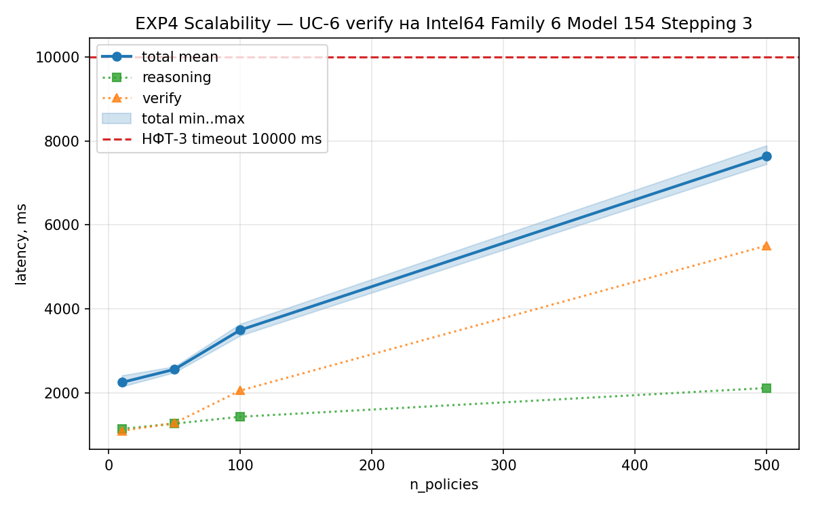
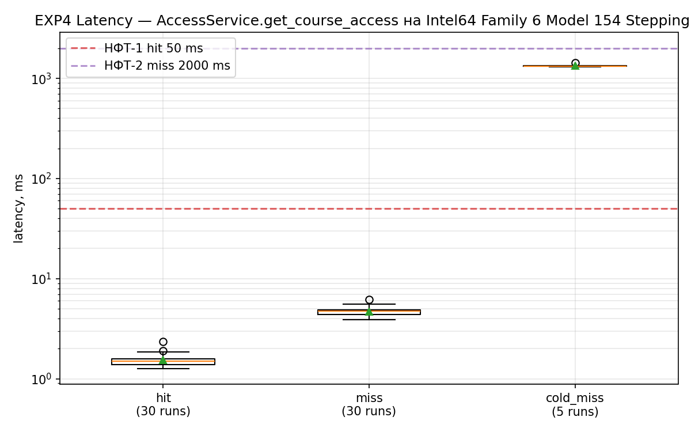

# EXP4 Performance — результаты (24.04)

## Железо

- python: `3.14.3`
- platform: `Windows-11-10.0.26200-SP0`
- processor: `Intel64 Family 6 Model 154 Stepping 3, GenuineIntel`
- machine: `AMD64`
- cpu_count: `12`

## Scalability (UC-6 verify, 3 прогона на размер)

| n_policies | runs | reason mean, ms | verify mean, ms | total mean, ms | total min, ms | total max, ms | stdev |
|---|---|---|---|---|---|---|---|
| 10 | 3 | 1152 | 1105 | 2257 | 2159 | 2421 | 144 |
| 50 | 3 | 1276 | 1290 | 2567 | 2494 | 2632 | 69 |
| 100 | 3 | 1440 | 2063 | 3502 | 3371 | 3648 | 139 |
| 500 | 3 | 2123 | 5509 | 7632 | 7449 | 7890 | 230 |

## Cache latency (30 прогонов hit/miss + 5 прогонов cold_miss)

| Режим | n | min | median | mean | p95 | p99 | max | stdev |
|---|---|---|---|---|---|---|---|---|
| hit | 30 | 1.27 | 1.49 | 1.54 | 1.86 | 1.90 | 2.36 | 0.24 |
| miss | 30 | 3.91 | 4.74 | 4.71 | 5.27 | 5.55 | 6.16 | 0.48 |
| cold_miss | 5 | 1302.40 | 1322.14 | 1344.32 | 1347.76 | 1347.76 | 1434.25 | 52.93 |

## Соответствие НФТ

- **НФТ-1** cache hit ≤50 ms: hit mean=1.54 ms, p99=1.90 ms — запас порядка.
- **НФТ-2** cache miss ≤2000 ms (cold start: World + load + reasoning + AccessService): mean=1344 ms, p95=1348 ms — соответствует.
- **НФТ-3** reasoning timeout 10 с (UC-6 verify на 500 правил): mean=7632 ms — соответствует.

UC-6 verify на 500 правил (7-8 с) не сверяется с НФТ-2 (access path, 2 с) — это UC-6 путь, верхняя граница в НФТ-3.
